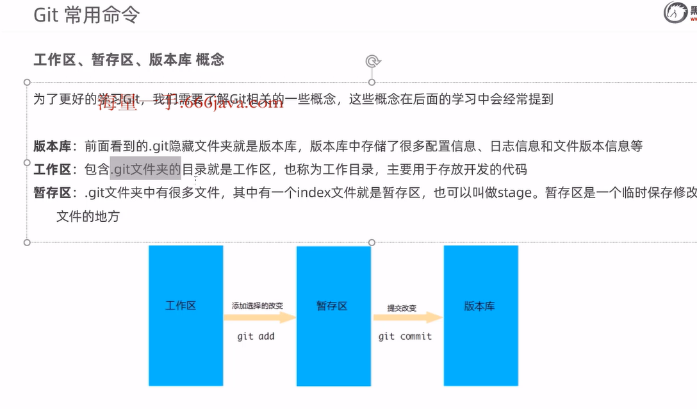
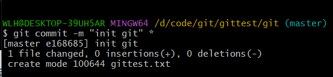

## git

- git是一种版本控制工具

### git代码托管平台

- github
- 码云
- gitlab
- BitBucket

### git全局设置

- 安装git后最重要的是先给设置用户名称和用户邮箱	，因为每次git 提交都会用到这个用户信息(这个信息可以任意设置)

1. 在git命令行窗口设置
   - $ git config --global user.name "用户名"
   - $ git config --global user.email "邮箱地址"  
2. 查看配置信息：git config --list

### 获取git仓库两种方式

1. 在本地初始化一个仓库 git init
2. 从远程仓库获取 $ git clone https://gitee.com/xxx555552/git.git	

### 工作区 暂存区 版本库

- 版本库

- 工作区

- 暂存区

- 空的仓库没有index文件 因为需要git add提交到暂存区才会创建index文件， 然后git commit才会真正提交到版本库里

### git工作区中文件的状态

git工作区的文件有两种状态：(可以通过 git status 来查看文件状态)

- untracked 未跟踪（未被纳入版本控制） 创建一个新文件 没有git add 就不会跟踪

- tracked  已跟踪（被纳入版本控制）git add之后就是Staged
  - unmodified 未修改状态
  - Modified 已修改状态
  - Staged 已暂存状态

### 本地仓库操作

- git status 查看文件状态
- git add 将文件的修改提交到暂存区
- git reset 将暂存区的文件取消暂存或者是切换指定版本
- git commit 将暂存区的文件修改提交到版本库
- git log 查看日志

- git commit -m "版本信息" 提交的文件
- 第一次提交git commit文件的状态是unmodified文件状态
- 对文件做出修改但未提交到暂存区或是版本库 文件是红色的已修改状态modified
- 

- 执行git add * 后文件是绿色的modified状态，说明文件已经加到暂存区了

  

- 使用git reset 命令取消文件的暂存状态 文件又变回红色modified的已修改状态（未提交到版本库的是未跟踪状态，并且文件显示红色）

- 未提交到 版本库的

- git log 查看日志

这里的Author 是你刚才配置的用户信息

4afe3b71ab7e409a8dc10b1400c45ea84e3690f7 这一串字符串是你的版本标识

- 接下来我们可以使用git reset --hard 版本标识字符串 来回到提交过的指定的版本

- 再次查看日志git log 

- 发现日志只剩下这个版本了

### 远程仓库的命令

- git  remote  查看远程仓库
- git remote add 添加远程仓库 
- git clone 从远程仓库克隆
- git pull 从远程仓库拉取
- git push 推送到远程仓库 

1. 本地仓库要是未关联远程仓库，那么使用git remote 是没有任何信息的

2. 使用git remote add 添加远程仓库

**origin** ：远程仓库的简称  后面加一下远程的仓库的url

3. 关联之后在使用git remote查看

4. 使用git remote -v查看

**关联之后你的本地仓库就和远程仓库关联在一起了，之后你就可以实现远程仓库和本地仓库的通信**

### 克隆远程仓库并修改推送到远程仓库的流程

- 现在本地创建一个文件夹，在这个文件夹下进入git bash命令行中 使用git clone 克隆远程仓库

- 在本地仓库里添加新的文件gittest.txt文件

- 使用git add命令添加gittest.txt文件到暂存区（注意不能没有git add 就直接git commit 这样就报一个错误error: pathspec 'gittest.txt' did not match any file(s) known to git）

- 使用git commit -m 提交到版本库

- 使用git push origin(远程仓库的简称) master(远程仓库的分支)

- 这样在远程仓库就有我们push上去的文件了

### 身份验证

- 账号为你的码云账号，而且必须是你的仓库成员
- 只需要认证一次，之后你的认证信息就会自动保存在windows里面

### 拉取远程仓库

- 这个适合团队多人协助 团队里的每一人都关联这个远程仓库之后。
- 只要有人修改文件并git push  提交到远程仓库，然后另外一个团队成员git pull拉取远程仓库的最新更新

**注意**

- 当前本地仓库不是从远程仓库拉取，而是自己创建的git init的 并且仓库中存在文件，比如图中的test.txt文件

此时拉取会出现错误 refusing to merge unrelated histories 拒绝去合并未关联的历史 

- 解决此问题可以： 例如： git pull origin master --allow-unrelated-histories 允许没有关联的拉取

### 分支操作

#### 查看分支

git branch 列出所有本地分支

**绿色的master表示我们当前所在的分支**

git branch -r 列出所有远程分支

git branch -a 列出所有本地分支和远程分支

#### 创建分支

使用git branch 分支名字 

#### 切换分支

git checkout [name]

#### 推送至远程仓库分支

git push [shortname] [name]

#### 合并分支

- git merge [name]

- 在主分支里合并b1,b2分支

#### 合并分支产生的冲突问题

- 当你的master分支有b1.txt文件，b1分支也有b1.txt文件，分别对这两个文件进行修改，写入不一样的内容
- 然后提交之后合并分支 git merge b1

- 合并到一半出现一个冲突错误
- 文件里的内容

- 此时可以使用git add命令把文件添加到暂存区，告诉git我们已经解决冲突

- 但此时使用git commit 命令可能会出现错误

- 可以在git commit 命令后面加一个 -i参数

### 标签操作

- 常用命令

**标签就是把某一个状态定格成一个固定版本  静态的	**

**什么时候使用标签，当项目开发到一定程度了，可以发行版本的时候**

### 在idea中使用git

### 在idea中使用git 获取仓库

- 不受git 管理的文件配置

表示哪些文件不需要版本控制

#### 本地仓库操作

- idea简化了提交，直接点击提交 不用添加到暂存区就可以直接提交

#### 远程仓库操作

### git push -u origin master 这个u是什么意思

在git push命令中使用-u参数的意思是:在首次推送分支时,将本地分支与远程仓库的对应分支相关联,用于跟踪。以后再次推送该分支时,只需要使用git push即可,git会自动推送到与本地分支相关联的远程分支。所以,上面的命令git push -u origin master 的效果是:1. 首次将本地的master分支推送到远程origin仓库
\2. 并且,将本地master分支与远程的master分支相关联,用于跟踪
\3. 以后再推送master分支时,只需git push,git就知道要推送到origin的master分支需要注意的是,如果不使用-u参数首次推送分支,那么之后推送该分支需要使用完整命令:git push origin master因为没有相关联,所以每次都需要指定推送到哪个远程仓库的哪个分支。使用-u参数的好处是:1. 简化了之后的推送命令,只需要git push即可,方便快捷2. 如果远程分支改名或者删除,git也能自动跟踪这些变化,将本地分支推送到正确的远程分支3. 如果忘记本地分支对应推送到哪个远程分支,git会提示正确的推送命令,避免错误推送所以,对于长期开发并经常推送的分支,使用git push -u origin <branch-name> 首次推送并相关联是非常推荐的。这可以简化将来的工作,让git帮助我们管理远程分支对应的本地分支。
