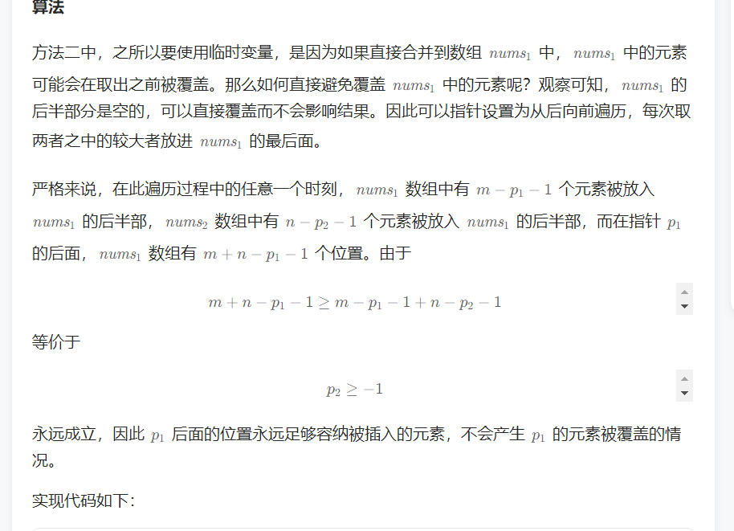

## leedcod热门面试题

### 2. 两数相加

给你两个 **非空** 的链表，表示两个非负的整数。它们每位数字都是按照 **逆序** 的方式存储的，并且每个节点只能存储 **一位** 数字。

请你将两个数相加，并以相同形式返回一个表示和的链表。

你可以假设除了数字 0 之外，这两个数都不会以 0 开头。

 

**示例 1：**


```
输入：l1 = [2,4,3], l2 = [5,6,4]
输出：[7,0,8]
解释：342 + 465 = 807.
```

**示例 2：**

```
输入：l1 = [0], l2 = [0]
输出：[0]
```

**示例 3：**

```
输入：l1 = [9,9,9,9,9,9,9], l2 = [9,9,9,9]
输出：[8,9,9,9,0,0,0,1]
```

 

**提示：**

- 每个链表中的节点数在范围 `[1, 100]` 内
- `0 <= Node.val <= 9`
- 题目数据保证列表表示的数字不含前导零

```java
/**
 * Definition for singly-linked list.
 * public class ListNode {
 *     int val;
 *     ListNode next;
 *     ListNode() {}
 *     ListNode(int val) { this.val = val; }
 *     ListNode(int val, ListNode next) { this.val = val; this.next = next; }
 * }
 */
class Solution {
    public ListNode addTwoNumbers(ListNode l1, ListNode l2) {
        ListNode pre = new ListNode(0);//创建头节点
        ListNode cur = pre;
        int sum = 0;
        int carry = 0;
        while(l1 != null || l2 != null){
            int x = l1 == null? 0:l1.val;
            int y = l2 == null? 0:l2.val;
            sum = x+y+carry;
            carry = sum / 10;
            sum = sum % 10;
            cur.next = new ListNode(sum);
            cur = cur.next;
            if(l1 != null){
                l1 = l1.next;
            }
            if(l2 != null){
                l2 = l2.next;
            }
        }
        if(carry == 1){//两个个位数最大也是9+9=18加上进位也只是19，所以最后的进位最大也只是1
            cur.next = new ListNode(carry);
        }
        return pre.next;//返回头结点的下一个节点，也就是第一个节点

    }
}
```

### 3. 无重复字符的最长子串

给定一个字符串 `s` ，请你找出其中不含有重复字符的 **最长子串** 的长度。

 

**示例 1:**

```
输入: s = "abcabcbb"
输出: 3 
解释: 因为无重复字符的最长子串是 "abc"，所以其长度为 3。
```

**示例 2:**

```
输入: s = "bbbbb"
输出: 1
解释: 因为无重复字符的最长子串是 "b"，所以其长度为 1。
```

**示例 3:**

```
输入: s = "pwwkew"
输出: 3
解释: 因为无重复字符的最长子串是 "wke"，所以其长度为 3。
     请注意，你的答案必须是 子串 的长度，"pwke" 是一个子序列，不是子串。
```

 

**提示：**

- `0 <= s.length <= 5 * 104`
- `s` 由英文字母、数字、符号和空格组成

**思路**：

这道题主要用到思路是：滑动窗口

什么是滑动窗口？

其实就是一个队列,比如例题中的 abcabcbb，进入这个队列（窗口）为 abc 满足题目要求，当再进入 a，队列变成了 abca，这时候不满足要求。所以，我们要移动这个队列！

如何移动？

我们只要把队列的左边的元素移出就行了，直到满足题目要求！

一直维持这样的队列，找出队列出现最长的长度时候，求出解！

时间复杂度：O(n)O(n)O(n)

```java
class Solution {
    public int lengthOfLongestSubstring(String s) {
        // 如果字符串为空，直接返回0
        if (s.length()==0) return 0;
        // 创建一个哈希表，键为字符，值为该字符出现的最后位置
        HashMap<Character, Integer> map = new HashMap<Character, Integer>();
        // 初始化最大长度为0
        int max = 0;
        // 初始化左指针为0
        int left = 0;
        // 从左到右遍历字符串中的每个字符
        for(int i = 0; i < s.length(); i ++){
            // 如果当前字符已经在哈希表中存在
            if(map.containsKey(s.charAt(i))){
                // 更新左指针为该字符上一次出现的位置加一和当前左指针的较大者
                // 这样可以保证左指针到当前位置的子串没有重复
                left = Math.max(left,map.get(s.charAt(i)) + 1);
            }
            // 将当前字符和位置放入哈希表中，覆盖之前的值
            map.put(s.charAt(i),i);
            // 计算当前不重复子串的长度，并与之前记录的最大长度比较，取较大者作为新的最大长度
            max = Math.max(max,i-left+1);
        }
        // 返回最大长度
        return max;
    }
}
```


### 5. 最长回文子串

给你一个字符串 `s`，找到 `s` 中最长的回文子串。

如果字符串的反序与原始字符串相同，则该字符串称为回文字符串。

 

**示例 1：**

```
输入：s = "babad"
输出："bab"
解释："aba" 同样是符合题意的答案。
```

**示例 2：**

```
输入：s = "cbbd"
输出："bb"
```

- 思路一：中心扩展算法

以下是对代码的详细注释：

```java
class Solution {
    public String longestPalindrome(String s) {

        // 中心扩展算法
        // 如果输入字符串为空，直接返回空字符串
        if(s == null || s.length() == 0){
            return "";
        }
        
        // 初始化变量
        int len = 1; // 记录当前回文串的长度，初始为1
        int left = 0; // 左指针
        int right = 0; // 右指针
        int maxlen = 0; // 记录最长回文子串的长度，初始为0
        int maxstart = 0; // 记录最长回文子串的起始位置，初始为0
        
        // 遍历字符串中的每个字符
        for(int i = 0; i < s.length();i++){
            left = i - 1; // 左指针从当前字符的前一个位置开始
            right = i + 1; // 右指针从当前字符的后一个位置开始
            
            // 将左指针向左移动，直到到达字符串的起始位置或者不是回文字符为止
            while(left >= 0 && s.charAt(left) == s.charAt(i)){
                left--;
                len++;
            }
            
            // 将右指针向右移动，直到到达字符串的末尾或者不是回文字符为止
            while(right < s.length() && s.charAt(right) == s.charAt(i)){
                right++;
                len++;
            }
            
            // 如果左右指针所指的字符相等，就将左指针向左移动，右指针向右移动，直到不是回文字符为止
            while( left>=0 && right<s.length() && s.charAt(left) == s.charAt(right)){
                len+=2;
                left--;
                right++;
            }
            
            // 如果当前回文子串的长度比之前记录的最长回文子串的长度要长，就更新最长回文子串的长度和起始位置
            if(len > maxlen){
                maxlen = len;
                maxstart = left;
            }
            
            // 将回文子串的长度重置为1，准备寻找下一个回文子串
            len = 1;
            
        }
        
        // 返回最长回文子串
        return s.substring(maxstart+1,maxstart+maxlen+1);

    }
}
```

注：该代码使用中心扩展算法来寻找最长回文子串。简单来说，就是从字符串中的每个字符开始，分别向左和向右扩展，直到不是回文字符为止。如果回文子串的长度比之前记录的最长回文子串的长度要长，就更新最长回文子串的长度和起始位置。

- 思路二：动态规划


```java
class Solution {
    public String longestPalindrome(String s) {
        //动态规划
        int len = s.length();
        if (len < 2) {
            return s;
        }

        int maxLen = 1;
        int begin = 0;
        // dp[i][j] 表示 s[i..j] 是否是回文串
        boolean[][] dp = new boolean[len][len];
        for(int i =0 ; i < len; i ++){//对角线上单个字符肯定是回文，所以先初始化对角线上的
            dp[i][i] = true;
        }
        char[] ch = s.toCharArray();
        for(int j =1; j<len;j++){//从一列一列开始填
            for(int i =0; i < j; i++){//由于边界条件，肯定i<j，所以只需要填对角线上半部分的值
                if(ch[i] != ch[j]){
                    dp[i][j] = false;
                }else{
                    //状态转移方程dp[i+1][j-1]去掉头尾i和j。一个字符肯定是回文，
                    //所以j-1-(i+1)+1 <2 = j-i<3
                    if(j - i <3){
                        dp[i][j] = true;//去掉头尾只有一个字符，且ch[i] = ch[j] 那么就是回文
                    }else{
                        dp[i][j] = dp[i+1][j-1];
                    }
                }
                if(dp[i][j]&&j-i+1>maxLen){
                    maxLen = j-i+1;
                    begin = i;
                }
            }

        }
        return s.substring(begin,maxLen+begin);


      
            
    

    }
}
```


### 13. 罗马数字转整数

罗马数字包含以下七种字符: `I`， `V`， `X`， `L`，`C`，`D` 和 `M`。

```
字符          数值
I             1
V             5
X             10
L             50
C             100
D             500
M             1000
```

例如， 罗马数字 `2` 写做 `II` ，即为两个并列的 1 。`12` 写做 `XII` ，即为 `X` + `II` 。 `27` 写做 `XXVII`, 即为 `XX` + `V` + `II` 。

通常情况下，罗马数字中小的数字在大的数字的右边。但也存在特例，例如 4 不写做 `IIII`，而是 `IV`。数字 1 在数字 5 的左边，所表示的数等于大数 5 减小数 1 得到的数值 4 。同样地，数字 9 表示为 `IX`。这个特殊的规则只适用于以下六种情况：

- `I` 可以放在 `V` (5) 和 `X` (10) 的左边，来表示 4 和 9。
- `X` 可以放在 `L` (50) 和 `C` (100) 的左边，来表示 40 和 90。 
- `C` 可以放在 `D` (500) 和 `M` (1000) 的左边，来表示 400 和 900。

给定一个罗马数字，将其转换成整数。

 

**示例 1:**

```
输入: s = "III"
输出: 3
```

**示例 2:**

```
输入: s = "IV"
输出: 4
```

**示例 3:**

```
输入: s = "IX"
输出: 9
```

**示例 4:**

```
输入: s = "LVIII"
输出: 58
解释: L = 50, V= 5, III = 3.
```

**示例 5:**

```
输入: s = "MCMXCIV"
输出: 1994
解释: M = 1000, CM = 900, XC = 90, IV = 4.
```

 

**提示：**

- `1 <= s.length <= 15`
- `s` 仅含字符 `('I', 'V', 'X', 'L', 'C', 'D', 'M')`
- 题目数据保证 `s` 是一个有效的罗马数字，且表示整数在范围 `[1, 3999]` 内
- 题目所给测试用例皆符合罗马数字书写规则，不会出现跨位等情况。
- IL 和 IM 这样的例子并不符合题目要求，49 应该写作 XLIX，999 应该写作 CMXCIX 。
- 关于罗马数字的详尽书写规则，可以参考 [罗马数字 - Mathematics ](https://b2b.partcommunity.com/community/knowledge/zh_CN/detail/10753/罗马数字#knowledge_article)。

```java
class Solution {
    public int romanToInt(String s) {
        s = s.replace("IV","a");
        s = s.replace("IX","b");
        s = s.replace("XL","c");
        s = s.replace("XC","d");
        s = s.replace("CD","e");//提前把这种特殊的罗马数字在字符串里替换成可以在switch里选择的
        s = s.replace("CM","f");
        int result = 0;
        for(int i = 0 ; i < s.length(); i++){
            result += swich(s.charAt(i)); 
        }
        return result;


    }
    public int swich(char ch){
        switch(ch){
            case 'I' : return 1;
            
            case 'V': return 5;
            case 'X': return 10;
            case 'L': return 50;
            case 'C': return 100;
            case 'D': return 500;
            case 'M': return 1000;
            case 'a': return 4;
            case 'b': return 9;
            case 'c': return 40;
            case 'd': return 90;
            case 'e': return 400;
            case 'f': return 900;
            default : return 0;
        }

    }
}
```


### 20. 有效的括号

给定一个只包括 `'('`，`')'`，`'{'`，`'}'`，`'['`，`']'` 的字符串 `s` ，判断字符串是否有效。

有效字符串需满足：

1. 左括号必须用相同类型的右括号闭合。
2. 左括号必须以正确的顺序闭合。
3. 每个右括号都有一个对应的相同类型的左括号。

 

**示例 1：**

```
输入：s = "()"
输出：true
```

**示例 2：**

```
输入：s = "()[]{}"
输出：true
```

**示例 3：**

```
输入：s = "(]"
输出：false
```

```java
思路：
    解题思路：
算法原理

栈先入后出特点恰好与本题括号排序特点一致，即若遇到左括号入栈，遇到右括号时将对应栈顶左括号出栈，则遍历完所有括号后 stack 仍然为空；
建立哈希表 dic 构建左右括号对应关系：keykeykey 左括号，valuevaluevalue 右括号；这样查询 222 个括号是否对应只需 O(1)O(1)O(1) 时间复杂度；建立栈 stack，遍历字符串 s 并按照算法流程一一判断。
算法流程

如果 c 是左括号，则入栈 pushpushpush；
否则通过哈希表判断括号对应关系，若 stack 栈顶出栈括号 stack.pop() 与当前遍历括号 c 不对应，则提前返回 falsefalsefalse。
提前返回 falsefalsefalse

提前返回优点： 在迭代过程中，提前发现不符合的括号并且返回，提升算法效率。
解决边界问题：
栈 stack 为空： 此时 stack.pop() 操作会报错；因此，我们采用一个取巧方法，给 stack 赋初值 ??? ，并在哈希表 dic 中建立 key:′?′，value:′?′key: '?'，value:'?'key: 
′
 ? 
′
 ，value: 
′
 ? 
′
  的对应关系予以配合。此时当 stack 为空且 c 为右括号时，可以正常提前返回 falsefalsefalse；
字符串 s 以左括号结尾： 此情况下可以正常遍历完整个 s，但 stack 中遗留未出栈的左括号；因此，最后需返回 len(stack) == 1，以判断是否是有效的括号组合。
复杂度分析

时间复杂度 O(N)O(N)O(N)：正确的括号组合需要遍历 111 遍 s；
空间复杂度 O(N)O(N)O(N)：哈希表和栈使用线性的空间大小。


class Solution {
    private static final Map<Character,Character> map = new HashMap<>(){
        {
            //双重括号写法
            put('{','}');
            put('(',')');
            put('[',']');
            put('?','?');

        }
    } ;
    public boolean isValid(String s) {
        Deque<Character> stack = new LinkedList<>(){
            {
                push('?');
            }
        };
        if(s.length() > 0 && !map.containsKey(s.charAt(0))){
            return false;
        }
        for(Character c : s.toCharArray()){
            if(map.containsKey(c)){
                stack.push(c);
            }else if(map.get(stack.pop()) != c){
                return false;
            }
        }
        return stack.size() == 1;
    }
}
```


#### 什么是双重花括号写法

双重花括号写法是一种Java语言中的语法糖，用于在初始化集合或数组时快速添加元素。它的语法形式是在一个大括号块的内部再嵌套一个大括号块，例如：

```
List<String> list = new ArrayList<String>() {{
    add("hello");
    add("world");
}};
```

这个代码片段中，双重花括号块包含了两个调用`add()`方法的语句，它们会将字符串“hello”和“world”添加到一个新创建的`ArrayList`对象中。这个语法糖的效果等同于下面的代码：

```
List<String> list = new ArrayList<String>();
list.add("hello");
list.add("world");
```

双重花括号写法的优点是可以在初始化集合或数组时省略对于集合或数组类型的显式声明，同时可以快速地添加一些元素。但是，它的缺点是可能会导致一些性能问题和内存泄漏，因为它实际上是创建了一个匿名内部类的实例，并且该实例持有了对当前类的引用。因此，使用双重花括号写法时需要注意潜在的性能和内存问题。


### 69. x 的平方根 

给你一个非负整数 `x` ，计算并返回 `x` 的 **算术平方根** 。

由于返回类型是整数，结果只保留 **整数部分** ，小数部分将被 **舍去 。**

**注意：**不允许使用任何内置指数函数和算符，例如 `pow(x, 0.5)` 或者 `x ** 0.5` 。

 

**示例 1：**

```
输入：x = 4
输出：2
```

**示例 2：**

```
输入：x = 8
输出：2
解释：8 的算术平方根是 2.82842..., 由于返回类型是整数，小数部分将被舍去。
```

- 第一种解法： 二分法

```java
class Solution {
    public int mySqrt(int x) {
      int l = 0;
      int r = x;
      int ans = 0;
      while(l <= r){
          int mid = l + (r-l) / 2;
          if((long) mid * mid <= x){使用long避免mid*mid溢出
              ans = mid;
              l = mid +1;
          }else{
             r = mid -1;
          }
      }
      return ans;
    }
}
```

- 第二种解法：袖珍计算器算法


```java
class Solution {
    public int mySqrt(int x) {
        if(x == 0){
            return 0;
        }
        int ans = (int) Math.exp(0.5 * Math.log(x));
        return (long)(ans+1)*(ans +1)<=x? ans+1:ans;
}
}
```


### 88. 合并两个有序数组

给你两个按 **非递减顺序** 排列的整数数组 `nums1` 和 `nums2`，另有两个整数 `m` 和 `n` ，分别表示 `nums1` 和 `nums2` 中的元素数目。

请你 **合并** `nums2` 到 `nums1` 中，使合并后的数组同样按 **非递减顺序** 排列。

**注意：**最终，合并后数组不应由函数返回，而是存储在数组 `nums1` 中。为了应对这种情况，`nums1` 的初始长度为 `m + n`，其中前 `m` 个元素表示应合并的元素，后 `n` 个元素为 `0` ，应忽略。`nums2` 的长度为 `n` 。

 

**示例 1：**

```
输入：nums1 = [1,2,3,0,0,0], m = 3, nums2 = [2,5,6], n = 3
输出：[1,2,2,3,5,6]
解释：需要合并 [1,2,3] 和 [2,5,6] 。
合并结果是 [1,2,2,3,5,6] ，其中斜体加粗标注的为 nums1 中的元素。
```

**示例 2：**

```
输入：nums1 = [1], m = 1, nums2 = [], n = 0
输出：[1]
解释：需要合并 [1] 和 [] 。
合并结果是 [1] 。
```

**示例 3：**

```
输入：nums1 = [0], m = 0, nums2 = [1], n = 1
输出：[1]
解释：需要合并的数组是 [] 和 [1] 。
合并结果是 [1] 。
注意，因为 m = 0 ，所以 nums1 中没有元素。nums1 中仅存的 0 仅仅是为了确保合并结果可以顺利存放到 nums1 中。
```

 

**提示：**

- `nums1.length == m + n`
- `nums2.length == n`
- `0 <= m, n <= 200`
- `1 <= m + n <= 200`
- `-109 <= nums1[i], nums2[j] <= 109`

 

**进阶：**你可以设计实现一个时间复杂度为 `O(m + n)` 的算法解决此问题吗？

- 一、直接把nums2的元素复制到nums后面的n个元素，然后直接排序

```java
class Solution {
    public void merge(int[] nums1, int m, int[] nums2, int n) {
   
        for(int i = 0; i < n;i++){
            nums1[i+m] = nums2[i];
        }
        for(int i = n+m-1; i>=0;i--){
            for(int j = 0; j<i; j++){
                if(nums1[j] >nums1[j +1]){
                    int temp = nums1[j+1];
                    nums1[j+1] = nums1[j];
                    nums1[j] = temp;
                }
            }
        }


    }
}
```

- 二、双指针


方法一没有利用数组 nums1与 nums2已经被排序的性质。为了利用这一性质，我们可以使用双指针方法。这一方法将两个数组看作队列，每次从两个数组头部取出比较小的数字放到结果中。如下面的动画所示：

```java
Solution {
    public void merge(int[] nums1, int m, int[] nums2, int n) {
        int p1 = 0, p2 = 0;
        int[] sorted = new int[m + n];
        int cur;
        while (p1 < m || p2 < n) {
            if (p1 == m) {
                cur = nums2[p2++];
            } else if (p2 == n) {
                cur = nums1[p1++];
            } else if (nums1[p1] < nums2[p2]) {
                cur = nums1[p1++];
            } else {
                cur = nums2[p2++];
            }
            sorted[p1 + p2 - 1] = cur;
        }
        for (int i = 0; i != m + n; ++i) {
            nums1[i] = sorted[i];
        }
    }
}
复杂度分析

时间复杂度：O(m+n)。 指针移动单调递增，最多移动 m+n次，因此时间复杂度为 O(m+n)

空间复杂度：O(m+n)。 需要建立长度为 m+n的中间数组 sorted

。

```


- #### 方法三：逆向双指针



```java
class Solution {
    public void merge(int[] nums1, int m, int[] nums2, int n) {
        int p1 = m - 1, p2 = n - 1;
        int tail = m + n - 1;
        int cur;
        while (p1 >= 0 || p2 >= 0) {
            if (p1 == -1) {
                cur = nums2[p2--];
            } else if (p2 == -1) {
                cur = nums1[p1--];
            } else if (nums1[p1] > nums2[p2]) {
                cur = nums1[p1--];
            } else {
                cur = nums2[p2--];
            }
            nums1[tail--] = cur;
        }
    }
}


```


### 160. 相交链表

给你两个单链表的头节点 `headA` 和 `headB` ，请你找出并返回两个单链表相交的起始节点。如果两个链表不存在相交节点，返回 `null` 。

图示两个链表在节点 `c1` 开始相交**：**

[](https://assets.leetcode-cn.com/aliyun-lc-upload/uploads/2018/12/14/160_statement.png)

题目数据 **保证** 整个链式结构中不存在环。

**注意**，函数返回结果后，链表必须 **保持其原始结构** 。

**自定义评测：**

**评测系统** 的输入如下（你设计的程序 **不适用** 此输入）：

- `intersectVal` - 相交的起始节点的值。如果不存在相交节点，这一值为 `0`
- `listA` - 第一个链表
- `listB` - 第二个链表
- `skipA` - 在 `listA` 中（从头节点开始）跳到交叉节点的节点数
- `skipB` - 在 `listB` 中（从头节点开始）跳到交叉节点的节点数

评测系统将根据这些输入创建链式数据结构，并将两个头节点 `headA` 和 `headB` 传递给你的程序。如果程序能够正确返回相交节点，那么你的解决方案将被 **视作正确答案** 。

 

**示例 1：**

[](https://assets.leetcode.com/uploads/2018/12/13/160_example_1.png)

```
输入：intersectVal = 8, listA = [4,1,8,4,5], listB = [5,6,1,8,4,5], skipA = 2, skipB = 3
输出：Intersected at '8'
解释：相交节点的值为 8 （注意，如果两个链表相交则不能为 0）。
从各自的表头开始算起，链表 A 为 [4,1,8,4,5]，链表 B 为 [5,6,1,8,4,5]。
在 A 中，相交节点前有 2 个节点；在 B 中，相交节点前有 3 个节点。
— 请注意相交节点的值不为 1，因为在链表 A 和链表 B 之中值为 1 的节点 (A 中第二个节点和 B 中第三个节点) 是不同的节点。换句话说，它们在内存中指向两个不同的位置，而链表 A 和链表 B 中值为 8 的节点 (A 中第三个节点，B 中第四个节点) 在内存中指向相同的位置。
```

 

**示例 2：**

[](https://assets.leetcode.com/uploads/2018/12/13/160_example_2.png)

```
输入：intersectVal = 2, listA = [1,9,1,2,4], listB = [3,2,4], skipA = 3, skipB = 1
输出：Intersected at '2'
解释：相交节点的值为 2 （注意，如果两个链表相交则不能为 0）。
从各自的表头开始算起，链表 A 为 [1,9,1,2,4]，链表 B 为 [3,2,4]。
在 A 中，相交节点前有 3 个节点；在 B 中，相交节点前有 1 个节点。
```

**示例 3：**

[](https://assets.leetcode.com/uploads/2018/12/13/160_example_3.png)

```
输入：intersectVal = 0, listA = [2,6,4], listB = [1,5], skipA = 3, skipB = 2
输出：null
解释：从各自的表头开始算起，链表 A 为 [2,6,4]，链表 B 为 [1,5]。
由于这两个链表不相交，所以 intersectVal 必须为 0，而 skipA 和 skipB 可以是任意值。
这两个链表不相交，因此返回 null 。
```

 

**提示：**

- `listA` 中节点数目为 `m`
- `listB` 中节点数目为 `n`
- `1 <= m, n <= 3 * 104`
- `1 <= Node.val <= 105`
- `0 <= skipA <= m`
- `0 <= skipB <= n`
- 如果 `listA` 和 `listB` 没有交点，`intersectVal` 为 `0`
- 如果 `listA` 和 `listB` 有交点，`intersectVal == listA[skipA] == listB[skipB]`

 

**进阶：**你能否设计一个时间复杂度 `O(m + n)` 、仅用 `O(1)` 内存的解决方案？


- **解法一：**判断两个链表是否相交，那就是判断是否有节点相同，但是链表长度有可能不一样，一个长一个短。那么我们就可以使用两个指针pa,pb分别指向两个链表的头结点开始遍历，谁先遍历结束，谁就指向另外一个链表的头结点，然后再开始遍历。这样做就抵消了两个链表之间的长度差距。

```java
/**
 * Definition for singly-linked list.
 * public class ListNode {
 *     int val;
 *     ListNode next;
 *     ListNode(int x) {
 *         val = x;
 *         next = null;
 *     }
 * }
 */
public class Solution {
    public ListNode getIntersectionNode(ListNode headA, ListNode headB) {
        if(headA == null || headB == null){
            return null;
        }
        ListNode pa = headA,pb = headB;
        while(pa != pb){
            pa = pa == null? headB:pa.next;
            pb = pb == null? headA:pb.next;
        }
        return pa;
        
        
    }
}

这是一个Java方法，它接受两个单链表headA和headB作为输入，并返回它们相交的节点。如果这两个链表不相交，该方法返回null。

该方法首先检查headA或headB是否为null。如果其中一个为null，则意味着一个链表为空，它们之间没有交集。在这种情况下，该方法返回null。

如果两个链表都非空，该方法将两个指针pA和pB分别初始化为headA和headB的头指针。然后该方法进入一个循环，直到pA和pB指向同一个节点。在循环内部，该方法检查pA或pB是否为null。如果其中任意一个为null，则意味着我们已经到达了其中一个链表的末尾。在这种情况下，该方法将指针设置为另一个链表的头指针并继续迭代。

如果这两个链表相交，那么必然会有一个点，在该点上pA和pB指向同一个节点。此时，该方法退出循环并返回pA（或pB，因为它们现在指向同一个节点）。

总体而言，该算法的时间复杂度为O(m+n)，其中m和n分别是headA和headB的长度。空间复杂度为O(1)，因为我们只使用了常量量的额外空间来存储两个指针。
```


- **解法二** 使用哈希集合

- 思路和算法

  判断两个链表是否相交，可以使用哈希集合存储链表节点。

  首先遍历链表 headA，并将链表 headA 中的每个节点加入哈希集合中。然后遍历链表 headB，对于遍历到的每个节点，判断该节点是否在哈希集合中：

  如果当前节点不在哈希集合中，则继续遍历下一个节点；

  如果当前节点在哈希集合中，则后面的节点都在哈希集合中，即从当前节点开始的所有节点都在两个链表的相交部分，因此在链表 headB 中遍历到的第一个在哈希集合中的节点就是两个链表相交的节点，返回该节点。

  如果链表 headB 中的所有节点都不在哈希集合中，则两个链表不相交，返回 null

  ```java
  /**
   * Definition for singly-linked list.
   * public class ListNode {
   *     int val;
   *     ListNode next;
   *     ListNode(int x) {
   *         val = x;
   *         next = null;
   *     }
   * }
   */
  public class Solution {
      public ListNode getIntersectionNode(ListNode headA, ListNode headB) {
       Set<ListNode> set = new HashSet<>();
       ListNode temp = headA;
       while(temp != null){
           set.add(temp);
           temp = temp.next;
       }
       temp = headB;
       while(temp != null){
           if(set.contains(temp)){
               return temp;
           }
           temp = temp.next;
       }
       return null;
          
          
      }
  }
  ```

  


### 202. 快乐数

编写一个算法来判断一个数 `n` 是不是快乐数。

**「快乐数」** 定义为：

- 对于一个正整数，每一次将该数替换为它每个位置上的数字的平方和。
- 然后重复这个过程直到这个数变为 1，也可能是 **无限循环** 但始终变不到 1。
- 如果这个过程 **结果为** 1，那么这个数就是快乐数。

如果 `n` 是 *快乐数* 就返回 `true` ；不是，则返回 `false` 。

 

**示例 1：**

```
输入：n = 19
输出：true
解释：
下面的2是平方的2
12 + 92 = 82
82 + 22 = 68
62 + 82 = 100
12 + 02 + 02 = 1
```

**示例 2：**

```
输入：n = 2
输出：false
```

 

**提示：**

- `1 <= n <= 231 - 1`

通过次数

374.7K

提交次数

592K

通过率

63.3%

- ```
  方法一：用哈希集合检测循环
  我们可以先举几个例子。我们从 777 开始。则下一个数字是 494949（因为 72=497^2=497 
  2
   =49），然后下一个数字是 979797（因为 42+92=974^2+9^2=974 
  2
   +9 
  2
   =97）。我们可以不断重复该的过程，直到我们得到 111。因为我们得到了 111，我们知道 777 是一个快乐数，函数应该返回 true。
  
  
  
  再举一个例子，让我们从 116116116 开始。通过反复通过平方和计算下一个数字，我们最终得到 585858，再继续计算之后，我们又回到 585858。由于我们回到了一个已经计算过的数字，可以知道有一个循环，因此不可能达到 111。所以对于 116116116，函数应该返回 false。
  
  
  
  根据我们的探索，我们猜测会有以下三种可能。
  
  最终会得到 111。
  最终会进入循环。
  值会越来越大，最后接近无穷大。
  第三个情况比较难以检测和处理。我们怎么知道它会继续变大，而不是最终得到 111 呢？我们可以仔细想一想，每一位数的最大数字的下一位数是多少。
  
  Digits	Largest	Next
  1	9	81
  2	99	162
  3	999	243
  4	9999	324
  13	9999999999999	1053
  对于 333 位数的数字，它不可能大于 243243243。这意味着它要么被困在 243243243 以下的循环内，要么跌到 111。444 位或 444 位以上的数字在每一步都会丢失一位，直到降到 333 位为止。所以我们知道，最坏的情况下，算法可能会在 243243243 以下的所有数字上循环，然后回到它已经到过的一个循环或者回到 111。但它不会无限期地进行下去，所以我们排除第三种选择。
  
  即使在代码中你不需要处理第三种情况，你仍然需要理解为什么它永远不会发生，这样你就可以证明为什么你不处理它。
  
  算法
  
  算法分为两部分，我们需要设计和编写代码。
  
  给一个数字 nnn，它的下一个数字是什么？
  按照一系列的数字来判断我们是否进入了一个循环。
  第 1 部分我们按照题目的要求做数位分离，求平方和。
  
  第 2 部分可以使用哈希集合完成。每次生成链中的下一个数字时，我们都会检查它是否已经在哈希集合中。
  
  如果它不在哈希集合中，我们应该添加它。
  如果它在哈希集合中，这意味着我们处于一个循环中，因此应该返回 false。
  我们使用哈希集合而不是向量、列表或数组的原因是因为我们反复检查其中是否存在某数字。检查数字是否在哈希集合中需要 O(1)O(1)O(1) 的时间，而对于其他数据结构，则需要 O(n)O(n)O(n) 的时间。选择正确的数据结构是解决这些问题的关键部分。
  
  
  ```

  ```java
  class Solution {
      //计算一个数的每个位数的平方和
      private int getNext(int n) {
          int totalSum = 0; 
          while (n > 0) {  
              //取出最后一位数
              int d = n % 10;  
              //去掉最后一位数
              n = n / 10;  
              //将每一位数的平方加到总和上
              totalSum += d * d;  
          }
          return totalSum;
      }
  
      public boolean isHappy(int n) {
          //创建一个集合,用来储存已经出现过的数
          Set<Integer> seen = new HashSet<>(); 
          //一旦发现已经包含n，说明已经陷入循环了。无法到1
          while (n != 1 && !seen.contains(n)) {  
              //如果该数没有出现过,加入集合
              seen.add(n);
              //计算该数的下一步,即每个位数的平方和
              n = getNext(n);  
          }
          //如果计算到1,返回true,否则返回false
          return n == 1;
      } 
  }
  ```

- 方法二 快慢指针

通过反复调用 getNext(n) 得到的链是一个隐式的链表。隐式意味着我们没有实际的链表节点和指针，但数据仍然形成链表结构。起始数字是链表的头 “节点”，链中的所有其他数字都是节点。next 指针是通过调用 getNext(n) 函数获得。

意识到我们实际有个链表，那么这个问题就可以转换为检测一个链表是否有环。因此我们在这里可以使用弗洛伊德循环查找算法。这个算法是两个奔跑选手，一个跑的快，一个跑得慢。在龟兔赛跑的寓言中，跑的慢的称为 “乌龟”，跑得快的称为 “兔子”。

不管乌龟和兔子在循环中从哪里开始，它们最终都会相遇。这是因为兔子每走一步就向乌龟靠近一个节点（在它们的移动方向上）

我们不是只跟踪链表中的一个值，而是跟踪两个值，称为快跑者和慢跑者。在算法的每一步中，慢速在链表中前进 1 个节点，快跑者前进 2 个节点（对 getNext(n) 函数的嵌套调用）。

如果 n 是一个快乐数，即没有循环，那么快跑者最终会比慢跑者先到达数字 1。

如果 n 不是一个快乐的数字，那么最终快跑者和慢跑者将在同一个数字上相遇。

```java
class Solution {
    //计算一个数的每个位数的平方和
    private int getNext(int n) {
        int totalSum = 0; //初始化一个总和为0
        while (n > 0) {   //当n>0时
            //取出最后一位数
            int d = n % 10;  //取n除以10的余数，即最后一位数
            //去掉最后一位数
            n = n / 10;  //将n除以10，去掉最后一位数
            //将每一位数的平方加到总和上
            totalSum += d * d;  //将每一位数的平方加到总和上
        }
        return totalSum;  //返回总和
    }
    //快慢指针
    public boolean isHappy(int n) {
        int low = n;  //定义一个慢指针，值为n
        int fastrun = getNext(n);  //定义一个快指针，值为n的每一位数的平方和
        while(fastrun != 1 && low != fastrun){  //当快指针不等于1且快指针不等于慢指针时
            low = getNext(low);  //慢指针移动一步
            fastrun = getNext(getNext(fastrun));  //快指针移动两步
        }
        return fastrun == 1;  //当快指针等于1时，返回true，否则返回false
    } 
}

```


复杂度分析

时间复杂度：O(log⁡n)O(\log n)O(logn)。该分析建立在对前一种方法的分析的基础上，但是这次我们需要跟踪两个指针而不是一个指针来分析，以及在它们相遇前需要绕着这个循环走多少次。
如果没有循环，那么快跑者将先到达 1，慢跑者将到达链表中的一半。我们知道最坏的情况下，成本是 O(2⋅log⁡n)=O(log⁡n)O(2 \cdot \log n) = O(\log n)O(2⋅logn)=O(logn)。
一旦两个指针都在循环中，在每个循环中，快跑者将离慢跑者更近一步。一旦快跑者落后慢跑者一步，他们就会在下一步相遇。假设循环中有 kkk 个数字。如果他们的起点是相隔 k−1k-1k−1 的位置（这是他们可以开始的最远的距离），那么快跑者需要 k−1k-1k−1 步才能到达慢跑者，这对于我们的目的来说也是不变的。因此，主操作仍然在计算起始 n 的下一个值，即 O(log⁡n)O(\log n)O(logn)。
空间复杂度：O(1)O(1)O(1)，对于这种方法，我们不需要哈希集来检测循环。指针需要常数的额外空间。

