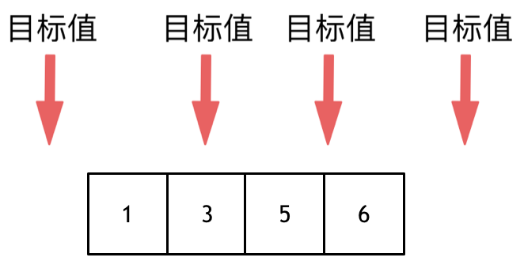

# 代码随想录一刷

## 数组

### 1、数组理论基础

- **数组是存放在连续的内存空间中一组相同数据类型的集合**
- **数组下标都是从0开始的。**
- **数组内存空间的地址是连续的**

正是**因为数组的在内存空间的地址是连续的，所以我们在删除或者增添元素的时候，就难免要移动其他元素的地址。**

- 那么二维数组的地址是否是连续的呢？--->其实不同语言的的内存管理不一样，这个不一定。比如c++就是连续的，但java的寻址是虚拟机在管理，而虚拟机会对寻址地址进行处理，而这个处理后的地址我们是看不出有规律的。

### 704. 二分查找

给定一个 n 个元素有序的（升序）整型数组 nums 和一个目标值 target  ，写一个函数搜索 nums 中的 target，如果目标值存在返回下标，否则返回 -1。

示例 1:

```text
输入: nums = [-1,0,3,5,9,12], target = 9     
输出: 4       
解释: 9 出现在 nums 中并且下标为 4     
```


示例 2:

```text
输入: nums = [-1,0,3,5,9,12], target = 2     
输出: -1        
解释: 2 不存在 nums 中因此返回 -1        
```


提示：

- 你可以假设 nums 中的所有元素是不重复的。
- n 将在 [1, 10000]之间。
- nums 的每个元素都将在 [-9999, 9999]之间。


#### 思路

**这道题目的前提是数组为有序数组**，同时题目还强调**数组中无重复元素**，因为一旦有重复元素，使用二分查找法返回的元素下标可能不是唯一的，这些都是使用二分法的前提条件，当大家看到题目描述满足如上条件的时候，可要想一想是不是可以用二分法了。


二分查找涉及的很多的边界条件，逻辑比较简单，但就是写不好。例如到底是 `while(left < right)` 还是 `while(left <= right)`，到底是`right = middle`呢，还是要`right = middle - 1`呢？

大家写二分法经常写乱，主要是因为**对区间的定义没有想清楚，区间的定义就是不变量**。要在二分查找的过程中，保持不变量，就是在while寻找中每一次边界的处理都要坚持根据区间的定义来操作，这就是**循环不变量**规则。

写二分法，区间的定义一般为两种，左闭右闭即[left, right]，或者左闭右开即[left, right)。

#### 二分法第一种写法（左闭右闭）

第一种写法，我们定义 target 是在一个在左闭右闭的区间里，**也就是[left, right] （这个很重要非常重要）**。

区间的定义这就决定了二分法的代码应该如何写，**因为定义target在[left, right]区间，所以有如下两点：**

- while (left <= right) 要使用 <= ，因为left == right 在while条件里面还有用，因为有可能mid = left = right，所以使用 <=
- if (nums[middle] > target) right 要赋值为 middle - 1，因为当前这个nums[middle]已经大于target，那么有边界就变成right = middle - 1

```java
class Solution {
    public int search(int[] nums, int target) {
        int left = 0,right = nums.length - 1;
        int mid = 0;
        while(left <= right){
            mid = left + ((right - left) / 2);//防止left+right加上太多超过int长度
            if(nums[mid] < target){
                left = mid + 1;//左边界更新往数组后走
            }else if(nums[mid] > target){
                right = mid - 1;//右边界更新往数组前走
            } else{
                return mid;
            }
        }
        return -1;

    }
}
```

- 时间复杂度：O(log n)
- 空间复杂度：O(1)

#### 二分法第二种写法（左闭右开）

如果说定义 target 是在一个在左闭右开的区间里，也就是[left, right) ，那么二分法的边界处理方式则截然不同。

有如下两点：

- while (left < right)，这里使用 < ,因为在区间[left, right)左闭右开里left != right
- `if (nums[middle] > target)`   right 更新为 middle，因为当前`nums[middle]`不等于target，去左区间继续寻找，而寻找区间是左闭右开区间，所以right更新为middle，即：下一个查询区间不会比较`nums[middle]`

```java
class Solution {
    public int search(int[] nums, int target) {
        int left = 0,right = nums.length;
        int mid = 0;
        while(left < right){//[left,right)
            mid = left + ((right - left) / 2);//防止left+right加上太多超过int长度
            if(nums[mid] < target){
                left = mid + 1;//左闭右开，左边界取左闭值
            }else if(nums[mid] > target){
                right = mid;//左闭右开，右边界取右开值
            } else{
                return mid;
            }
        }
        return -1;

    }
}
```

#### 总结

- 以前学过二分法，虽然他的逻辑很简单，但是有时候总被二分法的区间范围和边界条件的取值给搞乱了。现在知道了二分法有两种写法，一种是左闭右闭，另外一种是左闭右开。根据区间的取值范围来确定边界条件。


####  35.搜索插入位置

给定一个排序数组和一个目标值，在数组中找到目标值，并返回其索引。如果目标值不存在于数组中，返回它将会被按顺序插入的位置。

你可以假设数组中无重复元素。

示例 1:

- 输入: [1,3,5,6], 5
- 输出: 2

示例 2:

- 输入: [1,3,5,6], 2
- 输出: 1

示例 3:

- 输入: [1,3,5,6], 7
- 输出: 4

示例 4:

- 输入: [1,3,5,6], 0
- 输出: 0


这道题目不难，但是为什么通过率相对来说并不高呢，我理解是大家对边界处理的判断有所失误导致的。

这道题目，要在数组中插入目标值，无非是这四种情况。



- 目标值在数组所有元素之前
- 目标值等于数组中某一个元素
- 目标值插入数组中的位置
- 目标值在数组所有元素之后

这四种情况确认清楚了，就可以尝试解题了。

**使用暴力解法和二分法**

- 暴力法：

  ```cpp
  class Solution {
  public:
      int searchInsert(vector<int>& nums, int target) {
          for (int i = 0; i < nums.size(); i++) {
          // 分别处理如下三种情况
          // 目标值在数组所有元素之前
          // 目标值等于数组中某一个元素
          // 目标值插入数组中的位置
              if (nums[i] >= target) { // 一旦发现大于或者等于target的num[i]，那么i就是我们要的结果
                  return i;
              }
          }
          // 目标值在数组所有元素之后的情况
          return nums.size(); // 如果target是最大的，或者 nums为空，则返回nums的长度
      }
  };
  ```

- 二分法

  既然暴力解法的时间复杂度是O(n)，就要尝试一下使用二分查找法。

  

  大家注意这道题目的前提是数组是有序数组，这也是使用二分查找的基础条件。

  以后大家**只要看到面试题里给出的数组是有序数组，都可以想一想是否可以使用二分法。**

  同时题目还强调数组中无重复元素，因为一旦有重复元素，使用二分查找法返回的元素下标可能不是唯一的。

  - 左闭右闭 写法

    ```cpp
    ass Solution {
    public:
        int searchInsert(vector<int>& nums, int target) {
            int n = nums.size();
            int left = 0;
            int right = n - 1; // 定义target在左闭右闭的区间里，[left, right]
            while (left <= right) { // 当left==right，区间[left, right]依然有效
                int middle = left + ((right - left) / 2);// 防止溢出 等同于(left + right)/2
                if (nums[middle] > target) {
                    right = middle - 1; // target 在左区间，所以[left, middle - 1]
                } else if (nums[middle] < target) {
                    left = middle + 1; // target 在右区间，所以[middle + 1, right]
                } else { // nums[middle] == target
                    return middle;
                }
            }
            // 分别处理如下四种情况
            // 目标值在数组所有元素之前  [0, -1]
            // 目标值等于数组中某一个元素  return middle;
            // 目标值插入数组中的位置 [left, right]，return  right + 1
            // 目标值在数组所有元素之后的情况 [left, right]， 因为是右闭区间，所以 return right + 1
            return right + 1;
        }
    ```

- 左闭右开写法

  ```cpp
  class Solution {
  public:
      int searchInsert(vector<int>& nums, int target) {
          int n = nums.size();
          int left = 0;
          int right = n; // 定义target在左闭右开的区间里，[left, right)  target
          while (left < right) { // 因为left == right的时候，在[left, right)是无效的空间
              int middle = left + ((right - left) >> 1);
              if (nums[middle] > target) {
                  right = middle; // target 在左区间，在[left, middle)中
              } else if (nums[middle] < target) {
                  left = middle + 1; // target 在右区间，在 [middle+1, right)中
              } else { // nums[middle] == target
                  return middle; // 数组中找到目标值的情况，直接返回下标
              }
          }
          // 分别处理如下四种情况
          // 目标值在数组所有元素之前 [0,0)
          // 目标值等于数组中某一个元素 return middle
          // 目标值插入数组中的位置 [left, right) ，return right 即可
          // 目标值在数组所有元素之后的情况 [left, right)，因为是右开区间，所以 return right
          return right;
      }
  };
  ```

#### 34. 在排序数组中查找元素的第一个和最后一个位置

给定一个按照升序排列的整数数组 nums，和一个目标值 target。找出给定目标值在数组中的开始位置和结束位置。

如果数组中不存在目标值 target，返回 [-1, -1]。

进阶：你可以设计并实现时间复杂度为 $O(\log n)$ 的算法解决此问题吗？

示例 1：

- 输入：nums = [5,7,7,8,8,10], target = 8
- 输出：[3,4]

示例 2：

- 输入：nums = [5,7,7,8,8,10], target = 6
- 输出：[-1,-1]

示例 3：

- 输入：nums = [], target = 0
- 输出：[-1,-1]

**思路**

使用二分法找到初始起点和最后坐标  

分三种情况：

- 第一种target比数组里的任何数都小或者都大，则返回-1，-1
- 第二种target的大小在数组范围里面，但是数组里面没有target
- 第三种target在数组里面，返回他的起始坐标和最后坐标

```java
class Solution {
    public int[] searchRange(int[] nums, int target) {
        int left = searchLeft(nums,target);
        int right = searchRight(nums,target);
        if(left == -3|| right == -3){//第一种情况
            return new int[]{-1,-1};
        }
        //情况3 自己拿一个简单数组推导一下，可以知道当target在数组里面时，left和right的值至少相差2
        if(right - left > 1){
            return new int[]{left + 1,right - 1};//所以这边left+1，right-1
        }
        //第二种情况
        return new int[]{-1,-1};
        

        

    }
    //寻找左边界
    public int searchLeft(int[] nums, int target){
        int left = 0,right = nums.length - 1;
        //如果target比数组的任何数都小，则leftBoder没有被赋值，将以初始值返回-3
        int leftBorder = -3;
        int mid = 0;
        while(left <= right){
            mid = left + ((right - left) >> 2);
            if(nums[mid] >= target){
                right = mid - 1;
                leftBorder = right;
            }else{
                left = mid + 1;
            }

        }
        return leftBorder;

    }
    //寻找右边界
        public int searchRight(int[] nums, int target){
        int left = 0,right = nums.length - 1;
            //如果target比数组的任何数都大，则leftBoder没有被赋值，将以初始值返回-3
        int rightBorder = -3;
        int mid = 0;
        while(left <= right){
            mid = left + ((right - left) >> 2);
            if(nums[mid] <= target){
               left = mid + 1;
               rightBorder = left;
               
            }else{
                right = mid - 1;
                
            }

        }
        return rightBorder;

    }
}
```


####  27. 移除元素

[力扣题目链接(opens new window)](https://leetcode.cn/problems/remove-element/)

给你一个数组 nums 和一个值 val，你需要 原地 移除所有数值等于 val 的元素，并返回移除后数组的新长度。

不要使用额外的数组空间，你必须仅使用 O(1) 额外空间并**原地**修改输入数组。

元素的顺序可以改变。你不需要考虑数组中超出新长度后面的元素。

示例 1: 给定 nums = [3,2,2,3], val = 3, 函数应该返回新的长度 2, 并且 nums 中的前两个元素均为 2。 你不需要考虑数组中超出新长度后面的元素。

示例 2: 给定 nums = [0,1,2,2,3,0,4,2], val = 2, 函数应该返回新的长度 5, 并且 nums 中的前五个元素为 0, 1, 3, 0, 4。

**你不需要考虑数组中超出新长度后面的元素。**


**思路**

- 暴力解法

  使用两个for循环，找到val就把后面的数集体往前移一位，数组长度减一

  

```java
class Solution {
    public int removeElement(int[] nums, int val) {
        int size = nums.length;
        for(int i = 0; i < size; i++){
            if(nums[i] == val){//找到等于val的数，坐标i以后的数字集体往前移一位
                for(int j = i +1; j < size; j++){
                    nums[j - 1] = nums[j];
                }
                i--;//i后面的数组都往前移一位，i也要跟着移一位
                size--;
            }
            
        }
        return size;
    }
}
```


- 双指针法

​		使用快慢指针

​				快指针和慢指针同时从同一个起点出发，快指针负责找到不等于val的数组元素，并把他往前移到慢指针的位置上。慢指针负责停留在val位置上等待val元素被覆盖后，继续往后走找到val。

```java
class Solution {
    public int removeElement(int[] nums, int val) {
        int size = nums.length;
        int slow = 0;
        for(int fast = 0; fast < size; fast++){
            if(nums[fast] != val){
                nums[slow++] = nums[fast];//将val覆盖后，slow再往后走
            }
        }
        return slow;
    
}
}
```


#### 977.有序数组的平方

[力扣题目链接(opens new window)](https://leetcode.cn/problems/squares-of-a-sorted-array/)

给你一个按 非递减顺序 排序的整数数组 nums，返回 每个数字的平方 组成的新数组，要求也按 非递减顺序 排序。

示例 1： 输入：nums = [-4,-1,0,3,10] 输出：[0,1,9,16,100] 解释：平方后，数组变为 [16,1,0,9,100]，排序后，数组变为 [0,1,9,16,100]

示例 2： 输入：nums = [-7,-3,2,3,11] 输出：[4,9,9,49,121]


**思路**

- 暴力解法

  - 给每个数组元素平方后，然后再排序

  

```java
class Solution {
    public int[] sortedSquares(int[] nums) {
        for(int i = 0; i < nums.length; i++){
            nums[i] = nums[i] * nums[i];
        }
        Arrays.sort(nums);
        return nums;

    }
}
```


- 双指针方法

  - 由于数组是有序的，还有数组里面有负数存在，所以一个排好序的数组里面每一个数平方后，最大值只会出现在数组的最左边或者最右边。
  - 那么我们就可以使用双指针，一个指向数组开头，一个指向数组最后。把他们分别平方后比大小。然后把大的数或者小的数复制到另外一个新数组。然后不断向中间逼近。

  

```java
class Solution {
    public int[] sortedSquares(int[] nums) {
        int k = nums.length - 1;
        int[] result = new int[nums.length];
        for(int i = 0,j = nums.length - 1; i <= j;){
            if(nums[i] * nums[i] < nums[j] * nums[j]){
                result[k--] = nums[j] * nums[j];
                j--;
            }else{
                result[k--] = nums[i] * nums[i];
                i++;
            }
        }
        return result;

    }
}
```


#### 209.长度最小的子数组

[力扣题目链接(opens new window)](https://leetcode.cn/problems/minimum-size-subarray-sum/)

给定一个含有 n 个正整数的数组和一个正整数 s ，找出该数组中满足其和 ≥ s 的长度最小的 连续 子数组，并返回其长度。如果不存在符合条件的子数组，返回 0。

示例：

输入：s = 7, nums = [2,3,1,2,4,3] 输出：2 解释：子数组 [4,3] 是该条件下的长度最小的子数组。

提示：

- 1 <= target <= 10^9
- 1 <= nums.length <= 10^5
- 1 <= nums[i] <= 10^5


**一 暴力解法**

这个方法在leedcode已经超时了

```java
class Solution {
    public int minSubArrayLen(int target, int[] nums) {
        int result = Integer.MAX_VALUE;
        int minlength = 0;
        
        for(int i = 0; i < nums.length; i++){
            int sum = 0;
            for(int j = i; j < nums.length; j++){
                sum = sum+nums[j];
                if(sum >= target){
                    minlength = j - i + 1;//区连续子数组的长度
                    result = result < minlength? result:minlength;//更新result的值
                    break;//找到最短的连续子数组就终止内循环，知道外循环全部遍历完
                }
            }
        }
        return result == Integer.MAX_VALUE? 0:result;//result值一直不变就返回0


    }
}
```


**二、滑动窗口**

使用滑动窗口，这是一种类似双指针的方法。j往后走，i在起始位置，当子数组的和大于target时就删掉起始位置的数，减小子数组长度，然后判断子数组的和是否大于target,大于就继续减小，不大于就继续加nums[j]。

```java
class Solution {
    public int minSubArrayLen(int target, int[] nums) {
        int result = Integer.MAX_VALUE;
        int minlength = 0;
        
        int i = 0;
        int sum = 0;
        for(int j = 0; j < nums.length; j++){
            sum+=nums[j];
            while(sum >= target){
                minlength = j - i + 1;
                result = result < minlength? result:minlength;
                sum-=nums[i++];//把子数组最小的删掉，逐渐减少数组长度
            }
            
        }
     
        return result == Integer.MAX_VALUE? 0:result;//result值一直不变就返回0


    }
}
```


#### 	 59.螺旋矩阵II

[力扣题目链接(opens new window)](https://leetcode.cn/problems/spiral-matrix-ii/)

给定一个正整数 n，生成一个包含 1 到 n^2 所有元素，且元素按顺时针顺序螺旋排列的正方形矩阵。

示例:

输入: 3 输出: [ [ 1, 2, 3 ], [ 8, 9, 4 ], [ 7, 6, 5 ] ]


**思路**

- 找好边界条件

- 坚持循环不变量原则

  模拟顺时针画矩阵的过程:

  - 填充上行从左到右
  - 填充右列从上到下
  - 填充下行从右到左
  - 填充左列从下到上

  由外向内一圈一圈这么画下去。

  可以发现这里的边界条件非常多，在一个循环中，如此多的边界条件，如果不按照固定规则来遍历，那就是**一进循环深似海，从此offer是路人**。

  这里一圈下来，我们要画每四条边，这四条边怎么画，每画一条边都要坚持一致的左闭右开，或者左开右闭的原则，这样这一圈才能按照统一的规则画下来。

  那么我按照左闭右开的原则，来画一圈，大家看一下：

  

  这里每一种颜色，代表一条边，我们遍历的长度，可以看出每一个拐角处的处理规则，拐角处让给新的一条边来继续画。

  这也是坚持了每条边左闭右开的原则。

```java
class Solution {
    public int[][] generateMatrix(int n) {
        int circlenums[][] =  new int[n][n];
        int startI = 0,startJ = 0;//起始位置
        int loop = n / 2;//循环圈数，比如n = 3,n/2=1,需要循环一圈
        int mid = n / 2;//如果n为奇数，那么mid就为矩阵中间元素； 
        int count = 1;//遍历矩阵，矩阵元素值每次加1
        int offset = 1; // 需要控制每一条边遍历的长度，每次循环右边界收缩一位
         int i,j;
        while(loop > 0){
            i = startI;
            j = startJ;
            //模拟从左到右遍历
            //每一行元素个数为n个，所以n-offset,//左闭右开边界条件
            for(j = startJ; j < n - offset; j++){
                circlenums[startI][j] = count++;
            }
              //模拟从上到下遍历
            //每一行元素个数为n个，所以n-offset,//左闭右开边界条件
            for(i = startI; i < n - offset; i++){
                circlenums[i][j] = count++;
            }
            //模拟从右到左遍历
         
            for(; j > startJ; j--){
                circlenums[i][j] = count++;
            }
                 //模拟从下到上遍历
            for(; i > startI; i--){
                circlenums[i][j] = count++;
            }

            startI++;//第二圈起始位置得加一，比如第一圈起始位置为[0][0] 那么第二圈就有[1][1]
            startJ++;
            offset+=1;//控制每一圈遍历的长度
            loop--;//循环次数减一

        }
           // 如果n为奇数的话，需要单独给矩阵最中间的位置赋值
        if(n % 2 == 1){
            circlenums[mid][mid] = count;
        }
        return circlenums;

    }
}
```


#### 总结


## 链表

### 链表理论知识

什么是链表，链表是一种通过指针串联在一起的线性结构，每一个节点由两部分组成，一个是数据域一个是指针域（存放指向下一个节点的指针），最后一个节点的指针域指向null（空指针的意思）。

链表的入口节点称为链表的头结点也就是head。

### 链表类型

- 单链表

- 双链表：

  - 单链表中的指针域只能指向节点的下一个节点。
  - 双链表：每一个节点有两个指针域，一个指向下一个节点，一个指向上一个节点。
  - 双链表 既可以向前查询也可以向后查询。
  - 

- 循环链表：首尾相连

  - 

  

  ### 链表的存储方式

  数组是在内存中是连续分布的，但是链表在内存中可不是连续分布的。

  链表是通过指针域的指针链接在内存中各个节点。

  所以链表中的节点在内存中不是连续分布的 ，而是散乱分布在内存中的某地址上，分配机制取决于操作系统的内存管理。

  

  ### 链表的定义

  java版本

  

  ```java
  class listNode{
  	int val;
  	listNode next;
  	//无参构造函数
  	public listNode(){
  	
  	}
  	//有一个参数构造函数
  	public listNode(int val){
  		this.val = val;
  	
  	}
  	//有两个参数构造函数
  	public listNode(int val，listNode next){
  		this.val = val;
  		this.next = next;
  	
  	}
  }
  ```

  ### 删除节点

  

```java
listNode l;
l.next = list.next.next;
将C节点的指针指向E，跳过D节点。
如果是C++语言最好自己手动释放一下D节点内存。因为跳过D节点，D节点在内存中还是存在的。
    但如果是java，python我们就不用管了，因为他们有自己的内存回收机制
```

### 添加节点


```java
listNode c;
c.next = F;
F.next = D;
```

可以看出链表的增添和删除都是O(1)操作，也不会影响到其他节点。

但是要注意，要是删除第五个节点，需要从头节点查找到第四个节点通过next指针进行删除操作，查找的时间复杂度是O(n)。


### 性能分析


数组在定义的时候，长度就是固定的，如果想改动数组的长度，就需要重新定义一个新的数组。

链表的长度可以是不固定的，并且可以动态增删， 适合数据量不固定，频繁增删，较少查询的场景。
