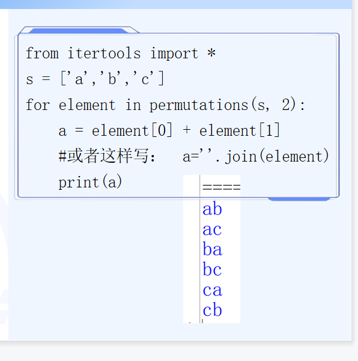
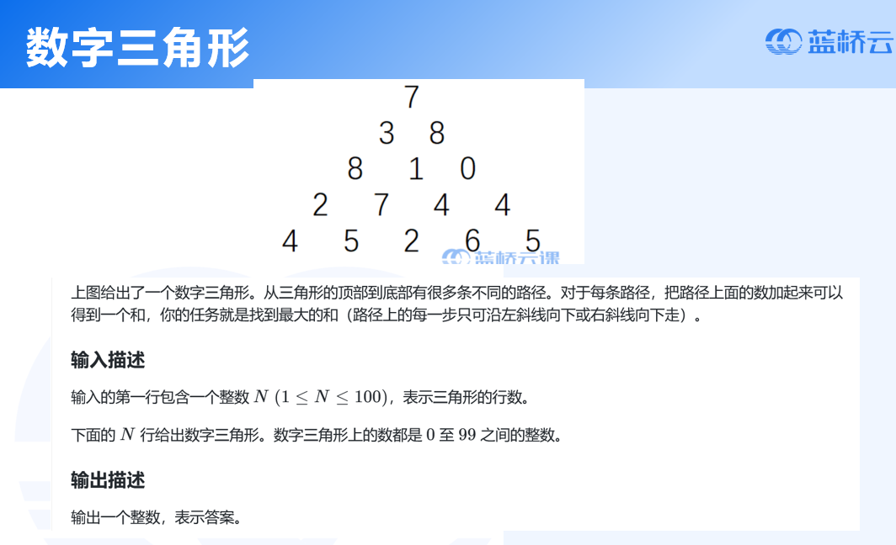
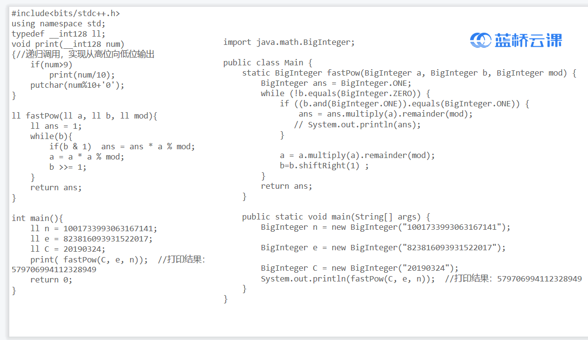
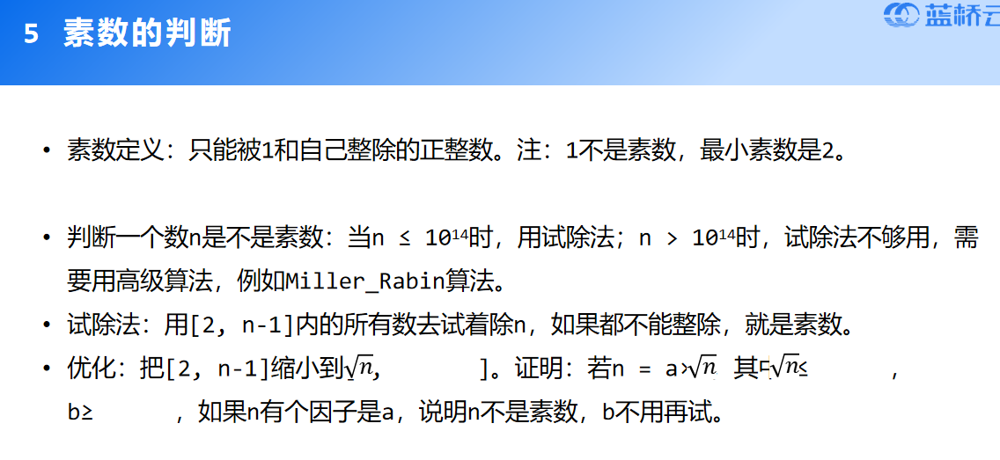
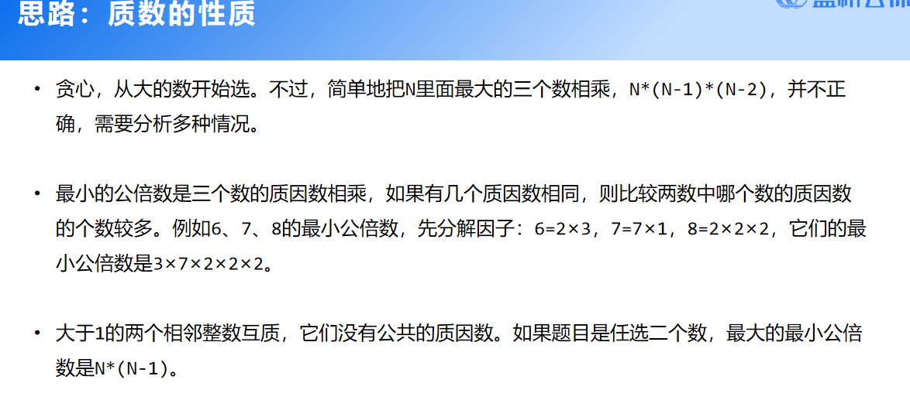

## 蓝桥杯

### 时间显示

题目描述

小蓝要和朋友合作开发一个时间显示的网站。

在服务器上，朋友已经获取了当前的时间，用一个整数表示，值为从 1970年 11 月 11 日 00:00:00到当前时刻经过的毫秒数。

现在，小蓝要在客户端显示出这个时间。小蓝不用显示出年月日，只需要显示出时分秒即可，毫秒也不用显示，直接舍去即可。

给定一个用整数表示的时间，请将这个时间对应的时分秒输出。
输入描述

输入一行包含一个整数，表示时间。
输出描述

输出时分秒表示的当前时间，格式形如 HH:MM:SS，其中 HH 表示时，值为 00 到 23，MM 表示分，值为 00 到 59，SS 表示秒，值为 00 到 59。时、分、秒 不足两位时补前导 0。
输入输出样例
示例 1

    输入

46800999

    1
    
    输出13:00:00


下面分别给出使用 Java API 和不使用 Java API 的两种实现方式。

使用 Java API 的实现方式：

```java
import java.text.SimpleDateFormat;
import java.util.Date;

public class TimeDisplay {
    public static void main(String[] args) {
        // 获取当前时间
        long currentTime = System.currentTimeMillis();

        // 将时间转换为 Date 对象
        Date date = new Date(currentTime);

        // 设置时间格式
        SimpleDateFormat dateFormat = new SimpleDateFormat("HH:mm:ss");

        // 格式化时间并输出
        String timeStr = dateFormat.format(date);
        System.out.println(timeStr);
    }
}
```

在上述代码中，首先使用 `System.currentTimeMillis()` 获取当前时间的毫秒数，然后将毫秒数转换为 `Date` 对象。接着，使用 `SimpleDateFormat` 对象设置时间格式，并将 `Date` 对象格式化为字符串，最后将字符串输出。

不使用 Java API 的实现方式：

```java
public class TimeDisplay {
    public static void main(String[] args) {
        // 获取当前时间
        long currentTime = System.currentTimeMillis();

        // 计算小时、分钟、秒数
        int hours = (int) ((currentTime / (1000 * 60 * 60)) % 24);
        int minutes = (int) ((currentTime / (1000 * 60)) % 60);
        int seconds = (int) (currentTime / 1000) % 60;

        // 格式化时间并输出
        System.out.printf("%02d:%02d:%02d", hours, minutes, seconds);
        /*
        "%02d:%02d:%02d" 是一个格式化输出字符串，其中 %02d 表示格式化一个整数为两位宽度，并在前面用 0 补齐。

具体来说，% 表示格式化字符串的起始，后面的 0 表示用 0 进行填充，2 表示占据两个字符宽度，d 表示格式化为整数。

因此，"%02d" 表示格式化一个整数为两位宽度，并在前面用 0 补齐。而 "%02d:%02d:%02d" 表示格式化三个整数，并用 : 分隔，每个整数都占据两位宽度，并在前面用 0 补齐。例如，如果第一个整数为 9，第二个整数为 8，第三个整数为 7，那么格式化后的字符串为 "09:08:07"。

在本题中，使用 "%02d:%02d:%02d" 格式化输出小时、分钟、秒数，保证输出的字符串中每个时间部分都占据两位宽度，并在前面用 0 补齐。例如，如果小时为 9，分钟为 8，秒数为 7，那么格式化后的字符串为 "09:08:07"。
        
        */
    }
}
```

在上述代码中，首先使用 `System.currentTimeMillis()` 获取当前时间的毫秒数，然后使用数学计算获取小时、分钟、秒数。最后使用 `printf` 方法格式化输出时间，并在小时、分钟、秒数不足两位时在前面补零。

这两种实现方式都可以将一个整数表示的时间转换为时分秒表示，并输出。使用 Java API 的方式更加简洁和易读，而不使用 Java API 的方式需要进行一些数学计算，稍微复杂一些。

#### Date

`Date` 类是 Java 中表示日期和时间的类，在创建 `Date` 对象时，可以传入一个表示自 1970 年 1 月 1 日 00:00:00 GMT 以来经过的毫秒数的参数，即 `Date(long date)` 构造方法。

例如，`Date date = new Date(1616160000000L)` 表示创建一个日期对象，表示 2021 年 3 月 19 日 00:00:00 GMT。

以下是一个使用 `Date` 类创建日期对象的示例代码：

```java
import java.util.Date;

public class DateExample {
    public static void main(String[] args) {
        // 创建 Date 对象，表示 2021 年 3 月 19 日 00:00:00 GMT
        Date date = new Date(1616160000000L);

        // 输出 Date 对象的值
        System.out.println(date);
    }
}
```

在上述代码中，创建一个 `Date` 对象，表示 2021 年 3 月 19 日 00:00:00 GMT，使用 `System.out.println()` 输出 `Date` 对象的值。

需要注意的是，`Date` 类在 JDK 8 中已经过时，推荐使用 `java.time` 包中的日期和时间 API 进行日期和时间的操作。

#### simpleDateFormat 

`SimpleDateFormat` 是 Java 中用于日期格式化的类，它可以将日期和时间按照指定的格式进行格式化，也可以将字符串解析为日期和时间。在 Java 应用程序中，经常需要将日期和时间转换为特定的格式，例如将日期格式化为 `"yyyy-MM-dd"`，或者将时间格式化为 `"HH:mm:ss"`。

`SimpleDateFormat` 类的常用构造方法有两个：

```java
SimpleDateFormat(String pattern)
SimpleDateFormat(String pattern, Locale locale)
//SimpleDateFormat dateFormat = new SimpleDateFormat("yyyy-MM-dd HH:mm:ss",Locale.CHIsNA);
```

其中，`pattern` 参数表示日期和时间的格式，`locale` 参数表示地区和语言。

`SimpleDateFormat` 类的常用方法主要包括：

- `format(Date date)`：将指定的日期格式化为字符串。
- `parse(String source)`：将指定的字符串解析为日期对象。

以下是一个使用 `SimpleDateFormat` 格式化日期和时间的示例代码：

```java
import java.text.SimpleDateFormat;
import java.util.Date;

public class SimpleDateFormatExample {
    public static void main(String[] args) {
        // 创建 SimpleDateFormat 对象，指定日期格式
        SimpleDateFormat dateFormat = new SimpleDateFormat("yyyy-MM-dd HH:mm:ss");

        // 创建 Date 对象，表示当前时间
        Date date = new Date();

        // 将 Date 对象格式化为字符串
        String dateString = dateFormat.format(date);

        // 输出格式化后的字符串
        System.out.println(dateString);
    }
}
```

在上述代码中，首先使用 `SimpleDateFormat` 创建一个日期格式化对象 `dateFormat`，指定日期和时间的格式为 `"yyyy-MM-dd HH:mm:ss"`。接着，使用 `new Date()` 创建一个 `Date` 对象，表示当前时间。最后，使用 `dateFormat.format()` 方法将 `Date` 对象格式化为字符串，并将字符串输出。

注意，`SimpleDateFormat` 不是线程安全的类，如果在多线程环境下使用，需要进行同步处理，或者使用 `ThreadLocal` 等方式保证线程安全。


#### !!

public class data {
 public static void main(String[] args){
 Scanner scanner = new Scanner(System.in);
 Long time = scanner.nextLong();
 SimpleDateFormat simpleDateFormat = new SimpleDateFormat("HH:mm:ss", Locale.CHINA);
 Date date = new Date(time);
 String strtime = simpleDateFormat.format(date);
 System.out.println(strtime);

}

}为什么我在idea编辑器里运行这段代码，输入46800999，输出是21:00:00，而不是10:00:00

可能是因为你的本地时区设置不同所导致的。在 Java 中，`SimpleDateFormat` 默认使用的是系统时区来进行时间格式化。而在中国时区（GMT+8），1970 年 1 月 1 日 00:00:00 GMT 对应的是北京时间 1970 年 1 月 1 日 08:00:00。

因此，如果你的本地时区设置为 GMT+8（即北京时间所在的时区），那么输入 46800999 所代表的时间就是北京时间的下午 5 点 00 分 00 秒，而不是上午 10 点 00 分 00 秒。因此，输出的结果就是 21:00:00，而不是 10:00:00。

如果你想要在代码中使用固定的时区来进行时间格式化，可以在创建 `SimpleDateFormat` 对象时指定时区，例如：

```java
SimpleDateFormat simpleDateFormat = new SimpleDateFormat("HH:mm:ss", TimeZone.getTimeZone("GMT"));
```

在这个例子中，我们指定了时区为 GMT，即格林威治标准时间，这样就可以保证使用固定的时区来进行时间格式化，而不受本地时区设置的影响。


Cannot resolve constructor 'SimpleDateFormat(java.lang.String, java.util.TimeZone)'

如果你在使用 `SimpleDateFormat` 的构造方法时出现了 "Cannot resolve constructor 'SimpleDateFormat(java.lang.String, java.util.TimeZone)'" 的错误，可能是因为你正在使用的 Java 版本过低。

在 Java 7 及更早的版本中，`SimpleDateFormat` 并不支持在构造方法中直接指定时区，需要通过调用 `setTimeZone()` 方法来设置时区。因此，你可以将代码修改为以下形式：

```java
SimpleDateFormat simpleDateFormat = new SimpleDateFormat("HH:mm:ss");
simpleDateFormat.setTimeZone(TimeZone.getTimeZone("GMT"));
```

在这个例子中，我们首先创建一个默认时区为本地时区的 `SimpleDateFormat` 对象，然后再调用 `setTimeZone()` 方法将时区设置为 GMT，这样就可以保证使用固定的时区来进行时间格式化，而不受本地时区设置的影响。

如果你使用的是 Java 8 或更高版本，可以直接使用带有时区参数的 `SimpleDateFormat` 构造方法，例如：

```java
SimpleDateFormat simpleDateFormat = new SimpleDateFormat("HH:mm:ss", TimeZone.getTimeZone("GMT"));
```

在这个例子中，我们直接使用带有时区参数的构造方法来创建 `SimpleDateFormat` 对象，并将时区设置为 GMT。


### 砝码称重

## 问题描述

你有一架天平和 NN 个砝码，这 NN 个砝码重量依次是 W1,W2,⋅⋅⋅,WNW1,W2,⋅⋅⋅,WN。 

请你计算一共可以称出多少种不同的重量？ 注意砝码可以放在天平两边。

## 输入格式

输入的第一行包含一个整数 NN。 

第二行包含 NN 个整数：W1,W2,W3,⋅⋅⋅,WNW1,W2,W3,⋅⋅⋅,WN。

## 输出格式

输出一个整数代表答案。

## 样例输入

```txt
3
1 4 6
```

## 样例输出

```txt
10
```

## 样例说明

能称出的 1010 种重量是：1、2、3、4、5、6、7、9、10、111、2、3、4、5、6、7、9、10、11。

1=1；1=1；

2=6−4(2=6−4(天平一边放 66，另一边放 4)；4)；

3=4−1；3=4−1；

4=4；4=4；

5=6−1；5=6−1； 

6=6；6=6；

7=1+6；7=1+6；

 9=4+6−1；9=4+6−1；

10=4+6；10=4+6；

11=1+4+6。11=1+4+6。

## 评测用例规模与约定

对于 5050的评测用例，1≤N≤151≤N≤15。 

对于所有评测用例，1≤N≤100,N1≤N≤100,N个砝码总重不超过 100000100000。

### 运行限制

- 最大运行时间：1s 
- 最大运行内存: 256M


```java
public class Balance {
    public static void main(String[] args){
        Scanner scan = new Scanner(System.in);
        Set<Integer> set = new HashSet<>();
        int n = scan.nextInt();
        int[] fama = new int[n];    
	for (int i = 0; i < n; i++) {
        fama[i] = scan.nextInt();
    }
    //初始化set集合，放入0
    set.add(0);
    for (int i = 0; i < n; i++) {
        //将set集合转化为list集合
        List<Integer> list = new ArrayList<>(set);
        for (int k : list) {
            //将新的砝码与set集合的元素进行加减操作，得出新的砝码秤重
            set.add(k + fama[i]);
            set.add(Math.abs(k - fama[i]));
        }
    }
    //移除0元素
    set.remove((Object)0);
    //输出set集合大小，也就是秤重方案数
    System.out.println(set.size());
    scan.close();
}
```
}

#### set集合怎么转化为list

要将HashSet转换为List，可以使用Java中的ArrayList类。ArrayList是一个动态数组，可以根据需要自动扩展大小。要将HashSet转换为ArrayList，可以使用以下代码：

```java
HashSet<Integer> set = new HashSet<Integer>();
// 添加元素到HashSet中
List<Integer> list = new ArrayList<Integer>(set);
```

在上面的代码中，我们首先创建了一个HashSet对象set，并向其中添加了一些元素。然后，我们使用ArrayList的构造函数将set转换为ArrayList。这样，我们就可以使用ArrayList的所有方法来操作这个列表了。需要注意的是，由于HashSet是无序的，因此转换后的ArrayList也是无序的。如果您需要对列表进行排序，可以使用Collections.sort()方法。


除了使用ArrayList，还可以使用Java 8中引入的Stream API来将HashSet转换为List。Stream API提供了一种更简洁、更灵活的方式来操作集合。以下是使用Stream API将HashSet转换为List的示例代码：

```java
HashSet<Integer> set = new HashSet<Integer>();
// 添加元素到HashSet中
List<Integer> list = set.stream().collect(Collectors.toList());
```

在上面的代码中，我们首先创建了一个HashSet对象set，并向其中添加了一些元素。然后，我们使用Stream API的collect()方法将set转换为List。collect()方法接受一个Collector对象作为参数，用于指定如何将Stream中的元素收集到一个集合中。在这里，我们使用Collectors.toList()方法来创建一个List对象。这样，我们就可以使用List的所有方法来操作这个列表了。需要注意的是，由于HashSet是无序的，因此转换后的List也是无序的。如果您需要对列表进行排序，可以使用Stream API的sorted()方法


### 杨辉三角形

### 题目描述

下面的图形是著名的杨辉三角形：


如果我们按从上到下、从左到右的顺序把所有数排成一列，可以得到如下数列： 1,1,1,1,2,1,1,3,3,1,1,4,6,4,1,⋯1,1,1,1,2,1,1,3,3,1,1,4,6,4,1,⋯

给定一个正整数 NN，请你输出数列中第一次出现 NN 是在第几个数？

### 输入描述

输入一个整数 NN。

### 输出描述

输出一个整数代表答案。

### 输入输出样例

#### 示例 1

> 输入

```txt
6
```

> 输出

```txt
13
```

### 评测用例规模与约定

对于 2020 的评测用例，1≤N≤101≤N≤10； 对于所有评测用例，1≤N≤10000000001≤N≤1000000000。

### 运行限制

- 最大运行时间：1s 
- 最大运行内存: 256M


```java
public class YangHui {//只能得30分，后面超时
    public static void main(String[] args){
        // 创建四个列表，用于存储杨辉三角的每一行
        List<Long> list1 = new ArrayList<>();
        List<Long> list2 = new ArrayList<>();
        List<Long> list3 = new ArrayList<>();
        List<Long> list4 = new ArrayList<>();
        // 向第一个列表中添加初始元素0和1
        list1.add(0L);
        list1.add(1L);
        list1.add(0L);
        list3.addAll(list1);
        // 定义两个变量now和pre，用于计算杨辉三角的每一行
        Long now = 0L;
        Long pre = 0L;
        // 循环计算杨辉三角的每一行，共计算40行
        for(int i = 0 ; i < 40; i++){
            // 从第一个列表中取出第一个元素作为pre
            pre = list1.get(0);
            // 循环遍历第一个列表中的所有元素
            while(list1.size() != 0){
                // 从第一个列表中取出一个元素作为now
                now = list1.remove(0);
                // 将now+pre的结果添加到第二个列表中
                list2.add(now + pre);
                // 更新pre的值为now
                pre = now;
            }
            // 向第二个列表中添加一个0，用于填充下一行的空缺
            list2.add(0L);
            // 清空第一个列表，并将第二个列表中的元素复制到第一个列表中
            list1.clear();
            list1.addAll(list2);
            // 清空第二个列表，并将第一个列表中的元素复制到第三个列表中
            list2.clear();
            list3.addAll(list1);
        }
        // 遍历第三个列表，将所有非0元素添加到第四个列表中
        for(Long l : list3){
            if(l != 0){
                list4.add(l);
            }
        }
        // 从标准输入中读取
        Scanner scan = new Scanner(System.in);
		Long n = scan.nextLong();
// 输出第四个列表中n的索引值+1
		System.out.println(list4.indexOf(n) + 1);
    }
}
在上面的代码中，我们首先使用Scanner类从标准输入中读取一个长整型数值n。然后，我们使用List的indexOf()方法查找第四个列表中n的索引值，并将其加1后输出。需要注意的是，如果n不在第四个列表中，indexOf()方法将返回-1。如果您对Java中的Scanner类和List的indexOf()方法不熟悉，可以参考Java官方文档：https://docs.oracle.com/javase/8/docs/api/java/util/Scanner.html 和 https://docs.oracle.com/javase/8/docs/api/java/util/List.html

//100分的解法
import java.util.Scanner;
public class Main {
    public static void main(String[] args) {
        Scanner scan = new Scanner(System.in);
        long n = scan.nextLong();
        long[] arr =new long[44725];
        arr[0]=1;
        long k=1L;
        if (n == 1) {
            System.out.println(1);
            return;
        }
        for (int i = 1;i<44725; i++) {
            for (int j = i; j>=i-16&&j>=1; j--) {
                arr[j] += arr[j - 1];
                if (arr[j] == n) {
                    System.out.println(k + i-j + 1);
                    return;
                }
            }
            k+=(i+1);
        }
        System.out.println(((1 + n) * n / 2) + 2);
    }
}
```


#### list.add(0L)是什么意思

这行代码是将一个长整型数值0L添加到列表list的末尾。在Java中，0L表示长整型的0，即64位的0。在这段代码中，它被用作列表list的一个元素。如果您对Java中的数据类型不熟悉，可以参考Java官方文档：https://docs.oracle.com/javase/tutorial/java/nutsandbolts/datatypes.html


#### list集合remove（0）后，后面的元素会自动补上来吗

是的，当您从列表中删除一个元素时，后面的元素会自动向前移动，以填补被删除元素的空缺。在Java中，可以使用List的remove()方法来删除列表中的元素。例如，如果您要删除列表中的第一个元素，可以使用以下代码：

```
List<Integer> list = new ArrayList<Integer>();
// 添加元素到列表中
list.remove(0);
```

在上面的代码中，我们首先创建了一个ArrayList对象list，并向其中添加了一些元素。然后，我们使用remove()方法将列表中的第一个元素删除。这样，列表中的所有元素都会向前移动一个位置，以填补被删除元素的空缺。需要注意的是，如果您删除的是最后一个元素，列表的大小将减少1，而不是将最后一个元素向前移动。如果您对Java中的List不熟悉，可以参考Java官方文档：https://docs.oracle.com/javase/8/docs/api/java/util/List.html

## 双向排序

### 题目描述

给定序列 (a1,a2,⋅⋅⋅,an)=(1,2,⋅⋅⋅,n)(a1,a2,⋅⋅⋅,an)=(1,2,⋅⋅⋅,n)，即 ai=iai=i。

小蓝将对这个序列进行 mm 次操作，每次可能是将 a1,a2,⋯ ,aqia1,a2,⋯,aqi 降序排列，或者将 aqi,aqi+1,⋯ ,anaqi,aqi+1,⋯,an 升序排列。

请求出操作完成后的序列。

### 输入描述

输入的第一行包含两个整数 n,mn,m，分别表示序列的长度和操作次数。

接下来 mm 行描述对序列的操作，其中第 i 行包含两个整数 pi,qipi,qi 表示操作类型和参数。当 pi=0pi=0 时，表示将 a1,a2,⋅⋅⋅,aqia1,a2,⋅⋅⋅,aqi 降序排列；当 pi=1pi=1 时，表示将 aqi,aqi+1,⋯ ,anaqi,aqi+1,⋯,an 升序排列。

### 输出描述

输出一行，包含 nn 个整数，相邻的整数之间使用一个空格分隔，表示操作完成后的序列。

### 输入输出样例

#### 示例

> 输入

```txt
3 3
0 3
1 2
0 2
```

> 输出

```txt
3 1 2
```

### 样例说明

原数列为 (1,2,3)(1,2,3)。

第 11 步后为 (3,2,1)(3,2,1)。

第 22 步后为 (3,1,2)(3,1,2)。

第 33 步后为 (3,1,2)(3,1,2)。与第 22 步操作后相同，因为前两个数已经是降序了。

### 评测用例规模与约定

对于 30%30% 的评测用例，n,m≤1000n,m≤1000；

对于 60%60% 的评测用例，n,m≤5000n,m≤5000；

对于所有评测用例，1≤n,m≤100000，0≤pi≤1，1≤qi≤n1≤n,m≤100000，0≤pi≤1，1≤qi≤n。

### 运行限制

| 语言    | 最大运行时间 | 最大运行内存 |
| ------- | :----------: | ------------ |
| C++     |      1s      | 256M         |
| C       |      1s      | 256M         |
| Java    |      1s      | 256M         |
| Python3 |      1s      | 256M         |


## 卡片

## 题目描述

**本题为填空题，只需要算出结果后，在代码中使用输出语句将所填结果输出即可。**

小蓝有很多数字卡片，每张卡片上都是数字 0到 9。

小蓝准备用这些卡片来拼一些数，他想从 11 开始拼出正整数，每拼一个，就保存起来，卡片就不能用来拼其它数了。

小蓝想知道自己能从 1 拼到多少。

例如，当小蓝有 30张卡片，其中 0 到 9 各 3 张，则小蓝可以拼出 1 到 10

但是拼 11时卡片 1已经只有一张了，不够拼出 11。

现在小蓝手里有 0到 9的卡片各2021 张，总共20210 张，请问小蓝可以从 1拼到多少？

提示：建议使用计算机编程解决问题。

### 运行限制

- 最大运行时间：1s 
- 最大运行内存: 128M

~~~java
import java.util.*;

public class Main {
    public static void main(String[] args){
        // 初始化数字卡片
        int[] nums = new int[10];
        Arrays.fill(nums,2021);
        // 初始化数字
        boolean flag = true;
        int number = 0;
        // 枚举数字
        while(flag){
            // 将数字转换成字符数组
            char[] str = String.valueOf(number).toCharArray();
            // 遍历字符数组
            for(int i = 0; i < str.length; i++ ){
                // 如果当前数字卡片可以使用，则将当前数字卡片的数量减1
                if(nums[str[i] - '0'] > 0){
                    nums[str[i] - '0'] --;
                }
                // 如果当前数字卡片不可以使用，则停止枚举
                else{
                    flag = false;
                    break;
                }
            }
            // 如果当前数字可以拼出，则继续枚举下一个数字
            if(flag){
                number++;
            }
        }
        // 输出最后一个可以拼出的数字
        System.out.println(number - 1);
    }
}
```<|im_sep|>

//s    
从1开始枚举，每次检查剩下的卡片能不能拼出这个数字。

如何求一个数的每个位置的数字？先对10 取模，个位上的数字就求出来了，再除以10，原本十位上的数字就变到了个位上，再对 10 取模...

把当前拼的这个数每一位都拆出来，看看那个数字的卡片还够不够，不够的话就说明拼不了，这时候退出循环，所以最多拼到上一个数。

    
    package meiju;

import java.util.Arrays;

public class Kapian {
	static int[] nums = new int[10];
	static int check(int x) {
		while(x > 0) {
			int now = x%10;
			if(nums[now] > 0) {
				nums[now]--;
			}
			else {
				return 0;
			}
			x=x/10;
		}
		return 1;
	}

	public static void main(String[] args) {
		// TODO Auto-generated method stub
		
		Arrays.fill(nums,2021);
		int i =1;
		while(true) {
			if(check(i) == 0) {
				System.out.println(i - 1);
				break;
			}
			i++;
			
		}
		

	}

}

    

~~~

## 摆放货物

### 题目描述

小蓝有一个超大的仓库，可以摆放很多货物。

现在，小蓝有 nn 箱货物要摆放在仓库，每箱货物都是规则的正方体。小蓝规定了长、宽、高三个互相垂直的方向，每箱货物的边都必须严格平行于长、宽、高。

小蓝希望所有的货物最终摆成一个大的长方体。即在长、宽、高的方向上分别堆 LL、WW、HH 的货物,满足 n=L×W×Hn=L×W×H。

给定 nn，请问有多少种堆放货物的方案满足要求。

例如，当 n=4n=4 时，有以下 66 种方案：1×1×4、1×2×2、1×4×1、2×1×2、2×2×1、4×1×11×1×4、1×2×2、1×4×1、2×1×2、2×2×1、4×1×1。

请问，当 n=2021041820210418（注意有 16位数字）时，总共有多少种方案？

提示：建议使用计算机编程解决问题。

### 答案提交

这是一道结果填空的题，你只需要算出结果后提交即可。本题的结果为一个整数，在提交答案时只填写这个整数，填写多余的内容将无法得分。

### 运行限制

- 最大运行时间：1s 
- 最大运行内存: 256M

```java
import java.util.HashSet;
import java.util.Set;

/**
 * @author WLH
 * @verstion 1.0
 */
public class foods {
    public static void main(String[] args) {
        long n = 2021041820210418L;
        long m = (long) Math.sqrt(n);
        Set<Long> set = new HashSet<>();
        for(long i = 1; i <= m; i++){
            if(n % i == 0){
                set.add(i);
                set.add(n/i);
            }
        }
        int num = 0;
        Long[] arr = set.toArray(new Long[0]);
        for(int i = 0; i < arr.length; i ++){
            for(int j = 0; j < arr.length; j++){
                for(int k = 0; k < arr.length; k++){
                    if(arr[i]*arr[j]*arr[k] == n){
                        num++;
                    }

                }
            }
        }
        System.out.println(num);

    }
}
```


## 计算天数

你好，如果你想用java计算两个日期之间有多少天，有几种方法可以实现。我为你总结了以下几种方法：

- [一种方法是使用java.util.Date类和java.util.concurrent.TimeUnit类。你可以先用SimpleDateFormat类将字符串格式的日期转换为Date对象，然后用getTime()方法获取两个日期的毫秒值，再用TimeUnit.DAYS.convert()方法将毫秒值转换为天数](https://www.baeldung.com/java-date-difference)[1](https://www.baeldung.com/java-date-difference)[2](https://www.javatpoint.com/how-to-calculate-date-difference-in-java)。
- [另一种方法是使用java.time.temporal.ChronoUnit枚举类。这个类提供了一个between()方法，可以计算两个日期之间的时间单位数，比如天数、月数、年数等。你可以先用LocalDate类或其他日期时间类创建两个日期对象，然后用ChronoUnit.DAYS.between()方法获取天数](https://beginnersbook.com/2017/10/java-8-calculate-days-between-two-dates/)[3](https://beginnersbook.com/2017/10/java-8-calculate-days-between-two-dates/)[4](https://beginnersbook.com/2017/10/java-8-calculate-days-between-two-dates/)。
- 还有一种方法是使用java.time.Period类。这个类也可以计算两个日期之间的时间段，但是它只能计算以年、月、日为单位的时间段。你也可以先用LocalDate类或其他日期时间类创建两个日期对象，然后用Period.between()方法获取Period对象，再用getDays()方法获取天数。

以上是我为你找到的一些常用的方法，希望对你有帮助。

- 使用java.util.Date类和java.util.concurrent.TimeUnit类的方法：

```java
import java.text.SimpleDateFormat;
import java.util.Date;
import java.util.concurrent.TimeUnit;

public class DateExample1 {
    public static void main(String[] args) throws Exception {
        // 定义两个字符串格式的日期
        String date1 = "1901/01/01 00:00:00";
        String date2 = "2021/12/31 23:59:59";

        // 创建SimpleDateFormat对象，指定日期格式
        SimpleDateFormat sdf = new SimpleDateFormat("yyyy/MM/dd HH:mm:ss");

        // 调用parse()方法将字符串转换为Date对象
        Date d1 = sdf.parse(date1);
        Date d2 = sdf.parse(date2);

        // 调用getTime()方法获取两个日期的毫秒值
        long time1 = d1.getTime();
        long time2 = d2.getTime();

        // 计算两个日期之间的毫秒差
        long diffInMillis = Math.abs(time2 - time1);

        // 使用TimeUnit.DAYS.convert()方法将毫秒差转换为天数
        long diffInDays = TimeUnit.DAYS.convert(diffInMillis, TimeUnit.MILLISECONDS);

        // 输出结果
        System.out.println("两个日期之间相差" + diffInDays + "天");
    }
}
```

- 使用java.time.temporal.ChronoUnit枚举类的方法：

```java
import java.time.LocalDate;
import java.time.temporal.ChronoUnit;

public class DateExample2 {
    public static void main(String[] args) {
        
       // 定义两个LocalDate对象，指定年月日
       LocalDate date1 = LocalDate.of(1901, 1, 1);
       LocalDate date2 = LocalDate.of(2021, 12, 31);

       // 调用ChronoUnit.DAYS.between()方法计算两个日期之间的天数
       long diffInDays = ChronoUnit.DAYS.between(date1, date2);

       // 输出结果
       System.out.println("两个日期之间相差" + diffInDays + "天");
    }
}
```

- 使用java.time.Period类的方法：

```java
import java.time.LocalDate;
import java.time.Period;

public class DateExample3 {
    public static void main(String[] args) {

       // 定义两个LocalDate对象，指定年月日
       LocalDate date1 = LocalDate.of(1901, 1, 1);
       LocalDate date2 = LocalDate.of(2021, 12, 31);

       // 调用Period.between()方法获取两个日期之间的Period对象
       Period period = Period.between(date1, date2);

       // 调用getDays()方法获取Period对象中的天数部分（不包括年月）
       int diffInDays = period.getDays();

       // 输出结果（注意这里只是输出了天数部分，如果要输出完整的年月日，可以使用period.getYears(), period.getMonths()等方法）
       System.out.println("两个日期之间相差" + diffInDays + "天");
    }
}
```


### 用excel计算天数


在 Excel 中，我们可以使用 `DATEDIF` 函数来计算两个日期之间的差值。`DATEDIF` 函数的语法如下：

```
DATEDIF(start_date, end_date, unit)
```

其中，`start_date` 表示开始日期，`end_date` 表示结束日期，`unit` 表示计算的单位。`unit` 可以取以下几个值：

- "Y"：计算年数。
- "M"：计算月数。
- "D"：计算天数。
- "MD"：计算两个日期之间的月份数，但不考虑年份。
- "YM"：计算两个日期之间的年份数，但不考虑整年。
- "YD"：计算两个日期之间的天数，但不考虑整年和整月。

例如，要计算从 2022 年 1 月 1 日到 2022 年 3 月 21 日的天数，可以使用以下公式：

```
=DATEDIF("2022-01-01", "2022-03-21", "D")
```

注意，日期需要使用双引号引起来，并使用短横线分隔年、月、日。

如果想要计算两个日期之间的整年数或整月数，可以使用以下公式：

计算整年数：

```
=DATEDIF(start_date, end_date, "Y")
```

计算整月数：

```
=DATEDIF(start_date, end_date, "M")
```

需要注意的是，如果 `start_date` 晚于 `end_date`，则 `DATEDIF` 函数会返回错误值。另外，`DATEDIF` 函数在 Excel 2016 中已被标记为已弃用，建议使用其他函数代替。

### 使用python计算天数

```python
from datetime import *
dt1 = datetime(1901,1,1)
dt2 = datetime(2000,12,31)
print(dt1.weekday())
dt3 = dt2 - dt1
print(dt3.days // 7)

这段代码导入了datetime模块，然后创建了两个datetime对象：dt1和dt2。dt1表示1901年1月1日，dt2表示2000年12月31日。然后，我们使用dt1.weekday()方法来获取dt1所代表的日期是星期几（0表示星期一，6表示星期日）。接下来，我们计算了dt2和dt1之间的天数差，并使用//运算符来计算整数除法，以获取这段时间内的完整周数。
```

### / 和//运算符有什么区别

/运算符用于执行浮点数除法，//运算符用于执行整数除法。例如，5/2将返回2.5，而5//2将返回2。

在java里也是这样吗

在Java中，/运算符和//运算符的行为与Python中的相同。/运算符用于执行浮点数除法，//运算符用于执行整数除法

#### 闰年判断

闰年的判断方法是：能被4整除但不能被100整除的年份为闰年，能被400整除的也是闰年。这个方法是历法学家约翰·格里高利在1582年制定的，称为“格里高利历”。在此之前，闰年的判断方法比较复杂，格里高利历的出现大大简化了闰年的判断方法。

```python
def is_leap_year(year):
    if year % 4 == 0 and year % 100 != 0 or year % 400 == 0:
        return True
    else:
        return False

print(is_leap_year(2000))
print(is_leap_year(1900))
print(is_leap_year(2004))
```


## python大数（填空）


```python
# 将字符串转换为整数列表
data = "5650 4542 3554 473 946 4114 3871 9073 90 4329 \
2758 7949 6113 5659 5245 7432 3051 4434 6704 3594 \
9937 1173 6866 3397 4759 7557 3070 2287 1453 9899 \
1486 5722 3135 1170 4014 5510 5120 729 2880 9019 \
2049 698 4582 4346 4427 646 9742 7340 1230 7683 \
5693 7015 6887 7381 4172 4341 2909 2027 7355 5649 \
6701 6645 1671 5978 2704 9926 295 3125 3878 6785 \
2066 4247 4800 1578 6652 4616 1113 6205 3264 2915 \
3966 5291 2904 1285 2193 1428 2265 8730 9436 7074 \
689 5510 8243 6114 337 4096 8199 7313 3685 211 \
"
num = data.split()

# 计算列表中所有数字的乘积
product = 1
for i in num:
    product = product * int(i)

# 计算乘积的末尾有多少个零
count = 0
while product % 10 == 0:
    product = product // 10
    count += 1

# 输出结果
print(count)

```

## 两个字符串数字相乘会自动转化为int吗

在Python中，两个字符串相乘不会自动转换为整数。相反，它将重复字符串中的字符，以产生一个新的字符串。例如，以下代码将重复字符串 "hello" 三次：

```
my_string = "hello" * 3
print(my_string)
```

这将输出：

```
hellohello
```

如果你想将两个字符串转换为整数并相乘，你需要使用 

int()

 函数将它们转换为整数。例如，以下代码将两个字符串转换为整数并相乘：


```
num1 = "10"
num2 = "20"
product = int(num1) * int(num2)
print(product)
```

这将输出：

```
200
```

## python处理字符


## 思维题


## 成绩排列

小蓝给学生们组织了一场考试，卷面总分为 100 分，每个学生的得分都是一个 0 到 100 的整数。

如果得分至少是 60 分，则称为及格。如果得分至少为 85 分，则称为优秀。

请计算及格率和优秀率，用百分数表示，百分号前的部分四舍五入保留整 数。


```java
import java.text.DecimalFormat;
import java.util.Scanner;

/**
 * @author WLH
 * @verstion 1.0
 */
public class Score {
    public static void main(String[] args) {
        Scanner scan = new Scanner(System.in);
        int n = scan.nextInt();
        int[] num = new int[n+1];
        for(int i = 1; i <= n; i++){
            num[i] = scan.nextInt();
        }
        int jige = 0;
        int youxiu = 0;
        for(int i = 1; i <= n; i++){
            if(num[i] >= 60){
                jige++;
            }
            if(num[i] >= 85){
                youxiu++;
            }
        }
//        DecimalFormat df = new DecimalFormat("#.##");
//        int i = df.format(jige / n );
//        System.out.printf("%.2f",1.0*jige/n*100+"%");
//        System.out.printf("%.2f",1.0*youxiu/n*100+"%");
        System.out.printf("%.0f%%\n", (1.0 * jige / n * 100));//.0f四舍五入
        System.out.printf("%.0f%%\n", (1.0 * youxiu / n * 100));
        scan.close();
    }
}
```

You:


System.out.println(youxiu / n * 100+"%");要使输出不为0%，要怎么改

------

ChatGPT:


要使输出不为0%，需要确保分母n不为0，分子youxiu也不为0。如果分子为0，则输出为0%。另外，为了让输出的百分比更加直观，可以使用DecimalFormat类将输出结果保留一定小数位数。以下是一种可能的修改方式：

```java
DecimalFormat df = new DecimalFormat("#.##"); // 保留两位小数
if (n != 0 && youxiu != 0) {
    System.out.println(df.format(youxiu / n * 100) + "%");
} else {
    System.out.println("分母或分子为0，无法计算百分比。");
}
```

这样，当分母或分子为0时，输出结果为“分母或分子为0，无法计算百分比。”，否则输出百分比（保留两位小数）。

------

You:


DecimalFormat这个是什么，给我介绍一下用法

------

ChatGPT:


`DecimalFormat`是Java中用于格式化数字的一个类。它可以将数字按照指定的格式进行格式化，例如保留小数位数、添加千位分隔符、指定数据的最小长度等等。下面是一些常见的用法：

1. 保留小数位数

```java
double num = 123.456789;
DecimalFormat df = new DecimalFormat("#.##"); // 保留两位小数
String result = df.format(num); // 格式化数字
System.out.println(result); // 输出结果为123.46
```

1. 添加千位分隔符

```java
int num = 12345678;
DecimalFormat df = new DecimalFormat("#,###"); // 添加千位分隔符
String result = df.format(num); // 格式化数字
System.out.println(result); // 输出结果为12,345,678
```

1. 指定数据的最小长度

```java
int num = 123;
DecimalFormat df = new DecimalFormat("000000"); // 指定数据的最小长度为6
String result = df.format(num); // 格式化数字
System.out.println(result); // 输出结果为000123
```

除此之外，`DecimalFormat`还支持很多其他的格式化选项，如指定数据的最大长度、指定百分比格式、指定货币格式等等。可以根据需要来设置不同的格式化选项。


## 排列字母

小蓝要把一个字符串中的字母按其在字母表中的顺序排列。

例如，LANQIAO 排列后为 AAILNOQ。

又如，GOODGOODSTUDYDAYDAYUP 排列后为 AADDDDDGGOOOOPSTUUYYY。

请问对于以下字符串，排列之后字符串是什么？

WHERETHEREISAWILLTHEREISAWAY

```java
import java.util.Arrays;

/**
 * @author WLH
 * @verstion 1.0
 */
public class RangLetter {
    public static void main(String[] args) {
        String str = "WHERETHEREISAWILLTHEREISAWAY";
        char[] arr = str.toCharArray();
        Arrays.sort(arr);
        System.out.println(arr);

    }
}
```

## 纸张尺寸

在 ISO 国际标准中定义了 A0 纸张的大小为 1189mm ×× 841mm, 将 A0 纸 沿长边对折后为 A1 纸, 大小为 841mm ×× 594mm, 在对折的过程中长度直接取 下整 (实际裁剪时可能有损耗)。将 A1 纸沿长边对折后为 A2 纸, 依此类推。

输入纸张的名称, 请输出纸张的大小。

### 输入格式

输入一行包含一个字符串表示纸张的名称, 该名称一定是 A0、A1、A2、 A3、A4、A5、A6、A7、A8、A9 之一。

### 输出格式

输出两行，每行包含一个整数，依次表示长边和短边的长度。

### 样例输入1

```txt
A0
```

### 样例输出1

```text
1189
841
```

### 样例输入 2

```txt
A1
```

### 样例输出 2

```text
841
594
```

```java
import java.util.Scanner;

/**
 * @author WLH
 * @verstion 1.0
 */
public class PaperSize {
    public static void main(String[] args) {
        Scanner scan = new Scanner(System.in);
        int n = scan.nextLine().charAt(1) - '0';
        int a = 1189,b=841;
        for(int i = 1; i <= n; i++){
            a = a/2;
            if(a < b){
                int temp = a;
                a = b;
                b = temp;
            }
        }
        System.out.println(a);
        System.out.println(b);
    }
}
```

## 付账问题

【题目描述】有n个人出去吃饭，他们总共消费了S元。其中第i个人带了ai元。所有人带的钱的总数是足够付账的。现在问题来了：每个人分别要出多少钱呢？为了公平起见，我们希望在总付钱量恰好为S的前提下，最后每个人付的钱的标准差最小。我们约定，每个人支付的钱数可以是任意非负实数，即可以不是1分钱的整数倍。你需要输出最小的标准差是多少。标准差：是多个数与它们平均数差值的平方平均数，一般用于刻画这些数之间的“偏差有多大”。设第i个人付的钱为bi元，那么标准差为：


**思路**：如果每人带的钱够多，人均完全一样，bi = S/n = avg，标准差X = 0。不过总有人钱不够，分两种情况讨论：（1）第i人带的钱不够平均数avg，他只能出他带的全部钱ai。（2）第i人带的钱比平均数avg多，他可以多摊一些。


**求解步骤**：（1）对ai从小到大排序；（2）前一部分人的钱不够，那么就出他们所有的钱；（3）从总付钱数中扣除前一部分人出的钱，得剩余钱数为S’，以及后一部分人的出钱平均数avg’。（4）后一部分人的钱多，他们多出一些。怎么出？这部分人也分两类：（i）比较有钱的，但是他的钱也不够avg’，那么他的钱还是要全出；（ii）非常有钱的，不管怎么摊他都有富余。

因为前面一部分人不够avg,所以后面够了avg的人就不能只出avg了，要尽可能的每个人出的一样。因为有人不够，总有人多出，因为是标准差（方差开根号），所以每个人出的钱差距越小越好。a[i]*(n+1-i) >= s说明第 I 个人后面都可以跟他出一样的钱，那就让他后面的跟他出一样得到钱。a[i]*(n+1-i) < s说明第i个人后面出跟他一样的钱是不够的，那么他后面的人出的肯定比他多，那就让他全出，再考虑下一位。


```java
import java.io.FileNotFoundException;
import java.util.Arrays;
import java.util.Scanner;
public class Main {
public static void main(String args[]) {
        int n;
        long S;
        double ans=0,avg;
        Scanner input=new Scanner(System.in);
        n=input.nextInt();
        S=input.nextLong();
        long a[]=new long[n];
        for(int i=0;i<n;i++)         
            a[i]=input.nextLong();
       Arrays.sort(a);
        avg=(double)S/n;
        for(int i=0;i<n;i++) {
            if(S<=(n-i)*a[i]) {
                ans += (n-i)*Math.pow((double)S/(n-i)-avg,2);
                break;
            }
            ans += Math.pow(a[i]-avg,2);
            S -= a[i];
        }
        System.out.printf("%.4f\n",Math.sqrt(ans/n));

```


## python输入

```python
num = eval(input())//自动转类型
int num = int(input)//手动
```

```python
print("字符串：%s" % "hello world")
print("整数：%d" % 100)
print("浮点数：%f" % 3.1415926)
print("指数形式浮点数：%e" % 1000000000000000000000000000000000000000000000000000000000000000000000000000000)
print("小数方式浮点数：%g" % 123456789.123456789)
print("十六进制数：%x" % 255)
print("八进制数：%o" % 255)
print("字符：%c" % 97)
print("repr字符串：%r" % "hello world")
print("输出%本身：%%")

print("不带编号：{} {}".format("hello", "world"))
print("带编号：{0} {1}".format("hello", "world"))


print("整数：{:d}".format(100))
print("浮点数：{:f}".format(3.1415926))
print("指数形式浮点数：{:e}".format(1000000000000000000000000000000000000000000000000000000000000000000000000000000))
print("小数方式浮点数：{:g}".format(123456789.123456789))
print("十六进制数：{:x}".format(255))
print("八进制数：{:o}".format(255))
print("字符：{:c}".format(97))
print("字符串：{:s}".format("hello world"))
print("数字：{:,}".format(1234567890))

```


## java保留有效数字输出

Java中保留有效数字的方法有很多种，常用的有以下几种：

1. 使用String.format()方法

可以使用String.format()方法将数字格式化为指定的字符串。例如，以下代码将数字保留两位有效数字并输出：

```
double num = 3.1415926;

String str = String.format("%.2f", num);

System.out.println(str); // 输出 3.14
```


1. 使用System.out.printf()方法

可以使用System.out.printf()方法将数字格式化为指定的字符串并输出。例如，以下代码将数字保留两位有效数字并输出：

```
double num = 3.1415926;

System.out.printf("%.2f", num); // 输出 3.14


```


1. 使用DecimalFormat类

可以使用DecimalFormat类将数字格式化为指定的字符串。例如，以下代码将数字保留两位有效数字并输出：

```
double num = 3.1415926;

DecimalFormat df = new DecimalFormat("#.00");

String str = df.format(num);

System.out.println(str); // 输出 3.14


```


1. 使用BigDecimal类

可以使用BigDecimal类将数字保留指定的位数。例如，以下代码将数字保留两位有效数字并输出：

```
double num = 3.1415926;

BigDecimal bd = new BigDecimal(num);

bd = bd.setScale(2, RoundingMode.HALF_UP);

System.out.println(bd); // 输出 3.14
```


以上方法都可以在Java 1.8中使用。

在使用DecimalFormat类时，需要导入java.text.DecimalFormat包。在使用BigDecimal类时，需要导入java.math.BigDecimal包。


## java各种数据类型

Java中的数据类型可以分为两类：基本数据类型和引用数据类型。

基本数据类型包括：

1. byte：1字节，范围为-128~127 3位十进制数
2. short：2字节，范围为-32768~32767  5位十进制数
3. int：4字节，范围为-2147483648~2147483647  10位十进制数
4. long：8字节，范围为-9223372036854775808~9223372036854775807  19位十进制数
5. float：4字节，范围为-3.4028235E38~3.4028235E38，精度为6~7位小数
6. double：8字节，范围为-1.7976931348623157E308~1.7976931348623157E308，精度为15位小数
7. char：2字节，表示Unicode字符，范围为\u0000~\uffff
8. boolean：1位，表示true或false


Java中的基本数据类型都有对应的包装类，用于在需要使用对象的场合下使用。以下是Java中基本数据类型和对应的包装类：

1. byte：Byte
2. short：Short
3. int：Integer
4. long：Long
5. float：Float
6. double：Double
7. char：Character
8. boolean：Boolean

这些包装类都有一些常用的方法，例如：

1. intValue()：将Integer对象转换为int类型的值
2. longValue()：将Long对象转换为long类型的值
3. floatValue()：将Float对象转换为float类型的值
4. doubleValue()：将Double对象转换为double类型的值
5. charValue()：将Character对象转换为char类型的值
6. booleanValue()：将Boolean对象转换为boolean类型的值
7. compareTo()：比较两个对象的大小
8. equals()：判断两个对象是否相等
9. toString()：将对象转换为字符串

例如，可以使用以下代码将一个Integer对象转换为int类型的值：

Integer obj = new Integer(123);

int num = obj.intValue();


需要注意的是，自动装箱和自动拆箱功能可以使得基本数据类型和对应的包装类之间的转换更加方便，但也可能会导致一些问题，例如空指针异常。因此，在使用自动装箱和自动拆箱功能时，需要谨慎处理。

#### 将字符串转成int

Java中可以使用Integer.parseInt()方法将字符串转换为int类型的值。例如，以下代码将字符串"123"转换为int类型的值：

String str = "123";

int num = Integer.parseInt(str);


需要注意的是，如果字符串不能转换为int类型的值，会抛出NumberFormatException异常。因此，在使用Integer.parseInt()方法时，需要进行异常处理。

#### 将字符串转long

Java中可以使用Long.parseLong()方法将字符串转换为long类型的值。例如，以下代码将字符串"123"转换为long类型的值：

String str = "123";

long num = Long.parseLong(str);


需要注意的是，如果字符串不能转换为long类型的值，会抛出NumberFormatException异常。因此，在使用Long.parseLong()方法时，需要进行异常处理。

#### 将char 转成int

Java中可以使用强制类型转换将char类型的值转换为int类型的值。例如，以下代码将字符'a'转换为int类型的值：

char ch = 'a';

int num = (int) ch;


需要注意的是，char类型的值占用两个字节，而int类型的值占用四个字节，因此在进行强制类型转换时可能会出现精度丢失的问题。

#### char 不会自动转换int吗

Java中的char类型的值可以自动转换为int类型的值。例如，以下代码将字符'a'转换为int类型的值：

char ch = 'a';

int num = ch;


需要注意的是，char类型的值占用两个字节，而int类型的值占用四个字节，因此在进行自动转换时可能会出现精度丢失的问题。

##### valueOf()

在Java中，valueOf()方法可以将字符串转换为对应的包装类对象。例如，以下代码将字符串"123"转换为Integer类型的对象：

String str = "123";

Integer num = Integer.valueOf(str);


需要注意的是，如果字符串不能转换为对应的包装类对象，会抛出NumberFormatException异常。因此，在使用valueOf()方法时，需要进行异常处理。


#### 每个包装类都有valueOf()吗

ava中的大部分包装类都提供了valueOf()方法，用于将字符串转换为对应的包装类对象。例如，以下是Java中常用的包装类和对应的valueOf()方法：

1. Byte：Byte.valueOf(String s)
2. Short：Short.valueOf(String s)
3. Integer：Integer.valueOf(String s)
4. Long：Long.valueOf(String s)
5. Float：Float.valueOf(String s)
6. Double：Double.valueOf(String s)
7. Character：Character.valueOf(char c)

需要注意的是，如果字符串不能转换为对应的包装类对象，会抛出NumberFormatException异常。因此，在使用valueOf()方法时，需要进行异常处理


### 数组Long[] 与数组long[]有什么区别

###### Answer

数组是一种有序数据的集合，可以用一个统一的数组名和不同的下标来确定数组中唯一的元素。数组有不同的类型，包括基本类型和类类型。在Java中，数组Long[]和数组long[]的区别如下： Long[]是Long类的数组，long[]是long类型的数组。Long是long的包装类，可以为null，初始值为null，而long是基本类型，不能为null，初始值为0。 对于基本类型的数组，只能进行基本运算，而对于类类型的数组，可以有属性和方法。例如，可以对Long[]数组进行toString()方法的调用，而对于long[]数组则没有这个方法。 在给数组元素赋值时，可以给long[]数组元素赋值为long类型的值，而给Long[]数组元素赋值时，要给其赋值为Long类型的值或者null值。 需要注意的是，long long和long在C++中是不同的概念，long  long是C++的64位整型的基本类型，而long则是32位整型的基本类型。而在Java中，long是64位整型的基本类型，没有long  long这个概念。此外，数组和vector是不同的数据结构，虽然它们都可以对一种类型进行储存，但是具体实现和使用方式有所不同。


## System.out.printf("%.0f%%\n", (1.0 * jige / n * 100));这个代码能够实现四舍五入吗

这个代码可以实现四舍五入，但是它会将小数部分直接截断，而不是按照四舍五入的方式进行舍入。例如，如果 `(1.0 * jige / n * 100)` 的结果为 `99.5`，那么使用 `System.out.printf("%.0f%%\n", (1.0 * jige / n * 100))` 输出的结果将是 `99%`，而不是 `100%`。

如果想按照四舍五入的方式进行舍入，可以使用 `Math.round` 方法或者 `DecimalFormat` 类。例如，使用 `Math.round` 方法进行四舍五入的代码如下：

```java
long percentage = Math.round(1.0 * jige / n * 100);
System.out.printf("%d%%\n", percentage);
```

这个代码将按照四舍五入的方式将 `(1.0 * jige / n * 100)` 舍入为最接近的整数，并输出结果。

如果使用 DecimalFormat 进行四舍五入，可以使用以下代码：

```java
DecimalFormat df = new DecimalFormat("#");
df.setRoundingMode(RoundingMode.HALF_UP);
double percentage = 1.0 * jige / n * 100;
System.out.printf("%s%%\n", df.format(percentage));
```

在这个代码中，使用了 `RoundingMode.HALF_UP` 舍入模式，表示如果小数部分大于或等于 0.5，则向上取整；否则向下取整。这个代码将按照四舍五入的方式将 `(1.0 * jige / n * 100)` 舍入到最接近的整数，并输出结果。


**如果要对正小数进行四舍五入取整，可以通过 `int(f+0.5)` 来实现；对于负小数，只需改为 `int(f-0.5)` 。**
**同样，可以将这一方法扩展至对任意位进行四舍五入，代码如下。**


## 幸运数字

【题目描述】一个整数如果只含有因子3、5、7，称为幸运数字。前10个幸运数字是3、5、7、9、15、21、25、27、35、45。问59084709587505 是第几个幸运数字。

```java
/**
 * @author WLH
 * @verstion 1.0
 */
public class LuckNum {
    public static void main(String[] args) {
        long num = 59084709587505L;
        int cn = 0;
        for(int i = 0; Math.pow(3,i) < num; i++){
            for(int j = 0; Math.pow(5,j) < num; j++){
                for(int k = 0;Math.pow(7,k) <num; k++){
                    if(Math.pow(3,i)*Math.pow(5,j)*Math.pow(7,k) <= num)
                        cn++;
                }
            }
        }
        System.out.println(cn -1);
    }
}
```


# 枚举

## 简单嵌套枚举


###  点问题

众所周知在扑克牌中，有一个老掉牙的游戏叫做24点，选取4张牌进行加减乘除，看是否能得出24这个答案。
 现在小蓝同学发明了一个新游戏，他从扑克牌中依次抽出6张牌，注意不是一次抽出且不考虑10。进行计算，看是否能够组成 42 点，满足输出YES，反之输出 NO。
 最先抽出来的牌作为第一个操作数，抽出牌做第二个操作数，运算结果再当作第一个操作数，继续进行操作。
 除不尽的情况保留整数。
 请设计一个程序对该问题进行解答。

输入样例：
 K A Q 6 2 3  

输出样例：
 YES

```java
import java.util.ArrayList;
import java.util.List;
import java.util.Scanner;

public class PointPro {
    static int[] a = new int[10];
    static List<List<Integer>> list = new ArrayList<>(); //用于存储中间结果

    public static void main(String[] args) {
        Scanner scan = new Scanner(System.in);
        for(int i = 0; i < 6;i++){
            String c;
            c = scan.next(); //读入扑克牌面值
            if(c.charAt(0) == 'A'){
                a[i] = 1;
            }
            else if(c.charAt(0) == 'k'){
                a[i] = 13;
            }
            else if(c.charAt(0) == 'Q'){
                a[i] = 12;
            }
            else if(c.charAt(0) == 'J'){
                a[i] = 11;
            }
            else{
                a[i] = c.charAt(0) - '0'; //把字符类型数字转换为int类型数字
            }

        }
        list.add(new ArrayList<>()); //初始化
        list.get(0).add(a[0]);
        for(int i = 1; i <= 5; i++){
            list.add(new ArrayList<>()); //每次增加一个 ArrayList
            for(int j = 0; j < list.get(i -1).size(); j++){
                //遍历上一层结果，计算当前层结果
                list.get(i).add(list.get(i - 1).get(j) + a[i]);
                list.get(i).add(list.get(i - 1).get(j) - a[i]);
                list.get(i).add(list.get(i - 1).get(j) * a[i]);
                list.get(i).add(list.get(i - 1).get(j) / a[i]);
            }

        }
        int flag = 0;
        for(int i = 0; i < list.get(5).size(); i++){
            if(list.get(5).get(i) == 42){ //判断是否有结果等于42
                flag = 1;
                break;
            }
        }
        if(flag == 1){
            System.out.println("YES");
        }
        else{
            System.out.println("NO");
        }

    }
}

```

#### 思路


这里可以依次枚举数字，然后再枚举数字间的符号即可。创建 5 个 Vector，分别用来存放 1-5 次的运算结果

ans0内存放抽取的第一个数，ans1存放a[1]与下一个抽取的值经过加减乘除四种运算的结果（4种数据），ans2存放ans2中每一个数据各与再下一个抽取的值经过加减乘除四种运算的结果（4*4=16种）...以此类推，ans3内64种，ans4内256种，ans5内1024种。

注：’1‘的ASCLL码比‘0’的大1，'2'比'0'大2....所以如果所取牌的面值是数字c.charAt(0) - '0'得到的还是该数值。（把char类型的数字转换为int类型的数字，常用这种方法：c.charAt(0) - '0' ）


#### static Vector<Vector> ans = new Vector<Vector>();

这段代码定义了一个静态变量"ans"，类型为"Vector<Vector>"。外层的"Vector"表示一组内部的"Vectors"，每个内部"Vector"包含了若干个"Integer"对象。这个变量可以在同一类中的任何方法或对象中访问，它的值在程序的整个生命周期中都将保持不变。

## 组合型枚举

排列组合相信大家都学习过，组合型枚举就是让你在个中，随机选出个，问你有多少种方案，而且每一种方案选择了哪个，这就是组合型枚举。
即组合型枚举就是寻找c”问题。
$$
排列和组合有什么区别，请举例说明
排列和组合是组合数学中的两个基本概念。它们都是用来计算从给定的一组元素中选取若干个元素的方式数的。

区别如下：

排列是指从给定的元素中选取若干个元素，按照一定的顺序排列的方式数，而组合则是指从给定的元素中选取若干个元素，不考虑其顺序的方式数。
在排列中，不同顺序的选取方式被视为不同的排列，而在组合中，不同顺序的选取方式被视为相同的组合。
举例来说，如果从A、B、C、D四个元素中选取两个元素，那么所有可能的排列和组合如下：

排列：

AB
AC
AD
BA
BC
BD
CA
CB
CD
DA
DB
DC
组合：

AB
AC
AD
BC
BD
CD
可以看出，在排列中，每种选取方式都是不同的，比如AB和BA就被视为不同的排列；而在组合中，同样的选取方式只算一种，比如AB和BA被视为相同的组合。
$$

#### 模板

```java
package 组成排列枚举模板;

import java.util.ArrayList;
import java.util.List;
import java.util.Scanner;

/**
 * 组合枚举模板
 */
public class ZuHe {
    static int n; // 记录集合元素总数
    static int m; // 记录选出的元素个数
    static List<Integer> list = new ArrayList<>(); // 使用 List 存储已选中的元素

    /**
     * 递归计算组合
     * @param x 当前考虑的元素下标
     */
    static void cala(int x){
        if(list.size() > m || list.size() + (n - x + 1) < m){ // 剪枝，优化没必要的计算
            return;
        }
        if(x == n +1){ // 选够了m个数输出
            for(int i = 0; i < list.size(); i++){
                System.out.print(list.get(i) + " ");
            }
            System.out.println("");
            return;
        }
        if(x == m + 1){ // 选够了m个数输出
            for(int i = 0; i < list.size(); i++){
                System.out.print(list.get(i) + " ");
            }
            System.out.println();
            return;
        }
        cala(x +1); //第一次递归，不选 x
        list.add(x);
        cala(x + 1); //第二次递归，选择 x
        list.remove((x)); // 回溯，撤销选择
    }

    public static void main(String[] args) {
        Scanner scan = new Scanner(System.in);
        n = scan.nextInt(); // 输入元素总数
        m = scan.nextInt(); // 输入选出的元素个数
        cala(1); // 从第一个元素开始组合
    }
}

```


### 公平抽签

小A的学校，蓝桥杯的参赛名额非常有限，只有m个名额，但是共有n个人报名，其中m<=n。作为老师非常苦恼，他不知道该让谁去，他在寻求一个绝对公平的方式。于是他准备让大家抽签决定，即m个签是去，剩下的是不去。

小A非常想弄明白最后的抽签结果是什么样子的，到底有多少种结果。                              请设计一个程序帮助小A。最后输出各种情况的人名即可，一行一种情况，每种情况的名字按照报名即输入顺序排序。

第一行 输入 N M

第二行 到 第 N+1 行 共输入 N 个人名

每种情况输出 M 个人名，空格隔开。

输入样例：

3  2
xiaowang
xiaoA
xiaoli

输出样例：
xiaowang xiaoA
xiaowang xiaoli
xiaoA xiaoli

```java
package 组成排列枚举模板;

import java.util.ArrayList;
import java.util.List;
import java.util.Scanner;
import java.util.Vector;

/**
 * @author WLH
 * @verstion 1.0
 */
public class ZuHe {
    static int n;
    static int m;
    static List<Integer> list = new ArrayList<>();
    static List<String> list2 = new ArrayList<>();
    static List<String> list3 = new ArrayList<>();
//    static Vector<String> list3 = new Vector<String>();
//    static Vector<String> list2 = new Vector<String>();
//    static Vector<Integer> list = new Vector<Integer>();
    static void cala(int x){
        if(list.size() > m || list.size() + (n - x + 1) < m){
            return;
        }

        if(x == n + 1){
            String asTem = "";
            for(int i = 0; i < list.size(); i++){
                asTem += list2.get(list.get(i) - 1) + " ";

            }

            list3.add(asTem);

            return;
        }
        cala(x + 1);
        list.add(x);
        cala(x + 1);
        list.remove((Object)x);//注意这个，因为你如果不加(Object)，因为x是数字，remove(int index)可以根据索引删除数字，而remove(Object)是删除内容，但又因为这段代码的x是数字，list里也是存的数字，数字是int类型。所以会引发歧义，导致调用remove(int index),导致错误索引

    }

    public static void main(String[] args) {
        Scanner scan = new Scanner(System.in);
        n = scan.nextInt();
        m = scan.nextInt();
        for(int i = 0; i < n; i++){
            String s;
            s = scan.next();
            list2.add(s);
        }
        cala(1);
        for(int i = list3.size() -1 ; i>=0; i--){
            System.out.println(list3.get(i));
        }
    }
}
```

### 什么是剪枝

“剪枝”是一种用于减少递归分支数，缩短递归时间的常用策略。在算法实现过程中，为了减少计算量，往往会从深度和广度两个方面入手，使用适当的剪枝方法删去递归树上无意义或重复的子树分支，以达到优化运算效率的目的。

以下是一个求解斐波那契数列的例子：

```java
public int fib(int n) {
    if (n <= 1) {
        return n;
    }
    return fib(n - 1) + fib(n - 2);
}
```

上面的代码使用递归的方式实现了求解斐波那契数列的问题。但是对于较大的 n 值，由于树形结构的存在，递归求解的过程会指数级别增长，运行速度非常慢。这时就需要使用剪枝的方式优化运算。

以下是使用记忆化搜索（也称备忘录法）的方式对上面的代码进行优化，避免重复计算：

```java
public int fib(int n) {
    int[] memo = new int[n + 1];
    return helper(memo, n);
}

private int helper(int[] memo, int n) {
    // 已经计算过
    if (memo[n] != 0) {
        return memo[n];
    }
    // 未计算
    if (n <= 1) {
        return n;
    }
    memo[n] = helper(memo, n - 1) + helper(memo, n - 2);
    return memo[n];
}
```

上面的代码使用了一个数组 memo 存储已经得出的计算结果避免了重复计算。这样，当需要计算 fib(n) 时，如果已经计算过，就直接返回 memo[n] 的值；如果没有计算过，则递归求解 fib(n - 1) 和 fib(n - 2)，计算出结果后将其存储到 memo[n] 中，然后返回 memo[n] 的值。

这样就可以避免递归树中很多重复的计算。同时，由于使用了记忆化搜索的方式，计算量也从指数级别降到了线性级别，提高了算法的效率。

在实际应用中，剪枝方法还有很多种，如 alpha-beta 剪枝、重复子问题剪枝等等。根据具体问题的特点和要求选择合适的剪枝方法，可以在保证正确性的前提下，大大提高算法的效率。

## 排列性枚举

#### 模板

```java
import java.util.ArrayList;
import java.util.List;
import java.util.Scanner;

public class PaiLie {
    static int n;
    static int[] order = new int[20]; //排列结果
    static boolean[] chosen = new boolean[20];
    static List<String> list = new ArrayList<>(); //存放输入数据,泛型用什么根据具体题目
    static <object> void scal(int x){
        //递归函数，按位置进行填数
        if(x == n + 1){ //填完了
            String ansTem = "";
            for(int i = 1; i <= n; i++){
                System.out.println(order[i]); //输出结果
            }
            return;
        }
        for(int i = 1; i <= n; i++){
            if(chosen[i]){
                continue; //跳过已选择的数
            }
            order[x] = i; //填入数
            chosen[i] = true; //标记已被选择
            scal(x + 1); //继续填下一个数
            chosen[i] = false; //回溯
            order[x] = 0; //回溯
        }
    }

    public static void main(String[] args) {
        Scanner scan = new Scanner(System.in);
        n = scan.nextInt(); //读入排列长度
        for(int i = 0; i < n; i++){
            String s;
            s = scan.next();
            list.add(s); //读入数据
        }
        scal(1); //开始填数
    }

}

```

### 座次问题

小 A 的学校，老师好不容易解决了蓝桥杯的报名问题，现在老师又犯愁了。现在有 N 位同学参加比赛，但是老师想给他们排座位，但是排列方式太多了。老师非常想弄明白最后的排座次的结果是什么样子的，到底有多少种结果。

请设计一个程序帮助老师。

最后输出各种情况的人名即可，一行一种情况，每种情况的名字按照报名即输入顺序排序。

第一行 输入 N；
第二行 到 第N+1 行 共输入 N 个人名。

由于小 A 学校承办能力实在有限，所以其中 N 小于等于 10 人。

输入样例：
 3
xiaowang
xiaoA
xiaoli

输出样例：
 xiaowang xiaoA xiaoli
xiaowang xiaoli xiaoA
xiaoA xiaowang xiaoli
xiaoA xiaoli xiaowang
xiaoli xiaowang xiaoA
xiaoli xiaoA xiaowang
import java.util.Scanner;
import java.util.Vector;

```java
package zuhepailieMEIJU;

import java.util.ArrayList;
import java.util.List;
import java.util.Scanner;
import java.util.Vector;

/**
 * @author WLH
 * @verstion 1.0
 */
public class PaiLie {
    static int n;
    static int[] order = new int[20];
    static boolean[] chosen = new boolean[20];//这是一个Java程序中声明一个长度为20的布尔类型数组，数组名为chosen。在声明时，数组中的元素都会被默认初始化为false。这个数组似乎是用来标记某些元素是否被选择过的
    static List<String> list = new ArrayList<>();
    static void calc(int x){
        if(x == n + 1){
            String ans = "";
            for(int i = 1; i <= n; i++){
                ans += list.get(order[i] - 1) + " ";
            }
            System.out.println(ans);
            return;
        }
        for(int i =1; i <= n; i++){
            if(chosen[i]){
                continue;
            }
            order[x] = i;
            chosen[i] = true;
            calc(x + 1);
            chosen[i] = false;//这边有一个递归序，用栈存储。栈的底层：x = 1;i = 1; 往上： x = 2; i = 2; 最上层 ： x =3, i = 3.因为是栈，最上面的最先执行，所以x = 3 i = 3 
            order[x] = 0;
        }

    }

    public static void main(String[] args) {
        Scanner scan = new Scanner(System.in);
        n = scan.nextInt();
        for(int i = 0; i < n; i++){
            String s;
            s = scan.next();
            list.add(s);
        }
        calc(1);

    }
}
```

#### nextLine()（会输入你的回车键） 和next()的区别

在Java中，`nextLine()`和`next()`是 Scanner 类的两个方法，用于读取用户输入的数据。它们的区别在于：

- `nextLine()` 会读取整行用户输入，包括行末的换行符，然后将其作为一个字符串返回。
- `next()` 会读取输入中的下一个标记（默认是以空格分隔的字符串），然后将其作为一个字符串返回。注意，它不会读取行末的换行符。

举个例子，如果用户输入了以下内容：

```
Hello World
```

调用 `nextLine()` 方法会返回字符串 `"Hello World"`（包括换行符）；而调用 `next()` 方法会返回字符串 `"Hello"`。

如果用户输入了以下内容：

```
Hello    World
```

调用 `nextLine()` 方法会返回字符串 `"Hello    World"`（包括换行符和多个空格）；而调用 `next()` 方法会返回字符串 `"Hello"`。


public class Main {
    // 声明变量
    static int n; // 输入的名字数量
    static Vector<String> name = new Vector<String>(); // 用 Vector 存储名字
    static int[] order = new int[20]; // 存储每个名字输出时的顺序
    static boolean[] chosen = new boolean[20]; // 标记某个名字是否已经被选过

```java
static <object> void calc(int x) { // 计算函数
    if (x == n + 1) { // 如果已选完 n 个名字，输出结果并返回
        String ansTem = ""; // 存储输出结果的字符串

        for (int i = 1; i <= n; i++) { // 按照顺序输出名字
            ansTem += name.get(order[i] - 1) + " ";
        }

        System.out.println(ansTem); // 输出结果
        return;
    }

    for (int i = 1; i <= n; i++) { // 遍历每个名字
        if (chosen[i]) continue; // 如果已经被选过了，跳过
        order[x] = i; // 将当前名字加入顺序数组中
        chosen[i] = true; // 标记当前名字已被选过
        calc(x + 1); // 递归选下一个名字
        chosen[i] = false; // 标记当前名字未被选过
        order[x] = 0; // 将当前名字从顺序数组中清除
    }
}

public static void main(String[] args) { // 主函数
    Scanner in = new Scanner(System.in);
    n = in.nextInt(); // 读入名字数量

    for (int i = 0; i < n; i++) { // 循环读入每个名字
        String s;
        s = in.next();
        name.addElement(s); // 将名字加入 Vector
    }

    calc(1); // 开始计算输出结果
```


## 介绍一下java的Vector类

Java中的Vector类是一种实现了动态数组的数据结构，与数组相比，它具有自动扩容和缩容、线程安全等优点。Vector类实现了List接口，它允许按照插入的顺序存储元素，支持通过索引随机访问元素。

以下是Java中Vector类的一些常用方法：

- add(E e)：将指定的元素添加到Vector的末尾。
- add(int index, E element)：在指定的位置插入指定的元素。
- remove(int index)：移除指定位置上的元素。
- size()：返回Vector中元素的个数。
- get(int index)：返回指定位置上的元素。
- set(int index, E element)：将指定位置上的元素替换为指定的元素。
- isEmpty()：如果Vector中没有元素，则返回true，否则返回false。

除了上述方法外，Vector还有一些其他的方法，例如contains()、indexOf()、lastIndexOf()等，可以在需要时使用。

需要注意的是，由于Vector是线程安全的，它的操作比ArrayList慢一些，因此在单线程环境下，更推荐使用ArrayList。	


## 这个add() 和addElement()有什么区别

`add()` 和 `addElement()` 都是向集合类（如 `ArrayList`、`Vector`）中添加元素的方法，但是它们的具体实现略有不同。

`add()` 方法是 `List` 接口的方法，用于将指定元素添加到列表的末尾。例如：

```
arduinoCopy codeArrayList<String> list = new ArrayList<>();
list.add("foo");
```

`addElement()` 方法是 `Vector` 类的方法，用于将指定元素添加到向量的末尾。例如：

```
arduinoCopy codeVector<String> vector = new Vector<>();
vector.addElement("foo");
```

可以看出，它们的用法很相似，唯一的区别是方法名称不同。实际上，`addElement()` 方法在早期版本的 Java 中被广泛使用，但自从 Java 2 中引入了 `Collection` 框架之后，推荐使用 `add()` 方法来添加元素，因为这样可以更方便地将不同类型的集合类互相转换，而且 `add()` 方法的性能也优于 `addElement()` 方法。


## 特殊时间

### 问题描述

**本题为填空题，只需要算出结果后，在代码中使用输出语句将所填结果输出即可。**

2022 年 2 月 22 日 22:2022:20 是一个很有意义的时间, 年份为 2022 , 由 3 个 2 和 1 个 0 组成, 如果将月和日写成 4 位, 为 0222 , 也是由 3 个 2 和 1 个 0 组 成, 如果将时间中的时和分写成 4 位, 还是由 3 个 2 和 1 个 0 组成。

小蓝对这样的时间很感兴趣, 他还找到了其它类似的例子, 比如 111 年 10 月 11 日 01:11,220201:11,2202 年 2 月 22 日 22:0222:02 等等。

请问, 总共有多少个时间是这种年份写成 4 位、月日写成 4 位、时间写成 4 位后由 3 个一种数字和 1 个另一种数字组成。注意 1111 年 11 月 11 日 11:1111:11 不算，因为它里面没有两种数字。

### 运行限制

- 最大运行时间：1s 
- 最大运行内存: 512M

```java
/**
 * @author WLH
 * @verstion 1.0
 */
public class SpecialNum {
    static int day_per_month[] = {0, 31, 28, 31, 30, 31, 30, 31, 31, 30, 31, 30, 31};

    //检查日期D是否合法
    public static int check_D(int D) {
        int month = D / 100;
        int day = D % 100;
        if(month < 1 || month > 12)return 0;
        if(day < 1 || day > day_per_month[month])return 0;
        return 1;
    }
    //检查时刻H是否合法
    public static int check_H(int H){
        int h = H / 100;
        int m = H % 100;
        if(h < 0 || h > 23)return 0;
        if(m < 0 || m > 59)return 0;
        return 1;
    }
    public static void main(String[] args) {
        int ans = 0;
        //枚举第一个数字
        for(int a = 0; a <= 9; a++)
            //枚举第二个数字
            for(int b = 0; b <= 9; b++)
                if(a != b){
                //合法数量
                int N_Y = 4, N_D = 0, N_H = 0;
                int [] A = new int[]{a, a, a, a};
                //枚举四种情况aaab、aaba、abaa、baaa
                for(int i = 0; i < 4; i++){
                    A[i] = b;
                    int number = 0;
                    for(int j = 0; j < 4; j++){
                        number = number * 10 + A[j];//组合数字
                    }

                    N_D += check_D(number);
                    N_H += check_H(number);
                    A[i] = a;
                }
                ans += N_Y * N_D * N_H;//每种组合乘起来，其实也可以直接4*N_D*N_H因为年限没有限制，他收到日期和时间的限制。而每种组合都有四种组合，所以直接乘4
            }
        System.out.println(ans);
    }
}
```

## Python排列函数permutations()：

功能：连续返回由 iterable序列中的元素生成的长度为r的排列。如果r未指定或为None，r默认设置为 iterable 的长度，即生成包含所有元素的全排列。




## 手写组合代码：二进制法

一个包含n个元素的集合{a0, a1, a2, a3, ..., an-1}，它的子集有{φ}，{a0}，{a1}，{a2}, ..., {a0, a1, a2}, ..., {a0, a1, a2, a3, ..., an-1}，共2n个。用二进制的概念进行对照，子集正好对应了二进制。 例如n = 3的集合{a0, a1, a2}，它的子集和二进制数的对应关系是：


```java
import java.util.Scanner;

/**
 * @author WLH
 * @verstion 1.0
 */
public class 二进制子集 {
    public static void main(String[] args) {
        int[] arr = new int[]{1,2,3,4,5,67,8,9,0};
        Scanner scan = new Scanner(System.in);
        int n = scan.nextInt();//需要生成arr[0]~arr[n-1]的所有子集
        //1<<n表示2^n,就比如arr[0]~arr[3]中的数字是{1,2,3}，那么子集的个数就是2^3=8个 000 111 110 101 011 010 100 001
        for(int i = 0; i < (1<< n);i++){
            for(int j = 0; j < n; j++){//遍历arr[0]~arr[n-1]的每一位

                if((i & (1<<j)) != 0){//如果i的第j位为1，那么就输出arr[j]
                    System.out.print(arr[j] + " ");//还有一个空集没打
                }
            }
            System.out.println();

        }
      

    }
}
//这段代码是用来打印指定数组的所有子集的，其思路是利用二进制的位运算来实现。具体来说，对于长度为 n 的数组 a，它的所有子集可以通过一个二进制数 i 来表示，其中二进制数的第 j 位是 1 表示数组中的第 j 个元素在子集中，否则不在子集中。例如，如果数组 a 的元素为 {1, 2, 3}，那么二进制数 101 表示子集 {1, 3}，二进制数 110 表示子集 {1, 2}，等等。

//具体实现时，可以用一个循环来枚举所有的二进制数 i，然后再用一个循环来检查二进制数的每一位是否为 1，如果是则输出对应的数组元素。具体来说，这段代码中的循环 for(int i=0;i<(1<<n);i++) 会枚举所有的二进制数 i，其中 (1<<n) 表示 $2^n$，也就是所有可能的二进制数的数量。然后，循环中的第二个循环 for(int j=0;j<n;j++) 会枚举二进制数 i 的每一位，其中 (1<<j) 表示将数字 1 左移 j 位，也就是将第 j 位设置为 1。然后，循环中的条件 if(i & (1<<j)) 会检查二进制数 i 的第 j 位是否为 1，如果是则输出对应的数组元素 a[j]。

//最后，输出换行符，将每个子集输出在不同的行上，以便于观察。

//注：这段代码的时间复杂度是 $O(2^n \times n)$，其中 $n$ 是数组的长度。
```

## 1<<0这个是将0左移一位还是将1左移0位

`1<<0` 表示将数字 1 左移 0 位，也就是不移动，仍然是数字 1。这是因为左移操作会将二进制数的每一位向左移动指定的位数，如果指定的位数是 0，那么二进制数不会发生变化，仍然是原来的数。

因此，`1<<0` 的结果仍然是二进制数 `1`，也就是十进制数 1

## 排列序数

【题目描述】如果用a b c d这4个字母组成一个串，有4!=24种。现在有不多于10个两两不同的小写字母，给出它们组成的串，你能求出该串在所有排列中的序号吗？【输入描述】输入一行，一个串。【输出描述】输出一行，一个整数，表示该串在其字母所有排列生成的串中的序号。注意：最小的序号是0

### python解法

用sort()函数排序然后permutations()。sort()不能直接对字符串排序。把字符串转换成list，排序后，再转换回字符串，就得到了最小字符串

```python
from itertools import *
olds = input()
news = list(olds)
news.sort()
cnt = 0
for element in permutations(news):
    a = ''.join(element)
    if olds == a:
        print(cnt)
        break
    cnt +=1
 element返回的值   
('a', 'c', 'd', 'g', 'j')
('a', 'c', 'd', 'j', 'g')
('a', 'c', 'g', 'd', 'j')
('a', 'c', 'g', 'j', 'd')
('a', 'c', 'j', 'd', 'g')
('a', 'c', 'j', 'g', 'd')
('a', 'd', 'c', 'g', 'j')
这段代码是用 Python 编写的，它的作用是找到一个字符串的全排列中第一个与原字符串相同的排列，并输出该排列在全排列中的索引。

具体来说，代码首先读入一个字符串 olds，然后将其转换成一个列表 news，并对列表进行排序。接下来，它使用 permutations 函数生成字符串 news 的全排列，并逐个检查每个排列是否与原字符串相同。具体来说，代码中的 for element in permutations(news): 循环会枚举字符串 news 的所有全排列，其中 permutations(news) 函数会返回一个迭代器，包含字符串 news 的所有全排列。然后，循环中的代码将当前排列转换成字符串 a，并检查该字符串是否与原字符串 olds 相同，如果相同，则输出当前循环次数 cnt，并退出循环。

最后，代码输出的结果是字符串 news 的全排列，以及第一个与原字符串 olds 相同的排列在全排列中的索引。
```


## 火星人 lanqiaoOJ题号572 


## c++解法

用C++编码十分容易，因为next_permutation()直接按元素的大小顺序进行排列，它能从当前排列开始，按顺序输出下一个更大的排列，连续做m次，就是答案。

next_permutation()

#include<bits/stdc++.h>

#include<bits/stdc++.h>

```c++
#include <bits/stdc++.h>
using namespace std;
int a[10000]; // 定义整型数组a，用于存储排列中每个位置填入的元素

int main() {
    int n, m;
    cin >> n >> m; // 输入排列长度n以及需要进行的m次操作
    for (int i = 1; i <= n; i++) {
        cin >> a[i]; // 输入排列中每个位置填入的元素
    }
    for (int i = 1; i <= m; i++) {
        next_permutation(a + 1, a + n + 1); // 使用C++ STL中的next_permutation函数进行m次操作，每次操作将当前排列变为下一个排列
    }
    for (int i = 1; i <= n; i++) {
        cout << a[i] << " "; // 输出操作后得到的排列
    }
    return 0;
}
```

这段代码的主要功能是对一个长度为n的排列进行m次操作，每次操作将当前排列变为下一个排列。其中，排列中每个位置填入的元素通过整型数组a来存储，使用C++ STL中的next_permutation函数可以方便地实现排列的操作。最后，将操作后得到的排列输出。


## 尺取法


### 为什么尺取法能用来优化？


### 回文判定


```java
package meiju;

import java.util.Scanner;

/**
 * @author WLH
 * @verstion 1.0
 */
public class Huiwen {
    public static void main(String[] args) {
        Scanner scan = new Scanner(System.in);
        String s = scan.next();
        int len = s.length();
        int i =0;
        int j = len -1;
        int flag = 1;
        while(i < j){
            if(s.charAt(i) != s.charAt(j)){
                flag = 0;
                break;
            }
            i++;
            j--;
        }
        if(flag == 1){
            System.out.println("Y");
    }
        else{
            System.out.println("N");
        }
    }
}
```

## 找指定和的整数对


```java
package meiju;

import java.util.ArrayList;
import java.util.Arrays;
import java.util.Collections;
import java.util.List;
import java.util.Scanner;
import java.util.Set;
import java.util.TreeSet;

public class addnum {

	public static void main(String[] args) {
		// TODO Auto-generated method stub
		Scanner scan = new Scanner(System.in);
		int n = scan.nextInt();
		int num = scan.nextInt();
		
		List<Integer> list = new ArrayList<>();
		
		
		for(int i = 0; i < n; i++) {
			int m = scan.nextInt();
			list.add(m);
		}
		Collections.sort(list);
		int i = 0;
		int j = list.size() - 1;
		while(i < j) {
			if(list.get(i)+list.get(j) < num) {
				i++;
				continue;
			}else if(list.get(i)+list.get(j) > num) {
				j--;
				continue;
			}
			System.out.println(i);
			System.out.println(j);
			break;

		}
		
		
	}

}

```


### 在java中list怎么使用sort

在 Java 中，可以使用 `Collections.sort()` 方法对 `List` 进行排序。具体方法为：

```java
List<T> list = new ArrayList<T>();
// 向列表中添加元素
// ...

// 对列表进行排序
Collections.sort(list);
Collections
```

其中 `T` 表示列表中元素的类型。如果 T 实现了 `Comparable` 接口，则 `Collections.sort()` 方法会使用 `T` 的 `compareTo()` 方法进行排序。如果 T 没有实现 `Comparable` 接口，则需要提供一个比较器（`Comparator`）对象，作为 `Collections.sort()` 的第二个参数来实现排序。

示例：

```java
// 对整型列表进行排序
List<Integer> list = new ArrayList<Integer>();
list.add(3);
list.add(1);
list.add(4);
list.add(1);
list.add(5);
Collections.sort(list);
System.out.println(list);  // 输出 [1, 1, 3, 4, 5]

// 对自定义对象列表进行排序
class Person {
    String name;
    int age;

    public Person(String name, int age) {
        this.name = name;
        this.age = age;
    }

    @Override
    public String toString() {
        return "Person{" +
                "name='" + name + '\'' +
                ", age=" + age +
                '}';
    }
}

List<Person> personList = new ArrayList<Person>();
personList.add(new Person("Alice", 20));
personList.add(new Person("Bob", 25));
personList.add(new Person("Charlie", 18));
Collections.sort(personList, new Comparator<Person>() {//Comparator
    @Override
    public int compare(Person p1, Person p2) {
        return p1.age - p2.age;  // 按照年龄升序排序
    }
});
System.out.println(personList);  // 输出 [Person{name='Charlie', age=18}, Person{name='Alice', age=20}, Person{name='Bob', age=25}]
```

需要注意的是，对于基本类型的列表，可以直接使用 `Collections.sort()` 方法进行排序。对于自定义对象的列表，需要实现 `Comparable` 接口或者提供一个比较器（`Comparator`）对象来实现排序。

### 那set也是这样排序的吗

在 Java 中，可以使用 `TreeSet` 对 `Set` 进行排序。`TreeSet` 是一个有序的集合，它通过红黑树实现元素的排序。具体方法为：

```java
Set<T> set = new TreeSet<T>();
// 向集合中添加元素
// ...

// 对集合进行排序
Set<T> sortedSet = new TreeSet<T>(set);
```

其中 `T` 表示集合中元素的类型。如果 T 实现了 `Comparable` 接口，则 `TreeSet` 会使用 `T` 的 `compareTo()` 方法进行排序。如果 T 没有实现 `Comparable` 接口，则需要提供一个比较器（`Comparator`）对象，作为 `TreeSet` 的构造函数参数来实现排序。

示例：

```java
// 对整型集合进行排序
Set<Integer> set = new TreeSet<Integer>();
set.add(3);
set.add(1);
set.add(4);
set.add(1);
set.add(5);
System.out.println(set);  // 输出 [1, 3, 4, 5]

// 对自定义对象集合进行排序
class Person implements Comparable<Person> {
    String name;
    int age;

    public Person(String name, int age) {
        this.name = name;
        this.age = age;
    }

    @Override
    public int compareTo(Person p) {
        return this.age - p.age;  // 按照年龄升序排序
    }

    @Override
    public String toString() {
        return "Person{" +
                "name='" + name + '\'' +
                ", age=" + age +
                '}';
    }
}

Set<Person> personSet = new TreeSet<Person>();
personSet.add(new Person("Alice", 20));
personSet.add(new Person("Bob", 25));
personSet.add(new Person("Charlie", 18));
System.out.println(personSet);  // 输出 [Person{name='Charlie', age=18}, Person{name='Alice', age=20}, Person{name='Bob', age=25}]
```

需要注意的是，`TreeSet` 是一个有序的集合，它默认按照元素的自然顺序进行排序。如果需要按照其他顺序进行排序，则需要提供一个比较器（`Comparator`）对象。同时，由于 `TreeSet` 是基于红黑树实现的，因此它的插入、删除和查找操作的时间复杂度都是 O(log n)。

## 美丽的区间 


```java
import java.util.*;

public class Main {
    public static void main(String[] args) {
        Scanner scan = new Scanner(System.in);
        int n = scan.nextInt();  // 读入数组长度
        int S = scan.nextInt();  // 读入目标和
        int[] a = new int[n];    // 定义数组 a，长度为 n
        for (int i = 0; i < n; i++)
            a[i] = scan.nextInt();  // 读入数组 a 的元素

        int sum = 0, ans = Integer.MAX_VALUE;  // sum 表示当前子数组的元素和，ans 表示最短子数组的长度
        for (int i = 0, j = 0; i < n;) {  // 双指针法，i、j 分别指向子数组的左右端点，初始时 i、j 都指向数组的第一个位置
            if (sum < S) {  // 如果当前子数组的元素和小于目标和 S，则将 i 指针右移一位，扩大子数组
                sum += a[i];  // 将 a[i] 的值加到 sum 中
                i++;
            } else {  // 如果当前子数组的元素和不小于目标和 S，则更新最短子数组的长度，将 j 指针右移一位，缩小子数组
                ans = Math.min(i - j, ans);  // 更新最短子数组的长度，使用 Math.min() 方法将当前子数组长度与 ans 取最小值
                sum -= a[j];  // 将 a[j] 的值从 sum 中减去
                j++;
            }
        }
 
        if (ans == Integer.MAX_VALUE)
            System.out.print(0);  // 如果没有找到符合条件的子数组，则输出 0
        else
            System.out.print(ans);  // 输出最短子数组的长度

        scan.close();  // 关闭 Scanner 对象
    }
}
```


## 递推

### 斐波那契数列


## 数字三角形




```java
package meiju;

import java.util.Scanner;

public class Numsanjiaoxing {
    public static void main(String[] args) {
        // 定义一个二维数组，用于存储数字三角形中的数字
        int[][] num = new int[101][101];
        // 创建 Scanner 对象，用于读取输入的数据
        Scanner scan = new Scanner(System.in);
        // 读取数字三角形的行数
        int n = scan.nextInt();
        // 循环读取数字三角形中的数字
        for(int i =1; i <=n; i++) {
            for(int j =1; j <=i; j++) {
                num[i][j] = scan.nextInt();
            }
        }
        // 从倒数第二行开始，循环计算最大值并存储到 num 数组中
        for(int i = n -1; i>=1; i--) {
            for(int j = 1;j<=i; j++) {
                // 判断 num[i+1][j] 和 num[i+1][j+1] 中的较大值，并加上 num[i][j]，存储到 num[i][j] 中
                if(num[i+1][j] >= num[i+1][j+1]) {
                    num[i][j]+=num[i+1][j];
                }else {
                    num[i][j]+=num[i+1][j+1];
                }
            }
        }
        // 输出数字三角形中的最大值
        System.out.println(num[1][1]);
    }
}
```

这段代码是一个求数字三角形最大值的程序。它首先读取数字三角形的行数和每行的数字，然后从倒数第二行开始循环计算每个位置的最大值，并存储到 num 数组中，最后输出 num[1][1] 中的值，也就是数字三角形中的最大值。


## DFS

### N皇后问题


```java
public class Main {
    static int x[] = new int[15]; // 存储每个皇后所在的列数
    static int sum, n; // sum表示解的个数，n表示皇后的个数

    // 判断第k个皇后是否可以放置在x[k]列
    static boolean PD(int k) {
        for (int i = 1; i < k; i++) {
            if (abs(k - i) == abs(x[k] - x[i]))
                return false; // 判断是否在对角线上
            else if (x[k] == x[i])
                return false; // 判断是否在同一列上
        }
        return true;
    }

    // 检查是否已经摆放了所有皇后
    static boolean check(int a) {
        if (a > n)
            sum++; // 找到一个解，解的个数加1
        else
            return false;
        return true;
    }

    // 使用深度优先搜索（DFS）来搜索所有可能的解
    static void DFS(int a) {
        if (check(a))
            return;
        else
            for (int i = 1; i <= n; i++) {
                x[a] = i; // 第a个皇后放在第i列
                if (PD(a)) // 判断是否能放置第a个皇后
                    DFS(a + 1); // 能放置则进行下一个皇后的搜索
                else continue; // 不能放置则尝试下一列
            }
    }

    public static void main(String[] args) {
        Scanner in = new Scanner(System.in);
        n = in.nextInt(); // 输入皇后的个数
        DFS(1); // 从第一个皇后开始搜索
        System.out.println(sum); // 输出解的个数
    }
}
```

这个程序是为了解决N皇后问题，即在一个N×N的棋盘上摆放N个皇后，使得它们互不攻击，即任意两个皇后都不在同一行、同一列和同一对角线上。

1. `PD(int k)` 函数用于判断第k个皇后是否可以放置在当前位置。它通过检查是否在同一列、同一对角线上，来判断是否符合要求。
2. `check(int a)` 函数用于检查是否所有皇后都已经摆放。如果已经摆放完毕（即a > n），则解的个数sum加1。
3. `DFS(int a)` 函数是一个深度优先搜索函数，用于递归地搜索所有可能的皇后放置方案。它尝试将第a个皇后放在每一列上，如果当前位置满足要求（即`PD(a)`返回true），则继续搜索下一个皇后的位置；否则，尝试将当前皇后放在下一列上。
4. `main` 函数是程序的入口，从用户那里接收一个整数n，表示皇后的个数，然后调用`DFS(1)`函数开始搜索所有可能的解。最后，输出解的个数。

这个程序通过递归和回溯的方式，找到了所有可能的N皇后问题的解，然后输出解的个数。


## 简单数论

### 1.模运算


```java
import java.util.Scanner;

public class Main {
    public static void main(String[] args) {
        Scanner sc = new Scanner(System.in);
        long a = sc.nextLong(), b = sc.nextLong(), n = sc.nextLong();
        long week = a * 5 + b * 2;  //每周做题
        long days = (n / week) * 7; //周数*7天
        n %= week;                  //余下不够一周的做题数
        if (n <= a * 5)
            days += n / a + (n % a != 0 ? 1 : 0); //在周一到周五内
        else {                       //周六和周日
            days += 5;
            n -= a * 5;
            days += n / b + (n % b != 0 ? 1 : 0);
        }
        System.out.println(days);
        sc.close();
    }
}

```


### 2 快速幂

幂运算an，当n很大时，如果一个个地乘，时间是O(n)的，速度很慢，此时可以用快速幂，在O(logn)的时间内算出来。快速幂的一个解法：分治法，算a2，然后再算(a2) 2，…，一直算到an，代码也容易写。标准的快速幂：用位运算实现。基于位运算的快速幂，原理是倍增。


### 例题


```java
import java.util.Scanner;

public class Main {
    static long fastPow(long a, long n, long mod) {
        long ans = 1;
        a %= mod;   //重要，防止下面的ans*a越界
        while (n > 0) {
            if ((n & 1) == 1) {
                ans = (ans * a) % mod;  //取模
            }
            a = (a * a) % mod;  //取模
            n >>= 1;
        }
        return ans;
    }

    public static void main(String[] args) {
        Scanner sc = new Scanner(System.in);
        long b = sc.nextLong(), p = sc.nextLong(), k = sc.nextLong(); 
        System.out.println(fastPow(b, p, k));
        sc.close();
    }
}

```

### RSA解密


```

```





### 3 GCD：定义、性质


#### 什么是互素

互素"指的是两个或多个数的最大公因数为1。在数学中，两个数互素的概念非常重要，因为它们可以用于简化分数、求解同余方程等问题。

在Java中，可以使用BigInteger类的gcd()方法来计算两个数的最大公因数。以下是一个示例代码块，其中a和b是两个需要判断是否互素的数：


```java
import java.math.BigInteger;

public class Test {
    public static void main(String[] args) {
        BigInteger a = BigInteger.valueOf(12);
        BigInteger b = BigInteger.valueOf(35);
        BigInteger gcd = a.gcd(b);
        if (gcd.intValue() == 1) {
            System.out.println("a and b are coprime");
        } else {
            System.out.println("a and b are not coprime");
        }
    }
}
在上面的代码中，我们使用了BigInteger.valueOf()方法来创建BigInteger类型的变量，然后使用gcd()方法计算它们的最大公因数。如果最大公因数为1，则a和b是互素的。

```

#### 最大公因数和最大公约数的区别

在数学中，最大公因数和最大公约数是同一个概念，指的是两个或多个数的最大公因数。在计算机科学中，这两个术语通常被视为同义词，因为它们都指的是同一个概念。

在Java中，可以使用BigInteger类的gcd()方法来计算两个数的最大公因数。以下是一个示例代码块，其中a和b是两个需要计算最大公因数的数：


### BigInteger

```java
import java.math.BigInteger;

// 从long创建一个BigInteger
BigInteger bigInt1 = BigInteger.valueOf(1234567890L);

// 从String创建一个BigInteger
BigInteger bigInt2 = new BigInteger("98765432101234567890");

```

一旦您有了BigInteger实例，就可以执行各种操作，例如加法、减法、乘法和除法。这些操作使用add()、subtract()、multiply()和divide()等方法执行。例如：

```java
BigInteger result = bigInt1.add(bigInt2);

```

这将把bigInt1和bigInt2相加，并将结果存储在result中。

BigInteger类还提供了比较两个BigInteger实例的方法，例如compareTo()、equals()和max()。例如

```java
if (bigInt1.compareTo(bigInt2) > 0) {
    System.out.println("bigInt1 is greater than bigInt2");
}
```


### 4 LCM：定义、性质


### 核桃的数量   2013年第四届省赛 lanqiaoOJ题号210


### 5.素数的判断




#### 例题：最大最小公倍数 lanqiaoOJ题号1510





```java
import java.util.Scanner;

public class Main {
    public static void main(String[] args) {
        Scanner sc = new Scanner(System.in);
        long n = sc.nextLong();
        long ans;
        if (n <= 2) {
            ans = n;
        } else if (n % 2 != 0) {
            ans = n * (n - 1) * (n - 2);  // n是奇数
        } else {                          // n是偶数
            if (n % 3 != 0) {
                ans = n * (n - 1) * (n - 3);  // n没有因数3
            } else {
                ans = (n - 1) * (n - 2) * (n - 3);  // n有因数3
            }
        }
        System.out.println(ans);
    }
}

```


### 6 素数筛

素数的筛选：给定n，求2~n内所有的素数。一个个地判断很慢，所以用“筛子”筛所有的整数，把非素数筛掉，剩下的就是素数。常用两种筛法：埃氏筛、欧拉筛。


## java的sort函数


## static double ep = le-12;怎么修改这个代码

这段代码有一个错误，"le-12"不是有效的数值。我猜测你的意思是将ep设置为10的负12次方，即1e-12。如果是这样，你可以将代码修改为：

```java
static double ep = 1e-12;
```

在这个示例中，我们使用科学计数法来表示1e-12，这样可以避免使用不正确的数值表示方式。同时，我们将ep设置为静态变量，这意味着它可以在类的任何方法中使用，并且所有实例都共享相同的值。


## s.substring(i + 2);

`s.substring(i + 2)` 是一个用于获取字符串 `s` 中从下标 `i+2` 开始到字符串末尾的子字符串的方法调用。它返回一个新的字符串，包含从 `i+2` 开始到字符串末尾的所有字符。其中，`i` 是一个表示字符串中字符位置的整数下标。

具体来说，如果 `s` 是一个字符串，它包含字符 "abcdefg"，那么 `s.substring(2)` 将返回一个新的字符串，它包含字符 "cdefg"。类似地，如果 `s.substring(0, 3)`，将返回一个新的字符串，它包含字符 "abc"。

在这个代码中，`s.substring(i + 2)` 是用于获取从 `i+2` 开始到字符串末尾的子字符串的方法调用，它被用于将 s 中字符的一部分替换为另一个字符。具体而言，`s.substring(0, i + 1)` 将返回从字符串开头到下标 `i+1` 位置的子字符串，然后将其与要替换的字符 "o" 或 "*" 以及从下标 `i+2` 开始到字符串末尾的子字符串连接起来，从而得到一个新的字符串。


## StringBuilder和StringBuffer有什么区别

StringBuilder和StringBuffer都是Java中用于字符串拼接和修改的类，它们之间的主要区别在于线程安全性和性能。

StringBuffer是一个线程安全的类，它的所有公共方法都是同步的，因此多个线程可以安全地同时访问它，但在多线程环境下，由于同步机制的开销，它的性能可能会有所下降。

而StringBuilder是一个非线程安全的类，它的所有公共方法都没有进行同步，因此在单线程环境下，它的性能通常比StringBuffer要好。但在多线程环境下，如果多个线程同时访问同一个StringBuilder实例，就需要在代码中进行同步，否则可能会出现线程安全问题。

除了线程安全性和性能之外，StringBuilder和StringBuffer的方法和用法是一样的。它们都具有append、insert、replace、delete等方法，可以用于字符串的拼接和修改。

因此，如果在单线程环境下进行字符串拼接和修改操作，可以使用StringBuilder，如果在多线程环境下进行这些操作，应该使用StringBuffer。


## String怎么转化StringBuilder

可以使用StringBuilder类提供的构造函数或append方法将String转换为StringBuilder，具体方法如下：

1. 通过StringBuilder的构造函数将String转换为StringBuilder：

```
String str = "Hello, world!";
StringBuilder sb = new StringBuilder(str);
```

在上面的代码中，我们创建了一个String对象str，然后使用StringBuilder的构造函数将其转换为StringBuilder对象sb。

1. 通过StringBuilder的append方法将String添加到StringBuilder中：

```
String str = "Hello, world!";
StringBuilder sb = new StringBuilder();
sb.append(str);
```

在上面的代码中，我们创建了一个空的StringBuilder对象sb，然后使用其append方法将String对象str添加到其中。

需要注意的是，当将String转换为StringBuilder时，会创建一个新的StringBuilder对象，而不是在原始的String对象上进行修改。因此，如果需要在原始的String对象上进行修改，应该使用StringBuffer类，它提供了与StringBuilder类相似的方法，但是是线程安全的。
