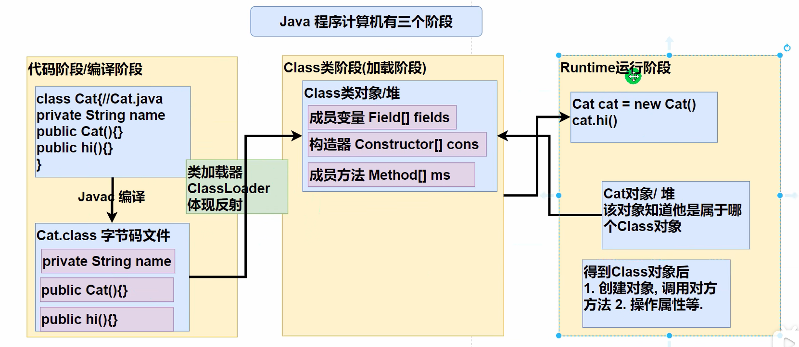
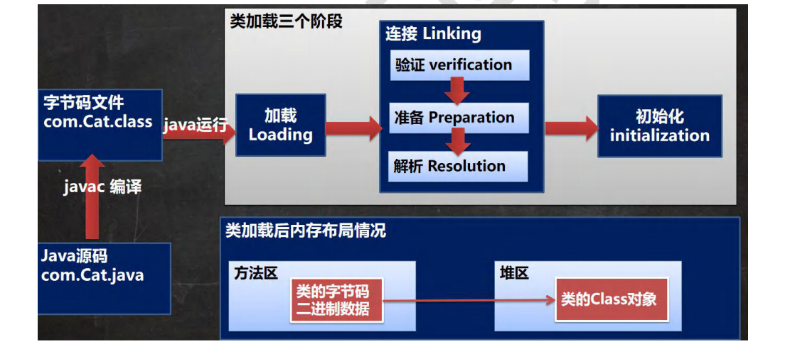

### GPT提问

## @GetMapping("/get")

public BaseResponse<Team> getTeamById(long id){
if(id <= 0){
throw new BusinessException(ErrorCode.NULL_ERROR);
}
Team team = teamService.getById(id);
if(team == null){
throw new BusinessException(ErrorCode.NULL_ERROR,"获取队伍失败");
}
return ResultUtils.success(team);

Copy

```
}这个函数的参数不需要加上注解@RequestBody 来接收前端参数吗
```

在这个例子中，`id` 参数并不是一个请求体（RequestBody），而是一个请求参数（RequestParam），因此不需要加上 `@RequestBody` 注解来接收前端参数。

`@RequestParam` 注解用于从请求参数中获取参数值，它通常用于获取 GET 请求的参数，或者 POST 请求中的 URL 参数。在这个例子中，`id` 参数用于指定需要查询的团队 ID，它是一个普通的请求参数，而不是请求体。

因此，我们可以直接在方法定义中声明 `id` 参数，并使用 `@RequestParam` 注解来标识它：

java

Copy

```
@GetMapping("/get")
public BaseResponse<Team> getTeamById(@RequestParam long id){
    // ...
}
```

这样，在接收到 GET 请求时，Spring MVC 会自动从请求参数中获取 `id` 参数的值，并将其传递给 `getTeamById` 方法。如果请求参数中没有指定 `id` 参数，或者 `id` 参数的值为空，那么 Spring MVC 会抛出异常。通过这种方式，我们可以方便地获取前端传递的参数，并进行相应的业务处理。


### 不加这个@RequestParam 可以 传递参数吗

不加 `@RequestParam` 注解也可以传递参数，但是需要注意一些细节。

在 Spring MVC 中，请求参数可以通过三种方式来传递：路径变量、请求参数、请求体。其中，路径变量和请求参数是最常见的传递参数方式，请求体通常用于传递复杂的数据结构（如 JSON 或 XML 格式的数据）。

如果不加 `@RequestParam` 注解，Spring MVC 会默认将参数解析为路径变量。路径变量是从请求 URL 中解析出来的，通常用于 RESTful 风格的 API，例如：

java

Copy

```
@GetMapping("/teams/{id}")
public BaseResponse<Team> getTeamById(@PathVariable long id){
    // ...
}
```

在这个例子中，`id` 参数是一个路径变量，它从请求 URL 的 `/teams/{id}` 中解析出来，并传递给 `getTeamById` 方法。如果请求 URL 中没有指定 `{id}` 变量，那么 Spring MVC 会抛出异常。

但是，如果请求参数不是路径变量，而是一个查询参数（例如 `?id=123`），那么就需要使用 `@RequestParam` 注解来标识参数了。如果不加 `@RequestParam` 注解，Spring MVC 会将参数解析为请求体，而不是查询参数，这可能会导致参数无法正确解析。

因此，如果请求参数是一个查询参数，我们应该在方法定义中使用 `@RequestParam` 注解来标识参数，以避免解析错误。如果请求参数是一个请求体，我们应该使用 `@RequestBody` 注解来标识参数，以便 Spring MVC 可以正确解析请求体中的数据。


BeanUtils.copyProperties(team, teamQuery);

## `BeanUtils.copyProperties` 是 Spring Framework 中的一个工具类，用于复制对象的属性值。它可以将一个对象的属性值复制到另一个对象中，而不需要手动逐个复制每个属性。

在这个例子中，`BeanUtils.copyProperties(team, teamQuery)` 的作用是将 `team` 对象的属性值复制到 `teamQuery` 对象中。具体来说，它会将 `team` 对象中所有的属性值（除了 `null` 值）复制到 `teamQuery` 对象中对应的属性中，如果属性名不同则会自动进行名称映射。这样可以很方便地将一个对象的属性值复制到另一个对象中，节省了手动赋值的时间和精力。

需要注意的是，`BeanUtils.copyProperties` 方法只会复制对象中存在的属性，如果两个对象中的属性名称不同，则需要手动进行属性名称的映射。另外，如果目标对象中的属性已经有值，则会覆盖原有的值，因此需要谨慎使用。如果需要进行更复杂的属性复制操作，可以考虑使用其他工具类或手动编写代码来实现。


### QueryWrapper<Team> queryWrapper = new QueryWrapper<>(team);

这个是什么查询

`QueryWrapper` 是 MyBatis-Plus 框架中的一个查询条件构造器，用于快速构建查询条件。它可以根据实体对象或 Lambda 表达式构建查询条件，并支持链式调用和多种查询操作（如等于、大于、小于、模糊匹配、排序等）。

在这个例子中，`QueryWrapper` 的作用是构建一个查询条件，用于查询 `Team` 实体对象。具体来说，它会将 `team` 对象中的非空属性作为查询条件，并使用默认的查询操作（例如等于操作）进行匹配。如果需要进行更复杂的查询操作，可以在 `QueryWrapper` 中链式调用其他查询方法，例如 `eq`、`gt`、`like` 等。

需要注意的是，`QueryWrapper` 构造的查询条件并不会立即执行查询操作，而是在调用查询方法时才会执行。因此，在使用 `QueryWrapper` 进行查询时，需要正确设置查询条件，并在最终查询操作中使用它来执行查询。例如：

java

Copy

```
QueryWrapper<Team> queryWrapper = new QueryWrapper<>(team);
List<Team> teams = teamMapper.selectList(queryWrapper);
```

在这个例子中，我们将 `QueryWrapper` 对象传递给 `selectList` 方法，用于执行查询操作，并返回符合条件的结果列表。MyBatis-Plus 会根据 `QueryWrapper` 中的条件自动生成相应的 SQL 语句，并执行查询操作。


## @EqualsAndHashCode(callSuper = true)

这个注解是干啥的

`@EqualsAndHashCode(callSuper = true)` 是 Lombok 框架中的一个注解，用于自动生成 `equals()` 和 `hashCode()` 方法。它会根据类中的属性自动生成 `equals()` 和 `hashCode()` 方法，以便在比较和哈希操作时使用。

在这个注解中，`callSuper` 属性表示是否调用父类的 `equals()` 和 `hashCode()` 方法，默认为 `false`，表示只比较当前类中的属性。如果将 `callSuper` 属性设置为 `true`，则会同时调用父类的 `equals()` 和 `hashCode()` 方法，将父类的属性也考虑在内。

例如，在下面的代码中，我们使用了 `@EqualsAndHashCode(callSuper = true)` 注解来生成 `equals()` 和 `hashCode()` 方法：

java

Copy

```
@Getter
@Setter
@EqualsAndHashCode(callSuper = true)
public class Team extends BaseEntity {
    private String name;
    private String description;
}
```

在这个例子中，`Team` 类继承了 `BaseEntity` 类，我们将 `callSuper` 属性设置为 `true`，表示在比较和哈希操作时也考虑父类的属性。这样，当我们比较两个 `Team` 对象时，除了比较 `Team` 类中的属性之外，还会比较 `BaseEntity` 类中的属性，例如 `id`、`createdTime` 和 `updatedTime`。

需要注意的是，使用 `@EqualsAndHashCode` 注解可以方便地生成 `equals()` 和 `hashCode()` 方法，但是需要确保类中的属性具有良好的比较和哈希特性，避免出现不必要的问题。如果类中的属性不适合用于比较和哈希操作，或者需要自定义比较和哈希方法，可以手动编写 `equals()` 和 `hashCode()` 方法，以确保正确性和性能。


/ g. 校验用户最多创建 5 个队伍
// todo 有 bug，可能同时创建 100 个队伍
QueryWrapper<Team> queryWrapper = new QueryWrapper<>();
queryWrapper.eq("userId", userId);
long hasTeamNum = this.count(queryWrapper);
if (hasTeamNum >= 5) {
throw new BusinessException(ErrorCode.PARAMS_ERROR, "用户最多创建 5 个队伍");
}这段代码是怎么判断用户最多只能创建5个队伍

这段代码通过查询数据库中指定用户创建的队伍数量来判断用户最多只能创建 5 个队伍。

具体来说，首先使用 `QueryWrapper` 构造一个查询条件，用于查询指定用户创建的队伍数量。在这个例子中，查询条件是 `"userId" = userId`，用于查询与指定用户 `userId` 相关的队伍。然后，使用 `count` 方法统计符合条件的队伍数量，并将结果保存在 `hasTeamNum` 变量中。最后，判断 `hasTeamNum` 是否大于等于 5，如果是，则抛出一个自定义的业务异常，表示用户最多只能创建 5 个队伍。

需要注意的是，这段代码中存在一个已知的 bug，即可能同时创建 100 个队伍。这是因为在判断用户创建的队伍数量时，没有对并发操作进行控制，可能导致多个线程同时创建队伍，从而超过了最大限制。为了解决这个问题，可以在代码中添加并发控制机制，例如使用分布式锁或数据库事务等方式来避免并发问题。


QueryWrapper<Team> queryWrapper = new QueryWrapper<>();这段代码是指定查询team表吗

是的，`QueryWrapper` 是 MyBatis-Plus 框架中的一个查询条件构造器，用于快速构建查询条件。在这段代码中，创建了一个 `QueryWrapper` 对象，用于指定查询 `Team` 实体对象对应的数据库表。

在默认情况下，MyBatis-Plus 会将实体类名转换为对应的数据库表名，例如 `Team` 实体类对应的数据库表名为 `team`。因此，在创建 `QueryWrapper` 对象时，不需要显式指定表名，只需要指定实体类即可。例如，`QueryWrapper<Team> queryWrapper = new QueryWrapper<>();` 表示创建一个用于查询 `team` 表的 `QueryWrapper` 对象，并指定了查询条件为空。

需要注意的是，如果实体类名与数据库表名不同，或者需要查询的表不是实体类对应的表，可以通过 `@TableName` 注解或 `setEntityClass` 方法来指定表名或实体类。例如，如果 `Team` 实体类对应的数据库表名为 `team_info`，则可以在 `Team` 类上添加 `@TableName("team_info")` 注解，或者在创建 `QueryWrapper` 对象时使用 `queryWrapper.setEntityClass(Team.class)` 来指定实体类和表名。


StringUtils.isBlank(team.getPassword())

`StringUtils.isBlank(team.getPassword())` 是一个表达式，它使用了 `StringUtils` 类中的静态方法 `isBlank` 来判断 `team.getPassword()` 是否为空或者只包含空格。

具体来说，`isBlank` 方法会判断传入的字符串是否为 `null` 或者只包含空格。如果字符串为 `null` 或者只包含空格，则返回 `true`，否则返回 `false`。

在这个代码段中，这个表达式的作用是检查 `team.getPassword()` 是否为空或者只包含空格。如果是，则抛出一个 `BusinessException` 异常，异常的错误码是 `ErrorCode.PARAMS_ERROR`，并附带一个错误信息。


如果改为isNotBlank呢

如果将 `StringUtils.isBlank(team.getPassword())` 改为 `StringUtils.isNotBlank(team.getPassword())`，它会判断 `team.getPassword()` 是否不为空且非空格字符。

具体来说，`isNotBlank` 方法会判断传入的字符串是否为 `null` 或者是否为空串（即长度为 0），或者是否只包含空格。如果字符串不是以上情况之一，则返回 `true`，否则返回 `false`。

在这个代码段中，如果将 `StringUtils.isBlank(team.getPassword())` 改为 `StringUtils.isNotBlank(team.getPassword())`，则条件判断的含义也会发生相应的变化。如果 `team.getPassword()` 不为空且不只包含空格，则会执行后续的代码；否则会抛出一个 `BusinessException` 异常，异常的错误码是 `ErrorCode.PARAMS_ERROR`，并附带一个错误信息。

总之，`StringUtils.isNotBlank(team.getPassword())` 和 `StringUtils.isBlank(team.getPassword())` 的区别在于判断条件的取反，前者表示字符串不为空且非空格字符，后者表示字符串为空或只包含空格字符。


juc是什么

### `juc` 是 `java.util.concurrent` 的缩写，它是 Java 标准库中提供的用于多线程编程的并发工具包。`juc` 包含了一组线程安全的类和接口，可以简化多线程编程的复杂度，提高程序的并发性能。

`juc` 包含了许多用于多线程编程的类和接口，其中一些常用的类和接口如下：

- `Lock` 接口：与关键字 `synchronized` 相比，可以更灵活地控制多线程的锁定和释放。
- `ReentrantLock` 类：`Lock` 接口的一个实现类，提供了可重入锁的功能。
- `ReentrantReadWriteLock` 类：提供了读写锁的功能，可以在多线程环境下提高读操作的并发性能。
- `Semaphore` 类：可以用于限制同时访问某个资源的线程数量。
- `CountDownLatch` 类：可以用于在多线程环境下等待一些操作完成后再继续执行。
- `CyclicBarrier` 类：可以用于在多线程环境下等待一组线程都到达一个屏障点后再继续执行。
- `Atomic` 类：提供了一组原子操作，可以在多线程环境下安全地进行数值的更新和操作。
- `ConcurrentHashMap` 类：线程安全的哈希表实现，可以高效地支持多线程环境下的并发读写操作。

`juc` 还提供了一些其他的类和接口，可以满足不同的多线程编程需求。使用 `juc` 可以帮助开发者更方便地编写高性能、高可靠性的多线程程序。


当我们用mybatis的逻辑删除注解，执行删除操作后isdelete字段会被标记为1，那数据不会真的从数据库删除，那怎么才能真正被删除呢

## [](https://app.slack.com/team/U0542M70FDW)

**Claude\**应用\****[晚上 8:16](https://wlhco.slack.com/archives/D053FEZTG1J/p1683548188753189)

在Mybatis中,使用逻辑删除注解@LogicDelete后,执行删除操作的数据会被标记为删除(通常是将is_delete字段设置为1),但实际上数据不会从数据库中物理删除。要真正将这些逻辑删除的数据从数据库中物理删除,有以下几种方式:1. 定期执行清理脚本:编写一个清理脚本,定期执行,清理is_delete字段为1的数据。例如每周清理一次,每月清理一次等。

```
sql
DELETE FROM table_name WHERE is_delete = 1;
```

\2. 在删除数据时检查is_delete字段并进行物理删除:可以在Mapper中的删除方法中,判断is_delete字段,如果为1则执行物理删除操作。

```
java
int deleteById(Integer id) {
  // 逻辑删除
  User user = selectById(id);
  user.setIsDelete(1);
  updateById(user);
  
  // 检查is_delete字段,如果为1,执行物理删除
  if (user.getIsDelete() == 1) {
    SqlHelper.deleteById(User.class, id);
  }
}
```

\3. 开启自动清理功能:Mybatis Plus从3.3.0版本开始支持自动清理功能,需要在application.yml中配置:

```
yaml
mybatis-plus:
  global-config:
    db-config:
      logic-delete-value: 1
      logic-delete-field: is_delete
      logic-delete-flag-field: is_deleted
```

然后在Mapper接口方法中使用@SqlParser注解即可实现自动清理:

```
java
@SqlParser(filter = true) 
int deleteById(Integer id);
```

开启此功能后,Mybatis Plus会自动在删除数据时检查is_delete字段,如果为1则执行物理删除语句清理这条数据。所以,总结来说,要真正将逻辑删除的数据从数据库中物理删除,需要定期执行清理脚本、在代码中手动检测并清理、或者开启Mybatis Plus的自动清理功能。希望这个解释能帮助您理解如何实现Mybatis逻辑删除数据的物理清理。如果您有任何其他疑问,请随时提出。 （已编辑） 


当Long和long使用== 比较的时候

## [](https://app.slack.com/team/U0542M70FDW)

**Claude\**应用\****[晚上 11:00](https://wlhco.slack.com/archives/D053FEZTG1J/p1683558044445039)

Long和long是Java中表示整数的两个类型,一个是包装类型(Long),一个是基本类型(long)。它们使用==进行比较时,比较的对象是不同的:- 对Long类型使用==:比较的是Long对象的引用(对象地址)。- 对long类型使用==:直接比较的值本身,没有对象引用的概念。例如:

```
java
Long a = 100L;
Long b = 100L;
long c = 100; 
long d = 100;

a == b  // false,比较的是引用,两个对象不同
c == d  // true,对long类型直接比较实际的值

a == c // true,自动拆箱比较的是值 
c == a // true,自动拆箱比较的是值
```

可以看出,Long类型使用==比较的是引用,而long类型直接比较的值。但是,在Long和long之间的比较中,会发生自动拆箱和装箱:- Long自动拆箱为long,然后进行值比较,所以a == c和c == a结果为true。- 而a == b结果为false,这是因为没有发生自动拆箱,仍然是比较Long对象引用。注意:1. 这种自动拆箱装箱仅在==表达式中发生,如果是方法参数或赋值,不会自动拆箱装箱。2. a和b虽然值相等,但==结果不同,这是因为它们是两个不同的Long对象。要判断Long值相等,必须使用.equals()方法。3. 两个long变量的值相等,==结果就是true,因为直接比较的是值。所以总结来说,在Long和long的比较中,如果涉及Long类型,==比较的就是对象引用,要判断值相等必须使用.equals()。而直接比较两个long类型,==结果就是它们的值是否相等。希望这段解释可以帮助你彻底理解Long与long类型使用==进行比较时的差异和需要注意的点。如果您有任何疑问或不理解的地方,请告知我,我将做进一步举例说明。 （已编辑） 


java对象封装的是Long 那么存到数据库后，再取出来数据也是Long类型的吗

## [](https://app.slack.com/team/U0542M70FDW)

**Claude\**应用\****[晚上 11:12](https://wlhco.slack.com/archives/D053FEZTG1J/p1683558733704209)

这 depends 于你的数据库字段类型和Java对象类型之间的映射关系。如果你的实体类字段使用Long类型:

```
java
public class User {
    private Long id;
}
```

且在数据库中id对应的字段类型也是bigint或decimal等可以存储Long值的类型,那么:- 插入数据时,会将Long值自动转换为数据库字段类型
\- 查询数据时,会将数据库字段类型自动转换为Long类型即映射关系如下:| Java类型 | 数据库类型 |
| :--: | :--:|
| Long | bigint / decimal |所以,在这种映射关系下,存入数据库的是对应字段类型的值,取出来的Java对象中的id字段则为Long类型。但是,如果数据库中id字段类型为int,且你的Java对象仍使用Long类型,此时会发生类型不匹配:- 插入数据时,Long值超出int范围会报错
\- 查询数据时,int值会自动转换为Long类型,但精度损失所以说,对象与数据库字段类型的映射关系非常重要。如果不匹配,除了精度损失外,还可能导致意想不到的错误。另外,对于是否使用包装类型如Long还是基本类型long,也要根据需求判断:- 如果id字段为自增主键,使用long更合适,因为Long对象在==比较时比较的是引用,可能导致问题。
\- 如果需要支持id值为null,则必须使用Long等包装类型。所以,综上,是否将数据库取出的数据也映射为Long类型,需要考虑:1. 数据库字段类型是否匹配Long类型
\2. Long类型在项目中的使用是否合适(如是否会==比较)
\3. 是否需要支持null值只有在这三个方面没有问题或有特殊需求的情况下,才将数据库取出的数据映射为Long类型,否则应考虑使用其他匹配的类型,如long、int等。希望这个详细的解释能帮助你理解Java类型与数据库类型的映射关系,以及使用Long类型的注意事项。如果您有任何疑问或不理解的地方,请告知我,我将提供进一步的示例加以说明。 （已编辑） 


**LH W**[晚上 11:13](https://wlhco.slack.com/archives/D053FEZTG1J/p1683558799311249)

##  我们在封装实体类的时候，id一般是设置long比较好还是Long比较好

[](https://app.slack.com/team/U0542M70FDW)

**Claude\**应用\****[晚上 11:13](https://wlhco.slack.com/archives/D053FEZTG1J/p1683558800489669)

在封装实体类时,选择long类型还是Long类型的id字段,需要考虑以下几点:1. 主键自增情况如果id作为主键并自增长,long类型更加合适,因为:- long是基本类型,==比较的是值,这与自增主键的比较需求匹配。
\- Long是包装类型,==比较的是对象引用,如果新建两个Long对象值相同但引用不同,==结果为false,这会对使用自增主键的代码产生意想不到的影响。2. null值支持情况如果需要id支持null值,必须使用Long等包装类型,因为基本类型不支持null。3. 数据库字段映射要考虑数据库中对应的id字段类型,如果为int类型但使用Long,会有精度损失的风险。反之如果数据库类型太大,会造成空间浪费。所以,综上,选择long还是Long类型的id,可以参考如下原则:- 作为自增主键,优先选择long类型,方便与数据库主键比较。- 需要支持null值,必须选择包装类型Long。 - 选择匹配数据库字段类型的Java类型,避免精度损失或空间浪费。- 如果既要自增,又要null值,可以选择Long类型,但在代码比较时需要特别留意对象引用的问题,调用equals()方法比较值而非==。除此之外,还要根据实体类的具体需求判断,如果 foreseeable 的使用场景下没有上述条件,也可以选择简单对应的Long或long类型。但总的原则是要考虑到日后可能的变化,尽量选择一个既利于当前使用,也不会造成未来问题的类型。很多时候选对一开始的类型可以省去许多日后需求变化带来的麻烦。希望这个关于选择long还是Long类型的分析和建议能为你在实体类设计中对主键类型的选择提供帮助。如果你有任何其他疑问,也请告知我,我很乐意提供更详细的思考方向和意见。 （已编辑） 


## for (Map.Entry<Integer,Long> entry : indexDistanceMap.entrySet())

这段代码是一个 Java for-each 循环，它遍历了一个名为 indexDistanceMap 的 Map 集合中的每个键值对。具体来说，它将 Map 中的每个键值对表示为一个 Map.Entry 对象，并将这些对象依次赋值给循环变量 entry，然后执行循环体中的代码块。

循环变量 entry 的类型是 Map.Entry<Integer, Long>，其中 Integer 是键的类型，Long 是值的类型。在循环体中，您可以使用 entry.getKey() 方法获取当前键的值，使用 entry.getValue() 方法获取当前值的值。这种循环方式比传统的 for 循环更简洁，并且可以避免出现下标越界等错误。


## SortedMap<Integer, Long> indexDistanceMap = new TreeMap<>();

这段代码创建了一个 SortedMap 对象 indexDistanceMap，它是一个按键排序的 Map 集合。具体来说，它使用 TreeMap 类来实现 SortedMap 接口，该接口将集合中的元素根据键的自然顺序排序，或者根据指定的 Comparator 排序。

该 Map 集合的键的类型是 Integer，值的类型是 Long。您可以使用 put() 方法将键值对添加到集合中，并使用 get() 方法获取键对应的值。由于 TreeMap 是一个有序的集合，因此您可以使用 firstKey() 和 lastKey() 方法获取集合中第一个和最后一个键，或者使用 headMap()、tailMap() 和 subMap() 方法来获取一个子集合。


## SortedMap 是什么

SortedMap 是 Java 中的一个接口，它继承自 Map 接口，并且对 Map 中的元素进行了排序。SortedMap 中的元素按照键（Key）的自然顺序进行排序，或者按照指定的比较器（Comparator）进行排序。SortedMap 中的元素是按照键的排序顺序存储的，因此可以使用键的排序顺序来访问、遍历和操作元素。

SortedMap 接口提供了一些方法，用于获取 SortedMap 的子集、范围查找、比较器的获取和设置等操作。SortedMap 还提供了一些与 Map 接口相同的方法，如 put()、get()、containsKey()、containsValue() 等。

Java 中的 TreeMap 类实现了 SortedMap 接口，并使用红黑树的数据结构来存储元素。与 HashMap 不同，TreeMap 中的元素是有序的，并且可以使用键的自然顺序或自定义的比较器对元素进行排序。SortedMap 接口和 TreeMap 类通常用于需要按照键排序的场合，如字典、排序列表等。


QueryWrapper<User> queryWrapper = new QueryWrapper<>();
queryWrapper.isNotNull("tags");
queryWrapper.select("id","tags");
List<User> userList = this.list(queryWrapper);

clojure

Copy

```
    String tags = loginUser.getTags();
    Gson gson = new Gson();
    List<String> tagList = gson.fromJson(tags, new TypeToken<List<String>>() {
    }.getType());
    // 用户列表的下表 => 相似度'
    List<Pair<User,Long>> list = new ArrayList<>();
    // 依次计算当前用户和所有用户的相似度
    for (int i = 0; i <userList.size(); i++) {
        User user = userList.get(i);
        String userTags = user.getTags();
        //无标签的 或当前用户为自己
        if (StringUtils.isBlank(userTags) || user.getId() == loginUser.getId()){
            continue;
        }
        List<String> userTagList = gson.fromJson(userTags, new TypeToken<List<String>>() {
        }.getType());
        //计算分数
        long distance = AlgorithmUtils.minDistance(tagList, userTagList);
        list.add(new Pair<>(user,distance));
    }
    //按编辑距离有小到大排序
    List<Pair<User, Long>> topUserPairList = list.stream()
            .sorted((a, b) -> (int) (a.getValue() - b.getValue()))
            .limit(num)
            .collect(Collectors.toList());
    //有顺序的userID列表
    List<Long> userListVo = topUserPairList.stream().map(pari -> pari.getKey().getId()).collect(Collectors.toList());

    //根据id查询user完整信息
    QueryWrapper<User> userQueryWrapper = new QueryWrapper<>();
    userQueryWrapper.in("id",userListVo);
    Map<Long, List<User>> userIdUserListMap = this.list(userQueryWrapper).stream()
            .map(user -> getSafetyUser(user))
            .collect(Collectors.groupingBy(User::getId));

    // 因为上面查询打乱了顺序，这里根据上面有序的userID列表赋值
    List<User> finalUserList = new ArrayList<>();
    for (Long userId : userListVo){
        finalUserList.add(userIdUserListMap.get(userId).get(0));
    }
    return finalUserList;请解释这段代码，以及用到的工具类
```

## 这段代码主要是一个用户推荐算法的实现，目的是根据用户的标签信息，计算出和当前用户最相似的一些用户，然后返回这些用户的信息。下面是这段代码的详细解释：

1. 首先创建一个 QueryWrapper 对象，并使用 isNotNull() 和 select() 方法设置查询条件，然后使用 list() 方法查询出满足条件的用户列表。这里使用 MyBatis-Plus 框架中的 Wrapper 来构建查询条件。
2. 获取当前用户的标签信息，并使用 Gson 工具类将标签信息解析成一个 List<String> 对象。这里使用 Gson 工具类将 JSON 格式的字符串解析为 Java 对象。
3. 创建一个空的 Pair 列表，用于保存当前用户和其他所有用户的相似度信息。
4. 使用 AlgorithmUtils 工具类计算当前用户和其他用户的相似度，并将相似度信息保存到 Pair 列表中。
5. 对 Pair 列表按相似度从小到大排序，并使用 Stream API 中的 limit() 方法限制只取前 num 个元素。
6. 使用 Stream API 将排序后的 Pair 列表转换成用户 ID 列表，并使用 QueryWrapper 对象查询用户的完整信息，并将结果按照用户 ID 分组。
7. 根据用户 ID 列表和查询到的用户信息，构建最终的用户列表，并返回结果。

工具类 AlgorithmUtils 中的 minDistance() 方法是计算两个字符串之间的编辑距离（也称为 Levenshtein 距离），用于衡量两个字符串的相似度。Pair 类是一个简单的键值对类，用于保存用户对象和相似度信息。这段代码使用了 MyBatis-Plus 框架和 Gson 工具类来实现查询和 JSON 解析功能。


Pair 列表是什么

## Pair 列表是指一个列表，其中每个元素都是一个 Pair 对象。Pair 是一个简单的键值对类，用于保存两个对象之间的关系。在 Java 中，可以使用 Pair 类来表示任意两个对象之间的关系，例如一个用户和其相似度、一张图片和其大小等等。

Pair 类通常包含两个属性，一个是 key，表示键的对象，另一个是 value，表示值的对象。在这个列表中，每个元素都是一个 Pair 对象，其中 key 表示一个用户对象，value 表示和当前用户的相似度。

在这段代码中，Pair 列表用于保存当前用户和其他所有用户的相似度信息。在循环中，将每个用户和当前用户的相似度计算出来，然后将这个用户和相似度打包成一个 Pair 对象，并添加到 Pair 列表中。最终，Pair 列表中的元素将按照相似度从小到大排序，并返回前 num 个元素作为推荐结果。

Pair 类通常用于需要保存两个对象之间关系的场合，它可以很方便地将两个对象打包成一个对象，并在需要时进行获取。在 Java 中，Pair 类通常不是由标准库提供的，但是可以使用 Apache Commons Lang 库或 Google Guava 库等第三方库来实现。


## 它相对map的区别是什么

Pair 和 Map 都是用于存储键值对的数据结构，它们之间的区别如下：

1. Pair 只能存储一个键值对，而 Map 可以存储多个键值对。
2. Pair 中的键值对是不可修改的，一旦创建后就无法修改键或值，而 Map 中的键值对是可修改的。
3. Pair 不实现 Map 接口，而 Map 实现了 Map 接口，并提供了一系列的操作方法，如 put()、get()、remove() 等。
4. Pair 通常用于表示两个相关联的对象，如用户和相似度、坐标和值等，而 Map 通常用于存储多个相关联的对象，如学生和成绩、商品和价格等。
5. Pair 不支持键的查找和遍历，而 Map 支持键的查找和遍历，可以使用 keySet()、values()、entrySet() 等方法来获取键、值或键值对的集合。

在使用数据结构时，应根据具体的需求选择合适的数据结构。如果只需要保存一个键值对，可以使用 Pair；如果需要保存多个键值对，并需要对键进行查找和遍历，可以使用 Map。在 Java 中，Pair 不是标准库中内置的数据结构，但是可以使用第三方库来实现。


## 那他的优势是什么

Pair 的优势在于它非常简单和轻量级，适合于表示两个相关联的对象。相对于 Map，Pair 不需要实现复杂的接口和方法，也不需要使用哈希表等数据结构来存储键值对，因此具有以下优势：

1. 简单易用：Pair 只需要存储两个对象，使用起来非常简单，而 Map 需要存储多个键值对，并且需要使用复杂的方法来操作键值对。
2. 轻量级：Pair 不需要使用哈希表等数据结构来存储键值对，因此它的存储空间更小，创建和访问速度更快。
3. 易于理解：Pair 的含义非常明确，它表示两个相关联的对象，例如一个用户和相似度。相对于 Map，Pair 更容易理解和使用。
4. 代码可读性高：Pair 的代码非常简洁，不需要使用复杂的方法来操作键值对，因此代码可读性更高。
5. 更直观：Pair 的使用更直观，不需要使用 get() 或 put() 等方法来获取或设置键值对，而是直接使用 key 和 value 属性来获取或设置键值对。

总之，Pair 是一个非常简单和轻量级的数据结构，适合于表示两个相关联的对象。相对于 Map，Pair 更简洁、更易用、更易于理解和阅读。但是需要注意的是，Pair 只能存储一个键值对，如果需要存储多个键值对，则应该使用 Map 或其他合适的数据结构。


## for(i = n /2; i >1; i--) 这个代码的时间复杂度是多少，怎么分析的

这段代码的时间复杂度是 O(n)，其中 n 是循环次数。

具体地，循环的起点是 `i = n / 2`，每次循环 `i` 的值会减少 1，直到 `i` 小于或等于 1。因此，循环会执行 `n/2 - 1` 次，其中 n 是起点 `n/2` 和终点 1 之间的整数个数。

因此，这段代码的时间复杂度是 O(n)，其中 n 是循环次数，也就是 `n/2 - 1`。通常情况下，会忽略掉常数项和低阶项，因此可以简写为 O(n/2) 或 O(n)。


## 在c++ 创建对象的方法

在 C++ 中，有两种方式可以创建对象：

1. 使用 new 运算符：可以使用 new 运算符在堆上分配内存并创建对象。例如：

   Copy

   ````
   MyClass* myObj = new MyClass();    // 创建 MyClass 类型的对象
   ```
   ````

2. 在栈上实例化对象：可以直接在函数或作用域内创建对象，这些对象在栈上自动分配内存。例如：

   Copy

   ````
   MyClass myObj;                     // 在栈上创建 MyClass 类型的对象
   ```
   ````

需要注意的是，使用 new 运算符创建的对象需要手动释放内存，否则会造成内存泄漏。可以使用 delete 运算符来释放内存。例如：

Copy

```
MyClass* myObj = new MyClass();       // 创建 MyClass 类型的对象
// 使用 myObj 操作对象
delete myObj;                         // 释放内存
```

在栈上创建的对象无需手动释放内存，因为其内存会在作用域结束时自动释放。


## java多线程中 方法run和start的区别是什么


在Java多线程中,run()和start()方法的区别是:run():1. run()方法只是线程执行体,并不会真正启动一个线程。2. 如果直接调用run()方法,它会在当前线程中运行,并不会启动一个新线程。3. run()方法只是线程启动后调用的第一个方法。start():1. start()方法会真正启动一个新线程,并执行run()方法。2. start()方法会调用JVM中线程调度器,线程调度器会在适当的时候调用run()方法。3. start()方法只会调用一次,重复调用会启动多个线程。而run()方法可以被重复调用。4. 开始执行start()方法后,新的线程会进入就绪状态,等待被线程调度器调用以进入运行状态。5. start()方法是一个native方法,由JVM实现。总结:1. run()方法是线程执行体,只会在当前线程运行,不会启动新线程。2. start()方法会启动一个新线程,并在新线程中调用run()方法。3. start()方法只能被调用一次,重复调用会启动多个线程。而run()方法可以被重复调用。4. start()是一个native方法,由JVM实现。run()是一个Java方法。下面是一个简单示例:

```
java
public class MyThread extends Thread {
    @Override
    public void run() {
        System.out.println("run: " + Thread.currentThread().getName());
    }

    public static void main(String[] args) {
        MyThread thread = new MyThread();
        thread.run();  // 直接调用run()方法,在主线程中运行
        thread.start(); // 启动新线程,调用run()方法
    }
}
```

运行结果:
run: main
run: Thread-0希望这个解释能帮助你理解run()和start()方法的区别,如有任何疑问,欢迎在评论中提出。 （已编辑） 

------

**新消息**

仅对你可见

[8:43](https://wlhco.slack.com/archives/D053FEZTG1J/p1684586615000100)

**Reminder:** While direct messaging with Claude, you can type `/reset` to start a new conversation. By default, Claude will remember your whole conversation, which will affect its responses.


**LH W**[晚上 8:55](https://wlhco.slack.com/archives/D053FEZTG1J/p1684587320251249)

native 是什么

[](https://app.slack.com/team/U0542M70FDW)

**Claude\**应用\****[晚上 8:55](https://wlhco.slack.com/archives/D053FEZTG1J/p1684587320793619)

native 是Java中的一个关键字,用于修饰方法。它表示该方法是非Java实现的,由其他语言如C、C++实现。native方法通常用于:1. 与操作系统交互:因为Java无法直接访问操作系统底层,需要 native 方法作为接口。例如 File I/O 操作等。2. 访问系统硬件:如视频,音频,USB等设备控制。3. 提高执行效率:某些情况下,由非Java语言实现的方法执行效率更高。使用native关键字修饰的方法叫做native方法。native方法有以下特点:1. native方法的方法体只包含';' 分号,没有任何实现代码。 因为方法的实现由其他语言提供。2. native方法需要在Java代码中提供方法声明,并使用native关键字修饰。3. 还需要提供与之对应的native方法实现,一般在.c或.cpp文件中实现,然后再将这些文件编译为动态库。4. 在Java程序运行前,需要先将动态库文件加载,Java程序才能调用native方法。5. native方法的调用过程实际上是Java所在的虚拟机调用动态库中的对应函数。一个简单的native方法示例:

```
java
public class NativeMethod {
    public native void printHello();

    static {
        System.loadLibrary("NativeMethod");
    }

    public static void main(String[] args) {
        NativeMethod nm = new NativeMethod();
        nm.printHello();
    }
}
```

对应的C语言实现:

```
c
void printHello() { 
    printf("Hello from native code!");
}
```

编译为NativeMethod.dll(Windows)或libNativeMethod.so(Linux)动态库,然后Java程序就可以调用printHello() native 方法了。我希望这个解释可以帮助你理解Java native关键字和native方法。如果有任何疑问,欢迎在评论中提出。 （已编辑） 


**LH W**[晚上 8:58](https://wlhco.slack.com/archives/D053FEZTG1J/p1684587503124199)

那么run方法的主要应用场景是什么

[](https://app.slack.com/team/U0542M70FDW)

**Claude\**应用\****[晚上 8:58](https://wlhco.slack.com/archives/D053FEZTG1J/p1684587504335629)

run()方法的主要应用场景有:1. 被Thread类的start()方法调用:当调用start()方法启动一个线程时,虚拟机会执行新的线程的run()方法。所以如果要实现一个自定义线程,只需要扩展Thread类,并重写其run()方法。2. 实现Runnable接口:Runnable接口只有一个run()方法,用于线程执行体。我们可以实现Runnable接口,重写run()方法,然后将其实例传入Thread来启动线程。3. 用于线程池:当一个任务被提交到线程池中时,线程池会调用该任务对象的run()方法来执行任务。所以我们可以实现Runnable接口,重写run()方法,然后将任务对象提交到线程池。4. 手动调用:我们也可以手动调用run()方法,但是此时run()方法将运行在当前线程中,不会启动一个新线程。除了上面几种情况外,run()方法几乎不会被直接调用。它通常被Thread类和线程池等调用以运行新线程或执行异步任务。总结来说,run()方法的主要应用场景是:1. 重写Thread类的run()方法来定义线程执行体2. 实现Runnable接口的run()方法作为线程任务3. 实现Runnable接口的run()方法作为线程池任务它很少会被直接调用。直接调用run()方法会在当前线程中运行,而不是启动新的线程。下面是一个简单示例:

```
java
public class RunMethodDemo implements Runnable {
    @Override
    public void run() {
        String threadName = Thread.currentThread().getName();
        System.out.println("Hello from " + threadName);
    }

    public static void main(String[] args) {
        Runnable task = new RunMethodDemo();
        // 调用run()方法,在主线程中运行
        task.run(); 
        
        // 通过线程启动run()方法,启动新线程
        Thread thread = new Thread(task);
        thread.start();
        
        // 通过线程池启动run()方法,在线程池的某个线程中运行
        ExecutorService pool = Executors.newFixedThreadPool(2);
        pool.submit(task);
    }
}
```

运行结果:
Hello from main
Hello from Thread-0
Hello from pool-1-thread-1


## .[售票系统]，编程摸拟三个售票窗口售票100
,分别使用继承Thread和实现Runnable方式
,并分析有什么问题？

这里我们分别使用继承Thread和实现Runnable的方式来模拟三个售票窗口售卖100张票:继承Thread方式:

```
java
public class TicketWindow extends Thread {
    private static int ticket = 100;

    @Override
    public void run() {
        while (ticket > 0) {
            System.out.println(getName() + "售出一张票,还剩" + --ticket + "张票");
        }
    }

    public static void main(String[] args) {
        TicketWindow w1 = new TicketWindow();
        TicketWindow w2 = new TicketWindow();
        TicketWindow w3 = new TicketWindow();
        w1.start();
        w2.start();
        w3.start();
    }
}
```

实现Runnable方式:

```
java
public class TicketWindow implements Runnable {
    private static int ticket = 100;

    @Override
    public void run() {
        while (ticket > 0) {
            System.out.println(Thread.currentThread().getName() + "售出一张票,还剩" + --ticket + "张票");
        }
    }

    public static void main(String[] args) {
        Thread t1 = new Thread(new TicketWindow());
        Thread t2 = new Thread(new TicketWindow());
        Thread t3 = new Thread(new TicketWindow());
        t1.start();
        t2.start();
        t3.start();
    } 
}
```

两种方式的分析:1. 共享资源ticket在两个方式下都是static的,这会导致安全性问题。如果三个线程同时运行,可能导致ticket被减到负值。2. 继承Thread方式直接扩展Thread类,重写run()方法。实现Runnable方式则实现Runnable接口,重写run()方法,然后通过Thread类来启动线程。3. 实现Runnable方式的好处是避免了Java中的单继承限制,一个类可以同时实现多个接口。4. 两种方式的线程调度都无法保证绝对的公平性,可能会导致某个窗口一直售票,其他窗口无票可售的情况。为了解决上述问题,我们可以:1. 使用线程同步机制(如互斥锁)来保证对ticket的操作是原子的和互斥的。2. 使用线程池来管理线程,保证统一的调度策略。3. 采用轮询的方式让每个窗口逐个售票,以保证公平性。我希望这个解释可以帮助你分析两种模拟售票窗口的方式以及存在的问题。如果有任何疑问,欢迎在评论中提出。 （已编辑） 

**回复****回复**


## 线程可以通过调用以下方法来检查和响应中断标志:

\1. interrupted():可以检查线程的中断标志是否被设置,并清除标志。该方法返回标志的原值。我们可以如下调用:

```
java
while (!Thread.interrupted()) {
    // 线程运行逻辑
}
// 中断标志被清除,继续运行
```

\2. isInterrupted():可以检查线程的中断标志是否被设置。该方法返回标志的当前值,不清除标志。我们可以如下调用:

```
java
while (!isInterrupted()) {
    // 线程运行逻辑
}
interrupt(); // 在退出循环后清除标志
```

\3. 在catch块中捕捉InterruptedException异常:当线程在调用阻塞方法(如sleep())时被interrupt()中断,会抛出InterruptedException异常。我们可以在catch块中处理中断逻辑并清除中断标志。例如:

```
java
try {
    Thread.sleep(1000);
} catch (InterruptedException e) {
    // 中断处理逻辑
    interrupt(); 
}
```

\4. 在阻塞方法的入口检查中断标志:在进入阻塞方法前,可以先检查中断标志,然后决定是否进入阻塞状态。例如: 

```
java
if (!Thread.interrupted()) {
    Thread.sleep(1000);
}
```

总结来说,线程可以通过直接检查中断标志(interrupted()和isInterrupted())、捕获InterruptedException异常以及在阻塞方法入口检查标志等方式来响应中断请求。
但是需要注意,一旦线程清除了中断标志,它就无法再响应中断,直到下次调用interrupt()方法。下面是一个完整的示例:

```
java
public class InterruptDemo extends Thread {
    @Override
    public void run() {
        while (!isInterrupted()) {
            try {
                Thread.sleep(1000);
            } catch (InterruptedException e) {
                interrupt();  // 中断标志清除
                System.out.println("Interrupted!");
            }
            System.out.println("Thread running");
        }
        System.out.println("Thread end");
    }

    public static void main(String[] args) throws InterruptedException {
        Thread thread = new InterruptDemo();
        thread.start();
        thread.interrupt();
        thread.join();
    }
}
```

输出:
Thread running
Interrupted!
Thread running
Thread end我希望这个解释可以帮助你理解如何在线程中检查和响应中断标志。如果有任何疑问,欢迎在评论中提出。 （已编辑） 


## join方法和yield方法的区别

join()方法和yield()方法都是与线程调度相关的方法,但 theirs作用是不同的:join()方法:- join()方法的作用是等待线程死亡。调用join()方法的线程会等待join()方法所在线程结束后才继续执行。- 语法:

```
java
thread.join();
```

\- 例如:

```
java
public class JoinDemo {
    public static void main(String[] args) throws InterruptedException {
        Thread thread = new Thread(() -> {
            System.out.println("Child thread start");
            try {
                Thread.sleep(1000);
            } catch (InterruptedException e) {
                e.printStackTrace();
            }
            System.out.println("Child thread end");
        });
        thread.start();
        thread.join();  // 主线程等待thread线程结束后再继续执行
        System.out.println("Main thread end");
    }
}
```

输出:
Child thread start
Child thread end
Main thread endyield()方法:- yield()方法的作用是让出CPU,让线程从运行状态进入就绪状态。- 语法:

```
java 
Thread.yield();
```

\- yield()方法并不会让线程立即失去执行权,而是等待下一次调度,调度器根据线程的优先级重新选择一个线程执行。- 例如:

```
java
public class YieldDemo {
    public static void main(String[] args) {
        new Thread(() -> {
            for (int i = 0; i < 5; i++) {
                System.out.println(Thread.currentThread().getName() + "运行");
                if (i == 2) {
                    Thread.yield();    
                }
            }
        }, "线程1").start();

        new Thread(() -> {
            for (int i = 0; i < 5; i++) {
                System.out.println(Thread.currentThread().getName() + "运行");
            }
        }, "线程2").start();
    }
}
```

可能的输出:
线程1运行
线程2运行 
线程1运行
线程1运行
线程2运行
线程2运行 
线程1运行
线程1运行
线程2运行可以看到,yield()方法让线程1让出了执行权,线程2获得了执行,但是随后线程1又获得了执行权。总结:- join()方法使调用线程等待join线程结束,然后继续执行。
\- yield()方法让调用线程让出CPU执行权,进入就绪状态等待再次被调度。两者的作用都是控制线程的执行,但join()是等待线程结束,yield()是让出CPU执行权。


## 怎么设置守护线程

守护线程(daemon thread)是一种特殊的线程,它会在用户线程结束时自动结束。我们可以通过调用线程的setDaemon(boolean)方法将一个线程设置为守护线程。语法:

```
java
thread.setDaemon(true);  // 将线程设置为守护线程
```

设置为守护线程的线程有以下特点:1. 守护线程会在所有非守护线程结束时自动结束。
\2. 守护线程提供一种在后台服务的方法,通常用来为其他线程的运行提供便利服务。
\3. JVM会等待所有非守护线程结束才会结束。
\4. 主线程默认是非守护线程。下面是一个例子:

```
java
public class DaemonThreadDemo {
    public static void main(String[] args) {
        Thread thread = new Thread(() -> {
            while (true) {
                try {
                    Thread.sleep(1000);
                } catch (InterruptedException e) {
                    e.printStackTrace();
                }
                System.out.println("Daemon thread running");
            }
        });
        thread.setDaemon(true);  // 设置为守护线程
        thread.start();

        System.out.println("Main thread end");
    } 
}
```

输出:
Main thread end可以看到,主线程结束后,守护线程也自动结束,没有输出。如果不设置为守护线程,输出会是:
Main thread end
Daemon thread running
Daemon thread running
...因为非守护线程不会随着主线程结束而结束。所以,总结来说,要设置一个守护线程,需要调用thread.setDaemon(true)方法,在启动线程之前设置。
守护线程可以用来为其他非守护线程提供服务,并且会在所有非守护线程结束时自动结束。我希望这个解释可以帮助你理解守护线程的概念和用法。如果有任何疑问,欢迎在评论中提出。 （已编辑） 


**LH W**[上午 10:48](https://wlhco.slack.com/archives/D053FEZTG1J/p1684637318804079)

那守护线程没有输出我们怎么知道守护线程已经结束了

[](https://app.slack.com/team/U0542M70FDW)

**Claude\**应用\****[上午 10:48](https://wlhco.slack.com/archives/D053FEZTG1J/p1684637320225279)

你说得对,由于守护线程会在主线程结束时自动结束,所以我们没办法通过输出来确定守护线程何时结束。要判断守护线程是否结束,我们可以使用以下几种方法:1. 使用守护线程的isAlive()方法:isAlive()方法可以判断线程是否处于活动状态,可以在主线程结束后判断守护线程的isAlive()返回值来确定其是否结束。

```
java
public class DaemonThreadDemo {
    public static void main(String[] args) {
        Thread thread = new Thread(() -> {
            while (true) {
                // ...
            }
        });
        thread.setDaemon(true);
        thread.start();
        
        // 主线程结束
        
        System.out.println(thread.isAlive());  // false,守护线程结束
    }
}
```

\2. 使用Thread.join()方法:主线程中调用守护线程的join()方法,join()会等待守护线程结束,从而确定其结束时间。

```
java
public class DaemonThreadDemo {
    public static void main(String[] args) {
        Thread thread = new Thread(() -> {
            while (true) {
                // ...
            }
        });
        thread.setDaemon(true);
        thread.start();
        
        thread.join();  // 等待守护线程结束
        
        System.out.println("守护线程结束");
    }
}
```

\3. 使用计数器来判断任务是否完成:如果守护线程执行某个任务,可以使用计数器来记录任务进度,主线程判断计数器的值来确定守护线程何时结束。

```
java
public class DaemonThreadDemo {
    private static int counter = 0;
    
    public static void main(String[] args) {
        Thread thread = new Thread(() -> {
            while (counter < 5) {
                counter++;
            }
        });
        thread.setDaemon(true);
        thread.start();
        
        while (counter < 5) {}  // 等待计数器为5
        
        System.out.println("守护线程结束");
    }
}
```

所以,要判断守护线程是否结束并不容易,我们可以使用线程的isAlive()方法、join()方法或者计数器等手段来间接判断守护线程的运行状态,从而确定其结束时间。


## 垃圾回收机制是不是是一个守护线程

是的,Java的垃圾回收机制是使用守护线程实现的。Java使用异步的垃圾回收机制来自动管理内存,它使用守护线程在后台运行来定期回收不再使用的对象。Java垃圾回收机制具有以下特征:1. 它是自动进行的,程序员不需要手动去释放内存。
\2. 它是异步的,垃圾回收线程会在后台运行,与用户线程同时执行。
\3. 它会定期检查对象是否可达,如果不可达就回收内存。
\4. System.gc()方法只是一个提醒JVM进行垃圾回收,JVM可能会忽略该提醒。无法确定回收时间。
\5. JVM会根据内存使用情况自动调整垃圾回收频率,优化性能。为了实现上述特征,Java的垃圾回收机制启动了一个低优先级的守护线程来执行垃圾回收,它会定期检查内存中的对象是否可达,并回收不可达对象所占用的内存空间。如果没有这个垃圾回收机制,那每个Java程序员在开发程序时,都需要手动去跟踪内存的使用情况,并且显示的回收内存,这无疑会增加工作量并且容易造成内存泄漏,所以自动垃圾回收机制是必不可少的。所以,总结来说,是的,Java的垃圾回收机制使用守护线程实现自动内存管理,这是Java作为一门高级语言,易于开发的重要特征之一。
垃圾回收机制让Java程序员从复杂的内存管理中解放出来,专注于业务逻辑的开发。


## 实现同步怎么设置效率最高

在Java中实现同步有三种主要方式:1. synchronized关键字:可以用于方法和语句块上,实现同步。2. Lock锁:通过Lock接口实现同步,需要手动获取和释放锁。3. 无锁:使用CAS等原子操作实现同步。这三种方式的效率比较如下:无锁 > Lock锁 > synchronized所以,要实现同步并且效率最高,无锁方式是首选。当无法使用无锁方式时,可以考虑使用Lock锁,它比synchronized更高效。
synchronized应该是最后的选择。下面我们来详细分析这三种方式的实现和效率:1. synchronizedsynchronized通过对对象的监视器(monitor)进行加锁,只有获得监视器的线程可以进入同步块或者同步方法。效率较低,因为在竞争激烈时,线程会频繁地获取和释放锁,导致上下文切换过于频繁。2. Lock锁通过Lock接口的lock()和unlock()方法手动加锁和释放锁。相比synchronized更灵活,可以指定锁等待时间等。与synchronized相比, Lock锁的性能更高,因为它可以通过tryLock()方法尝试获取锁,如果获取不到,线程可以立即返回做其他事情,无需阻塞,这样可以减少上下文切换。3. 无锁通过CAS(Compare And Swap)等原子操作实现同步。这种方式不会引起线程上下文切换,所以性能最高。但是CAS等原子操作只能作用于单个变量的更新,如果同步涉及到多个变量的更新,无法使用这种方式。总结来说,要实现高效的同步,推荐以下顺序考虑:1. 无锁(使用CAS等原子操作)
\2. Lock锁
\3. synchronized如果无法使用无锁方式,应优先选择Lock锁,它相比synchronized有更高的性能和更多的功能。synchronized应该作为最后的选择。


## 线程的suspend 和 resume方法是干什么的

suspend()和resume()方法是Thread类中用于挂起和恢复线程的方法。suspend()方法可以挂起一个线程,使其进入阻塞状态。
resume()方法可以恢复一个挂起的线程,使其进入就绪状态。这两个方法的作用就是控制线程的执行和暂停。但是,由于suspend()和resume()方法存在一些问题,现在已经被废弃了,不推荐使用。替代的方法是使用wait()和notify()方法实现线程间的同步。suspend()和resume()方法的主要问题有:1. 数据不一致问题:
如果一个线程持有对象锁,然后被suspend挂起,此时锁无法释放,其他线程无法访问这个对象,会导致数据不一致。2. priority inversion (优先级翻转)问题:
一个高优先级线程被一个低优先级线程挂起,而低优先级线程又被另一个线程挂起,会导致高优先级线程长时间等待,优先级翻转。3. 死锁问题:
如果两个线程互相持有对方需要的锁,然后都suspend对方线程,会导致两个线程都永久阻塞,出现死锁。4. 恢复难以保证公平性:
被resume恢复的线程难以保证公平的与其他线程一起参与调度,可能会饿死其他线程。为了解决上述问题,Java从JDK1.2开始,废弃了suspend()和resume()方法,改用wait()和notify()方法来实现线程间的同步和通信。
因此,现代的Java程序不推荐使用suspend()和resume()方法。总结来说,suspend()方法用于挂起线程,resume()方法用于恢复线程。但由于存在一些严重问题,这两个方法已被废弃,不推荐使用。
正确的线程同步和通信应使用wait()和notify()方法实现。我希望这个解释可以帮助你理解suspend()和resume()方法的作用和缺陷。如果有任何疑问,欢迎在评论中提出。 （已编辑） 


**LH W**[下午 2:57](https://wlhco.slack.com/archives/D053FEZTG1J/p1684652241845899)

wait()和notify()方法

[](https://app.slack.com/team/U0542M70FDW)

**Claude\**应用\****[下午 2:57](https://wlhco.slack.com/archives/D053FEZTG1J/p1684652242894229)

wait()和notify()方法是Object类中的方法,用于实现线程之间的同步和通信。wait()方法会释放对象的锁,并使当前线程进入等待状态,直到其他线程调用对象的notify()方法或notifyAll()方法唤醒当前线程。notify()方法会唤醒一个在对象上等待的线程,使其重新获得锁进入就绪状态。
notifyAll()方法会唤醒所有在对象上等待的线程。这两个方法需要和synchronized关键字一起使用,因为在调用wait()方法之前必须获得对象的锁,之后wait()方法会释放这个锁,直到被notify唤醒。使用wait()和notify()方法可以实现线程间的有序同步执行和通信,避免 busy waiting。下面是一个例子:

```
java
public class WaitNotifyDemo {
    public synchronized void before() {
        System.out.println("before");
        notifyAll();     // 唤醒所有等待线程
    }
    
    public synchronized void after() {
        try {
            wait();      // 释放锁,等待被唤醒
        } catch (InterruptedException e) {
            e.printStackTrace();
        }
        System.out.println("after");
    }
}
java
public static void main(String[] args) {
    WaitNotifyDemo demo = new WaitNotifyDemo();
    new Thread(() -> demo.after()).start();
    
    try {
        Thread.sleep(1000);   // 主线程睡眠1秒,让after线程先获得锁
    } catch (InterruptedException e) {
        e.printStackTrace();
    }
    
    demo.before();           // 唤醒after线程
}
```

输出:
after
before （这个输出反了，应该是before after）after线程首先获得锁,在wait()方法处释放锁并等待,before()方法唤醒after线程,after线程重新获得锁并继续执行。总结:1. wait()方法会释放锁并使线程等待,直到被notify唤醒。
\2. notify()方法会唤醒一个等待线程,notifyAll()会唤醒所有等待线程。
\3. 这两个方法需要在同步方法或锁保护的代码块内使用,因为wait()需要首先获得锁才能释放。
\4. 使用这两个方法可以实现线程间的有序同步执行。


## 请你详细讲一下synchronized的机制

synchronized关键字实现同步的机制是通过对象监视器(monitor)实现的。当一个线程访问对象的同步方法或同步块时,它首先获得对象的monitor,当线程释放monitor时,其他线程才有机会获得monitor并继续执行。synchronized的主要作用是:保证被它修饰的方法或代码块在同一时刻只能被一个线程访问。synchronized实现同步的基本过程如下:1. 访问同步代码时,当前线程将先获得对象的monitor。
\2. 获取monitor的线程继续执行同步代码,其他线程将被阻塞。
\3. 同步代码执行完成,当前线程释放monitor。
\4. 获得monitor的被阻塞线程中一个将继续执行同步代码。这就保证了同步代码在同一时刻只能由一个线程执行。除了上述基本过程外,synchronized还有以下几个重要特性:1. 可重入:一个线程如果已经拥有一个对象的monitor,那么它再次请求这个对象的monitor是可以获取的。
\2. 不能继承:子类对象的monitor不能保护父类对象的同步代码块。
\3. 非公平:线程调度器会随机选择一个线程,而不是等待最久的线程来获得monitor。
\4. 锁定整个对象:synchronized锁定的是整个对象,而不是对象的某个方法或代码块。下面通过一个例子来详细演示synchronized是如何通过对象监视器实现同步的:

```
java
public class Account {
    private int balance;
    
    public synchronized void deposit(int amount) {
        balance += amount;
    }
    
    public synchronized void withdraw(int amount) {
        balance -= amount;
    }
}
java 
Account account = new Account();
new Thread(() -> account.deposit(1000)).start();
new Thread(() -> account.withdraw(1000)).start();
```

当第一个线程访问deposit()方法时,它会首先获得Account对象的monitor,然后执行方法体内代码,修改balance的值。
此时,第二个线程将被阻塞,无法访问withdraw()方法。第一个线程执行完毕,释放monitor,第二个线程获得monitor,然后访问withdraw()方法,也修改balance的值。可以看到,通过synchronized关键字同步deposit()和withdraw()方法,我们保证了两个线程在同一时刻只有一个可以访问这两个方法,与此同时也保证了对balance变量的并发访问是异步的。我希望这个详细的解释可以帮助你彻底掌握synchronized关键字实现同步的内部机制。如果有任何疑问,欢迎在评论区提出。 （已编辑） 


**LH W**[下午 3:52](https://wlhco.slack.com/archives/D053FEZTG1J/p1684655538724649)

synchronized 当他修饰非静态方法时，锁住的是整个对象而不是方法本身吗

[](https://app.slack.com/team/U0542M70FDW)

**Claude\**应用\****[下午 3:52](https://wlhco.slack.com/archives/D053FEZTG1J/p1684655539860209)

你说得对,当synchronized修饰非静态方法时,它锁定的不是方法本身,而是对象实例。
也就是说,同一对象的其他同步方法也无法被其他线程访问。这是因为同步方法的锁住的是对象的监视器(monitor),每一个对象只有一个监视器,所以如果一个线程访问对象的一个同步方法获取了监视器,其他线程就无法访问该对象的任何一个同步方法。举个例子:

```
java
public class Account {
    public synchronized void deposit() {...}
    public synchronized void withdraw() {...}
}
```

如果线程A访问了deposit()方法,此时线程B就无法访问withdraw()方法,因为这两个同步方法共享同一个对象实例的监视器,线程A已经获取了监视器的锁。相反,如果synchronized修饰静态方法,因为静态方法属于类,它锁定的将是Class对象。所以不同对象的同步静态方法也无法并发访问。例如:

```
java
public class Account {
    public static synchronized void deposit() {...}
    public static synchronized void withdraw() {...}
}
```

 这里,两个同步静态方法共享Account类的Class对象,所以也无法并发访问。总结来说:1. synchronized修饰非静态方法,锁定对象实例,同一对象的其他同步方法也无法访问。
\2. synchronized修饰静态方法,锁定Class对象,不同对象的同步静态方法也无法并发访问。
\3. 非静态同步方法和静态同步方法因为锁住的对象不同,所以可以并发访问。


## 当访问deposit方法时，其他线程也不能访问withdraw方法吗

你说得对,当一个线程访问Account类的deposit()同步方法时,其他线程也无法访问withdraw()同步方法。
这是因为:1. deposit()和withdraw()方法都使用synchronized同步,它们共享同一个对象实例的监视器。
\2. 同一时间只能有一个线程获取对象监视器,其他线程会被阻塞。
\3. 所以当一个线程访问deposit()或withdraw()其中一个方法时,其他线程无法访问这两个方法中的任何一个。我们通过一个例子来说明这个过程:

```
java
public class Account {
    public synchronized void deposit() {
        System.out.println(Thread.currentThread().getName() + "进入存款方法");
        try {
            Thread.sleep(2000);     // 模拟方法执行时间
        } catch (InterruptedException e) {
            e.printStackTrace();
        }
    }
    
    public synchronized void withdraw() {
        System.out.println(Thread.currentThread().getName() + "进入取款方法");
    }
}
java
Account account = new Account();
new Thread(() -> account.deposit(), "甲").start();
new Thread(() -> account.withdraw(), "乙").start();
```

输出:
甲进入存款方法可以看到,虽然在"甲"线程执行deposit()方法后的2秒内,"乙"线程也尝试访问withdraw()方法,但是由于同一对象的同步方法之间是互斥的,"乙"线程会被阻塞,无法访问withdraw()方法。2秒后,当"甲"线程释放deposit()方法的锁后,"乙"线程才能获得锁进入withdraw()方法。所以,总结来说:同一个对象的同步方法之间是互斥的,同一时间只能有一个线程访问这些方法中的任意一个。
其他线程必须等待同步方法释放锁之后才能继续执行。这个特性保证了对对象的并发访问是同步的,但同时也可能导致某些线程饿死,这是同步方法需要考虑的问题之一。我希望这个例子可以帮助你彻底理解同步方法之间的互斥关系。如果有任何疑问,欢迎评论提出。 （已编辑） 


**LH W**[下午 3:59](https://wlhco.slack.com/archives/D053FEZTG1J/p1684655999703089)

## 当线程进入休眠的时候，锁不会被释放吗

[](https://app.slack.com/team/U0542M70FDW)

**Claude\**应用\****[下午 4:00](https://wlhco.slack.com/archives/D053FEZTG1J/p1684656000320949)

你说得对,当线程进入休眠状态时,它并不会释放对象监视器的锁。
这是因为:1. 线程获得对象监视器锁后,会继续保持锁直到同步方法或同步代码块执行完毕。
\2. 进入休眠状态并不意味着同步方法或同步代码块已经执行完成。
\3. 所以,即使线程进入休眠,它也不会释放对象监视器的锁,其他线程仍然无法访问同步方法或同步代码块。我们可以通过一个例子来说明这个过程:

```
java
public class Account {
    public synchronized void deposit() {
        System.out.println(Thread.currentThread().getName() + "进入存款方法");
        try {
            Thread.sleep(2000);     // 线程进入休眠
        } catch (InterruptedException e) {
            e.printStackTrace();
        }
        System.out.println(Thread.currentThread().getName() + "退出存款方法");
    }
}
```

 

```
java
Account account = new Account();
new Thread(() -> account.deposit(), "甲").start();
new Thread(() -> account.deposit(), "乙").start();
```

输出:
甲进入存款方法
甲退出存款方法
乙进入存款方法可以看到,虽然"甲"线程在存款方法内休眠了2秒,但是它并未释放锁,所以"乙"线程无法进入存款方法,必须等待"甲"线程执行完毕退出方法后才能获得锁。所以,总结来说:1. 线程获得对象监视器锁后,会一直保持该锁直到同步方法或同步代码块执行完毕。
\2. 即使线程进入休眠状态,它也不会释放锁,其他线程仍无法访问同步方法或同步代码块。
\3. 只有当同步方法或同步代码块执行完成,当前线程才会释放锁,其他等待线程才有机会获得锁。这个特性确保了同步方法或同步代码块的原子性,但同时也可能导致性能问题,需要在设计时权衡考虑。我希望这个例子可以帮助你理解线程是如何持有和释放对象监视器锁的。如果有任何疑问,欢迎在评论区提出。 （已编辑） 


## 我在写一个安卓开发作业，要求使用OkHttp 来实现网络请求，在安卓页面里点击下载图片按钮，从网络下载下张图片并显示在图片组件里 从聚合数据API中选择一个API,点击api json按钮后进行调用，返回JSON数据，并在多行文本框组件中显示

- 下载并显示图片：

public class MainActivity extends AppCompatActivity {
    private ImageView imageView;

    @Override
    protected void onCreate(Bundle savedInstanceState) {
        super.onCreate(savedInstanceState);
        setContentView(R.layout.activity_main);
    
        imageView = findViewById(R.id.imageView);
    
        Button downloadButton = findViewById(R.id.downloadButton);
        downloadButton.setOnClickListener(new View.OnClickListener() {
            @Override
            public void onClick(View v) {
                downloadImage();
            }
        });
    }
    
    private void downloadImage() {
        String url = "https://picsum.photos/200/300"; // 图片的URL
        OkHttpClient client = new OkHttpClient();
        Request request = new Request.Builder()
                .url(url)
                .build();
        client.newCall(request).enqueue(new Callback() {
            @Override
            public void onFailure(Call call, IOException e) {
                e.printStackTrace();
            }
    
            @Override
            public void onResponse(Call call, Response response) throws IOException {
                final Bitmap bitmap = BitmapFactory.decodeStream(response.body().byteStream());
                runOnUiThread(new Runnable() {
                    @Override
                    public void run() {
                        imageView.setImageBitmap(bitmap);
                    }
                });
            }
        });
    }
}

在这个示例中，当用户点击“Download Image”按钮时，应用程序会使用OkHttp从指定的URL下载一张图片，并将其显示在ImageView组件中。

调用聚合数据API并显示JSON数据：

public class MainActivity extends AppCompatActivity {
    private TextView textView;

    @Override
    protected void onCreate(Bundle savedInstanceState) {
        super.onCreate(savedInstanceState);
        setContentView(R.layout.activity_main);
    
        textView = findViewById(R.id.textView);
    
        Button apiButton = findViewById(R.id.apiButton);
        apiButton.setOnClickListener(new View.OnClickListener() {
            @Override
            public void onClick(View v) {
                callAPI();
            }
        });
    }
    
    private void callAPI() {
        String apiKey = "YOUR_API_KEY"; // 替换为你的API Key
        String url = "https://api.juheapi.com/xxxxxx?key=" + apiKey; // 替换为API的URL
        OkHttpClient client = new OkHttpClient();
        Request request = new Request.Builder()
                .url(url)
                .build();
        client.newCall(request).enqueue(new Callback() {
            @Override
            public void onFailure(Call call, IOException e) {
                e.printStackTrace();
            }
    
            @Override
            public void onResponse(Call call, Response response) throws IOException {
                final String json = response.body().string();
                runOnUiThread(new Runnable() {
                    @Override
                    public void run() {
                        textView.setText(json);
                    }
                });
            }
        });
    }
}

在这个示例中，当用户点击“Call API”按钮时，应用程序会使用OkHttp从指定的API URL调用API，并将返回的JSON数据显示在TextView组件中。请注意，你需要将 `YOUR_API_KEY` 替换为你的API Key，并将 `https://api.juheapi.com/xxxxxx?key=` 替换为你要调用的API的URL。

如果你想在你的安卓应用中使用OkHttp，你需要在你的项目中添加以下依赖：

<uses-permission android:name="android.permission.INTERNET" />

这个权限将会允许你的应用程序访问互联网。

请注意，如果你的应用程序需要访问其他的网络资源，你可能需要添加其他的权限。例如，如果你的应用程序需要访问设备的存储空间，你需要添加以下权限：

<uses-permission android:name="android.permission.READ_EXTERNAL_STORAGE" />
<uses-permission android:name="android.permission.WRITE_EXTERNAL_STORAGE" />

这些权限将会允许你的应用程序读取和写入设备的存储空间。

请确保你在添加权限时，只添加你的应用程序需要的权限，以保护用户的隐私和安全。


## 反射

- 加载完类，就会在堆中产生一个Class类型的对象（一个类只会有一个Class对象）这个Class不是我们一般理解的那个class。他是一个类，而且这个类的名字就叫做Class。得到这个类对象后，我们就可以得到这个这个类的完整结构，就像一面镜子一样完美反射出这个类的所有结构，所以我们称它为“反射”（但是需要记住的是并不是所有类的信息都可以通反射得到，访问和修改类的信息受到访问权限的限制，比如一个类或者类的成员权限为private那么就没有办法访问到他，但是也是可以通爆破的方法绕过权限检查，就可以拿到所有的属性。同时绕过权限加快程序运行的速度）

反射机制原理示意图：

​	

**Java反射机制的主要用途包括以下几个方面：**

 #### 1.动态加载类和创建对象

Java反射机制可以根据类的全限定名，动态加载类，并创建该类的对象。例如：

```
String className = "com.example.MyClass";
Class<?> clazz = Class.forName(className);
Object obj = clazz.newInstance();
```

在这个例子中，我们通过反射机制加载了一个名为com.example.MyClass的类，并创建了该类的一个实例obj。

#### 2.获取类的属性和方法等信息

Java反射机制可以获取类的构造函数、属性、方法等信息，并可以修改它们的访问权限和属性值等。例如：

```java
Class<?> clazz = obj.getClass();
Field field = clazz.getDeclaredField("name");
field.setAccessible(true);//设置访问权限为True，跳过权限检查，可以访问权限为私有的
String name = (String) field.get(obj);
Method method = clazz.getDeclaredMethod("setName", String.class);
method.setAccessible(true);
method.invoke(obj, "newName");//newName字符串作为函数参数传递给setName函数
```

在这个例子中，我们首先通过反射机制获取了一个对象的类信息，然后获取了该类的一个私有属性name，并将其访问权限设置为可访问。接着，我们获取了该类的一个方法setName，并将其访问权限设置为可访问。最后，我们通过反射机制调用了该对象的setName方法，并传入一个新的名称newName，从而修改了该对象的属性值。


#### 3.动态代理

Java反射机制还可以用于动态代理，它允许程序在运行时动态地生成一个代理类，并在该代理类中实现指定的接口。代理类可以在调用接口方法时执行一些额外的逻辑，例如记录日志、实现事务管理、实现权限控制等

```java
public interface MyService {
  void doSomething();
}

public class MyServiceImpl implements MyService {
  public void doSomething() {
    System.out.println("doSomething");
  }
}

public class MyInvocationHandler implements InvocationHandler {
  private Object target;
  public MyInvocationHandler(Object target) {
    this.target = target;
  }

  public Object invoke(Object proxy, Method method, Object[] args) throws Throwable {
    System.out.println("before method: " + method.getName());
    Object result = method.invoke(target, args);
    System.out.println("after method: " + method.getName());
    return result;
  }
}

public class Main {
  public static void main(String[] args) {
    MyService service = new MyServiceImpl();
    MyInvocationHandler handler = new MyInvocationHandler(service);
    MyService proxy = (MyService) Proxy.newProxyInstance(
      service.getClass().getClassLoader(),
      service.getClass().getInterfaces(),
      handler);
    proxy.doSomething();
  }
}


在这个例子中，我们定义了一个MyService接口和一个MyServiceImpl实现类。我们还定义了一个MyInvocationHandler类，它实现了InvocationHandler接口，并在invoke方法中添加了额外的逻辑。在Main类中，我们首先创建了一个MyServiceImpl对象，然后创建了一个MyInvocationHandler对象，并将该对象传递给Proxy.newProxyInstance方法，从而动态生成了一个代理对象proxy。当我们调用proxy的doSomething方法时，实际上会调用MyInvocationHandler的invoke方法，从而在调用MyServiceImpl的doSomething方法前后添加了额外的逻辑。
```

####  Proxy.newProxyInstance

代理对象会拦截对MyService接口方法的调用,并在调用实际方法之前和之后执行一些操作。这在AOP(面向切面编程)中很有用。

Proxy.newProxyInstance()需要三个参数:

1. ClassLoader:用于加载代理类
2. Interfaces:代理类需要实现的接口列表
3. InvocationHandler:包含了在代理方法被调用时需要执行的方法。通常我们会传入一个实现了InvocationHandler接口的匿名类。

#### 反射优点和缺点

1. 可以动态的创建和使用对象（一些主流框架也是使用到了反射机制）
2. 缺点使用反射会影响执行速度，因为反射是解释执行。（优化方法可以跳过访问检查setAccessible(true)）

#### Class类

1. Class类对象不是new出来的，而是系统创建的。
2. 而且Class类对象在内存里只有一份，因为类只加载一次。意思是类加载之后，无论你创建几个实例，类对象还是只有那一个。
3. Class类对象是放在堆中的

```
class的常用方法
Class.forName(String className)：返回指定类名的Class对象。

Class.newInstance()：创建Class对象表示的类的一个新实例。

getFields()：返回Class对象表示的类或接口的所有公共字段，包括父类的公共字段。如果没有公共字段，则返回长度为0的数组。

getDeclaredFields()：返回Class对象表示的类或接口的所有字段，但不包括父类的字段。如果没有字段，则返回长度为0的数组。

getMethods()：返回Class对象表示的类或接口的所有公共方法，包括父类的公共方法。如果没有公共方法，则返回长度为0的数组。

getDeclaredMethods()：返回Class对象表示的类或接口的所有方法，但不包括父类的方法。如果没有方法，则返回长度为0的数组。

getConstructors()：返回Class对象表示的类的所有公共构造方法。如果没有公共构造方法，则返回长度为0的数组。

getDeclaredConstructors()：返回Class对象表示的类的所有构造方法，但不包括父类的构造方法。如果没有构造方法，则返回长度为0的数组。

isAssignableFrom(Class<?> cls)：判断Class对象是否可以分配给由指定的Class对象表示的类的实例。

getSuperclass()：返回Class对象表示的类的父类。

getClassLoader()：返回加载该类的类加载器。

getName()：返回Class对象所表示的实体（类、接口、数组类、基本类型或void）名称。

getSimpleName()：返回Class对象的简单名称。

getTypeName()：返回Class对象的全限定名称。

isArray()：判断该Class对象是否为数组类型。

isInterface()：判断该Class对象是否为接口类型。

isPrimitive()：判断该Class对象是否为基本类型。

newInstance()：创建Class对象所表示的类的一个新实例，等同于调用Class对象的无参构造方法。
```

#### 类加载

- 反射机制是java实现动态语言的关键，通过反射实现类动态加载。
- 静态加载：编译时要加载相关的类，如果没有就会报错，依赖性太强
- 动态加载：运行时加载需要的类，如果运行时不用该类，即使不存在该类，则不报
  错，降低了依赖性

**类加载时机**

1.当创建对象时（new)//静态加载
2.当子类被加载时，父类也加载//静态加载
3.调用类中的静态成员时//静态加载
4.通过反射//动态加载
Class.forName("com.test.Cat");


**类加载过程图：**



### java的类加载阶段堆是一个什么东西

Java的类加载阶段是指将字节码文件加载到内存中，并为其创建一个Class对象的过程。在Java程序运行时，类加载器会按照特定的顺序加载类，然后将类加载到堆中。

Java中的堆（Heap）是指存储对象的运行时数据区域，所有通过new关键字创建的对象都存储在堆中。堆是一个动态的数据结构，它在程序运行时动态地分配和回收内存空间。

在类加载阶段，Java虚拟机会为每个类创建一个Class对象，并将该对象存储在堆中。Class对象包含了该类的所有信息，包括类的名称、方法、属性、注解等。每个Class对象都有一个ClassLoader对象，它用于加载该类的字节码文件，并将类加载到堆中。

Java中的类加载器按照特定的顺序加载类，一般分为三个阶段：加载阶段、连接阶段和初始化阶段。在加载阶段，类加载器会读取类的字节码文件，并将其加载到内存中。在连接阶段，类加载器会进行验证、准备和解析等操作，确保类的结构正确无误。在初始化阶段，类加载器会执行类的初始化代码，对静态变量赋值、执行静态代码块等操作。

在类加载阶段，类加载器会将类加载到堆中，其中包括类的字节码、方法、属性等信息，以及Class对象本身。Class对象是一个特殊的对象，在堆中被保存为一个普通的Java对象，它包含了该类的所有信息，可以用于获取类的结构、方法、属性等信息。

需要注意的是，Java中的堆是一个动态的数据结构，它在程序运行时动态地分配和回收内存空间。类加载阶段中加载的类和Class对象都存储在堆中，并会随着程序的执行而动态地分配和回收内存空间。堆的大小可以通过JVM参数来设置，以满足不同程序的内存需求。


Tell me more.

除了上述提到的类加载阶段和堆的概念，Java中还有一些与类加载和堆相关的知识点，例如：

1. 类加载器

Java中的类加载器负责将字节码文件加载到内存中，并为其创建一个Class对象。Java中的类加载器按照特定的顺序加载类，一般分为三个阶段：加载阶段、连接阶段和初始化阶段。常见的类加载器有Bootstrap ClassLoader、Extension ClassLoader和Application ClassLoader等。

1. 类的加载顺序

Java中的类加载器按照特定的顺序加载类，一般分为三个阶段：加载阶段、连接阶段和初始化阶段。类的加载顺序取决于类加载器的顺序和类的依赖关系。一般来说，系统类库会被优先加载，然后才是用户自定义的类。

1. 类的卸载

Java中的类是动态加载和卸载的，当一个类不再被程序使用时，可以被卸载出内存，释放内存空间。类的卸载是由Java虚拟机自动完成的，当一个类满足以下条件时，它可以被卸载：

- 该类的所有实例都已经被回收。
- 该类的ClassLoader已经被回收。
- 该类没有任何其他的引用。

需要注意的是，类的卸载并不是立即发生的，它发生的时机是由Java虚拟机自行决定的，并且在不同的Java虚拟机实现中可能存在差异。

1. 堆的内存管理

Java中的堆是动态分配和回收内存空间的。Java虚拟机会自动管理堆的内存空间，并且在堆中分配内存空间的时候采用了垃圾回收算法，以自动回收不再使用的内存空间。常见的垃圾回收算法有标记-清除算法、复制算法、标记-整理算法等。

需要注意的是，堆的内存空间可以通过JVM参数设置，以满足不同程序的内存需求。常见的JVM参数有-Xms和-Xmx，分别用于指定堆的最小和最大大小。例如，可以通过以下命令将堆的最小大小设置为256MB，最大大小设置为1GB：

Copy

```
java -Xms256m -Xmx1g MyApp
```

在实际开发中，需要根据具体的程序内存使用情况来设置堆的大小，以避免出现内存溢出等问题。


## 网络编程


### InetAddress

InetAddress类表示互联网协议(IP)地址。它可以表示IPv4和IPv6地址。主要功能:1. 确定主机名称:InetAddress可以通过主机名获得对应的IP地址,也可以通过IP地址获得对应的主机名。例如通过InetAddress.getByName("[www.baidu.com](http://www.baidu.com/)")可以获取百度服务器的IP地址。2. IP地址转换:可以将IPv4地址转换为IPv6地址,也可以将IPv6地址转换为IPv4地址格式。3. IP地 址判断:可以判断某个IP地址是否可达,也可以判断两个IP地址是否属于同一网络。4. IP地址分类:可以将IP地址分类为公网地址、私有地址、回送地址等类型。5. IP地址操作:涉及主机字节顺序的转换、IP地址字符串和字节数组的转换等。主要方法:- getByName(String host):根据主机名获取IP地址。
\- getByAddress(byte[] addr):根据IP地址字节数组获取主机名。
\- getLocalHost():获取本地主机IP地址。
\- getAddress():返回IP地址的字节数组。
\- getHostName():返回主机名字符串。
\- isReachable(int timeout):测试是否可达,timeout为毫秒超时时间。
\- isAnyLocalAddress():判断是否为任意本地地址(0.0.0.0或::)。
\- isLoopbackAddress():判断是否为回送地址(127.0.0.1或::1)。
\- isLinkLocalAddress():判断是否为链路本地地址。
\- isSiteLocalAddress():判断是否为站点本地地址。InetAddress是一个表示IP和主机名的关键类,Java网络编程时经常会用到它。


```java
  //1. 获取本机的InetAddress 对象
        InetAddress localHost = InetAddress.getLocalHost();
        System.out.println(localHost);//DESKTOP-S4MP84S/192.168.12.1
        //2. 根据指定主机名 获取 InetAddress对象
        InetAddress host1 = InetAddress.getByName("DESKTOP-39UH5AR");
        System.out.println("host1=" + host1);//DESKTOP-S4MP84S/192.168.12.1

        //3. 根据域名返回 InetAddress对象, 比如 www.baidu.com 对应
        InetAddress host2 = InetAddress.getByName("www.baidu.com");
        System.out.println("host2=" + host2);//www.baidu.com / 110.242.68.4

        //4. 通过 InetAddress 对象，获取对应的地址
        String hostAddress = host2.getHostAddress();//IP 110.242.68.4
        System.out.println("host2 对应的ip = " + hostAddress);//110.242.68.4

        //5. 通过 InetAddress 对象，获取对应的主机名/或者的域名
        String hostName = host2.getHostName();
        System.out.println("host2对应的主机名/域名=" + hostName); // www.baidu.com
```


### Socket(套接字)

- Socket是Java网络编程的基石,它实现了客户端和服务器之间的连接。通常我们会使用Socket来进行客户端和服务器端的开发。

- Socket允许程序将网络连接当成一个流，数据在两个socket中通过IO进行传输

  **socket主要涉及的类有:**

  - Socket:客户端Socket,向服务端发出连接请求。
  - ServerSocket:服务器端Socket,监听客户端的连接请求。
  - InputStream:从Socke t得到的输入流,读取对方发送过来的数据。
  - OutputStream:往Socket写出的输出流,向对方发送数据。
  - 使用Socket时,通常会按照如下步骤进行:
    1. 服务端启动ServerSocket,监听某端口。通过ServerSocket.accept()等待客户端连接。
    2. 客户端创建Socket对象,指定要连接的服务器主机和端口号。这会向服务端发起连接请求。
    3. 服务端通过accept()获取到客户端的Socket对象,与客户端建立连接,开始通信。
    4. 客户端和服务端分别得到Socket的InputStream和OutputStream。然后可以通过输出流发送数据,通过输入流读取数据。
    5. 通信完成后,客户端关闭Socket,服务端关闭ServerSocket。建立和关闭连接。除了上述基本步骤外,Java还提供了一些便于高效网络通信的类,如:- DataInputStream、DataOutputStream:用于二进制数据的发送和接收。- ObjectInputStream、ObjectOutputStream:可以直接发送和接收Java对象。- Scanner和PrintStream:更容易读取和发送 字符串与基本类型。
