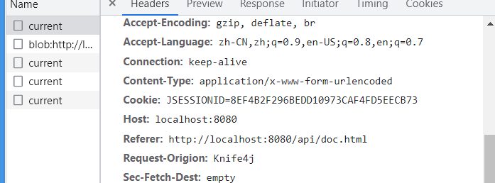
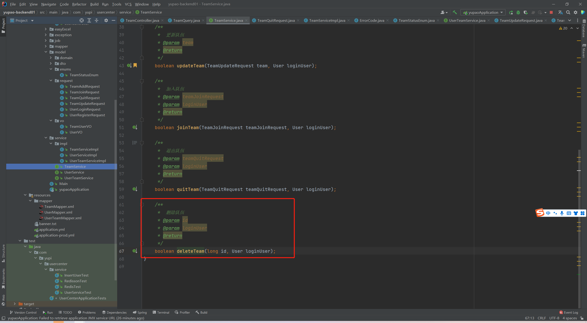
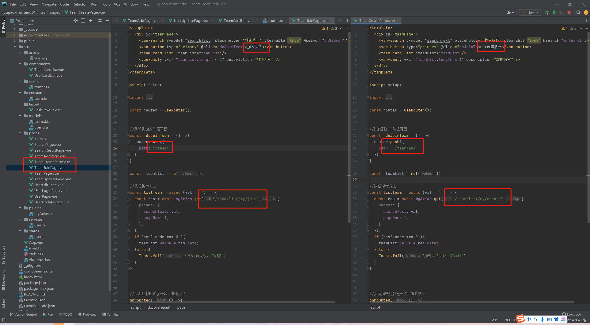
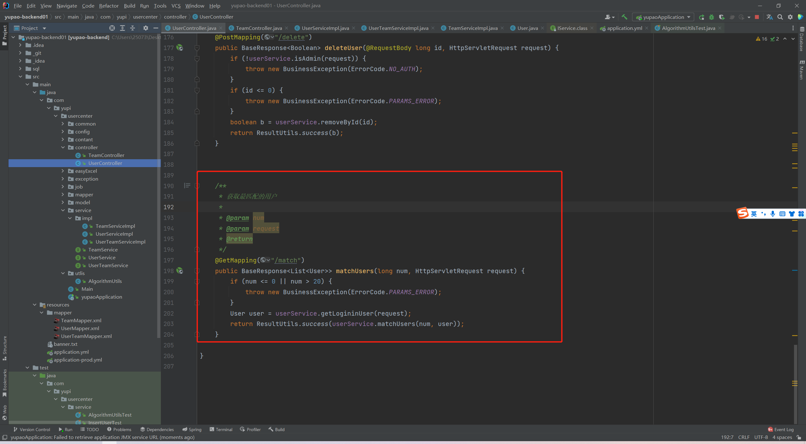
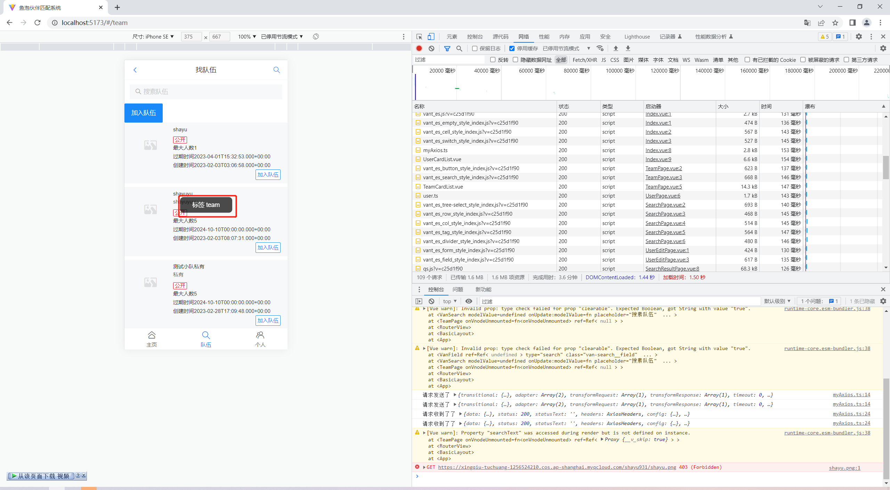
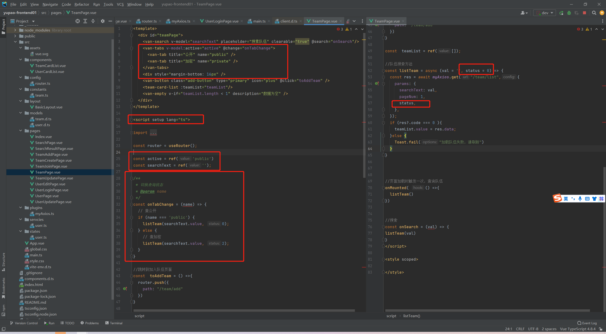
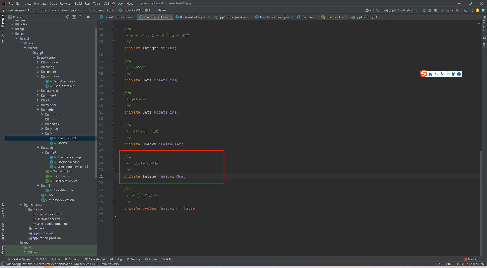

# 伙伴匹配系统

## 前端初始化


- 删除初始化页面，引入导航栏组件，显示成这样就是刚才在main.ts里面的样式没有删除


### 后端


#### sql查询和内存查询的区别是什么

SQL查询和内存查询之间存在几个关键的区别。

首先，SQL查询通常需要与关系数据库进行通信，从而需要在网络上传输数据以及进行数据库的磁盘读写操作。相比之下，内存查询只涉及到内存中的数据操作，因此通常更快。

其次，SQL查询通常需要使用SQL语言进行查询和过滤数据，这需要一定的学习和技能。而内存查询可以使用各种编程语言和库来实现，这使得它们更加灵活和易于使用。

最后，SQL查询通常能够处理大量的数据，因为关系数据库可以通过索引和其他技术来优化查询性能。相反，内存查询通常适用于较小的数据集，因为内存的容量有限，而且没有像关系数据库那样的优化工具来处理大规模数据。

综上所述，SQL查询和内存查询各有优缺点，具体使用哪种方式取决于具体的应用场景和需求。


#### lombok是什么，请给详细介绍

Lombok是一个Java库，它通过注解的方式来简化Java代码的编写。使用Lombok库后，我们可以通过注解来自动生成Java类的getter、setter、构造方法、equals()、hashCode()和toString()等常用方法，从而减少样板代码的编写。这使得我们能够更加专注于业务逻辑的实现，提高开发效率。

Lombok支持的注解包括@Data、@Getter、@Setter、@NoArgsConstructor、@AllArgsConstructor、@EqualsAndHashCode、@ToString等。例如，使用@Data注解可以自动生成类的所有常用方法，而使用@Getter和@Setter注解可以分别自动生成getter和setter方法。使用@NoArgsConstructor和@AllArgsConstructor注解可以分别自动生成无参构造方法和有参构造方法。

除了自动生成常用方法，Lombok还支持其他一些功能，比如@Builder注解可以自动生成Builder模式相关的代码，@SneakyThrows注解可以在方法中自动处理异常等。

总之，Lombok是一个非常实用的Java库，可以大大简化Java代码的编写，提高开发效率。但是，在使用Lombok时需要注意一些潜在的问题，比如可能会影响IDE的自动补全功能，也可能会导致一些编译时错误。


假设我们有一个Java类User，它有id、name、age等属性，我们需要为这些属性生成getter和setter方法，以及一个有参构造方法和toString()方法。在没有使用Lombok的情况下，我们需要手动编写这些代码，如下所示：

```java
public class User {
    private Long id;
    private String name;
    private Integer age;

    public User(Long id, String name, Integer age) {
        this.id = id;
        this.name = name;
        this.age = age;
    }

    public Long getId() {
        return id;
    }

    public void setId(Long id) {
        this.id = id;
    }

    public String getName() {
        return name;
    }

    public void setName(String name) {
        this.name = name;
    }

    public Integer getAge() {
        return age;
    }

    public void setAge(Integer age) {
        this.age = age;
    }

    @Override
    public String toString() {
        return "User{" +
                "id=" + id +
                ", name='" + name + '\'' +
                ", age=" + age +
                '}';
    }
}
```

使用Lombok，我们可以很方便地简化这段代码。我们只需要在类上添加@Data注解，并在构造方法上添加@RequiredArgsConstructor注解，就可以自动生成getter、setter、构造方法和toString()方法，如下所示：

```java
import lombok.Data;
import lombok.RequiredArgsConstructor;

@Data
@RequiredArgsConstructor
public class User {
    private final Long id;
    private final String name;
    private final Integer age;
}
```

可以看到，使用Lombok大大简化了代码量，让我们能够更加专注于业务逻辑的实现。


#### 使用工具mybatisX快速生成java代码xml文件

- 生成驼峰式


选择class name strategy 为camel驼峰式


生成代码对应Activity Column 实际字段


#### CollectionUtils


`CollectionUtils` 是 Apache Commons Collections 库中的一个实用类，提供了各种操作 Java 集合的方法。该类包括创建集合、检查空或空集合、在集合中查找元素、排序和过滤集合等方法。

一些常用的 `CollectionUtils` 方法包括：

- `isEmpty(Collection<?> coll)`：检查集合是否为 null 或空。
- `isNotEmpty(Collection<?> coll)`：检查集合是否不为 null 并且不为空。
- `addAll(Collection<? super T> collection, T... elements)`：将多个元素添加到集合中。
- `removeAll(Collection<?> removefrom, Collection<?> toremove)`：从一个集合中移除另一个集合中的所有元素。
- `containsAny(Collection<?> coll1, Collection<?> coll2)`：检查 `coll1` 中是否至少有一个元素也在 `coll2` 中。
- `filter(Collection<T> collection, Predicate<? super T> predicate)`：过滤集合，返回只包含符合给定谓词的元素的新集合。
- `transform(Collection<T> collection, Function<? super T, ? extends R> transformer)`：通过将函数应用于每个元素来转换集合，并返回包含转换后的元素的新集合。

使用 `CollectionUtils` 可以简化和优化操作集合的代码，因为它提供了许多常见集合操作的预构建方法。


​	Spring框架也提供了一些类似的工具类来操作集合，其中包括 `org.springframework.util.CollectionUtils`。

`CollectionUtils` 是 Spring 框架的一个实用类，提供了各种操作 Java 集合的方法，与 Apache Commons Collections 库中的 `CollectionUtils` 类的功能类似。但它们并不是同一个类，而是由不同的框架提供的。

在 Spring 中，`CollectionUtils` 包含了一些常用的方法，例如：

- `isEmpty(Collection<?> collection)`：检查集合是否为null或空。
- `contains(Enumeration<T> enumeration, T element)`：检查枚举是否包含给定的元素。
- `containsInstance(Collection<?> collection, Object element)`：检查集合是否包含给定的元素实例。

需要注意的是，Spring 框架的 `CollectionUtils` 和 Apache Commons Collections 库中的 `CollectionUtils` 并不兼容，因为它们的方法签名和实现是不同的。因此，如果你同时使用了这两个工具类，需要小心避免混淆它们。


### idea快捷键

- shift+ctrl+减号 - 可以把方法体快速折叠 
- 相反 加号+ 就是展开

alt+ent快速找到修复方法，或者简化代码


- 把鼠标光标放在这里，然后按alt+ent  点击create Test快速生成测试方法


- 自定义快速生成代码缩写


### Matcher matcher = Pattern.compile(validPattern).matcher(userAccount);请介绍这个代码所用到的类和方法

该代码使用了 Java 正则表达式相关的类和方法。具体来说，涉及到了以下类和方法：

- `java.util.regex.Pattern`：正则表达式模式类。该类提供了编译和匹配正则表达式的方法。其中，`compile(String regex)` 方法用于编译给定的正则表达式，返回一个 `Pattern` 实例，`matcher(CharSequence input)` 方法用于创建一个 `Matcher` 对象，用于在给定的输入字符串中查找模式匹配的结果。
- `java.util.regex.Matcher`：正则表达式匹配器类。该类提供了多个方法用于查找和替换匹配结果，其中包括 `find()` 方法用于查找下一个匹配的结果，`group()` 方法用于返回当前匹配的结果，等等。

在这段代码中，`Pattern.compile(validPattern)` 创建了一个正则表达式模式对象，并使用 `validPattern` 字符串作为正则表达式的模式，然后使用 `matcher(userAccount)` 方法创建一个匹配器对象，该匹配器将用于在 `userAccount` 字符串中查找模式匹配的结果。最后，可以使用匹配器的 `find()` 和 `group()` 方法来查找模式匹配的结果，从而判断 `userAccount` 是否符合给定的正则表达式模式。


#### 效验账号不包含特殊字符

```java
// 账户不能包含特殊字符
String validPattern = "[`~!@#$%^&*()+=|{}':;',\\\\[\\\\].<>/?~！@#￥%……&*（）——+|{}【】‘；：”“’。，、？]";
Matcher matcher = Pattern.compile(validPattern).matcher(userAccount);
if (matcher.find()) {
    return -1;
}

如果 matcher.find() 返回 true，则说明在字符串中找到了符合模式的子串，这意味着 userAccount 不符合要求，因此返回 -1。如果 matcher.find() 返回 false，则说明在字符串中没有找到符合模式的子串，这意味着 userAccount 符合要求，可以继续执行后续的代码逻辑。
```


#### 给数据库中的账号密码加密

```java
/**
 * 盐值，混淆密码
 */
private static final String SALT = "yupi";

String encryptPassword = DigestUtils.md5DigestAsHex((SALT + userPassword).getBytes());

这段代码的作用是使用 Spring 框架中的 DigestUtils 类，对给定的字符串进行 MD5 加密，并返回加密后的结果。

具体来说，DigestUtils.md5DigestAsHex() 方法接受一个字节数组作为参数，该字节数组表示要进行 MD5 加密的数据。在这段代码中，需要将 (SALT + userPassword) 字符串转换为字节数组，并将其作为参数传递给 md5DigestAsHex() 方法。其中，SALT 是一个常量，表示一个用于加密的盐值，可以增加加密的强度。

md5DigestAsHex() 方法会将传入的字节数组进行 MD5 加密，并将加密后的结果转换为一个十六进制字符串。这个字符串就是加密后的密码，可以将其存储到数据库中，或者与数据库中存储的密码进行比较，以验证用户的身份。

需要注意的是，MD5 加密虽然是一种常用的加密算法，但它已经被证明存在一些安全漏洞，因此在实际应用中，建议使用更加安全的加密算法，例如 SHA-256 或 SHA-512。
```


#### 用户脱敏

**一般来说我们要给查询的用户信息脱敏，不会返回密码等关键信息**

```java
 * 用户脱敏
 *
 * @param originUser
 * @return
 */
@Override
public User getSafetyUser(User originUser)  {
    if (originUser == null) {
        return null;
    }
    User safetyUser = new User();
    safetyUser.setId(originUser.getId());
    safetyUser.setUsername(originUser.getUsername());
    safetyUser.setUserAccount(originUser.getUserAccount());
    safetyUser.setAvatarUrl(originUser.getAvatarUrl());
    safetyUser.setGender(originUser.getGender());
    safetyUser.setPhone(originUser.getPhone());
    safetyUser.setEmail(originUser.getEmail());
    safetyUser.setPlanetCode(originUser.getPlanetCode());
    safetyUser.setUserRole(originUser.getUserRole());
    safetyUser.setUserStatus(originUser.getUserStatus());
    safetyUser.setCreateTime(originUser.getCreateTime());
    return safetyUser;
}
```


#### 移除登陆态-注销

```java
@Override
public int userLogout(HttpServletRequest request) {
    // 移除登录态
    request.getSession().removeAttribute(USER_LOGIN_STATE);
    return 1;
}
```


### userlist.forEach(this::getSafetyUser);

这段代码使用了 Java 8 中的 Lambda 表达式，对一个 List 集合中的每个元素进行操作。

具体来说，`userlist` 是一个 List 对象，代表一组用户信息。`forEach()` 方法用于遍历这个 List 中的每个元素，并对每个元素执行指定的操作。在这段代码中，Lambda 表达式 `this::getSafetyUser` 作为参数传递给 `forEach()` 方法，表示对于每个元素，都要执行 `getSafetyUser()` 方法。

`this::getSafetyUser` 表达式中的 `this` 表示当前对象本身，`::` 是 Java 8 中的方法引用符号，用于引用一个方法。因此，`this::getSafetyUser` 表示引用当前对象中的 `getSafetyUser()` 方法。

由于 `getSafetyUser()` 方法的参数类型与 List 中的元素类型一致，因此可以使用 Lambda 表达式的简化形式，将其写成 `userlist.forEach(user -> getSafetyUser(user))` 的形式，其中 `user -> getSafetyUser(user)` 表示对于每个元素 `user`，都要执行 `getSafetyUser(user)` 方法。


#### return userlist.stream().map(this::getSafetyUser).collect(Collectors.toList());
这段代码使用了 Java 8 中的 Lambda 表达式和 Stream API，对一个 List 集合中的每个元素进行操作，并将操作结果收集到一个新的 List 中返回。

具体来说，`userlist` 是一个 List 对象，代表一组用户信息。`stream()` 方法用于将这个 List 转换为一个 Stream 对象，从而可以使用 Stream API 进行操作。接着，`map()` 方法用于对 Stream 中的每个元素执行指定的操作，并将操作结果存储到一个新的 Stream 中。在这段代码中，Lambda 表达式 `this::getSafetyUser` 作为参数传递给 `map()` 方法，表示对于 Stream 中的每个元素，都要执行 `getSafetyUser()` 方法。

`getSafetyUser()` 方法的作用是将用户信息转换为安全用户信息，例如将密码加密、去除敏感信息等。这个方法的具体实现需要根据具体的业务需求进行。

最后，`collect()` 方法用于将 Stream 中的元素收集到一个 List 中，并返回这个 List。在这段代码中，`Collectors.toList()` 表示将所有 Stream 中的元素收集到一个新的 List 中，并返回这个 List。因此，整个代码的作用是对 `userlist` 集合中的每个元素执行 `getSafetyUser()` 方法，并将结果存储到一个新的 List 中返回。


#### Assertions.assertNotNull(userList);

```
这段代码使用了 Java 中的断言（assertion）机制，用于在代码执行过程中检查一个条件是否为真。具体来说，`assert` 关键字用于启用断言机制，`assertNotNull()` 方法用于检查一个对象是否为 null。如果对象为 null，则抛出 AssertionError 异常，否则程序继续执行。

在这段代码中，`assertNotNull(userList)` 表示对 `userList` 进行非空判断，如果 `userList` 为 null，则抛出 AssertionError 异常。这个断言通常用于确保一个方法的参数或返回值不为 null，以防止后续的代码出现 NullPointerException 异常。

需要注意的是，默认情况下 Java 中的断言机制是关闭的，需要使用 `-ea` 参数来启用。例如，可以在命令行中使用 `java -ea MyClass` 命令来启用 MyClass 类中的断言机制。在实际应用中，断言通常用于确保代码的正确性和稳定性，可以帮助开发人员更快速地定位和解决问题
```


### Mybatis-plus开启控制台 SQL 日志打印

```yml
mybatis-plus:
  configuration:
    log-impl: org.apache.ibatis.logging.stdout.StdOutImpl
```


- 加上之后运行测试，控制台会输出

```
==>  Preparing: SELECT id,username,userAccount,avatarUrl,gender,userPassword,phone,email,userStatus,createTime,updateTime,isDelete,userRole,planetCode FROM user WHERE isDelete=0 AND (tags LIKE ? AND tags LIKE ?)
```


#### mybatis配置xml


- ```xml
  <mapper namespace="com.yupi.yupo.mapper.UserMapper">
      
      这段代码是 MyBatis 中的 Mapper 配置，用于将 Java 接口方法映射到 SQL 查询语句上。
  
  具体来说，namespace 属性指定了这个 Mapper 接口的全限定名，用于与其他 Mapper 区分开来。接着，在这个 Mapper 中可以定义一系列方法，用于对数据库进行增删改查等操作。
  
  例如，对于一个名为 UserMapper 的 Mapper 接口，可以定义以下方法：
  
  public interface UserMapper {
      User getUserById(Long id);  // 根据 id 查询用户信息
      void addUser(User user);    // 添加用户信息
      void updateUser(User user); // 更新用户信息
      void deleteUser(Long id);   // 删除用户信息
      List<User> getAllUsers();   // 获取所有用户信息
  }
  
  在这些方法中，使用了 MyBatis 的注解或 XML 配置，将方法与 SQL 查询语句进行映射。例如，getUserById() 方法可以使用 MyBatis 的 @Select 注解，将查询语句与方法进行绑定：
  
  @Select("SELECT * FROM user WHERE id = #{id}")
  User getUserById(Long id);
  
  这个注解表示将 SELECT * FROM user WHERE id = #{id} 查询语句与 getUserById() 方法进行映射，其中 #{id} 表示方法的参数。当调用这个方法时，MyBatis 就会自动执行这个查询语句，并将查询结果映射成 Java 对象返回。
  
  除了注解方式，MyBatis 还支持 XML 配置方式进行映射，具体使用方式可以根据实际需求进行选择。
  ```


```xml
<?xml version="1.0" encoding="UTF-8"?>
<!DOCTYPE mapper
        PUBLIC "-//mybatis.org//DTD Mapper 3.0//EN"
        "http://mybatis.org/dtd/mybatis-3-mapper.dtd">

 这段代码是 MyBatis 的 Mapper 配置文件的头部声明，用于指定配置文件的版本和 DTD（Document Type Definition）。

具体来说，<?xml version="1.0" encoding="UTF-8"?> 表示这是一个 XML 文件，版本号为 1.0，编码方式为 UTF-8。接着，<!DOCTYPE mapper> 表示这个 XML 文件是一个 Mapper 配置文件，并且使用了 MyBatis Mapper 的 DTD。

在 DTD 的声明中，PUBLIC 表示这个 DTD 是公共的，可以在公共网络中访问到。-//mybatis.org//DTD Mapper 3.0//EN 表示 DTD 的标识符，其中 mybatis.org 是 DTD 的作者，Mapper 3.0 是 DTD 的版本号，EN 表示 DTD 的语言为英语。

最后，"http://mybatis.org/dtd/mybatis-3-mapper.dtd" 表示 DTD 在公共网络中的位置，用于 MyBatis 解析这个 XML 文件时进行验证。

需要注意的是，这段声明是 MyBatis Mapper 配置文件的固定格式，通常不需要修改。如果需要修改，建议参考官方文档进行操作。
```


```xml
<resultMap id="BaseResultMap" type="com.yupi.yupo.model.domain.User">
        <id property="id" column="id" jdbcType="BIGINT"/>
        <result property="username" column="username" jdbcType="VARCHAR"/>
    
    这段代码是 MyBatis 中的一个 ResultMap 配置，用于将数据库中的查询结果映射成 Java 对象。

具体来说，id 元素表示这个 ResultMap 的唯一标识符，type 属性表示映射的 Java 对象类型，这里是 com.yupi.yupo.model.domain.User。接着，每个 result 元素表示将数据库中的某个列映射到 Java 对象中的某个属性。其中，property 属性表示 Java 对象的属性名，column 属性表示数据库表的列名，jdbcType 属性表示数据库列的 JDBC 类型。

例如，<result property="id" column="id" jdbcType="BIGINT"/> 表示将数据库表中的 id 列映射到 Java 对象的 id 属性上，使用的 JDBC 类型是 BIGINT。这样，在执行数据库查询时，MyBatis 就可以自动将查询结果映射成 Java 对象，方便开发人员操作。

需要注意的是，这个 ResultMap 中的属性和列名需要严格对应，否则映射会出现错误。另外，MyBatis 还支持自定义 ResultMap，可以根据实际需求进行配置。
```


```xml
<sql id="Base_Column_List">
    id,username,userAccount,
    avatarUrl,gender,userPassword,
    phone,email,userStatus,
    createTime,updateTime,isDelete,
    userRole,planetCode
</sql>

这段代码是 MyBatis 中的 SQL 片段（SQL fragment），用于在其他 SQL 语句中引用。

具体来说，<sql> 标签用于定义一个 SQL 片段，id 属性指定了这个片段的唯一标识符，可以在其他 SQL 语句中使用 #{id} 引用这个片段。在这个例子中，id 属性为 Base_Column_List，表示这个片段包含了所有的基本列名。

接着，这个 SQL 片段中包含了所有需要查询或操作的列名，用逗号分隔。这些列名与前面的 ResultMap 中的列名相同，需要严格对应。其他 SQL 语句可以使用 INCLUDE 指令引用这个片段，例如：

<!-- 查询所有用户信息 -->
<select id="getAllUsers" resultType="User">
  SELECT <include refid="Base_Column_List"/> FROM user
</select>

这个 SQL 查询语句中使用了 <include> 指令引用了 Base_Column_List 这个 SQL 片段，表示查询所有用户信息，并返回 User 类型的对象列表。

使用 SQL 片段可以避免在 SQL 语句中重复写入相同的列名，提高 SQL 语句的可读性和维护性。同时，SQL 片段也可以进行继承和重写，方便不同的 SQL 语句进行组合和定制。
```


### 查询方式

1. sql查询（简单）

```java
sql查询
QueryWrapper<User> queryWrapper = new QueryWrapper<>();
//拼接查询 like '%java%' and like '%python%'
for(String tagName : TagNameList){
   queryWrapper = queryWrapper.like("tags",tagName);
}
List<User> userlist = userMapper.selectList(queryWrapper);
return userlist.stream().map(this::getSafetyUser).collect(Collectors.toList());
```

```sql
控制台输出sql
==>  Preparing: SELECT id,username,userAccount,avatarUrl,gender,userPassword,phone,email,userStatus,createTime,updateTime,isDelete,userRole,planetCode FROM user WHERE isDelete=0 AND (tags LIKE ? AND tags LIKE ?)
```

2. 内存查询（灵活，可以通过并发优化）

```java
控制台输出sql
==>  Preparing: SELECT id,username,userAccount,avatarUrl,tags,gender,userPassword,phone,email,userStatus,createTime,updateTime,isDelete,userRole,planetCode FROM user WHERE isDelete=0
```


```java
 //内存查询
        //1.查询所有用户
        QueryWrapper<User> queryWrapper = new QueryWrapper<>();
        List<User> userlist = userMapper.selectList(queryWrapper);
        //2.在内存中判断是否包含需要的标签
        Gson gson = new Gson();

return userlist.stream().filter(user -> {
    String tagsStr = user.getTags();
    //可以使用set优化，set可以去重，提升查询速度
    Set<String> temtagNamelist = gson.fromJson(tagsStr, new TypeToken<Set<String>>() {}.getType());//将json字符串转换为list
    for(String tagName : TagNameList){
        if(!temtagNamelist.contains(tagName)){
            return false;
        }
    }
    return true;
}).map(this::getSafetyUser).collect(Collectors.toList());

这段代码使用了Java 8中的Stream API对一个List<User>进行了过滤操作，将符合条件的User对象转换为一个List<SafetyUser>。

具体实现过程如下：

    userlist.stream() - 将userlist转换为一个流（Stream）对象，以便进行后续的过滤和转换操作。

    .filter(user -> {...}) - 对流中的每个User对象进行过滤，只保留符合条件的User对象。这里使用了Lambda表达式，对每个User对象进行判断，判断该对象的标签是否包含了指定的标签，如果包含则返回true，否则返回false。

    Set<String> temtagNamelist = gson.fromJson(tagsStr, new TypeToken<Set<String>>() {}.getType()) - 将User对象的标签字符串转换为一个Set<String>对象，以便进行标签的快速查询。这里使用了Gson库的fromJson方法，将JSON字符串转换为Set<String>对象。

    for(String tagName : TagNameList){...} - 遍历指定的标签列表，判断是否每个标签都存在于当前User对象的标签列表中。

    return true; - 如果每个标签都存在于当前User对象的标签列表中，则返回true，表示该User对象符合条件。

    .map(this::getSafetyUser) - 对符合条件的User对象进行转换，将其转换为一个SafetyUser对象。这里使用了方法引用（Method Reference）的方式，将this::getSafetyUser作为一个函数式接口，将符合条件的User对象传递给该函数式接口，以便进行转换操作。

    .collect(Collectors.toList()) - 将转换后的SafetyUser对象收集到一个List<SafetyUser>中，作为最终的结果返回。

综上所述，这段代码实现了对一个List<User>对象的过滤和转换操作，将符合条件的User对象转换为一个List<SafetyUser>对象返回。
        
        这里的map是什么作用:
 	在这段代码中，map方法的作用是将符合条件的User对象转换为SafetyUser对象。具体来说，map方法接受一个函数式接口作为参数，该函数式接口将一个User对象作为输入，返回一个SafetyUser对象作为输出。map方法将该函数式接口应用于流中的每个元素（即User对象），将其转换为一个SafetyUser对象，并返回由这些SafetyUser对象组成的新流。

在这段代码中，使用了方法引用（Method Reference）的方式来传递函数式接口，即this::getSafetyUser，该方法接受一个User对象作为参数，返回一个对应的SafetyUser对象。这样，map方法就会将流中的每个User对象都传递给getSafetyUser方法进行转换，最终得到一个由转换后的SafetyUser对象组成的流。

使用map方法可以方便地对流中的元素进行转换操作，在这个例子中，将符合条件的User对象转换为SafetyUser对象，方便后续的处理和操作。
        
```

##### 为什么在这段代码里还可以返回boolean类型的

```java
return userlist.stream().filter(user -> {
    String tagsStr = user.getTags();
    //如果用户没有标签，直接返回false
    if(StringUtils.isBlank(tagsStr)){
        return false;
    }
    //可以使用set优化，set可以去重，提升查询速度
    Set<String> temtagNamelist = gson.fromJson(tagsStr, new TypeToken<Set<String>>() {}.getType());//将json字符串转换为list
    for(String tagName : TagNameList){
        if(!temtagNamelist.contains(tagName)){
            return false;
        }
    }
    return true;
}).map(this::getSafetyUser).collect(Collectors.toList());

在这段代码中，filter方法接受一个Predicate函数式接口作为参数，该函数式接口将一个User对象作为输入，返回一个boolean类型的值作为输出。该方法将流中的每个元素（即User对象）传递给该函数式接口进行过滤，只保留符合条件的元素，最终得到一个新的流。

在这段代码中，filter方法的函数式接口实现了一个匿名函数（或Lambda表达式），该函数接受一个User对象作为参数，判断该对象是否符合条件。具体来说，如果该User对象的tags属性为空或不包含需要的标签，则返回false，表示该对象不符合条件；否则返回true，表示该对象符合条件。

因此，该函数式接口的返回值类型为boolean，以表示该User对象是否符合条件。在filter方法中，返回值类型为boolean的函数式接口是合法的，因为该方法要根据该函数式接口的返回值来过滤流中的元素。

在filter方法之后，使用map方法将符合条件的User对象转换为SafetyUser对象，最终将流转换为一个List<SafetyUser>对象并返回。

需要注意的是，虽然该函数式接口的返回值类型为boolean，但最终返回值类型是List<SafetyUser>，这是因为在filter方法之后使用了map方法进行了类型转换。map方法接受一个Function函数式接口作为参数，该函数式接口将一个User对象作为输入，返回一个SafetyUser对象作为输出。因此，map方法将流中的每个元素（即User对象）传递给该函数式接口进行转换，最终得到一个新的流，其中的每个元素都是SafetyUser对象。最后，使用collect方法将该流转换为一个List<SafetyUser>对象并返回。
```

##### 这两个方式查询速度

- 注意数据库第一次连接也是需要时间的
- 还有可能有查询缓存
- 数据量大一点才能看出区别
- 如果参数可以分析，可以根据用户的参数去选择哪一种查询方式，比如标签数
- 如果参数不可以分析，并且数据库连接足够，内存空间足够，可以并发查询，谁先返回用谁
- 还可以SQL查询和内存查询相结合，先用sql查询过滤过一些，比如java标签比较多，那么久先用SQL查询查出所有的java标签的用户，然后在这些用户里再去过滤掉没有包含所需要标签的用户

### 解析json字符串

序列化：把java对象转化为json

反序列化：json转为java对象

java json序列化库：

1. gson(google) 
2. fastjson alibaba(快，但漏洞太多)
3. jackjson、
4. kryo


```java
Gson gson = new Gson();//使用gson 从maven repository 里拉取坐标放到pom.xml里
for(User user : userlist){
    String tagsStr = user.getTags();
    List<String> tagNamelist = gson.fromJson(tagsStr, new TypeToken<List<User>>(){}.getType());
}
//            gson.toJson(temtagNamelist);//将list转换为json字符串

这段代码使用了Gson库将一个包含了多个User对象的JSON字符串转换成了一个List<String>对象，这个List<String>对象只包含了每个User对象的标签名。

代码的具体实现过程如下：

    gson.fromJson(tagsStr, new TypeToken<List<User>>(){}.getType()) - 这一行使用了Gson库的fromJson方法将tagsStr JSON字符串转换成一个List<User>对象。TypeToken类用于提供Gson库所需的类型信息，以正确地将JSON字符串反序列化为List<User>对象。

    new TypeToken<List<User>>(){}.getType() - 这一行创建了一个新的TypeToken对象，来表示泛型类型List<User>。然后调用getType()方法获取表示泛型类型List<User>的Type对象。

    接着，代码遍历了List<User>对象中的每个User对象，并将每个User对象的标签名提取出来，添加到一个新的List<String>对象中，即tagNamelist。

因此最终，tagNamelist只包含了原始JSON字符串中每个User对象的标签名。

```


#### 解析字符串遇到的错误


```java
            Set<String> temtagNamelist = gson.fromJson(tagsStr, new TypeToken<Set<String>>() {}.getType());//将json字符串转换为list

com.google.gson.JsonSyntaxException: java.lang.IllegalStateException: Expected a string but was BEGIN_OBJECT at line 1 column 3 path $[0]
这个错误可能是你把数据库里的json数据存成一个数组，然后gson.fromjson()解析的时候就会报错
### 
```

### if(StringUtils.isBlank(tagsStr)){
 return false;

 }

这段代码使用了Apache Commons Lang库中的`StringUtils`类，对一个字符串进行了非空（null或空字符串）判断操作。

具体来说，`StringUtils.isBlank()`方法用于判断一个字符串是否为null或空字符串，如果是则返回true，否则返回false。在这段代码中，如果`tagsStr`是空字符串，则直接返回false，表示该User对象不符合条件。

这个判断操作可以有效避免对空字符串进行解析或操作，防止出现空指针异常或其他错误。在进行字符串处理时，建议先对字符串进行非空判断，以保证代码的健壮性和可靠性。


### 并发流parallelStream 陷阱	

- parallelStream使用公共的线程池，可能导致效率低下 ，比如你有两个并发流的方法，一个在查数据库，一个在查内存。但是因为第一个查询方法数据量太大消耗线程池里的线程，导致另外一个方法没有线程可以用了。

在Java 8中，引入了Stream API来简化集合数据的处理。Stream API提供了一组丰富的操作，可以通过流水线方式来对集合数据进行转换和处理。除了串行流（sequentialStream）之外，Java 8还引入了并发流（parallelStream）来加速集合数据的处理。

并发流（parallelStream）是一种可以并行处理集合数据的流。它可以将一个流分成多个子流，在多个线程上同时处理这些子流，最后将它们合并成一个结果。这样可以有效地利用多核CPU的性能，提高集合数据的处理速度。

使用并发流非常简单，只需要将串行流（sequentialStream）改为并发流（parallelStream）即可。例如，下面的代码演示了如何使用并发流来对一个集合进行求和：

```
List<Integer> numbers = Arrays.asList(1, 2, 3, 4, 5, 6, 7, 8, 9, 10);
int sum = numbers.parallelStream() .mapToInt(Integer::intValue).sum();
```

在上面的代码中，我们首先将集合转换成并发流，然后使用mapToInt操作将每个元素转换为int类型，最后使用sum操作求和。由于使用了并发流，这个操作可以在多个线程上同时进行，从而加速求和的速度。

需要注意的是，并发流虽然可以加速集合数据的处理，但并不是所有的操作都适合使用并发流。例如，一些操作可能需要对集合数据进行排序或者去重，这些操作在并发环境下可能会导致结果不一致。因此，在使用并发流时需要根据具体的场景选择合适的操作。


### java8判空操作

- 查询数据等操作都记得要进行一个判空操作

```
temtagNamelist = Optional.ofNullable(temtagNamelist).orElse(new HashSet<>();

这行代码使用了Java 8中的Optional类来避免可能出现的空指针异常。它的作用是，如果temtagNamelist为null，则使用空的HashSet来进行初始化，否则直接使用原有的temtagNamelist。

具体来说，代码中的Optional.ofNullable(temtagNamelist)方法会将temtagNamelist包装成一个Optional对象，然后调用其orElse方法，如果temtagNamelist为null，则返回空的HashSet，否则返回原有的temtagNamelist。

使用Optional可以避免直接使用null的问题，使代码更加健壮和可读。同时，它也可以让代码更加简洁，避免了繁琐的null判断和赋值操作。
```


### 后端整合Swagger +Knife4j接口文档

什么是接口文档？写接口信息的文档，每条接口包括：

- 请求参数
- 响应参数
  - 错误码
- 接口地址
- 接口名称
- 请求类型
- 请求格式
- 备注

who 谁用？一般是后端或者负责人来提供，后端和前端都要使用

为什么需要接口文档？

- 有个书面内容（背书或者归档），便于大家参考和查阅，便于 **沉淀和维护** ，拒绝口口相传
- 接口文档便于前端和后端开发对接，前后端联调的 **介质** 。后端 => 接口文档 <= 前端
- 好的接口文档支持在线调试、在线测试，可以作为工具提高我们的开发测试效率

怎么做接口文档？

- 手写（比如腾讯文档、Markdown 笔记）
- 自动化接口文档生成：自动根据项目代码生成完整的文档或在线调试的网页。Swagger，Postman（侧重接口管理）（国外）；apifox、apipost、eolink（国产）

接口文档有哪些技巧？

**Swagger是什么？**

-  Swagger是一款RESTFUL接口的文档在线自动生成+功能测试功能软件。Swagger是一个规范和完整的框架,用于生成、描述、调用和可视化RESTful风格的Web服务。目标是使客户端和文件系统作为服务器以同样的速度来更新文件的方法,参数和模型紧密集成到服务器。

- 这个解释简单点来讲就是说，swagger是一款可以根据resutful风格生成的生成的接口开发文档，并且支持做测试的一款中间软件。

**Swagger 原理：**

1. 引入依赖（Swagger 或 Knife4j：https://doc.xiaominfo.com/knife4j/documentation/get_start.html）

2. 

3. ```xml
   <!--引入swagger-->
   <dependency>
       <groupId>io.springfox</groupId>
       <artifactId>springfox-swagger2</artifactId>
       <version>2.7.0</version>
   </dependency>
   <dependency>
       <groupId>io.springfox</groupId>
       <artifactId>springfox-swagger-ui</artifactId>
       <version>2.7.0</version>
   </dependency>
   ```

4. 自定义 Swagger 配置类

5. 

6. ```java
   package com.yupi.yupo.config;
   
   import com.github.xiaoymin.knife4j.spring.annotations.EnableKnife4j;
   import io.swagger.annotations.ApiOperation;
   import org.springframework.context.annotation.Bean;
   import org.springframework.context.annotation.Configuration;
   import springfox.documentation.builders.ApiInfoBuilder;
   import springfox.documentation.builders.PathSelectors;
   import springfox.documentation.builders.RequestHandlerSelectors;
   import springfox.documentation.service.ApiInfo;
   import springfox.documentation.service.Contact;
   import springfox.documentation.spi.DocumentationType;
   import springfox.documentation.spring.web.plugins.Docket;
   import springfox.documentation.swagger2.annotations.EnableSwagger2;
   
   
   @Configuration
   @EnableSwagger2 //该注解是Springfox-swagger框架提供的使用Swagger注解，该注解必须加
   
   
   public class SwaggerConfig {
       //注入bean
       @Bean
       public Docket productApi() {
           return new Docket(DocumentationType.SWAGGER_2)
                   //使用链式调用
                   .apiInfo(apiInfo())
                   .select()
                   //标注你控制器的位置
                   .apis(RequestHandlerSelectors.basePackage("com.yupi.yupo.controller"))
                   //可以选着部分接口，也可以全部
                   .paths(PathSelectors.any())
                   .build();
   
       }
   
       private ApiInfo apiInfo() {
           return new ApiInfoBuilder()
                   .title("伙伴匹配")
                   .description("伙伴匹配接口文档")
                   .termsOfServiceUrl("http://github.com/wlh555552")
                   .contact(new Contact("wlh", "http://github.com/wlh555552", "2109236440@qq.com"))
                   .version("1.0")
                   .build();
       }
   
   }
   
   ```

7. 定义需要生成接口文档的代码位置（Controller）

8. 引入knife4j （引入 knife4j就不用引入swagger了，因为knife4j已经包含了swagger）

   - knife4j是Swaager的增强

   - 引入坐标

   - 

   - ```
           引入knife4j-->
             <dependency>
                 <groupId>com.github.xiaoymin</groupId>
                 <artifactId>knife4j-spring-boot-starter</artifactId>
                 <version>2.0.9</version>
             </dependency>
     ```

```java
package com.yupi.yupo.config;

//import com.github.xiaoymin.knife4j.spring.annotations.EnableKnife4j;
import io.swagger.annotations.ApiOperation;
import org.springframework.context.annotation.Bean;
import org.springframework.context.annotation.Configuration;
import org.springframework.context.annotation.Profile;
import org.springframework.web.servlet.config.annotation.EnableWebMvc;
import springfox.documentation.builders.ApiInfoBuilder;
import springfox.documentation.builders.PathSelectors;
import springfox.documentation.builders.RequestHandlerSelectors;
import springfox.documentation.service.ApiInfo;
import springfox.documentation.service.Contact;
import springfox.documentation.spi.DocumentationType;
import springfox.documentation.spring.web.plugins.Docket;
import springfox.documentation.swagger2.annotations.EnableSwagger2WebMvc;

@Configuration
@EnableSwagger2WebMvc //该注解是Springfox-swagger框架提供的使用Swagger注解，该注解必须加
@Profile({"dev", "test"})   //版本控制访问  只允许在dev,test环境下访问
public class SwaggerConfig {
    //注入bean
     @Bean(value = "defaultApi2")
//@Bean

    public Docket defaultApi2() {
        return new Docket(DocumentationType.SWAGGER_2)
                //使用链式调用
                .apiInfo(apiInfo())
                .select()
                //标注你控制器的位置
                .apis(RequestHandlerSelectors.basePackage("com.yupi.yupo.controller"))
                //可以选着部分接口，也可以全部
                .paths(PathSelectors.any())
                .build();

    }

    /**
     * api信息
     * @return
     */
    private ApiInfo apiInfo() {
        return new ApiInfoBuilder()
                .title("伙伴匹配")
                .description("伙伴匹配接口文档")
                .termsOfServiceUrl("http://github.com/wlh555552")
                .contact(new Contact("wlh", "http://github.com/wlh555552", "2109236440@qq.com"))
                .version("1.0")
                .build();
    }

}

```


1. 千万注意：线上环境不要把接口暴露出去！！！可以通过在 SwaggerConfig 配置文件开头加上 `@Profile({"dev", "test"})` 限定配置仅在部分环境开启

2. 

3. ```yml
   mvc:
     pathmatch:
       matching-strategy: ANT_PATH_MATCHER
   profiles://记得配置运行环境
     active: dev
   ```

4. 启动即可 访问地址http://localhost:8080/api/doc.html#/home

5. knife4j 的接口文档http://localhost:8080/api/v2/api-docs

6. 可以通过在 controller 方法上添加 @Api、@ApiImplicitParam(name = "name",value = "姓名",required = true)    @ApiOperation(value = "向客人问好") 等注解来自定义生成的接口描述信息

如果 springboot version >= 2.6，需要添加如下配置：

```yaml
spring:
  mvc:
  	pathmatch:
      matching-strategy: ANT_PATH_MATCHER
```

todo 怎么隐藏


### 存量用户信息导入及同步

1. 把所有星球用户的信息导入
2. 把写了自我介绍的同学的标签信息导入
3. FeHelper 前端辅助插件，推荐安装

去星球点击F12，点击网络，在星球页面上触发一个请求

- 这个星球特别好，直接把请求接口的地址给我们了，接下去我们就直接去访问这个地址
- 

可以看到我们获取了一堆json数据

- 获取curl数据
- 


#### 网络请求中的curl是什么

curl是用于发起HTTP请求的工具,它可以用于测试HTTP接口。curl通常用于**:- 测试HTTP接口,验证接口是否正常
\- 学习HTTP协议,了解请求和响应的整个过程
\- 脚本中的HTTP请求,通过curl发起请求并获取响应
\- CI/CD流水线中的接口测试和请求curl的基本用法是:

```
bash
curl [options] [URL...]
```

options常用选项有:- `-X `:指定HTTP方法,如GET、POST等
\- `-d `:发送POST请求的数据体
\- `-H `:自定义请求头
\- `-u `:指定用户名和密码用于HTTP Basic认证
\- `-v `:输出完整的HTTP交互信息,用于调试 
\- `-w `:指定输出格式,常用于提取响应时间等信息举例:

```
bash
# GET请求
curl https://www.example.com

# POST请求
curl -X POST -d '{"name":"john"}' https://httpbin.org/post

# 设置User-Agent 
curl -H 'User-Agent: Mozilla' https://www.example.com

# HTTP Basic认证
curl -u 'username:password' https://httpbin.org/basic-auth/username/password

# 输出详细信息 
curl -v https://www.example.com

# 提取响应时间
curl -w 'time_total: %{time_total}\n' https://www.example.com 
```

所以,curl是一个非常有用的HTTP客户端工具,可以满足我们学习、测试、开发和运维过程中的各种HTTP请求需求。熟练使用curl,对理解HTTP协议和接口测试都很有帮助

curl "https://api.zsxq.com/v2/groups/51122858222824/topics?scope=all&count=20&end_time=2023-04-18T22^%^3A52^%^3A10.212^%^2B0800" ^
  -H "authority: api.zsxq.com" ^
  -H "accept: application/json, text/plain, */*" ^
  -H "accept-language: zh-CN,zh;q=0.9,en-US;q=0.8,en;q=0.7" ^
  -H "cookie: 
  -H "origin: https://wx.zsxq.com" ^
  -H "referer: https://wx.zsxq.com/" ^
  -H "sec-ch-ua: ^\^"Chromium^\^";v=^\^"112^\^", ^\^"Google Chrome^\^";v=^\^"112^\^", ^\^"Not:A-Brand^\^";v=^\^"99^\^"" ^
  -H "sec-ch-ua-mobile: ?0" ^
  -H "sec-ch-ua-platform: ^\^"Windows^\^"" ^
  -H "sec-fetch-dest: empty" ^
  -H "sec-fetch-mode: cors" ^
  -H "sec-fetch-site: same-site" ^
  -H "user-agent: Mozilla/5.0 (Windows NT 10.0; Win64; x64) AppleWebKit/537.36 (KHTML, like Gecko) Chrome/112.0.0.0 Safari/537.36" ^
  -H "x-request-id: 07cb7a711-fc1b-25bd-6e93-f7428c72843" ^
  -H "x-signature: e3d4432fcbee2bede332d71b4d096d741d55d4a9" ^
  -H "x-timestamp: 1681983875" ^
  -H "x-version: 2.36.0" ^
  --compressed

- 分析curl信息

Headers:- authority: [api.zsxq.com](http://api.zsxq.com/)  // 授权信息
\- accept: 声明接收的数据类型
\- accept-language: 声明接收的语言
\- cookie: 登录状态,包含token等信息
\- origin: 请求的源,[xn--wx-i07dt73mkbc.zsxq.com](http://xn--wx-i07dt73mkbc.zsxq.com/)
\- referer: 请求的来源页,[xn--wx-z22cw15gxf0ctpc.zsxq.com](http://xn--wx-z22cw15gxf0ctpc.zsxq.com/)
\- sec-ch-ua:浏览器信息
\- sec-ch-ua-mobile:是否是移动设备
\- sec-ch-ua-platform:操作系统信息
\- sec-fetch-dest: 请求的目的
\- sec-fetch-mode:请求的模式,这里是跨源请求cors
\- sec-fetch-site: 请求的源网站,这里是同源same-site
\- user-agent:用户代理,包含浏览器和操作系统信息 
\- x-request-id: 请求ID 
\- x-signature: 签名信息
\- x-timestamp: 时间戳
\- x-version: API版本号Options:- -compressed:请求压缩编码这个请求总体包含了很完整的HTTP头,包括授权、认证、语言、设备信息等,并带有签名和时间戳实现了安全验证。同时使用了gzip压缩,对响应内容进行压缩,提高传输效率。所以,这是一个非常规范的HTTP接口请求的示例


### 流程（数据导入）

1. 从excel导入用户信息

使用工具：

**EasyExcel**：[关于Easyexcel | Easy Excel (alibaba.com)](https://easyexcel.opensource.alibaba.com/docs/current/)

- 引入坐标

```java
    <!-- easy Excel -->
    <dependency>
        <groupId>com.alibaba</groupId>
        <artifactId>easyexcel</artifactId>
        <version>3.1.0</version>
    </dependency>
```

1. 抓取写了自我介绍的同学信息，提取出用户昵称、用户唯一 id、自我介绍信息
2. 从自我介绍中提取信息，然后写入到数据库中


两种读对象的方式：

1. 确定表头：建立对象，和表头形成映射关系
2. 不确定表头：每一行数据映射为 Map<String, Object>

两种读取模式：

1. 监听器：先创建监听器、在读取文件时绑定监听器。单独抽离处理逻辑，代码清晰易于维护；一条一条处理，适用于数据量大的场景。
2. 同步读：无需创建监听器，一次性获取完整数据。方便简单，但是数据量大时会有等待时常，也可能内存溢出。


### 依赖无法导入问题

- 可能是maven版本问题，因为换了3.9.1和3.6.1都导不进去，但3.8.1可以


### groupingBy

Collectors.groupingBy()是一个Collector方法,它可以对stream中的元素进行分组,返回一个Map<K, List<T>>。其方法签名为:

```java
java
public static <T, K> 
    Collector<T, ?, Map<K, List<T>>> groupingBy(Function<? super T, ? extends K> classifier)
```

它接收一个Function,用于决定如何对元素进行分类。它会遍历stream中的所有元素,使用该Function计算每个元素的分类key,并将相同key的元素添加到同一个List中,最终返回一个存储所有分组信息的Map。例如,要对Person对象列表按性别分组,可以使用:

```
java
Map<String, List<Person>> personMap = personList.stream()
                                         .collect(Collectors.groupingBy(Person::getGender));
```

这会返回一个Map:- key是"Male"和"Female"
\- value是相应性别的Person对象List这让我们可以很轻松地将流中的元素按某个字段分类为Map,非常有用。groupingBy()方法还有重载版本,可以接受下面两个额外参数:- Collector:用于规约每个分组中的元素,默认为ToListCollector
\- MapSupplier:返回的Map实现的供应商,可以自定义Map类型例如,要统计每个性别的Person数量,可以使用:

```
java
Map<String, Long> personCountMap = personList.stream()
                                           .collect(Collectors.groupingBy(Person::getGender, 
                                                                           Collectors.counting()));
```

这会返回一个Map,key是性别,value是相应性别的Person数量。所以,groupingBy()是一个十分有用的Collector方法,它让我们可以非常简单地对流的元素进行分组,并可选地基于分组执行进一步的规约操作。熟练使用这个方法,可以使我们的代码更加简洁高效。


### 编写后端UserSearchbytags接口

```java
    @GetMapping("/search/tags")
    public BaseResponse<List<User>> searchUsersByTags(@RequestParam(required = false) List<String> tagnamelist) {
        if(CollectionUtils.isEmpty(tagnamelist)){
            throw new BusinessException(ErrorCode.PARAMS_ERROR);
        }
        List<User> userList = userService.searchUserByTags(tagnamelist);

        return ResultUtils.success(userList);
    }
```

- 和前端对接时可能产生跨域问题


```
在这里允许跨域
@CrossOrigin(origins = {"http://localhost:3000/"})//允许跨域,前端端口
前端端口

这里还要提醒的一点是@CrossOrigin注解的问题。如果上面操作后还是有跨域问题，后端没有接受到数据，需要如下操作。（我去看了一下源码，后面鱼皮有添加过。）在后端config文件夹中添加WebMvcConfg

package com.yupi.usercenter.config;

import org.springframework.context.annotation.Configuration;
import org.springframework.web.servlet.config.annotation.CorsRegistry;
import org.springframework.web.servlet.config.annotation.WebMvcConfigurer;

@Configuration
public class WebMvcConfg implements WebMvcConfigurer {
 
    @Override
    public void addCorsMappings(CorsRegistry registry) {
        //设置允许跨域的路径
        registry.addMapping("/**")
                //设置允许跨域请求的域名
                //当**Credentials为true时，**Origin不能为星号，需为具体的ip地址【如果接口不带cookie,ip无需设成具体ip】
                /* 放自己的前端域名*/
                .allowedOrigins("http://localhost:5173", "http://127.0.0.1:5173", "http://127.0.0.1:8082", "http://127.0.0.1:8083")
                //是否允许证书 不再默认开启
                .allowCredentials(true)
                //设置允许的方法
                .allowedMethods("*")
                //跨域允许时间
                .maxAge(3600);
    }
}

```


### 单机登陆改分布式session登陆


- 在maven里使用package打包项目，然后在maven会在target目录里生成当前项目的jar包。
- 
- 
- 然后在终端里使用java -jar .\yupo-backend-0.0.1-SNAPSHOT.jar --server.port=8081运行。
- 
- 然后你再idea那个界面在启动这个项目
- 这样就模拟实现了分布式后端项目。
- 不过服务器启动的端口要不一样，比如idea的启动使用8080端口，另外一个使用8081启动。


**session登陆逻辑：**

1. 当你前端发起请求时后端会生成一个sessionid 并把数据存储在session中

2. }

   ```
   // 3. 用户脱敏
   User safetyUser = getSafetyUser(user);
   // 4. 记录用户的登录态
   request.getSession().setAttribute(*USER_LOGIN_STATE*, safetyUser);
   return safetyUser;
   ```

   

3. 

2. 然后，如果当前服务器前端再次发起请求，就会就会带着这个sessionid来找到你请求的对象。然后就可以拿到存储在session里的数据


**但是如果两个后端地址的域名是一样，当前端分别在不同后端服务请求时，产生的sessionid可能会互相覆盖。**


- 所以种 session 的时候注意范围，cookie.domain

比如两个域名：

aaa.yupi.com

bbb.yupi.com

如果要共享 cookie，可以种一个更高层的公共域名，比如 yupi.com

- 这时我们引出一个问题，如果我们把后端部署到两台服务器，A服务器和B服务器。那么向A服务器请求登陆后，又向B服务器请求时，B服务器不认识，又要重新登陆。这该怎么办呢？
- 所以我们就需要一个共享内存的东西

### 为什么服务器 A 登录后，请求发到服务器 B，不认识该用户？

用户在 A 登录，所以 session（用户登录信息）存在了 A 上

结果请求 B 时，B 没有用户信息，所以不认识。


解决方案：**共享存储** ，而不是把数据放到单台服务器的内存中


- 如何共享存储？

  1. Redis（基于内存的 K / V 数据库）此处选择 Redis，因为用户信息读取 / 是否登录的判断极其**频繁** ，Redis 基于内存，读写性能很高，简单的数据单机 qps 5w - 10w（每秒读取数据条数）
  2. MySQL 
  3. 文件服务器 ceph

  

  

  ### Session 共享实现

  #### 1. 安装 Redis

  官网：https://redis.io/

  windows 下载：

  Redis 5.0.14 下载：

  链接：https://pan.baidu.com/s/1XcsAIrdeesQAyQU2lE3cOg 

  提取码：vkoi 

  

  redis 管理工具 quick redis：https://quick123.net/

  


  2. 引入 redis，能够操作 redis：（注意引入的版本应该和springboot的版本一致）

  ```xml
  <!-- https://mvnrepository.com/artifact/org.springframework.boot/spring-boot-starter-data-redis -->
  <dependency>
      <groupId>org.springframework.boot</groupId>
      <artifactId>spring-boot-starter-data-redis</artifactId>
      <version>2.6.4</version>
  </dependency>
  ```

  3. 引入 spring-session 和 redis 的整合，使得自动将 session 存储到 redis 中：

  ```xml
  <!-- https://mvnrepository.com/artifact/org.springframework.session/spring-session-data-redis -->
  <dependency>
      <groupId>org.springframework.session</groupId>
      <artifactId>spring-session-data-redis</artifactId>
      <version>2.6.3</version>
  </dependency>
  ```

  4. 修改 spring-session 存储配置 `spring.session.store-type`

     默认是 none，表示存储在单台服务器

     store-type: redis，表示从 redis 读写 session

  

  JWT 的优缺点：https://zhuanlan.zhihu.com/p/108999941

  

  

  

  

  - 现在两个后端接口都可以获取当前用户信息了
  - 端口8080的

  

  

  - 端口8081的

  

  


- 现在在quickRedis里面也可以看到session数据了


### 什么情况要把方法写到service里

- 你这个方法要复用，会被别的重复调用时候写到service


### 模拟一千万用户

#### 导入数据

1. 用可视化界面：适合一次性导入、数据量可控


1. 写程序：for 循环，建议分批，不要一把梭哈（可以用接口来控制）**要保证可控、幂等，注意线上环境和测试环境是有区别的**

   导入 1000 万条，for i 1000w

2. 执行 SQL 语句：适用于小数据量


写程序使用for循环：

#### 编写一次性任务

- 在springboot开启@EnableScheduling//开启定时任务
- 

- 在需要的定时执行的方法那使用注解@Scheduled


for 循环插入数据的问题：

1. 建立和释放数据库链接（批量查询解决）
2. for 循环是绝对线性的（并发）

并发要注意执行的先后顺序无所谓，不要用到非并发类,比如list的集合

```java
 @Test//顺序执行
    public void doConcurrencyInsertUsers(){
        StopWatch stopWatch = new StopWatch();
        System.out.println("foossdfsdf");
        stopWatch.start();
        final int INSERT_NUM = 100000;
        List<User> userList =  new ArrayList<>();
        for(int i = 0; i < INSERT_NUM; i++ ){
            User user = new User();

            user.setUsername("LH");
            user.setUserAccount("wlh2");
            user.setAvatarUrl("https://www.baidu.com/img/bd_logo1.png?where=super");
            user.setTags("[]");
            user.setGender(0);
            user.setUserPassword("12324242");
            user.setPhone("23124124");
            user.setEmail("31241213@qq.com");
            user.setUserStatus(0);
            user.setUserRole(0);
            user.setPlanetCode("11111");
            userList.add(user);


        }
        //20秒10000条
        userService.saveBatch(userList,10000);//使用mybatis-plus的批量插入
        stopWatch.stop();
        System.out.println(stopWatch.getTotalTimeMillis());


    }


    /**
     * 并发批量插入用户   100000  耗时： 26830ms
     */
    @Test
    public void doConcurrencyInsertUser() {
        StopWatch stopWatch = new StopWatch();
        stopWatch.start();
        final int INSERT_NUM = 100000;
        // 分十组
        int j = 0;
        //批量插入数据的大小
        int batchSize = 5000;
        List<CompletableFuture<Void>> futureList = new ArrayList<>();
        // i 要根据数据量和插入批量来计算需要循环的次数。（鱼皮这里直接取了个值，会有问题,我这里随便写的）
        for (int i = 0; i < INSERT_NUM/batchSize; i++) {
            List<User> userList = new ArrayList<>();
            while (true){
                j++;
                User user = new User();
                user.setUsername("假沙鱼");
                user.setUserAccount("yusha");
                user.setAvatarUrl("shanghai.myqcloud.com/shayu931/shayu.png");
                user.setProfile("一条咸鱼");
                user.setGender(0);
                user.setUserPassword("12345678");
                user.setPhone("123456789108");
                user.setEmail("shayu-yusha@qq.com");
                user.setUserStatus(0);
                user.setUserRole(0);
                user.setPlanetCode("931");
                user.setTags("[]");
                userList.add(user);
                if (j % batchSize == 0 ){
                    break;
                }
            }
            //异步执行
            CompletableFuture<Void> future = CompletableFuture.runAsync(() ->{
                System.out.println("ThreadName：" + Thread.currentThread().getName());
                userService.saveBatch(userList,batchSize);
            },executorService);
                futureList.add(future);
        }
        CompletableFuture.allOf(futureList.toArray(new CompletableFuture[]{})).join();

        stopWatch.stop();
        System.out.println( stopWatch.getLastTaskTimeMillis());

    }
}

//并发执行中线程数开的越多不一定执行的越快，因为受限于你CPU的核数，如果


```

#### private ExecutorService executorService = new ThreadPoolExecutor(60,1000,10000, TimeUnit.MINUTES,new ArrayBlockingQueue<>(10000));
请详细解释这个代码，源码解释

这段代码是Java中创建一个线程池的示例。线程池是一种并发执行多个任务的技术，可以提高资源利用率和程序性能。这里使用了`ThreadPoolExecutor`类来创建一个自定义的线程池。下面对这段代码进行详细解释：

java

Copy

```java
private ExecutorService executorService = new ThreadPoolExecutor(60,1000,10000, TimeUnit.MINUTES,new ArrayBlockingQueue<>(10000));
```

1. `private ExecutorService executorService`: 定义了一个私有的`ExecutorService`对象，`ExecutorService`是一个接口，它提供了用于管理线程池和任务的方法。`executorService`变量用于引用创建的线程池。
2. `new ThreadPoolExecutor()`: 使用`ThreadPoolExecutor`类创建一个新的线程池实例。`ThreadPoolExecutor`是`ExecutorService`接口的实现之一。
3. `ThreadPoolExecutor`构造函数参数：
   - `60`: 核心线程数(corePoolSize)，线程池中始终保持活跃的线程数。即使线程处于空闲状态，也会保留在池中，除非设置了允许核心线程超时。
   - `1000`: 最大线程数(maximumPoolSize)，线程池允许的最大线程数。当核心线程数已满并且阻塞队列也已满时，线程池会创建新线程，直到达到最大线程数。
   - `10000`: 线程空闲时间(keepAliveTime)，当线程池中的线程数量超过核心线程数时，多余的线程在空闲时间超过keepAliveTime后会被终止。
   - `TimeUnit.MINUTES`: 空闲时间的时间单位。这里设置为分钟。
   - `new ArrayBlockingQueue<>(10000)`: 用于存储等待执行的任务的阻塞队列。这里使用了`ArrayBlockingQueue`，它是一个基于数组的有界阻塞队列，队列的最大容量为10000。

这个线程池的配置表示：

- 核心线程数为60，始终保持60个活跃线程。
- 最大线程数为1000，当核心线程数已满且阻塞队列也已满时，线程池会创建新线程，直至达到1000个线程。
- 空闲时间为10000分钟，当线程池中的线程数量超过60时，多余的线程在空闲时间超过10000分钟后会被终止。

- 使用`ArrayBlockingQueue`作为阻塞队列，队列容量为10000。


#### List<CompletableFuture<Void>> futureList = new ArrayList<>();
这段代码什么意思:

这段代码声明了一个CompletableFuture的List,用于存储多个CompletableFuture对象。

CompletableFuture是Java中的异步编程工具,可以用来表示一个异步计算的结果。它可以被用于异步请求,回调,线程池等场景。

所以,这个List可以用于存储多个异步操作,并在需要时await所有操作的完成,或者进行其他组合操作,如:

java

Copy

```
// 添加多个异步操作到List
futureList.add(CompletableFuture.runAsync(() -> { /* do something */ }));
futureList.add(CompletableFuture.runAsync(() -> { /* do something */ }));

// await所有操作完成
CompletableFuture.allOf(futureList.toArray(new CompletableFuture[0])).join();

// 取第一个完成的操作的结果
CompletableFuture.anyOf(futureList.toArray(new CompletableFuture[0]))
        .thenAccept(v -> { /* do something */ }); 
```

所以,简而言之,这个List用于组合和管理多个异步CompletableFuture操作。


**所以这个可以用来执行并发吗，弥补了list线程不安全**

是的,CompletableFuture和这个List可以很好的用于并发编程。原因有:

1. CompletableFuture代表一个异步计算的结果,可以在线程池中执行,从而实现并发。
2. CompletableFuture有很多组合方法,可以组合多个CompletableFuture,实现更复杂的并发逻辑。如:
   - allOf():等待所有CompletableFuture完成
   - anyOf():等待任一CompletableFuture完成
   - thenCombine():当两个CompletableFuture都完成时,执行某个action
   - thenAcceptBoth(), thenRunAfterBoth() 等等
3. 这个List<CompletableFuture<Void>>可以管理多个CompletableFuture,方便我们组合和操作。
4. CompletableFuture是线程安全的,可以在多线程中并发使用。

所以,通过这个List和CompletableFuture,我们可以方便的编写并发程序,而不用直接使用线程和synchronize来保证线程安全,简化了并发代码的编写。

例如,我们可以这样实现一个简单的并发下载程序:

java

Copy

```
List<CompletableFuture<Void>> futureList = new ArrayList<>();

// 添加多个下载任务到futureList
futureList.add(download("url1"));
futureList.add(download("url2"));
futureList.add(download("url3"));

// 等待所有下载完成
CompletableFuture.allOf(futureList.toArray(new CompletableFuture[0])).join(); 

void download(String url) {
    CompletableFuture.runAsync(() -> {
        // 下载逻辑
    });
}
```

所以总结来说,是的,这个List和CompletableFuture可以很好的用于并发编程。


#### //异步执行
CompletableFuture<Void> future = CompletableFuture.runAsync(() ->{
System.out.println("ThreadName：" + Thread.currentThread().getName());
userService.saveBatch(userList,batchSize);
},executorService);
futureList.add(future);
}
CompletableFuture.allOf(futureList.toArray(new CompletableFuture[]{})).join();
**请详细解释一下这个代码:**

这段代码做了以下 things:

1. 定义了一个CompletableFuture<Void>,代表一个异步操作,使用runAsync方法在线程池中执行。
2. 该异步操作的逻辑是:打印当前线程名,然后调用userService的saveBatch方法批量保存用户。
3. 将该CompletableFuture添加到futureList列表中。
4. 调用allOf方法,等待futureList中的所有CompletableFuture执行完成。
5. join()方法等待allOf方法完成。

所以,总体来说,这段代码实现了:

在线程池中并发批量保存用户,异步执行多个保存操作,然后等待所有操作完成。

具体分析如下:

java

Copy

```
//异步执行
CompletableFuture<Void> future = CompletableFuture.runAsync(() ->{
    System.out.println("ThreadName:" + Thread.currentThread().getName());
    userService.saveBatch(userList,batchSize); 
},executorService);
```

这段创建了一个CompletableFuture,在线程池executorService中异步执行,打印当前线程名,然后批量保存用户。

java

Copy

```
futureList.add(future);
```

将该CompletableFuture添加到列表,为后续组合操作做准备。

java

Copy

```
CompletableFuture.allOf(futureList.toArray(new CompletableFuture[]{})).join(); 
```

allOf方法会等待futureList中的所有CompletableFuture完成,join()方法会阻塞等待allOf执行完成。

所以总体来说,这段代码通过CompletableFuture和线程池实现了异步批量保存用户,然后等待所有保存操作完成。

很好的利用了CompletableFuture的异步和组合特性实现了并发操作。

 	


#### Page<User> userlist = userService.page(new Page<>(pageNum, pageSize), queryWrapper);
这个代码用到了工具，请详细解释一下

这段代码使用了 MyBatis-Plus（一个基于 MyBatis 的增强工具）提供的分页查询功能。下面是代码的解释：

1. `Page<User> userlist`: 定义了一个泛型为 `User` 的分页对象，用于存储查询结果。
2. `userService`: 是一个 UserService 对象，用于操作数据库中的用户信息。
3. `new Page<>(pageNum, pageSize)`: 创建了一个分页对象，并传入了当前要查询的页码和每页显示的记录数。
4. `queryWrapper`: 是一个 QueryWrapper 对象，用于设置查询条件。
5. `userService.page(...)`: 调用了 UserService 的 `page` 方法，该方法使用了 MyBatis-Plus 提供的分页查询功能，将查询结果封装到了分页对象中，并返回该对象。

总的来说，这段代码的作用是从数据库中查询用户信息，并将查询结果封装到一个分页对象中，以便于在前端页面进行分页展示。其中，MyBatis-Plus 提供了方便的分页查询功能，使得开发者可以轻松地实现分页查询功能，而不必自己手动编写 SQL 语句。


**请你介绍一下这个两个参数**

1. `pageNum`：表示当前查询的页码数，即要查询的数据在第几页。页码数从1开始计数，例如，如果要查询第一页的数据，则 `pageNum` 应该设置为1，如果要查询第二页的数据，则应该设置为2，以此类推。
2. `pageSize`：表示每页显示的记录数，即一页中最多显示多少条数据。例如，如果设置 `pageSize` 为10，则每页最多显示10条数据。

在分页查询中，这两个参数通常由前端页面传递给后端接口，后端接口再根据这两个参数进行相应的查询操作，将查询结果封装到分页对象中并返回给前端页面。在 MyBatis-Plus 中，我们可以使用 `Page` 对象来表示一个分页对象，其中包含了当前页码数、每页显示的记录数、总记录数和当前页的数据列表等信息。


#### 请问如何在 MyBatis-Plus 中使用 Page 对象进行分页查询？

在 MyBatis-Plus 中，使用 Page 对象进行分页查询非常简单，只需要按照以下步骤进行即可：

1. 在需要进行分页查询的方法中，创建一个 Page 对象，并传入当前页码和每页显示的记录数：

   

   ````
   Page<User> page = new Page<>(pageNum, pageSize);
   ```
   ````

2. 调用 MyBatis-Plus 提供的分页查询方法，将分页对象作为参数传入：

   

   ````
   IPage<User> userPage = userMapper.selectPage(page, queryWrapper);
   ```
   
   这里的 `userMapper` 是 MyBatis-Plus 自动生成的 Mapper 接口，`selectPage` 是其中的一个分页查询方法，它接受一个分页对象和一个查询条件对象作为参数，返回一个 `IPage` 接口的实现类对象，该对象包含了分页信息和查询结果。
   ````

3. 将查询结果封装到分页对象中，并将分页对象返回给前端：

   

   ````
   page.setRecords(userPage.getRecords());
   page.setTotal(userPage.getTotal());
   return page;
   ```
   
   这里将查询结果从 `IPage` 对象中取出，并设置到分页对象中，然后将分页对象返回给前端，前端就可以使用分页对象中的信息进行分页展示了。
   ````

在以上步骤中，需要注意的是，分页查询的方法名和查询条件对象的使用方式与普通查询方法是一样的，只是需要将分页对象作为第一个参数传入，且返回值需要使用 `IPage` 接口的实现类对象来代替普通的实体类对象。另外，分页对象中除了包含当前页码和每页显示的记录数之外，还包含了总记录数、总页数等信息，可以帮助我们进行更加灵活和精准的分页操作。


- 用户插入单元测试，注意打包时要删掉或忽略，不然打一次包就插入一次

- 关掉SQL日志打印

  


#### 数据库慢？

#### 

数据库慢？预先把数据查出来，放到一个更快读取的地方，不用再查数据库了。（缓存）

预加载缓存，定时更新缓存。（定时任务）

多个机器都要执行任务么？（分布式锁：控制同一时间只有一台机器去执行定时任务，其他机器不用重复执行了）

### 缓存的实现

- Redis（分布式缓存）
- memcached（分布式）
- Etcd（云原生架构的一个分布式存储，**存储配置**，扩容能力）

---

- ehcache（单机）

- 本地缓存（Java 内存 Map）
- Caffeine（Java 内存缓存，高性能）
- Google Guava


### spring和springboot的注解都有哪些，主要用途是什么 

Spring和Spring Boot都有许多注解，下面列举一些常见的注解及其主要用途：

### Spring注解

1. `@Autowired`：自动装配Bean，根据类型自动装配Bean实例。
2. `@Component`：标识一个类为Spring容器中的组件，自动扫描并注册为Bean。
3. `@Controller`：标识一个类为Spring MVC中的Controller。
4. `@Service`：标识一个类为服务层组件。
5. `@Repository`：标识一个类为数据访问层组件。
6. `@Configuration`：标识一个类为Spring配置类。
7. `@Bean`：在配置类中声明一个Bean。
8. `@Qualifier`：在自动装配时指定具体的Bean实例名称。
9. `@Value`：从属性文件或其他配置源中获取属性值。

### Spring Boot注解

1. `@SpringBootApplication`：标识一个类为Spring Boot的启动类，自动扫描并注册Bean。
2. `@RestController`：标识一个类为Spring MVC中的Rest Controller。
3. `@EnableAutoConfiguration`：开启Spring Boot的自动配置功能。
4. `@ConfigurationProperties`：将属性文件中的属性值映射到Java对象中。
5. `@ConditionalOnProperty`：根据配置属性值的条件来决定是否启用某些配置。
6. `@RequestMapping`：处理HTTP请求的注解，用于映射请求路径和方法。
7. `@EnableCaching`：开启缓存支持。
8. `@EnableAsync`：开启异步方法执行支持。
9. `@EnableScheduling`：开启定时任务支持。

总的来说，Spring注解主要用于实现IoC和AOP等功能，而Spring Boot注解则主要用于简化Spring应用的开发和部署，提供快速开发和集成的功能。


### Redis

> NoSQL 数据库

key - value 存储系统（区别于 MySQL，他存储的是键值对）


### Redis 数据结构

String 字符串类型： name: "yupi"

List 列表：names: ["yupi", "dogyupi", "yupi"]

Set 集合：names: ["yupi", "dogyupi"]（值不能重复）

Hash 哈希：nameAge: {  "yupi": 1, "dogyupi": 2 }

Zset 集合：names: {  yupi - 9,   dogyupi - 12  }（适合做排行榜）


---


bloomfilter（布隆过滤器，主要从大量的数据中快速过滤值，比如邮件黑名单拦截）

geo（计算地理位置）

hyperloglog（pv / uv）

pub / sub（发布订阅，类似消息队列）

BitMap （1001010101010101010101010101）


### 自定义RedisTemplate序列化

```java
package com.yupi.yupo.config;

import org.springframework.context.annotation.Bean;
import org.springframework.context.annotation.Configuration;
import org.springframework.data.redis.connection.RedisConnectionFactory;
import org.springframework.data.redis.connection.lettuce.LettuceConnectionFactory;
import org.springframework.data.redis.core.RedisTemplate;
import org.springframework.data.redis.serializer.RedisSerializer;

/**
 * @author WLH
 * @verstion 1.0
 */
@Configuration
public class RedisTempleConfig {
//    @Bean
//    public RedisConnectionFactory redisConnectionFactory() {
//        LettuceConnectionFactory factory = new LettuceConnectionFactory();
//        factory.setHostName("localhost");
//        factory.setPort(6379);
//        factory.setPassword("123456");
//        return factory;
//    }

    @Bean
    public RedisTemplate<String,Object> redisTemplate(RedisConnectionFactory connectionFactory){//使用注入的方式
        RedisTemplate<String,Object> redisTemplate = new RedisTemplate<>();
        redisTemplate.setConnectionFactory(connectionFactory);
        redisTemplate.setKeySerializer(RedisSerializer.string());
        return redisTemplate;
    }

}

```


**引入一个库时，先写测试类**


### Java 里的实现方式

#### Spring Data Redis（推荐）

Spring Data：通用的数据访问框架，定义了一组 **增删改查** 的接口

mysql、redis、jpa

[spring-data-redis](https://mvnrepository.com/artifact/org.springframework.data/spring-data-redis)


1）引入

```xml
<dependency>
    <groupId>org.springframework.boot</groupId>
    <artifactId>spring-boot-starter-data-redis</artifactId>
    <version>2.6.4</version>
</dependency>
```

2）配置 Redis 地址

```yml
spring:
  # redis 配置
  redis:
    port: 6379
    host: localhost
    database: 0
```


#### Jedis

独立于 Spring 操作 Redis 的 Java 客户端

要配合 Jedis Pool 使用


#### Lettuce

**高阶** 的操作 Redis 的 Java 客户端

异步、连接池(连接池最大的好处是复用)


#### Redisson

分布式操作 Redis 的 Java 客户端，让你像在使用本地的集合一样操作 Redis（分布式 Redis 数据网格）


#### JetCache 


对比

1. 如果你用的是 Spring，并且没有过多的定制化要求，可以用 Spring Data Redis，最方便
2. 如果你用的不是 SPring，并且追求简单，并且没有过高的性能要求，可以用 Jedis + Jedis Pool
3. 如果你的项目不是 Spring，并且追求高性能、高定制化，可以用 Lettuce，支持异步、连接池

---

- 如果你的项目是分布式的，需要用到一些分布式的特性（比如分布式锁、分布式集合），推荐用 redisson


### 设计缓存 key

不同用户看到的数据不同

systemId:moduleId:func:options（不要和别人冲突）

yupao:user:recommed:userId

**redis 内存不能无限增加，一定要设置过期时间！！！**（如果不设置过期时间，有可能缓存容量超了，启动redis内置的淘汰策略淘汰用户信息）


### 缓存预热

问题：第一个用户访问还是很慢（加入第一个老板），也能一定程度上保护数据库

缓存预热的优点：

1. 解决上面的问题，可以让用户始终访问很快

缺点：

1. 增加开发成本（你要额外的开发、设计）
2. 预热的时机和时间如果错了，有可能你缓存的数据不对或者太老
3. 需要占用额外空间


#### 怎么缓存预热？

1. 定时
2. 模拟触发（手动触发）


##### 实现

用定时任务，每天刷新所有用户的推荐列表

注意点：

1. 缓存预热的意义（新增少、总用户多）
2. 缓存的空间不能太大，要预留给其他缓存空间
3. 缓存数据的周期（此处每天一次）


> 分析优缺点的时候，要打开思路，从整个项目从 0 到 1 的链路上去分析


### 定时任务实现

1. **Spring Scheduler（spring boot 默认整合了）** 
2. Quartz（独立于 Spring 存在的定时任务框架）
3. XXL-Job 之类的分布式任务调度平台（界面 + sdk）


第一种方式：

1. 主类开启 @EnableScheduling
2. 给要定时执行的方法添加 @Scheduling 注解，指定 cron 表达式或者执行频率


不要去背 cron 表达式！！！！！

- https://cron.qqe2.com/
- https://www.matools.com/crontab/


### 缓存雪崩


# 概念

这一期大部分是概念问题，代码量较少。前面认真听，我也去搜了一下相关知识进行补充。

### 控制定时任务的执行（为啥？）

1. 浪费资源，想象 10000 台服务器同时 “打鸣”
2. 脏数据，比如重复插入


**要控制定时任务在同一时间只有 1 个服务器能执行。（**怎么做？）

1. 分离定时任务程序和主程序，只在 1 个服务器运行定时任务。成本太大
2. 写死配置，每个服务器都执行定时任务，但是只有 ip 符合配置的服务器才真实执行业务逻辑，其他的直接返回。成本最低；但是我们的 IP 可能是不固定的，把 IP 写的太死了
3. 动态配置，配置是可以轻松的、很方便地更新的（**代码无需重启**），但是只有 ip 符合配置的服务器才真实执行业务逻辑。问题：服务器多了、IP 不可控还是很麻烦，还是要人工修改

- - 数据库
  - Redis
  - 配置中心（Nacos、Apollo、Spring Cloud Config）

1. 分布式锁，只有抢到锁的服务器才能执行业务逻辑。坏处：增加成本；好处：不用手动配置，多少个服务器都一样。

**单机就会存在单点故障。**


# 锁

有限资源的情况下，控制同一时间（段）只有某些线程（用户 / 服务器）能访问到资源。

Java 实现锁：synchronized 关键字、并发包的类

问题：只对单个 JVM 有效


# 分布式锁

为啥需要分布式锁？

1. 有限资源的情况下，控制同一时间（段）只有某些线程（用户 / 服务器）能访问到资源。
2. 单个锁只对单个 JVM 有效

[https://blog.csdn.net/jiandanokok/article/details/114296755?ops_request_misc=%257B%2522request%255Fid%2522%253A%2522167189130116782425179973%2522%252C%2522scm%2522%253A%252220140713.130102334..%2522%257D&request_id=167189130116782425179973&biz_id=0&utm_medium=distribute.pc_search_result.none-task-blog-2~all~top_positive~default-1-114296755-null-null.142^v68^control,201^v4^add_ask,213^v2^t3_control2&utm_term=%E5%88%86%E5%B8%83%E5%BC%8F%E9%94%81&spm=1018.2226.3001.4187](https://blog.csdn.net/jiandanokok/article/details/114296755?ops_request_misc=%7B%22request%5Fid%22%3A%22167189130116782425179973%22%2C%22scm%22%3A%2220140713.130102334..%22%7D&request_id=167189130116782425179973&biz_id=0&utm_medium=distribute.pc_search_result.none-task-blog-2~all~top_positive~default-1-114296755-null-null.142^v68^control,201^v4^add_ask,213^v2^t3_control2&utm_term=分布式锁&spm=1018.2226.3001.4187)

[https://blog.csdn.net/m0_67645544/article/details/124768505?ops_request_misc=%257B%2522request%255Fid%2522%253A%2522167189130116782425179973%2522%252C%2522scm%2522%253A%252220140713.130102334..%2522%257D&request_id=167189130116782425179973&biz_id=0&utm_medium=distribute.pc_search_result.none-task-blog-2~all~top_click~default-2-124768505-null-null.142^v68^control,201^v4^add_ask,213^v2^t3_control2&utm_term=%E5%88%86%E5%B8%83%E5%BC%8F%E9%94%81&spm=1018.2226.3001.4187](https://blog.csdn.net/m0_67645544/article/details/124768505?ops_request_misc=%7B%22request%5Fid%22%3A%22167189130116782425179973%22%2C%22scm%22%3A%2220140713.130102334..%22%7D&request_id=167189130116782425179973&biz_id=0&utm_medium=distribute.pc_search_result.none-task-blog-2~all~top_click~default-2-124768505-null-null.142^v68^control,201^v4^add_ask,213^v2^t3_control2&utm_term=分布式锁&spm=1018.2226.3001.4187)

# 分布式锁实现的关键

## 抢锁机制

怎么保证同一时间只有 1 个服务器能抢到锁？


**核心思想** 就是：先来的人先把数据改成自己的标识（服务器 ip），后来的人发现标识已存在，就抢锁失败，继续等待。

等先来的人执行方法结束，把标识清空，其他的人继续抢锁。


MySQL 数据库：select for update 行级锁（最简单）

（乐观锁）

✔ **Redis 实现**：内存数据库，**读写速度快** 。支持 **setnx**、lua 脚本，比较方便我们实现分布式锁。

setnx：set if not exists 如果不存在，则设置；只有设置成功才会返回 true，否则返回 false。

## 注意事项

1. 用完锁要释放（腾地方）√
2. **锁一定要加过期时间 √**
3. 如果方法执行时间过长，锁提前过期了？问题：

1. 1. 连锁效应：释放掉别人的锁
   2. 这样还是会存在多个方法同时执行的情况

​	解决方案：续期

```java
boolean end = false;

//线程
new Thread(() -> {
    //判断状态
    if (!end)}{
        续期
    })

    end = true;
```

1. 释放锁的时候，有可能先判断出是自己的锁，但这时锁过期了，最后还是释放了别人的锁

```plain
// 原子操作
if(get lock == A) {
    // set lock B
    del lock
}
```

1. Redis 如果是集群（而不是只有一个 Redis），如果分布式锁的数据不同步怎么办？

Redis + lua 脚本实现

https://blog.csdn.net/feiying0canglang/article/details/113258494

# Redisson 实现分布式锁

Java 客户端，数据网格

实现了很多 Java 里支持的接口和数据结构


Redisson 是一个 java 操作 Redis 的客户端，**提供了大量的分布式数据集来简化对 Redis 的操作和使用，可以让开发者像使用本地集合一样使用 Redis，完全感知不到 Redis 的存在。**

1. spring boot starter 引入（不推荐，版本迭代太快，容易冲突）https://github.com/redisson/redisson/tree/master/redisson-spring-boot-starter
2. 直接引入：    Quick start(快速开始)

https://github.com/redisson/redisson#quick-start

添加依赖,编写RedissonConfig文件。然后是对Redisson的测试，对Redis数据进行增删改。

```java
<dependency>
   <groupId>org.redisson</groupId>
   <artifactId>redisson</artifactId>
   <version>3.19.1</version>
</dependency>  
/**
 * Redisson 配置
 */
@Configuration
@ConfigurationProperties(prefix = "spring.redis")
@Data
public class RedissonConfig {

    private String host;

    private String port;

    @Bean
    public RedissonClient redissonClient() {
        // 1. 创建配置
        Config config = new Config();
        String redisAddress = String.format("redis://%s:%s", host, port);
        //  使用单个Redis，没有开集群 useClusterServers()  设置地址和使用库
        config.useSingleServer().setAddress(redisAddress).setDatabase(3);
        // 2. 创建实例
        RedissonClient redisson = Redisson.create(config);
        return redisson;
    }
}
@SpringBootTest
public class RedissonTest {

    @Resource
    private RedissonClient redissonClient;

    @Test
    void test() {
        // list，数据存在本地 JVM 内存中
        List<String> list = new ArrayList<>();
        list.add("yupi");
        System.out.println("list:" + list.get(0));

        list.remove(0);

        // 数据存在 redis 的内存中
        RList<String> rList = redissonClient.getList("test-list");
        rList.add("yupi");
        System.out.println("rlist:" + rList.get(0));
        rList.remove(0);

        // map
        Map<String, Integer> map = new HashMap<>();
        map.put("yupi", 10);
        map.get("yupi");

        RMap<Object, Object> map1 = redissonClient.getMap("test-map");

        // set

        // stack


    }
}
```

## 分布式锁的实现

### 定时任务 + 锁

1. waitTime 设置为 0，只抢一次，抢不到就放弃
2. 注意释放锁要写在 finally 中


```java
/**
 * @author: shayu
 * @date: 2022/12/11
 * @ClassName: yupao-backend01
 * @Description: 数据预热
 */

@Component
@Slf4j
public class PreCacheJob {

    @Resource
    private UserService userService;

    @Resource
    private RedisTemplate<String, Object> redisTemplate;

    @Resource
    private RedissonClient redissonClient;
    // 重点用户
    private List<Long> mainUserList = Arrays.asList(1L);

    // 每天执行，预热推荐用户
    @Scheduled(cron = "0 12 1 * * *")   //自己设置时间测试
    public void doCacheRecommendUser() {
        RLock lock = redissonClient.getLock("shayu:precachejob:docache:lock");

        try {
            // 只有一个线程能获取到锁
            if (lock.tryLock(0, -1, TimeUnit.MILLISECONDS)) {
                System.out.println("getLock: " + Thread.currentThread().getId());
                for (Long userId : mainUserList) {
                    //查数据库
                    QueryWrapper<User> queryWrapper = new QueryWrapper<>();
                    Page<User> userPage = userService.page(new Page<>(1, 20), queryWrapper);
                    String redisKey = String.format("shayu:user:recommend:%s", mainUserList);
                    ValueOperations valueOperations = redisTemplate.opsForValue();
                    //写缓存,30s过期
                    try {
                        valueOperations.set(redisKey, userPage, 30000, TimeUnit.MILLISECONDS);
                    } catch (Exception e) {
                        log.error("redis set key error", e);
                    }
                }
            }
        } catch (InterruptedException e) {
            log.error("doCacheRecommendUser error", e);
        } finally {
            // 只能释放自己的锁
            if (lock.isHeldByCurrentThread()) {
                System.out.println("unLock: " + Thread.currentThread().getId());
                lock.unlock();
            }
        }

    }
}
```

## 测试

测试一下分布式，三个服务程序争抢锁（这里指缓存数据查询程序）。

（提醒：我们这里是用定时任务触发抢锁，所以定时任务时间先设定好，大概延后几分钟就行，下面的操作包括	设定定时任务时间---打包---启动三个服务---到时间抢锁其中一个服务抢到锁控制台回馈）


maven-package打包，生成target文件。cd进去相应文件夹。

在使用Java命令设置端口启动项目。java -jar .\yupao-backend-0.0.1-SNAPSHOT.jar --server.port=8081（8081端口）；开启三个服务。


我这里是8083端口服务抢到了锁。我这里是缓存过期了，所以没有数据。OK


# 看门狗机制（逾期问题）

开一个监听线程，如果方法还没执行完，就帮你重置 redis 锁的过期时间。


原理：

1. 监听当前线程，默认过期时间是 30 秒，每 10 秒续期一次（补到 30 秒）
2. 如果线程挂掉（注意 debug 模式也会被它当成服务器宕机），则不会续期


https://blog.csdn.net/qq_26222859/article/details/79645203

```java
    @Test
    void testWatchDog() {
        RLock lock = redissonClient.getLock("yupao:precachejob:docache:lock");
        try {
            // 只有一个线程能获取到锁
            if (lock.tryLock(0, -1, TimeUnit.MILLISECONDS)) {
                Thread.sleep(300000);//todo 实际要执行的代码
                System.out.println("getLock: " + Thread.currentThread().getId());
            }
        } catch (InterruptedException e) {
            System.out.println(e.getMessage());
        } finally {
            // 只能释放自己的锁
            if (lock.isHeldByCurrentThread()) {
                System.out.println("unLock: " + Thread.currentThread().getId());
                lock.unlock();
            }
        }
    }
```

# 思考

Redisson和spring-data-redis的区别？（沙鱼自己回忆想到。）

：之前在使用spring-data-redis时（第7章中），他也是可以对Redis进行操作。而Redisson也可对Redis进行操作。他们之间区别在哪，或者说侧重在哪。我当时想到的是Redisson可以对Redis集群操作。有兴趣的可以自己搜搜一下。

[https://blog.csdn.net/hnhroot/article/details/126296921?ops_request_misc=%257B%2522request%255Fid%2522%253A%2522167498413116800180663057%2522%252C%2522scm%2522%253A%252220140713.130102334..%2522%257D&request_id=167498413116800180663057&biz_id=0&utm_medium=distribute.pc_search_result.none-task-blog-2~all~baidu_landing_v2~default-2-126296921-null-null.142^v71^one_line,201^v4^add_ask&utm_term=Redission%E7%9A%84&spm=1018.2226.3001.4187](https://blog.csdn.net/hnhroot/article/details/126296921?ops_request_misc=%7B%22request%5Fid%22%3A%22167498413116800180663057%22%2C%22scm%22%3A%2220140713.130102334..%22%7D&request_id=167498413116800180663057&biz_id=0&utm_medium=distribute.pc_search_result.none-task-blog-2~all~baidu_landing_v2~default-2-126296921-null-null.142^v71^one_line,201^v4^add_ask&utm_term=Redission的&spm=1018.2226.3001.4187)

[https://blog.csdn.net/weixin_56219549/article/details/119484442?ops_request_misc=&request_id=&biz_id=102&utm_term=spring-data-redis%E5%92%8CRedission%E7%9A%84&utm_medium=distribute.pc_search_result.none-task-blog-2~all~sobaiduweb~default-1-119484442.142^v71^one_line,201^v4^add_ask&spm=1018.2226.3001.4187](https://blog.csdn.net/weixin_56219549/article/details/119484442?ops_request_misc=&request_id=&biz_id=102&utm_term=spring-data-redis和Redission的&utm_medium=distribute.pc_search_result.none-task-blog-2~all~sobaiduweb~default-1-119484442.142^v71^one_line,201^v4^add_ask&spm=1018.2226.3001.4187)


#### 

#### redis怎么添加分布式锁

Redis分布式锁是一种用于在分布式环境中确保多个节点之间同步访问共享资源的机制。这可以通过Redis的`SET`命令和其他一些基本操作来实现。以下是一个实现Redis分布式锁的基本步骤：

1. 生成一个唯一的字符串（如UUID）作为锁的值，以便在解锁时验证锁的所有者。

2. 使用`SET`命令尝试获取锁。设置键（锁名称）和值（锁的唯一字符串）。使用`NX`（如果键不存在则设置）和`PX`（设置过期时间，单位为毫秒）选项确保锁会自动释放，即使客户端发生故障。

   示例命令：`SET lock_key unique_value NX PX 10000`

3. 检查`SET`命令的返回值。如果返回值为`OK`，则表示成功获取锁，可以执行需要同步的操作。如果返回值为`nil`，则表示锁已被其他客户端持有，需要等待或重试。

4. 完成同步操作后，用`DEL`命令或者Lua脚本删除锁。在删除锁之前，需要验证锁的值与之前设置的值相同，以确保不会误删其他客户端持有的锁。

   示例Lua脚本：

   scheme

   Copy

   ````
   if redis.call("get",KEYS[1]) == ARGV[1] then
       return redis.call("del",KEYS[1])
   else
       return 0
   end
   ```
   
   使用`EVAL`命令执行Lua脚本：
   ````

   EVAL script 1 lock_key unique_value

   Copy

   ```
   
   ```

注意：此方法实现的分布式锁存在一定的缺陷，例如在Redis主从复制的情况下可能出现锁丢失的问题。因此，如果需要更加健壮的分布式锁实现，可以考虑使用Redis的Redlock算法。

### junit 的断言是什么

JUnit是一个用于Java语言的开源测试框架，其中的断言（Assertion）是用于测试代码中的期望结果是否与实际结果相同的关键部分。JUnit中的断言一般使用Assert类的静态方法进行调用。

以下是JUnit中常用的断言方法：

1. `assertTrue(boolean condition)`：判断一个条件是否为真。
2. `assertFalse(boolean condition)`：判断一个条件是否为假。
3. `assertEquals(expected, actual)`：判断两个对象是否相等。
4. `assertNotEquals(expected, actual)`：判断两个对象是否不相等。
5. `assertNull(Object object)`：判断一个对象是否为空。
6. `assertNotNull(Object object)`：判断一个对象是否非空。
7. `assertSame(expected, actual)`：判断两个对象是否相同（即引用同一个对象）。
8. `assertNotSame(expected, actual)`：判断两个对象是否不相同。
9. `fail(String message)`：强制测试失败，并输出指定的错误信息。

使用断言可以在测试代码中判断预期结果是否与实际结果相同，从而确定代码的正确性。如果断言失败，测试方法将会被认为是失败的，并输出相应的错误信息。因此，在编写测试方法时，使用合适的断言方法非常重要。


### 有时候要是package失败，可能是编辑器的问题。

- 可以把.idea的文件删掉，重新构建


# 组队功能开发时间：5:40

启动项目，登录跑起来。还是要注意跨域问题localhost和127.0.0.1不一样。


#### 

## 需求分析

### 理想的应用场景

我要跟别人一起参加竞赛或者做项目，可以发起队伍或者加入别人的队伍


用户可以 **创建** 一个队伍，设置队伍的人数、队伍名称（标题）、描述、超时时间 	P0

1. 队长、剩余的人数
2. 聊天？ 
3. 公开 或 private 或加密
4. 用户创建队伍最多 5 个


展示队伍列表，根据名称搜索队伍  P0，信息流中不展示已过期的队伍

修改队伍信息 P0 ~ P1

用户可以加入队伍（其他人、未满、未过期），允许加入多个队伍，但是要有个上限 	 P0

是否需要队长同意？筛选审批？

用户可以退出队伍（如果队长 退出，权限转移给第二早加入的用户 —— 先来后到） 	P1

队长可以解散队伍	 P0


分享队伍 =》 邀请其他用户加入队伍 P1

业务流程：

1. 生成分享链接（分享二维码）
2. 用户访问链接，可以点击加入

队伍人满后发送消息通知 P1

## 数据库表设计

队伍表 team

字段：

- id 主键 bigint（最简单、连续，放 url 上比较简短，但缺点是爬虫）
- name 队伍名称
- description 描述
- maxNum 最大人数
- expireTime 过期时间
- userId 创建人 id
- status 0 - 公开，1 - 私有，2 - 加密
- password 密码
- createTime 创建时间
- updateTime 更新时间
- isDelete 是否删除

```sql
create table team
(
  id           bigint auto_increment comment 'id'
  primary key,
  name   varchar(256)                   not null comment '队伍名称',
  description varchar(1024)                      null comment '描述',
  maxNum    int      default 1                 not null comment '最大人数',
  expireTime    datetime  null comment '过期时间',
  userId            bigint comment '用户id',
  status    int      default 0                 not null comment '0 - 公开，1 - 私有，2 - 加密',
  password varchar(512)                       null comment '密码',

  createTime   datetime default CURRENT_TIMESTAMP null comment '创建时间',
  updateTime   datetime default CURRENT_TIMESTAMP null on update CURRENT_TIMESTAMP,
  isDelete     tinyint  default 0                 not null comment '是否删除'
)
comment '队伍';
```

用户 - 队伍表 user_team

字段：

- id 主键
- userId 用户 id
- teamId 队伍 id
- joinTime 加入时间
- createTime 创建时间
- updateTime 更新时间
- isDelete 是否删除

```sql
create table user_team
(
    id           bigint auto_increment comment 'id'
        primary key,
    userId            bigint comment '用户id',
    teamId            bigint comment '队伍id',
    joinTime datetime  null comment '加入时间',
    createTime   datetime default CURRENT_TIMESTAMP null comment '创建时间',
    updateTime   datetime default CURRENT_TIMESTAMP null on update CURRENT_TIMESTAMP,
    isDelete     tinyint  default 0                 not null comment '是否删除'
)
    comment '用户队伍关系';
```

两个关系：

1. 用户加了哪些队伍？
2. 队伍有哪些用户？


方式：

1. 建立用户 - 队伍关系表 teamId userId（便于修改，查询性能高一点，可以选择这个，不用全表遍历）
2. 用户表补充已加入的队伍字段，队伍表补充已加入的用户字段（便于查询，不用写多对多的代码，可以直接根据队伍查用户、根据用户查队伍）

## 后端代码

### 实体生成

实体生成team和user-team


<details class="lake-collapse"><summary id="u00d3d33e"><span class="ne-text">生成过程和mybatisX实体无法生成问题解决</span></summary><p id="u69b00cb7" class="ne-p" style="margin: 0; padding: 0; min-height: 24px"></p><p id="u511634f1" class="ne-p" style="margin: 0; padding: 0; min-height: 24px"></p><div id="dtU9Q" class="ne-bookmark"><a href="https://blog.csdn.net/weixin_55549435/article/details/127435420?ops_request_misc=&amp;request_id=&amp;biz_id=102&amp;utm_term=idea%E6%8F%92%E4%BB%B6mybatisX%E6%97%A0%E6%B3%95%E7%94%9F%E6%88%90%E5%AE%9E%E4%BD%93&amp;utm_medium=distribute.pc_search_result.none-task-blog-2~all~sobaiduweb~default-0-127435420.142^v71^one_line,201^v4^add_ask&amp;spm=1018.2226.3001.4187" target="_blank">https://blog.csdn.net/weixin_55549435/article/details/127435420?ops_request_misc=&amp;request_id=&amp;biz_id=102&amp;utm_term=idea%E6%8F%92%E4%BB%B6mybatisX%E6%97%A0%E6%B3%95%E7%94%9F%E6%88%90%E5%AE%9E%E4%BD%93&amp;utm_medium=distribute.pc_search_result.none-task-blog-2~all~sobaiduweb~default-0-127435420.142^v71^one_line,201^v4^add_ask&amp;spm=1018.2226.3001.4187</a></div></details>

### 队伍controller接口

 ①增删改查

 ②PageRequest（序列化）---- TeamQuery继承

#### 为什么需要请求参数包装类？

1. 请求参数名称 / 类型和实体类不一样

2. 有一些参数用不到，如果要自动生成接口文档，会增加理解成本

3. 对个实体类映射到同一个对象

   

#### 为什么需要包装类？

可能有些字段需要隐藏，不能返回给前端

或者有些字段某些方法是不关心的

##### java编程时为什么有的对象需要生成一个序列化id 

在Java编程中，有时我们需要将对象的状态持久化到文件或通过网络传输给其他系统。为了实现这个功能，Java提供了一个叫做序列化（Serialization）的机制。序列化是一个将对象转换为字节序列的过程，这个字节序列可以进行持久化存储或在网络中传输。在Java中，实现`Serializable`接口的类的对象可以被序列化。

`serialVersionUID`是一个用于标识类版本的静态字段，它表示序列化和反序列化时所用的类版本。它的作用是确保序列化和反序列化过程的兼容性。如果一个类的结构（成员变量、方法等）发生了变化，那么反序列化时可能会出现问题。通过指定`serialVersionUID`，我们可以确保在序列化和反序列化过程中只有相同版本的类才能进行操作。

在实际项目中，`serialVersionUID`的用途如下：

1. 兼容性：当你对一个类进行修改时，如果不改变`serialVersionUID`，那么之前序列化的对象仍然可以被正确反序列化。否则，如果`serialVersionUID`发生变化，反序列化过程中会抛出`InvalidClassException`异常。
2. 避免意外修改：显式地为类定义一个`serialVersionUID`可以防止开发者不经意间修改了类的结构，从而导致序列化和反序列化的兼容性问题。

要生成`serialVersionUID`，你可以使用IDE（如IntelliJ IDEA或Eclipse）自动生成，或者使用`serialver`工具。如果不显式地指定`serialVersionUID`，Java编译器会自动为类生成一个，但这可能导致兼容性问题。

一个典型的`serialVersionUID`的定义如下：


```java
public class MyClass implements Serializable {
    private static final long serialVersionUID = 1L;

    // 类的其他成员和方法
}
```

总之，在Java编程中，为实现序列化接口的类定义`serialVersionUID`有助于确保序列化和反序列化过程的兼容性和稳定性。


 ③自己测试 http://localhost:8080/api/doc.html#/home


提醒一下：--BeanUtils和Page的依赖包注意一下。

[https://blog.csdn.net/weixin_41862477/article/details/127063696?ops_request_misc=%257B%2522request%255Fid%2522%253A%2522167539194216782427422856%2522%252C%2522scm%2522%253A%25	2220140713.130102334.pc%255Fall.%2522%257D&request_id=167539194216782427422856&biz_id=0&utm_medium=distribute.pc_search_result.none-task-blog-2~all~first_rank_ecpm_v1~times_rank-1-127063696-null-null.142^v72^insert_down3,201^v4^add_ask&utm_term=%E7%94%9F%E6%88%90%E5%BA%8F%E5%88%97%E5%8C%96%E5%BF%AB%E6%8D%B7%E9%94%AE&spm=1018.2226.3001.4187](https://blog.csdn.net/weixin_41862477/article/details/127063696?ops_request_misc=%7B%22request%5Fid%22%3A%22167539194216782427422856%22%2C%22scm%22%3A%2220140713.130102334.pc%5Fall.%22%7D&request_id=167539194216782427422856&biz_id=0&utm_medium=distribute.pc_search_result.none-task-blog-2~all~first_rank_ecpm_v1~times_rank-1-127063696-null-null.142^v72^insert_down3,201^v4^add_ask&utm_term=生成序列化快捷键&spm=1018.2226.3001.4187)

```java
package com.yupi.usercenter.controller;

import com.baomidou.mybatisplus.core.conditions.query.QueryWrapper;
import com.yupi.usercenter.common.BaseResponse;
import com.yupi.usercenter.common.ErrorCode;
import com.yupi.usercenter.common.ResultUtils;
import com.yupi.usercenter.exception.BusinessException;
import com.yupi.usercenter.model.domain.Team;
import com.yupi.usercenter.model.dto.TeamQuery;
import com.yupi.usercenter.service.TeamService;
import com.yupi.usercenter.service.UserService;
import lombok.extern.slf4j.Slf4j;
import org.springframework.beans.BeanUtils;
import com.baomidou.mybatisplus.extension.plugins.pagination.Page;
import org.springframework.data.redis.core.RedisTemplate;
import org.springframework.web.bind.annotation.*;

import javax.annotation.Resource;
import java.util.List;

/**
* @author: shayu
* @date: 2023/01/30
* @ClassName: yupao-backend01
* @Description:    队伍controller
*/

@RestController
    @RequestMapping("/user")
    @CrossOrigin(origins = {"http://localhost:5173/"})
    @Slf4j
    public class TeamController {

        @Resource
        private UserService userService;

        @Resource
        private RedisTemplate redisTemplate;

        @Resource
        private TeamService teamService;

        @PostMapping("/add")
        public BaseResponse<Long> addTeam(@RequestBody Team team){
            if (team == null){
                throw new BusinessException(ErrorCode.NULL_ERROR);
            }
            boolean save = teamService.save(team);
            if (!save){
                throw new BusinessException(ErrorCode.SYSTEM_ERROR,"插入失败");
            }
            return ResultUtils.success(team.getId());
        }

        @PostMapping("/delete")
            public BaseResponse<Boolean> deleteTeam(@RequestBody long id){
            if (id <= 0){
                throw new BusinessException(ErrorCode.NULL_ERROR);
            }
            boolean result = teamService.removeById(id);
            if (!result){
                throw new BusinessException(ErrorCode.SYSTEM_ERROR,"删除失败");
            }
            return ResultUtils.success(true);
        }

        @PostMapping("/update")
            public BaseResponse<Boolean> updateTeam(@RequestBody Team team){
            if (team == null){
                throw new BusinessException(ErrorCode.PARAMS_ERROR);
            }
            boolean result = teamService.updateById(team);
            if (!result){
                throw new BusinessException(ErrorCode.SYSTEM_ERROR,"更新失败");
            }
            return ResultUtils.success(true);
        }

        @GetMapping("/get")
        public BaseResponse<Team> getTeamById(long id){
            if (id <= 0){
                throw new BusinessException(ErrorCode.PARAMS_ERROR);
            }
            Team team = teamService.getById(id);
            if (team == null){
                throw new BusinessException(ErrorCode.NULL_ERROR);
            }
            return ResultUtils.success(team);
        }


        @GetMapping("/list")
        public BaseResponse<List<Team>> listTeams(TeamQuery teamQuery) {
            if (teamQuery == null) {
                throw new BusinessException(ErrorCode.PARAMS_ERROR);
            }
                Team team = new Team();
                BeanUtils.copyProperties(team, teamQuery);
                QueryWrapper<Team> queryWrapper = new QueryWrapper<>(team);
                List<Team> teamList = teamService.list(queryWrapper);
                return ResultUtils.success(teamList);
            }
    
              @GetMapping("/list/page")
        public BaseResponse<Page<Team>> listPageTeams(TeamQuery teamQuery) {
            if (teamQuery == null) {
                throw new BusinessException(ErrorCode.PARAMS_ERROR);
            }
            Team team = new Team();
            BeanUtils.copyProperties(teamQuery, team);
            Page<Team> page = new Page<>(teamQuery.getPageNum(),teamQuery.getPageSize());
            QueryWrapper<Team> queryWrapper = new QueryWrapper<>(team);
            Page<Team> resultPage = teamService.page(page,queryWrapper);
            return ResultUtils.success(resultPage);
        }
            }
/**
 * 队伍查询封装类
 * @TableName team
 */
@EqualsAndHashCode(callSuper = true)
@Data
public class TeamQuery extends PageRequest {
    /**
     * id
     */
    private Long id;

    /**
     * id 列表
     */
    private List<Long> idList;

    /**
     * 搜索关键词（同时对队伍名称和描述搜索）
     */
    private String searchText;

    /**
     * 队伍名称
     */
    private String name;

    /**
     * 描述
     */
    private String description;

    /**
     * 最大人数
     */
    private Integer maxNum;

    /**
     * 用户id
     */
    private Long userId;

    /**
     * 0 - 公开，1 - 私有，2 - 加密
     */
    private Integer status;
}
```

### 接口系统设计1:35:15

##### 1、创建队伍

用户可以 **创建** 一个队伍，设置队伍的人数、队伍名称（标题）、描述、超时时间 P0

队长、剩余的人数

聊天？

公开 或 private 或加密

信息流中不展示已过期的队伍

1. 请求参数是否为空？
2. 是否登录，未登录不允许创建
3. 校验信息

1. 1. 队伍人数 > 1 且 <= 20
   2. 队伍标题 <= 20
   3. 描述 <= 512
   4. status 是否公开（int）不传默认为 0（公开）
   5. 如果 status 是加密状态，一定要有密码，且密码 <= 32
   6. 超时时间 > 当前时间
   7. 校验用户最多创建 5 个队伍

1. 插入队伍信息到队伍表
2. 插入用户 => 队伍关系到关系表

```java
    @PostMapping("/add")
    public BaseResponse<Long> addTeam(@RequestBody TeamAddRequest teamAddRequest, HttpServletRequest request){
        if (teamAddRequest == null){
            throw new BusinessException(ErrorCode.NULL_ERROR);
        }
        User logininUser = userService.getLogininUser(request);
        Team team = new Team();
        BeanUtils.copyProperties(teamAddRequest,team);
        long teamId = teamService.addTeam(team,logininUser);
        return ResultUtils.success(teamId);
    }
/**
* @author shayu
* @description 针对表【team(队伍)】的数据库操作Service
* @createDate 2023-01-30 15:38:39
*/
public interface TeamService extends IService<Team> {

    /**
     *   添加队伍
     * @param team
     * @param loginUser
     * @return
     */
    long addTeam(Team team, User loginUser);
}
/**
* @author shayu
* @description 针对表【team(队伍)】的数据库操作Service实现
* @createDate 2023-01-30 15:38:39
*/
@Service
public class TeamServiceImpl extends ServiceImpl<TeamMapper, Team>
    implements TeamService{

    @Resource
    UserTeamService userTeamService;

    @Transactional(rollbackFor = Exception.class)
    @Override
    public long addTeam(Team team, User loginUser) {
        //1. 请求参数是否为空？
        if (team == null){
            throw  new BusinessException(ErrorCode.NULL_ERROR);
        }
        //2. 是否登录，未登录不允许创建
        if (loginUser == null) {
            throw  new BusinessException(ErrorCode.NOT_LOGIN);
        }
        final long userId = loginUser.getId();
        //3. 校验信息
        //  a. 队伍人数 > 1 且 <= 20
        Integer maxNum = Optional.ofNullable(team.getMaxNum()).orElse(0);
        if (maxNum < 1 || maxNum >20){
            throw new BusinessException(ErrorCode.PARAMS_ERROR,"队伍人数不符合要求");
        }
        //  b. 队伍标题 <= 20
        String name = team.getName();
        if (StringUtils.isBlank(name) || name.length() > 20) {
            throw new BusinessException(ErrorCode.PARAMS_ERROR, "队伍标题不满足要求");
        }
        //  c. 描述 <= 512
        String description = team.getDescription();
        if (StringUtils.isNotBlank(description) && description.length() > 512) {
            throw new BusinessException(ErrorCode.PARAMS_ERROR, "队伍描述过长");
        }
        //  d. status 是否公开（int）不传默认为 0（公开）
        int status = Optional.ofNullable(team.getStatus()).orElse(0);
        TeamStatusEnum statusEnum = TeamStatusEnum.getEnumByValue(status);
        if (statusEnum == null) {
            throw new BusinessException(ErrorCode.PARAMS_ERROR, "队伍状态不满足要求");
        }
        //  e. 如果 status 是加密状态，一定要有密码，且密码 <= 32
        String password = team.getPassword();
        if (TeamStatusEnum.SECRET.equals(statusEnum)) {
            if (StringUtils.isBlank(password) || password.length() > 32) {
                throw new BusinessException(ErrorCode.PARAMS_ERROR, "密码设置不正确");
            }
        }
        //  f. 超时时间 > 当前时间
        Date expireTime = team.getExpireTime();
        if (new Date().after(expireTime)) {
            throw new BusinessException(ErrorCode.PARAMS_ERROR, "超时时间 > 当前时间");
        }
        //  g. 校验用户最多创建 5 个队伍
        // todo 有 bug，可能同时创建 100 个队伍
        这段代码通过查询数据库中指定用户创建的队伍数量来判断用户最多只能创建 5 个队伍。

具体来说，首先使用 QueryWrapper 构造一个查询条件，用于查询指定用户创建的队伍数量。在这个例子中，查询条件是 "userId" = userId，用于查询与指定用户 userId 相关的队伍。然后，使用 count 方法统计符合条件的队伍数量，并将结果保存在 hasTeamNum 变量中。最后，判断 hasTeamNum 是否大于等于 5，如果是，则抛出一个自定义的业务异常，表示用户最多只能创建 5 个队伍。

需要注意的是，这段代码中存在一个已知的 bug，即可能同时创建 100 个队伍。这是因为在判断用户创建的队伍数量时，没有对并发操作进行控制，可能导致多个线程同时创建队伍，从而超过了最大限制。为了解决这个问题，可以在代码中添加并发控制机制，例如使用分布式锁或数据库事务等方式来避免并发问题。
        QueryWrapper<Team> queryWrapper = new QueryWrapper<>();
        queryWrapper.eq("userId", userId);
        long hasTeamNum = this.count(queryWrapper);
        if (hasTeamNum >= 5) {
            throw new BusinessException(ErrorCode.PARAMS_ERROR, "用户最多创建 5 个队伍");
        }
        //4. 插入队伍信息到队伍表
        team.setId(null);
        team.setUserId(userId);
        boolean result = this.save(team);
        Long teamId = team.getId();
        if (!result || teamId == null) {
            throw new BusinessException(ErrorCode.PARAMS_ERROR, "创建队伍失败");
        }
        //5. 插入用户 => 队伍关系到关系表
        UserTeam userTeam = new UserTeam();
        userTeam.setUserId(userId);
        userTeam.setTeamId(teamId);
        userTeam.setJoinTime(new Date());
        result = userTeamService.save(userTeam);
        if (!result) {
            throw new BusinessException(ErrorCode.PARAMS_ERROR, "创建队伍失败");
        }
        return teamId;
    }
}
/**
 * 队伍状态枚举
 */
public enum TeamStatusEnum {

    PUBLIC(0, "公开"),
    PRIVATE(1, "私有"),
    SECRET(2, "加密");

    private int value;

    private String text;

    public static TeamStatusEnum getEnumByValue(Integer value) {
        if (value == null) {
            return null;
        }
        TeamStatusEnum[] values = TeamStatusEnum.values();
        for (TeamStatusEnum teamStatusEnum : values) {
            if (teamStatusEnum.getValue() == value) {
                return teamStatusEnum;
            }
        }
        return null;
    }

    TeamStatusEnum(int value, String text) {
        this.value = value;
        this.text = text;
    }

    public int getValue() {
        return value;
    }

    public void setValue(int value) {
        this.value = value;
    }

    public String getText() {
        return text;
    }

    public void setText(String text) {
        this.text = text;
    }
}
/**
 * 用户添加队伍请求体
 *
 * @author yupi
 */
@Data
public class TeamAddRequest implements Serializable {

    private static final long serialVersionUID = 3191241716373120793L;

    /**
     * 队伍名称
     */
    private String name;

    /**
     * 描述
     */
    private String description;

    /**
     * 最大人数
     */
    private Integer maxNum;

    /**
     * 过期时间
     */
    private Date expireTime;

    /**
     * 用户id
     */
    private Long userId;

    /**
     * 0 - 公开，1 - 私有，2 - 加密
     */
    private Integer status;

    /**
     * 密码
     */
    private String password;
}
```

自己测试（记得登录）


- 发现添加过期时间，数据库那数据会自动多八个小时。


- 可能是时区的问题， 所以在前端传递参数的时候直接指定时区。


# 系统（接口）设计

## **2、查询队伍列表**

分页展示队伍列表，根据名称、最大人数等搜索队伍 P0，信息流中不展示已过期的队伍

1. 从请求参数中取出队伍名称等查询条件，如果存在则作为查询条件
2. 不展示已过期的队伍（根据过期时间筛选）
3. 可以通过某个**关键词**同时对名称和描述查询
4. **只有管理员才能查看加密还有非公开的房间**
5. 关联查询已加入队伍的用户信息
6. **关联查询已加入队伍的用户信息（可能会很耗费性能，建议大家用自己写 SQL 的方式实现）todo**


因为鱼皮切来切去比较乱，我这里直接用的鱼皮后面完成的代码，新建文件夹VO，两个请求和返回实体类。


[📎TeamUserVO.java](https://www.yuque.com/attachments/yuque/0/2023/java/26770555/1675604104929-5cd492bb-535c-4c99-be14-07b86112bab1.java)

[📎UserVO.java](https://www.yuque.com/attachments/yuque/0/2023/java/26770555/1675604104930-be5ff826-26a5-4a01-9956-580e2f60310e.java)


```java
    /**
     *  查询搜索队伍
     * @param teamQuery
     * @return
     */
    @Override
    public List<TeamUserVO> listTeams(TeamQuery teamQuery, boolean isAdmin) {
        QueryWrapper<Team> queryWrapper = new QueryWrapper<>();
        // 组合查询条件
        if (teamQuery != null) {
            Long id = teamQuery.getId();
            if (id != null && id > 0) {
                queryWrapper.eq("id", id);
            }
            //因为上面是拿的鱼皮的vo,所以这里需要添加
            List<Long> idList = teamQuery.getIdList();
            if (CollectionUtils.isNotEmpty(idList)) {
                queryWrapper.in("id", idList);
            }
            String searchText = teamQuery.getSearchText();
            if (StringUtils.isNotBlank(searchText)) {
                queryWrapper.and(qw -> qw.like("name", searchText).or().like("description", searchText));
            }
            String name = teamQuery.getName();
            if (StringUtils.isNotBlank(name)) {
                queryWrapper.like("name", name);
            }
            String description = teamQuery.getDescription();
            if (StringUtils.isNotBlank(description)) {
                queryWrapper.like("description", description);
            }
            Integer maxNum = teamQuery.getMaxNum();
            // 查询最大人数相等的
            if (maxNum != null && maxNum > 0) {
                queryWrapper.eq("maxNum", maxNum);
            }
            Long userId = teamQuery.getUserId();
            // 根据创建人来查询
            if (userId != null && userId > 0) {
                queryWrapper.eq("userId", userId);
            }
            // 根据状态来查询
            Integer status = teamQuery.getStatus();
            TeamStatusEnum statusEnum = TeamStatusEnum.getEnumByValue(status);
            if (statusEnum == null) {
                statusEnum = TeamStatusEnum.PUBLIC;
            }
            if (!isAdmin && statusEnum.equals(TeamStatusEnum.PRIVATE)) {
                throw new BusinessException(ErrorCode.NO_AUTH);
            }
            queryWrapper.eq("status", statusEnum.getValue());
        }

            // 不展示已过期的队伍
            // expireTime is null or expireTime > now()
            queryWrapper.and(qw -> qw.gt("expireTime", new Date()).or().isNull("expireTime"));
            List<Team> teamList = this.list(queryWrapper);
            if (CollectionUtils.isEmpty(teamList)) {
                return new ArrayList<>();
            }

        List<TeamUserVO> teamUserVOList = new ArrayList<>();
        // 关联查询创建人的用户信息
        for (Team team : teamList) {
            Long userId = team.getUserId();
            if (userId == null) {
                continue;
            }
            User user = userService.getById(userId);
            TeamUserVO teamUserVO = new TeamUserVO();
            BeanUtils.copyProperties(team, teamUserVO);
            // 脱敏用户信息
            if (user != null) {
                UserVO userVO = new UserVO();
                BeanUtils.copyProperties(user, userVO);
                teamUserVO.setCreateUser(userVO);
            }
            teamUserVOList.add(teamUserVO);
        }
        return teamUserVOList;
    }
```

## 3. 修改队伍信息时间：1:06:50

1. 判断请求参数是否为空
2. 查询队伍是否存在
3. 只有管理员或者队伍的创建者可以修改
4. 如果用户传入的新值和老值一致，就不用 update 了（可自行实现，降低数据库使用次数）TODO
5. **如果队伍状态改为加密，必须要有密码**
6. 更新成功


一样的直接找的鱼皮的代码，请求类实体


[📎TeamUpdateRequest.java](https://www.yuque.com/attachments/yuque/0/2023/java/26770555/1676217235428-3ffae1df-6786-4592-9278-097c3c323bf6.java)


```java
    /**
     *  update队伍更新
     * @param team
     * @param loginUser
     * @return
     */
    @Override
    public boolean updateTeam(TeamUpdateRequest team, User loginUser) {
        if (team == null) {
            throw new BusinessException(ErrorCode.PARAMS_ERROR);
        }
        Long id = team.getId();
        if (id == null || id <= 0) {
            throw new BusinessException(ErrorCode.PARAMS_ERROR);
        }
        Team oldTeam = this.getById(id);
        if (oldTeam == null) {
            throw new BusinessException(ErrorCode.NULL_ERROR, "队伍不存在");
        }
        // 只有管理员或者队伍的创建者可以修改
        if (oldTeam.getUserId() != loginUser.getId() && !userService.isAdmin(loginUser)) {
            throw new BusinessException(ErrorCode.NO_AUTH);
        }
        TeamStatusEnum statusEnum = TeamStatusEnum.getEnumByValue(team.getStatus());
        if (statusEnum.equals(TeamStatusEnum.SECRET)) {
            if (StringUtils.isBlank(team.getPassword())) {
                throw new BusinessException(ErrorCode.PARAMS_ERROR, "加密房间必须要设置密码");
            }
        }
        Team updateTeam = new Team();
        BeanUtils.copyProperties(team, updateTeam);
        return this.updateById(updateTeam);
    }
```

## 4. 用户可以加入队伍时间：1:25:25

其他人、未满、未过期，允许加入多个队伍，但是要有个上限 P0

1. 用户最多加入 5 个队伍
2. 队伍必须存在，只能加入未满、未过期的队伍
3. 不能加入自己的队伍，不能重复加入已加入的队伍（幂等性）
4. 禁止加入私有的队伍
5. 如果加入的队伍是加密的，必须密码匹配才可以
6. 新增队伍 - 用户关联信息


**注意，一定要加上事务注解！！！！**


自己造数据测试


<details class="lake-collapse"><summary id="ucbba02a7"><span class="ne-text">定义代码模板</span></summary><p id="ue38a3bc9" class="ne-p" style="margin: 0; padding: 0; min-height: 24px"></p></details>

```java
   @Override
    public boolean joinTeam(TeamJoinRequest teamJoinRequest, User loginUser) {
        if (teamJoinRequest == null){
            throw new BusinessException(ErrorCode.NULL_ERROR);
        }
        Long teamId = teamJoinRequest.getTeamId();
        if (teamId == null || teamId <= 0){
            throw  new BusinessException(ErrorCode.PARAMS_ERROR);
        }
        Team team = this.getById(teamId);
        if (team == null){
            throw  new BusinessException(ErrorCode.NULL_ERROR,"队伍不存在");
        }
        Date expireTime = team.getExpireTime();
        if (expireTime != null && expireTime.before(new Date())){
            throw new BusinessException(ErrorCode.PARAMS_ERROR,"队伍已过期");
        }
        Integer status = team.getStatus();
        TeamStatusEnum teamStatusEnum = TeamStatusEnum.getEnumByValue(status);
        if (TeamStatusEnum.PRIVATE.equals(teamStatusEnum)){
            throw new BusinessException(ErrorCode.PARAMS_ERROR,"禁止加入私有队伍");
        }
        String password = teamJoinRequest.getPassword();
        if (TeamStatusEnum.SECRET.equals(teamStatusEnum)){
            if (StringUtils.isBlank(password) || !password.equals(team.getPassword())){
                throw new BusinessException(ErrorCode.PARAMS_ERROR,"密码错误");
            }
        }
        //该用户已加入的队伍数量
        long userId = loginUser.getId();
        QueryWrapper<UserTeam> userTeamQueryWrapper = new QueryWrapper<>();
        userTeamQueryWrapper.eq("userId",userId);
        long hasJoinNum = userTeamService.count(userTeamQueryWrapper);
        if (hasJoinNum > 5){
            throw new BusinessException(ErrorCode.PARAMS_ERROR,"最多创建和加入5个队伍");
        }
        //不能重复加入已加入的队伍
        userTeamQueryWrapper = new QueryWrapper<>();
        userTeamQueryWrapper.eq("userId",userId);
        userTeamQueryWrapper.eq("teamId",teamId);
        long hasUserJoinTeam = userTeamService.count(userTeamQueryWrapper);
        if (hasUserJoinTeam > 0){
            throw new BusinessException(ErrorCode.PARAMS_ERROR,"用户已加入该队伍");
        }
        //已加入队伍的人数
        userTeamQueryWrapper = new QueryWrapper<>();
        userTeamQueryWrapper.eq("teamId",teamId);
        long teamHasJoinNum = userTeamService.count(userTeamQueryWrapper);
        if (teamHasJoinNum >= team.getMaxNum()){
            throw new BusinessException(ErrorCode.PARAMS_ERROR,"队伍已满");
        }
        //加入，修改队伍信息
        UserTeam userTeam = new UserTeam();
        userTeam.setUserId(userId);
        userTeam.setTeamId(teamId);
        userTeam.setJoinTime(new Date());
        return userTeamService.save(userTeam);
    }
```

## TODO

重复加入队伍的问题（加锁，分布式锁）


## 5. 用户可以退出队伍时间：7:00

请求参数：队伍 id

1.  校验请求参数 
2.  校验队伍是否存在 
3.  校验我是否已加入队伍 
4.  如果队伍 

1. 1.  只剩一人，队伍解散 
   2.  还有其他人 

1. 1. 1.  如果是队长退出队伍，权限转移给第二早加入的用户 —— 先来后到 

只用取 id 最小的 2 条数据

   	 ⅱ.  非队长，自己退出队伍 


测试就自己测试吧。

```java
 @Transactional(rollbackFor = Exception.class)
@Override
    public boolean quitTeam(TeamQuitRequest teamQuitRequest, User loginUser) {
        if (teamQuitRequest == null){
            throw new BusinessException(ErrorCode.PARAMS_ERROR);
        }
        Long teamId = teamQuitRequest.getTeamId();
        if (teamId == null || teamId <= 0){
            throw new BusinessException(ErrorCode.NULL_ERROR);
        }
        Team team = this.getById(teamId);
        if (team == null){
            throw new BusinessException(ErrorCode.NULL_ERROR,"队伍不存在");
        }
        long userId = loginUser.getId();
        UserTeam queryUserTeam = new UserTeam();
        queryUserTeam.setUserId(userId);
        queryUserTeam.setTeamId(teamId);
        QueryWrapper<UserTeam> queryWrapper = new QueryWrapper<>(queryUserTeam);
        long count = userTeamService.count(queryWrapper);
        if (count == 0 ){
            throw new BusinessException(ErrorCode.PARAMS_ERROR,"未加入队伍");
        }
        long teamHasJoinNum = this.countTeamUserByTeamId(teamId);
        // 队伍只剩一人，解散
        if (teamHasJoinNum == 1) {
            // 删除队伍
            this.removeById(teamId);
        } else {
            // 队伍还剩至少两人
            // 是队长
            if (team.getUserId() == userId) {
                // 把队伍转移给最早加入的用户
                // 1. 查询已加入队伍的所有用户和加入时间
                QueryWrapper<UserTeam> userTeamQueryWrapper = new QueryWrapper<>();
                userTeamQueryWrapper.eq("teamId", teamId);
                userTeamQueryWrapper.last("order by id asc limit 2");
                List<UserTeam> userTeamList = userTeamService.list(userTeamQueryWrapper);
                if (CollectionUtils.isEmpty(userTeamList) || userTeamList.size() <= 1) {
                    throw new BusinessException(ErrorCode.SYSTEM_ERROR);
                }
                UserTeam nextUserTeam = userTeamList.get(1);
                Long nextTeamLeaderId = nextUserTeam.getUserId();
                // 更新当前队伍的队长
                Team updateTeam = new Team();
                updateTeam.setId(teamId);
                updateTeam.setUserId(nextTeamLeaderId);
                boolean result = this.updateById(updateTeam);
                if (!result) {
                    throw new BusinessException(ErrorCode.SYSTEM_ERROR, "更新队伍队长失败");
                }
            }
        }
        // 移除关系
        return userTeamService.remove(queryWrapper);

    }


    /**
     * 获取某队伍当前人数
     *
     * @param teamId
     * @return
     */
    private long countTeamUserByTeamId(long teamId) {
        QueryWrapper<UserTeam> userTeamQueryWrapper = new QueryWrapper<>();
        userTeamQueryWrapper.eq("teamId", teamId);
        return userTeamService.count(userTeamQueryWrapper);
    }
```

## 6. 队长可以解散队伍时间：50:00

请求参数：队伍 id

业务流程：

1. 校验请求参数
2. 校验队伍是否存在
3. 校验你是不是队伍的队长
4. 移除所有加入队伍的关联信息
5. 删除队伍




枚举的添加


### 事务注解

**@Transactional(rollbackFor = Exception.class)**

**要么数据操作都成功，要么都失败**

```java
    @Override
    @Transactional(rollbackFor = Exception.class)
    public boolean deleteTeam(long id, User loginUser) {
        // 校验队伍是否存在
        Team team = getTeamById(id);
        long teamId = team.getId();
        // 校验你是不是队伍的队长
        if (team.getUserId() != loginUser.getId()) {
            throw new BusinessException(ErrorCode.NO_AUTH, "无访问权限");
        }
        // 移除所有加入队伍的关联信息
        QueryWrapper<UserTeam> userTeamQueryWrapper = new QueryWrapper<>();
        userTeamQueryWrapper.eq("teamId", teamId);
        boolean result = userTeamService.remove(userTeamQueryWrapper);
        if (!result) {
            throw new BusinessException(ErrorCode.SYSTEM_ERROR, "删除队伍关联信息失败");
        }
        // 删除队伍
        return this.removeById(teamId);
    }
```

#### ！！！！ 遇到一个权限问题


```
 public boolean deleteTeam(long id ,User loginUser) {
        // 校验队伍是否存在
        
        Team team = getTeamById(id);
        long teamId = team.getId();
        System.out.println(team.getUserId());
        System.out.println(loginUser.getId());
        System.out.println(team.getUserId() == loginUser.getId());
        // 校验你是不是队伍的队长
        if (team.getUserId() != loginUser.getId()) {
            throw new BusinessException(ErrorCode.NO_AUTH, "无访问权限");
        }
        // 移除所有加入队伍的关联信息
        QueryWrapper<UserTeam> userTeamQueryWrapper = new QueryWrapper<>();
        userTeamQueryWrapper.eq("teamId", teamId);
        boolean result = userTeamService.remove(userTeamQueryWrapper);
        if (!result) {
            throw new BusinessException(ErrorCode.SYSTEM_ERROR, "删除队伍关联信息失败");
        }
        // 删除队伍
        return this.removeById(teamId);
        
        、、、 输出
        Releasing transactional SqlSession [org.apache.ibatis.session.defaults.DefaultSqlSession@75905b25]
203012
203012
false
Transaction synchronization deregistering SqlSession [org.apache.ibatis.session.defaults.DefaultSqlSession@75905b25]
Transaction synchronization closing SqlSession [org.apache.ibatis.session.defaults.DefaultSqlSession@75905b25]
2023-05-08 21:20:12.306 ERROR 25092 --- [nio-8081-exec-1] c.y.y.exception.GlobalExceptionHandler   : businessException: 无权限

com.yupi.yupo.exception.BusinessException: 无权限


```

- 还有一个是 一个用户不是最多可以创建5个队伍吗。创建人和队长的概念好像有点不一样。 当队伍里只剩两个人，队长退出去后，队长就顺给最后一个人。但最后一个人的队伍数量已经超过5个了。但

## TODO

##### 7. 获取当前用户已加入的队伍

##### 8. 获取当前用户创建的队伍

复用 listTeam 方法，只新增查询条件，不做修改（开闭原则）

# 前端时间：1:12:00

https://vant-ui.github.io/vant/#/zh-CN/button

日期的组件有变动（2023年3月1日）

## 加入队伍页面

在teamPage队伍页面新增按钮，跳转队伍新增页面TeamAddPage页面。


路由记得也要改


TeamAddPage队伍新增页面

2023年3月1日其中的时间选择组件有变动。（旧的能用）


登录可测试


```vue
<template>
  <div id="teamPage">
    <van-form @submit="onSubmit">
      <van-cell-group inset>
        <van-field
          v-model="addTeamData.name"
          name="name"
          label="队伍名"
          placeholder="请输入队伍名"
          :rules="[{ required: true, message: '请输入队伍名' }]"
          />
        <van-field
          v-model="addTeamData.description"
          rows="4"
          autosize
          label="队伍描述"
          type="textarea"
          placeholder="请输入队伍描述"
          />
        <van-field
          is-link
          readonly
          name="datetimePicker"
          label="过期时间"
          :placeholder="addTeamData.expireTime ?? '点击选择过期时间'"
          @click="showPicker = true"
          />
          <van-popup v-model:show="showPicker" position="bottom">
            <van-datetime-picker
              v-model="addTeamData.expireTime"
              @confirm="showPicker = false"
              type="datetime"
              title="请选择过期时间"
              :min-date="minDate"
              />
            </van-popup>
          <van-field name="stepper" label="最大人数">
            <template #input>
              <van-stepper v-model="addTeamData.maxNum" max="10" min="3"/>
            </template>
                         </van-field>
                           <van-field name="radio" label="队伍状态">
                           <template #input>
                           <van-radio-group v-model="addTeamData.status" direction="horizontal">
                           <van-radio name="0">公开</van-radio>
                           <van-radio name="1">私有</van-radio>
                           <van-radio name="2">加密</van-radio>
                           </van-radio-group>
                           </template>
                           </van-field>
                           <van-field
              v-if="Number(addTeamData.status) === 2"
              v-model="addTeamData.password"
              type="password"
              name="password"
              label="密码"
              placeholder="请输入队伍密码"
              :rules="[{ required: true, message: '请填写密码' }]"
                />
                </van-cell-group>
                <div style="margin: 16px;">
                <van-button round block type="primary" native-type="submit">
                提交
                </van-button>
                </div>
                </van-form>
                </div>
                </template>

                <script setup>

                import {useRouter} from "vue-router";
              import {ref} from "vue";
              import myAxios from "../plugins/myAxios.ts";
              import {Toast} from "vant";

              const router = useRouter();

              const initFormData = {

                "name": "",
                "description": "",
                "expireTime": "",
                "maxNum": 0,
                "password": "",
                "status": 0,
                "userId": 0
              }
              const addTeamData = ref({...initFormData});

              // 展示日期选择器
              const showPicker = ref(false);
              const minDate = new Date();

              //提交
              const onSubmit = async () => {
                const postData = {
                  ...addTeamData.value,
                  status: Number(addTeamData.value.status)
                }
                //todo 前端数据校验
                const res = await myAxios.post("/team/add",postData);
                if (res?.code === 0 && res.data){
                  Toast.success("添加成功");
                  router.push({
                    path:'/team',
                    replace:true,
                  });
                }else {
                  Toast.fail("添加失败")
                }
              }


            </script>

<style scoped>

</style>
```

## 队伍表单时间：1:55:30

在队伍页面添加队伍的列表


新建TeamListCard页面


新建文件夹枚举


队伍的实体


```vue
import {userType} from "./user";

/**
 * 队伍类别
 */
export type TeamType = {
    id: number;
    username:string;
    name: string;
    description: string;
    expireTime?: Date;
    maxNum: number;
    password?: string,
    // todo 定义枚举值类型，更规范
    status: number;
    createTime: Date;
    updateTime: Date;
    createUser?: userType;
};
<template>
  <div
      id="teamCardList"
  >
  <van-card
      v-for="team in props.teamList"
      :desc="team.description"
      thumb="https://xingqiu-tuchuang-1256524210.cos.ap-shanghai.myqcloud.com/shayu931/shayu.png"
      :title="`${team.name} `"
  >
    <template #tags>
      <van-tag plain type="danger" style="margin-right: 8px; margin-top: 8px" >
        {{
          teamStatusEnum[team.status]
        }}
      </van-tag>
    </template>
    <template #bottom>
      <div>
        {{'最大人数' + team.maxNum}}
      </div>
      <div>
        {{'过期时间' + team.expireTime}}
      </div>
      <div>
        {{'创建时间' + team.createTime}}
      </div>
    </template>
    <template #footer>
      <van-button size="mini" plain type="primary" @click="doJoinTeam(team.id)">加入队伍</van-button>
    </template>
  </van-card>
  </div>
</template>

<script setup lang="ts">
import {TeamType} from "../models/team";
import {teamStatusEnum} from "../constants/team";
import myAxios from "../plugins/myAxios";
import {Toast} from "vant";

interface TeamCardListProps{
  teamList: TeamType[];
}
const props = withDefaults(defineProps<TeamCardListProps>(),{
  //@ts-ignore
  teamList: [] as TeamType[],
});

//队伍列表加入队伍
const doJoinTeam = async(id: number) =>{
  const res = await myAxios.post("/team/join",{
    teamId : id
  });
  if (res?.code === 0){
    Toast.success("加入成功")
  }else {
    Toast.fail("加入失败" + (res.description ? `， ${res.description} `:''));
  }
}
</script>

<style scoped>
#teamCardList :deep(.van-image__img){
  height: 128px;
  object-fit: unset;
}
</style>
```


1. 开发前端的功能

1. 1. 搜索队伍 √
   2. 更新队伍（仅队伍的创始人可见） √
   3. 查看个人已加入队伍 √
   4. 查看个人创建的队伍 √
   5. 解散队伍 √
   6. 退出队伍 √

1. 随机匹配 30 - 40 min
2. 完成之前的遗留问题 todo

## 搜索队伍时间：4：30

https://vant-ui.github.io/vant/#/zh-CN/button

添加搜索框和完善搜索功能

（这里鱼皮用的搜索框需要回车确定搜索，但项目是手机版的不好回车确定。可以换一个有确定的搜索组件。我没换，懒）


## 更新队伍时间：14:00

添加更新队伍的按钮


按钮跳转更新页面TeamUpdatePage


```vue
<template>
  <div id="teamPage">
    <van-form @submit="onSubmit">
      <van-cell-group inset>
        <van-field
            v-model="addTeamData.name"
            name="name"
            label="队伍名"
            placeholder="请输入队伍名"
            :rules="[{ required: true, message: '请输入队伍名' }]"
        />
        <van-field
            v-model="addTeamData.description"
            rows="4"
            autosize
            label="队伍描述"
            type="textarea"
            placeholder="请输入队伍描述"
        />
        <van-field
            is-link
            readonly
            name="datetimePicker"
            label="过期时间"
            :placeholder="addTeamData.expireTime ?? '点击选择过期时间'"
            @click="showPicker = true"
        />
        <van-popup v-model:show="showPicker" position="bottom">
          <van-datetime-picker
              v-model="addTeamData.expireTime"
              @confirm="showPicker = false"
              type="datetime"
              title="请选择过期时间"
              :min-date="minDate"
          />
        </van-popup>
        <van-field name="radio" label="队伍状态">
          <template #input>
            <van-radio-group v-model="addTeamData.status" direction="horizontal">
              <van-radio name="0">公开</van-radio>
              <van-radio name="1">私有</van-radio>
              <van-radio name="2">加密</van-radio>
            </van-radio-group>
          </template>
        </van-field>
        <van-field
            v-if="Number(addTeamData.status) === 2"
            v-model="addTeamData.password"
            type="password"
            name="password"
            label="密码"
            placeholder="请输入队伍密码"
            :rules="[{ required: true, message: '请填写密码' }]"
        />
      </van-cell-group>
      <div style="margin: 16px;">
        <van-button round block type="primary" native-type="submit">
          提交
        </van-button>
      </div>
    </van-form>
  </div>
</template>

<script setup>

import {useRoute, useRouter} from "vue-router";
import {onMounted, ref} from "vue";
import myAxios from "../plugins/myAxios.ts";
import {Toast} from "vant";

const router = useRouter();
const route = useRoute();

// 展示日期选择器
const showPicker = ref(false);
const minDate = new Date();


const addTeamData = ref({});

const  id = route.query.id;
//获取之前的队伍信息
onMounted(async () => {
  if (id <= 0){
    Toast.fail("加载队伍失败，请重试");
    return;
  }
  const res = await  myAxios.get("/team/get",{
    params: {
      id,
    }
  });
  if (res?.code === 0){
    addTeamData.value = res.data;
  }else {
    Toast.fail("加载队伍失败，请重试")
  }
})


//提交
const onSubmit = async () => {
  const postData = {
    ...addTeamData.value,
    status: Number(addTeamData.value.status)
  }
  //todo 前端数据校验
  const res = await myAxios.post("/team/update",postData);
  if (res?.code === 0 && res.data){
    Toast.success("更新成功");
    router.push({
      path:'/team',
      replace:true,
    });
  }else {
    Toast.fail("更新失败")
  }
}


</script>

<style scoped>

</style>
```

# **7. 获取当前用户已加入的队伍**时间：39:00


# **8. 获取当前用户创建的队伍**


```java
    @Resource
    UserTeamService userTeamService;
    /**
     *      获取我创建的队伍
     * @param teamQuery
     * @param request
     * @return
     */
    @GetMapping("/list/my/create")
    public BaseResponse<List<TeamUserVO>> listMyCreateTeams(TeamQuery teamQuery, HttpServletRequest request) {
        if (teamQuery == null) {
            throw new BusinessException(ErrorCode.PARAMS_ERROR);
        }
        User logininUser = userService.getLogininUser(request);
        boolean isAdmin = userService.isAdmin(request);
        teamQuery.setUserId(logininUser.getId());
        List<TeamUserVO> teamList = teamService.listTeams(teamQuery,isAdmin);
        return ResultUtils.success(teamList);
    }


    /**
     *  获取我加入的队伍
     * @param teamQuery
     * @param request
     * @return
     */
    @GetMapping("/list/my/join")
    public BaseResponse<List<TeamUserVO>> listMyJoinTeams(TeamQuery teamQuery, HttpServletRequest request) {
        if (teamQuery == null) {
            throw new BusinessException(ErrorCode.PARAMS_ERROR);
        }
        User logininUser = userService.getLogininUser(request);
        QueryWrapper<UserTeam> queryWrapper = new QueryWrapper<>();
        queryWrapper.eq("userId",logininUser.getId());
        List<UserTeam> userTeamlist = userTeamService.list(queryWrapper);
        // 取出不重复的队伍 id
        //teamId userId
        //1,2
        //1,3
        //2,3
        //result
        //1=> 2,3
        //2=> 3
        
           //这个java8的写法有问题，会导致只有一个队伍.我用debug显示最后idlist里面的是用户id 而不是队伍id 
          //这个java8的写法有问题，会导致只有一个队伍.我用debug显示最后idlist里面的是用户id 而不是队伍id 。哦我发现问题了
        //不应该UserTeam::getUserId 而是UserTeam::getTeamId
//        Map<Long, List<UserTeam>> listMap = userTeamlist.stream().collect(Collectors.groupingBy(UserTeam::getUserId));
//        ArrayList<Long> idList = new ArrayList<>(listMap.keySet());
        ArrayList<Long> idList = new ArrayList<>();
        for(UserTeam userTeam : userTeamlist){
            idList.add(userTeam.getTeamId());
        }
        //Map<Long, List<UserTeam>> listMap = userTeamlist.stream().collect(Collectors.groupingBy(UserTeam::getUserId));
       // ArrayList<Long> idList = new ArrayList<>(listMap.keySet());
        teamQuery.setIdList(idList);
        List<TeamUserVO> teamList = teamService.listTeams(teamQuery,true);
        return ResultUtils.success(teamList);
    }
```

## 个人创建和加入的队伍

复制UserPage页面改为UserUpdate页面，UserUpdate页面不用动，UserPage页面修改


复制TeamListPage页面，分别改为TeamJoinPage页面和TeamCreatePage页面



路由不要忘了


## 解散队伍 √退出队伍 √时间：1:17:00

TeamCardList页面添加解散队伍和退出队伍的按钮


后端修改解散队伍delete接口，新增通用删除请求体


# 随机匹配 30 - 40 min时间：1:30:00

下面这一段大家还是先看一遍，这个功能设计和代码实现，是连着下一期视频的。

所以下面的代码在下一期会有更改。所以先看在敲。

## 随机匹配

为了帮大家更快地发现和自己兴趣相同的朋友

**匹配 1 个还是匹配多个？**

答：匹配多个，并且按照匹配的相似度从高到低排序


**怎么匹配？（根据什么匹配）**

答：标签 tags

还可以根据 user_team 匹配加入相同队伍的用户

本质：找到有相似标签的用户

举例：

用户 A：[Java, 大一, 男]

用户 B：[Java, 大二, 男]

用户 C：[Python, 大二, 女]

用户 D：[Java, 大一, 女]

### 1. 怎么匹配

1. 找到有共同标签最多的用户（TopN）
2. 共同标签越多，分数越高，越排在前面
3. 如果没有匹配的用户，随机推荐几个（降级方案）

**编辑距离算法**：https://blog.csdn.net/DBC_121/article/details/104198838

最小编辑距离：字符串 1 通过最少多少次增删改字符的操作可以变成字符串 2

余弦相似度算法：https://blog.csdn.net/m0_55613022/article/details/125683937（如果需要带权重计算，比如学什么方向最重要，性别相对次要）

### 2. 怎么对所有用户匹配，取 TOP（下一期的内容）

直接取出所有用户，依次和当前用户计算分数，取 TOP N（54 秒）

优化方法：

1. 切忌不要在数据量大的时候循环输出日志（取消掉日志后 20 秒）
2. Map 存了所有的分数信息，占用内存解决：维护一个固定长度的有序集合（sortedSet），只保留分数最高的几个用户（时间换空间）e.g.【3, 4, 5, 6, 7】取 TOP 5，id 为 1 的用户就不用放进去了
3. 细节：剔除自己 √
4. 尽量只查需要的数据：

1. 1. 过滤掉标签为空的用户 √
   2. 根据部分标签取用户（前提是能区分出来哪个标签比较重要）
   3. 只查需要的数据（比如 id 和 tags） √（7.0s）

1. 提前查？（定时任务）

1. 1. 提前把所有用户给缓存（不适用于经常更新的数据）
   2. 提前运算出来结果，缓存（针对一些重点用户，提前缓存）

大数据推荐，比如说有几亿个商品，难道要查出来所有的商品？

难道要对所有的数据计算一遍相似度？

#### 匹配通用

 检索 => 召回 => 粗排 => 精排 => 重排序等等

检索：尽可能多地查符合要求的数据（比如按记录查）

召回：查询可能要用到的数据（不做运算）

粗排：粗略排序，简单地运算（运算相对轻量）

精排：精细排序，确定固定排位

## 匹配算法

#### 最短距离算法

\* 编辑距离算法（用于计算最相似的两组标签）

\* 原理：https://blog.csdn.net/DBC_121/article/details/104198838


新建文件夹utils 编写距离算法AlgorithmUtils

```java
package com.yupi.usercenter.utlis;

import java.util.List;
import java.util.Objects;

/**
* 算法工具类
*
* @author yupi
*/
public class AlgorithmUtils {

    /**
* 编辑距离算法（用于计算最相似的两组标签）
* 原理：https://blog.csdn.net/DBC_121/article/details/104198838
*
* @param tagList1
* @param tagList2
* @return
*/
    public static int minDistance(List<String> tagList1, List<String> tagList2) {
        int n = tagList1.size();
        int m = tagList2.size();

        if (n * m == 0) {
            return n + m;
        }

        int[][] d = new int[n + 1][m + 1];
        for (int i = 0; i < n + 1; i++) {
            d[i][0] = i;
        }

        for (int j = 0; j < m + 1; j++) {
            d[0][j] = j;
        }

        for (int i = 1; i < n + 1; i++) {
            for (int j = 1; j < m + 1; j++) {
                int left = d[i - 1][j] + 1;
                int down = d[i][j - 1] + 1;
                int left_down = d[i - 1][j - 1];
                if (!Objects.equals(tagList1.get(i - 1), tagList2.get(j - 1))) {
                    left_down += 1;
                }
                d[i][j] = Math.min(left, Math.min(down, left_down));
            }
        }
        return d[n][m];
    }

    /**
* 编辑距离算法（用于计算最相似的两个字符串）
* 原理：https://blog.csdn.net/DBC_121/article/details/104198838
*
* @param word1
* @param word2
* @return
*/
    public static int minDistance(String word1, String word2) {
        int n = word1.length();
        int m = word2.length();

        if (n * m == 0) {
            return n + m;
        }

        int[][] d = new int[n + 1][m + 1];
        for (int i = 0; i < n + 1; i++) {
            d[i][0] = i;
        }

        for (int j = 0; j < m + 1; j++) {
            d[0][j] = j;
        }

        for (int i = 1; i < n + 1; i++) {
            for (int j = 1; j < m + 1; j++) {
                int left = d[i - 1][j] + 1;
                int down = d[i][j - 1] + 1;
                int left_down = d[i - 1][j - 1];
                if (word1.charAt(i - 1) != word2.charAt(j - 1)) {
                    left_down += 1;
                }
                d[i][j] = Math.min(left, Math.min(down, left_down));
            }
        }
        return d[n][m];
    }
}
```

算法工具类测试

```java
package com.yupi.usercenter.service;

import com.yupi.usercenter.utlis.AlgorithmUtils;
import org.junit.jupiter.api.Test;

import java.util.Arrays;
import java.util.List;

/**
 * 算法工具类测试
 */
public class AlgorithmUtilsTest {


    @Test
    void test() {
        String str1 = "鱼皮是狗";
        String str2 = "鱼皮不是狗";
        String str3 = "鱼皮是鱼不是狗";
//        String str4 = "鱼皮是猫";
        // 1
        int score1 = AlgorithmUtils.minDistance(str1, str2);
        // 3
        int score2 = AlgorithmUtils.minDistance(str1, str3);
        System.out.println(score1);
        System.out.println(score2);
    }

    @Test
    void testCompareTags() {
        List<String> tagList1 = Arrays.asList("Java", "大一", "男");
        List<String> tagList2 = Arrays.asList("Java", "大一", "女");
        List<String> tagList3 = Arrays.asList("Python", "大二", "女");
        // 1
        int score1 = AlgorithmUtils.minDistance(tagList1, tagList2);
        // 3
        int score2 = AlgorithmUtils.minDistance(tagList1, tagList3);
        System.out.println(score1);
        System.out.println(score2);
    }

}
```

## 匹配算法实现

https://blog.csdn.net/weixin_44735928/article/details/126239350?ops_request_misc=&request_id=&biz_id=102&utm_term=sortedmap&utm_medium=distribute.pc_search_result.none-task-blog-2~all~sobaiduweb~default-5-126239350.nonecase&spm=1018.2226.3001.4187

[https://blog.csdn.net/cgsyck/article/details/108462189?ops_request_misc=%257B%2522request%255Fid%2522%253A%2522167791415816800226517868%2522%252C%2522scm%2522%253A%252220140713.130102334..%2522%257D&request_id=167791415816800226517868&biz_id=0&utm_medium=distribute.pc_search_result.none-task-blog-2~all~sobaiduend~default-1-108462189-null-null.142^v73^insert_down4,201^v4^add_ask,239^v2^insert_chatgpt&utm_term=sortedmap&spm=1018.2226.3001.4187](https://blog.csdn.net/cgsyck/article/details/108462189?ops_request_misc=%7B%22request%5Fid%22%3A%22167791415816800226517868%22%2C%22scm%22%3A%2220140713.130102334..%22%7D&request_id=167791415816800226517868&biz_id=0&utm_medium=distribute.pc_search_result.none-task-blog-2~all~sobaiduend~default-1-108462189-null-null.142^v73^insert_down4,201^v4^add_ask,239^v2^insert_chatgpt&utm_term=sortedmap&spm=1018.2226.3001.4187)




这里我自己敲跟着代码时，是有问题的出现了OOM内存溢出问题。

```java
    /**
     * 推荐匹配用户
     * @param num
     * @param loginUser
     * @return
     */
    @Override
    public List<User> matchUsers(long num, User loginUser) {
//        这里我因为电脑内存问题，没有办法像鱼皮电脑那样可以存放100万数据，可以直接运行。所以我选择了运行5万条数据。
//        不然的话会报 OOM（内存）的问题
//        QueryWrapper<User> queryWrapper = new QueryWrapper<>();
//        queryWrapper.last("limit 50000");
//        List<User> userList = this.list(queryWrapper);
//         或者用page分页查询，自己输入或默认数值，但这样匹配就有限制了
//        List<User> userList = this.page(new Page<>(pageNum,pageSize),queryWrapper);
//		这里查了所有用户，近100万条
        List<User> userList = this.list();
        String tags = loginUser.getTags();
        Gson gson = new Gson();
        List<String> tagList = gson.fromJson(tags, new TypeToken<List<String>>() {
        }.getType());
        System.out.println(tagList);
        // 用户列表的下表 => 相似度
        SortedMap<Integer, Long> indexDistanceMap = new TreeMap<>();
        for (int i = 0; i <userList.size(); i++) {
            User user = userList.get(i);
            String userTags = user.getTags();
            //无标签的
            if (StringUtils.isBlank(userTags)){
                continue;
            }
            List<String> userTagList = gson.fromJson(userTags, new TypeToken<List<String>>() {
            }.getType());
            //计算分数
            long distance = AlgorithmUtils.minDistance(tagList, userTagList);
            indexDistanceMap.put(i,distance);
        }
        //下面这个是打印前num个的id和分数
        List<User> userListVo = new ArrayList<>();
        int i = 0;
        for (Map.Entry<Integer,Long> entry : indexDistanceMap.entrySet()){
            if (i > num){
                break;
            }
            User user = userList.get(entry.getKey());
            System.out.println(user.getId() + ":" + entry.getKey() + ":" + entry.getValue());
            userListVo.add(user);
            i++;
        }
        return userListVo;
    }
```

这里我因为电脑内存问题，没有办法像鱼皮电脑那样可以存放100万数据，可以直接运行。所以我选择了运行5万条数据。

（下面这个是内存报错）


可以通过修改JVM来解决，一般情况下。但我的电脑实在太孬了，还是不行，就只查了一部分。


https://blog.csdn.net/weixin_39716105/article/details/110826921

https://blog.csdn.net/weixin_39857153/article/details/110826926


## 2. 怎么对所有用户匹配，取 TOP

直接取出所有用户，依次和当前用户计算分数，取 TOP N（54 秒）


优化方法：

1.  切忌不要在数据量大的时候循环输出日志（取消掉日志后 20 秒） 
2.  Map 存了所有的分数信息，占用内存
   解决：维护一个固定长度的有序集合（sortedSet），只保留分数最高的几个用户（时间换空间）
   e.g.【3, 4, 5, 6, 7】取 TOP 5，id 为 1 的用户就不用放进去了 
3.  细节：剔除自己 √ 
4.  尽量只查需要的数据： 

1. 1. 过滤掉标签为空的用户 √
   2. 根据部分标签取用户（前提是能区分出来哪个标签比较重要）
   3. 只查需要的数据（比如 id 和 tags） √（7.0s）

1.  提前查？（定时任务） 

1. 1. 提前把所有用户给缓存（不适用于经常更新的数据）
   2. 提前运算出来结果，缓存（针对一些重点用户，提前缓存）

[https://blog.csdn.net/neweastsun/article/details/80294811?ops_request_misc=%257B%2522request%255Fid%2522%253A%2522167817705716782427467256%2522%252C%2522scm%2522%253A%252220140713.130102334..%2522%257D&request_id=167817705716782427467256&biz_id=0&utm_medium=distribute.pc_search_result.none-task-blog-2~all~sobaiduend~default-3-80294811-null-null.142^v73^insert_down4,201^v4^add_ask,239^v2^insert_chatgpt&utm_term=java%20pair%E7%B1%BB&spm=1018.2226.3001.4187](https://blog.csdn.net/neweastsun/article/details/80294811?ops_request_misc=%7B%22request%5Fid%22%3A%22167817705716782427467256%22%2C%22scm%22%3A%2220140713.130102334..%22%7D&request_id=167817705716782427467256&biz_id=0&utm_medium=distribute.pc_search_result.none-task-blog-2~all~sobaiduend~default-3-80294811-null-null.142^v73^insert_down4,201^v4^add_ask,239^v2^insert_chatgpt&utm_term=java pair类&spm=1018.2226.3001.4187)


```java
    /**
     * 推荐匹配用户
     * @param num
     * @param loginUser
     * @return
     */
    @Override
    public List<User> matchUsers(long num, User loginUser) {
//        这里我因为电脑内存问题，没有办法像鱼皮电脑那样可以存放100万数据，可以直接运行。所以我选择了运行5万条数据。
//        不然的话会报 OOM（内存）的问题
//        QueryWrapper<User> queryWrapper = new QueryWrapper<>();
//        queryWrapper.last("limit 50000");
//        List<User> userList = this.list(queryWrapper);

//         或者用page分页查询，自己输入或默认数值，但这样匹配就有限制了
//        List<User> userList = this.page(new Page<>(pageNum,pageSize),queryWrapper);

        QueryWrapper<User> queryWrapper = new QueryWrapper<>();
        queryWrapper.isNotNull("tags");
        queryWrapper.select("id","tags");
        List<User> userList = this.list(queryWrapper);

        String tags = loginUser.getTags();
        Gson gson = new Gson();
        List<String> tagList = gson.fromJson(tags, new TypeToken<List<String>>() {
        }.getType());
        // 用户列表的下表 => 相似度'
        List<Pair<User,Long>> list = new ArrayList<>();
        // 依次计算当前用户和所有用户的相似度
        for (int i = 0; i <userList.size(); i++) {
            User user = userList.get(i);
            String userTags = user.getTags();
            //无标签的 或当前用户为自己
            if (StringUtils.isBlank(userTags) || user.getId() == loginUser.getId()){
                continue;
            }
            List<String> userTagList = gson.fromJson(userTags, new TypeToken<List<String>>() {
            }.getType());
            //计算分数
            long distance = AlgorithmUtils.minDistance(tagList, userTagList);
            list.add(new Pair<>(user,distance));
        }
        //按编辑距离有小到大排序
        List<Pair<User, Long>> topUserPairList = list.stream()
                .sorted((a, b) -> (int) (a.getValue() - b.getValue()))
                .limit(num)
                .collect(Collectors.toList());
        //有顺序的userID列表
        List<Long> userListVo = topUserPairList.stream().map(pari -> pari.getKey().getId()).collect(Collectors.toList());

        //根据id查询user完整信息
        QueryWrapper<User> userQueryWrapper = new QueryWrapper<>();
        userQueryWrapper.in("id",userListVo);
        Map<Long, List<User>> userIdUserListMap = this.list(userQueryWrapper).stream()
                .map(user -> getSafetyUser(user))
                .collect(Collectors.groupingBy(User::getId));

        // 因为上面查询打乱了顺序，这里根据上面有序的userID列表赋值
        List<User> finalUserList = new ArrayList<>();
        for (Long userId : userListVo){
            finalUserList.add(userIdUserListMap.get(userId).get(0));
        }
        return finalUserList;
    }
```

## 前端时间：1:00:00

### 添加匹配功能和加载骨架特效


需要修改index页面和userListCard页面


```vue
<template>
  <van-cell center title="心动模式">
    <template #right-icon>
      <van-switch v-model="isMatchMode" size="24" />
    </template>
                 </van-cell>
                   <user-card-list :user-list="userList" :loading="loading"/>
                   <van-empty v-if="!userList || userList.length < 1" description="数据为空" />
                   </template>

                   <script setup lang="ts">
                   import {ref, watchEffect} from "vue";
                   import {useRoute} from "vue-router";
                   import {Toast} from "vant";

                   import myAxios from "../plugins/myAxios.ts";
                   import UserCardList from "../components/UserCardList.vue";
                   import {userType} from "../models/user";

                   const route = useRoute();
                   const {tags} = route.query;


                   const userList = ref([]);

                   const isMatchMode = ref<boolean>(false);
                   const loading = ref(true);

                   /**
                   * 加载数据
                   */
                   const loadData = async () => {
                   let userListData;
                   loading.value = true;
                   //心动模式
                   if (isMatchMode.value){
                   const  num = 10;
                   userListData = await myAxios.get('user/match',{
                   params: {
                   num,
                   },
                   })
                   .then(function (response) {
                   console.log('/user/match succeed',response);
                   Toast.success('请求成功');
                   return response?.data;
                   })
                   .catch(function (error) {
                   console.log('/user/match error',error);
                   Toast.fail('请求失败');
                   });
                   }else {
                   //普通用户使用分页查询
                   userListData = await  myAxios.get('/user/recommend',{
                   params: {
                   pageSize: 8,
                   pageNum: 1,
                   },
                   })
                   .then(function (response) {
                   console.log('/user/recommend succeed', response);
                   Toast.success('请求成功');
                   return response?.data?.records;
                   })
                   .catch(function (error) {
                   console.log('/user/recommends error',error);
                   Toast.fail('请求失败');
                   });

                   }
                   if (userListData){
                   userListData.forEach((user: userType) =>{
                   if (user.tags){
                   user.tags = JSON.parse(user.tags);
                   }
                   })
                   userList.value = userListData;
                   }
                   loading.value = false;
                   }

                   watchEffect(() =>{
                   loadData();
                   })


                   </script>

<style scoped>

</style>
```

### 队伍操作按钮

加入队伍： 仅非队伍创建人、且未加入队伍的人可见

更新队伍：仅创建人可见

解散队伍：仅创建人可见

退出队伍：创建人不可见，仅已加入队伍的人可见


仅加入队伍和创建队伍的人能看到队伍操作按钮（listTeam 接口要能获取我加入的队伍状态） ✔

方案 1：前端查询我加入了哪些队伍列表，然后判断每个队伍 id 是否在列表中（前端要多发一次请求）

方案 2：在后端去做上述事情（推荐）


前端页面修改


后端编写，注意TeamUserVo实体增加hasJoin字段


```vue
    @GetMapping("/list")
    public BaseResponse<List<TeamUserVO>> listTeams(TeamQuery teamQuery, HttpServletRequest request) {
        if (teamQuery == null) {
            throw new BusinessException(ErrorCode.PARAMS_ERROR);
        }
        boolean isAdmin = userService.isAdmin(request);
        // 1、查询队伍列表
        List<TeamUserVO> teamList = teamService.listTeams(teamQuery, isAdmin);
        final List<Long> teamIdList = teamList.stream().map(TeamUserVO::getId).collect(Collectors.toList());
        // 2、判断当前用户是否已加入队伍
        QueryWrapper<UserTeam> userTeamQueryWrapper = new QueryWrapper<>();
        try {
            User loginUser = userService.getLoginUser(request);
            userTeamQueryWrapper.eq("userId", loginUser.getId());
            userTeamQueryWrapper.in("teamId", teamIdList);
            List<UserTeam> userTeamList = userTeamService.list(userTeamQueryWrapper);
            // 已加入的队伍 id 集合
            Set<Long> hasJoinTeamIdSet = userTeamList.stream().map(UserTeam::getTeamId).collect(Collectors.toSet());
            teamList.forEach(team -> {
                boolean hasJoin = hasJoinTeamIdSet.contains(team.getId());
                team.setHasJoin(hasJoin);
            });
        } catch (Exception e) {}
        return ResultUtils.success(teamList);
    }
```

### 前端导航栏标题

解决：使用 router.beforeEach，根据要跳转页面的 url 路径 匹配 config/routes 配置的 title 字段


在BasicLayout里增加根据路由切换标题


删除标签提示




主页搜索请求提示


## 强制登录，自动跳转到登录页

解决：axios 全局配置响应拦截、并且添加重定向

在全局路由中编写拦截。


在个人信息页中编写登录后跳转。


## 修改队伍页面加入队伍按钮

在TeamPage页面，修改加入队伍为创建队伍（按钮部分）把doJoinTeam全局修改为toAddTeam这个按钮太丑了，我们更换它的样式，变成圆形放在右下角


样式和引入


## 区分公开和加密房间；

区分公开和加密房间；加入有密码的房间，要指定密码

在TeamPage页面添加选择栏，区分公开和加密房间。




### 加入有密码的队伍

这里单独拿出来提是因为有些小问题。

按照鱼皮原来代码敲会导致密码输入框直接弹出。


```vue
<template>
  <div
      id="teamCardList"
  >
    <van-card
        v-for="team in props.teamList"
        :thumb="ikun"
        :desc="team.description"
        :title="`${team.name}`"
    >
      <template #tags>
        <van-tag plain type="danger" style="margin-right: 8px; margin-top: 8px">
          {{
            teamStatusEnum[team.status]
          }}
        </van-tag>
      </template>
      <template #bottom>
        <div>
          {{ `队伍人数: ${team.hasJoinNum}/${team.maxNum}` }}
        </div>
        <div v-if="team.expireTime">
          {{ '过期时间: ' + team.expireTime }}
        </div>
        <div>
          {{ '创建时间: ' + team.createTime }}
        </div>
      </template>
      <template #footer>
        <van-button size="small" type="primary" v-if="team.userId !== currentUser?.id && !team.hasJoin" plain
                    @click="preJoinTeam(team)">
          加入队伍
        </van-button>
        <van-button v-if="team.userId === currentUser?.id" size="small" plain
                    @click="doUpdateTeam(team.id)">更新队伍
        </van-button>
        <!-- 仅加入队伍可见 -->
        <van-button v-if="team.userId !== currentUser?.id && team.hasJoin" size="small" plain
                    @click="doQuitTeam(team.id)">退出队伍
        </van-button>
        <van-button v-if="team.userId === currentUser?.id" size="small" type="danger" plain
                    @click="doDeleteTeam(team.id)">解散队伍
        </van-button>
      </template>
    </van-card>

  </div>
  <van-dialog v-model:show="showPasswordDialog" title="请输入密码" show-cancel-button @confirm="doJoinTeam"
              @cancel="doJoinCancel">
    <van-field v-model="password" placeholder="请输入密码"/>
  </van-dialog>
</template>

<script setup lang="ts">
import {TeamType} from "../models/team";
import {teamStatusEnum} from "../constants/team";
import ikun from '../assets/ikun.png';
import myAxios from "../plugins/myAxios";
import {Dialog, Toast} from "vant";
import {onMounted, ref} from "vue";
import {getCurrentUser} from "../servcies/user";
import {useRouter} from "vue-router";


interface TeamCardListProps {
  teamList: TeamType[];
}

const props = withDefaults(defineProps<TeamCardListProps>(), {
  // @ts-ignore
  teamList: [] as TeamType[],
});

const showPasswordDialog = ref(false);
const password = ref('');
const joinTeamId = ref(0);
const currentUser = ref();

const VanDialog = Dialog.Component;

const router = useRouter();

onMounted(async () => {
  currentUser.value = await getCurrentUser();
})

const preJoinTeam = (team: TeamType) => {
  joinTeamId.value = team.id;
  if (team.status === 0) {
    doJoinTeam()
  } else {
    showPasswordDialog.value = true;
  }
}

const doJoinCancel = () => {
  joinTeamId.value = 0;
  password.value = '';
}

/**
 * 加入队伍
 */
const doJoinTeam = async () => {
  if (!joinTeamId.value) {
    return;
  }
  const res = await myAxios.post('/team/join', {
    teamId: joinTeamId.value,
    password: password.value
  });
  if (res?.code === 0) {
    Toast.success('加入成功');
    doJoinCancel();
  } else {
    Toast.fail('加入失败' + (res.description ? `，${res.description}` : ''));
  }
}

/**
 * 跳转至更新队伍页
 * @param id
 */
const doUpdateTeam = (id: number) => {
  router.push({
    path: '/team/update',
    query: {
      id,
    }
  })
}

/**
 * 退出队伍
 * @param id
 */
const doQuitTeam = async (id: number) => {
  const res = await myAxios.post('/team/quit', {
    teamId: id
  });
  if (res?.code === 0) {
    Toast.success('操作成功');
  } else {
    Toast.fail('操作失败' + (res.description ? `，${res.description}` : ''));
  }
}

/**
 * 解散队伍
 * @param id
 */
const doDeleteTeam = async (id: number) => {
  const res = await myAxios.post('/team/delete', {
    id,
  });
  if (res?.code === 0) {
    Toast.success('操作成功');
  } else {
    Toast.fail('操作失败' + (res.description ? `，${res.description}` : ''));
  }
}

</script>

<style scoped>
#teamCardList :deep(.van-image__img) {
  height: 128px;
  object-fit: unset;
}
</style>
```

## 展示已加入队伍人数时间：1:03:00

这个我们后端还未实现，所以在获取队伍列表接口，获取这个参数首先在封装类里添加字段（TeamUserVO）



修改listTeams接口


```java
@GetMapping("/list")
    public BaseResponse<List<TeamUserVO>> listTeams(TeamQuery teamQuery, HttpServletRequest request)  {
    if (teamQuery == null) {
        throw new BusinessException(ErrorCode.PARAMS_ERROR);
    }
    boolean isAdmin = userService.isAdmin(request);
    // 1、查询队伍列表
    List<TeamUserVO> teamList = teamService.listTeams(teamQuery, isAdmin);
    final List<Long> teamIdList = teamList.stream().map(TeamUserVO::getId).collect(Collectors.toList());
    // 2、判断当前用户是否已加入队伍
    QueryWrapper<UserTeam> userTeamQueryWrapper = new QueryWrapper<>();
    try {
        User loginUser = userService.getLogininUser(request);
        userTeamQueryWrapper.eq("userId", loginUser.getId());
        userTeamQueryWrapper.in("teamId", teamIdList);
        List<UserTeam> userTeamList = userTeamService.list(userTeamQueryWrapper);
        // 已加入的队伍 id 集合
        Set<Long> hasJoinTeamIdSet = userTeamList.stream().map(UserTeam::getTeamId).collect(Collectors.toSet());
        teamList.forEach(team -> {
            boolean hasJoin = hasJoinTeamIdSet.contains(team.getId());
            team.setHasJoin(hasJoin);
        });
    } catch (Exception e) {}
    // 3、查询已加入队伍的人数
    QueryWrapper<UserTeam> userTeamJoinQueryWrapper = new QueryWrapper<>();
    userTeamJoinQueryWrapper.in("teamId", teamIdList);
    List<UserTeam> userTeamList = userTeamService.list(userTeamJoinQueryWrapper);
    // 队伍 id => 加入这个队伍的用户列表
    Map<Long, List<UserTeam>> teamIdUserTeamList = userTeamList.stream().collect(Collectors.groupingBy(UserTeam::getTeamId));
    teamList.forEach(team -> team.setHasJoinNum(teamIdUserTeamList.getOrDefault(team.getId(), new ArrayList<>()).size()));
    return ResultUtils.success(teamList);
}
```

在前端的TeamCardList里修改原来的最大人数为已加入人数


## 重复加入队伍的问题✨✨✨

只要我们点的足够快，就可以在同一时间内往数据库插入多条同样的数据，所以这里我们使用分布式锁（推荐）使用两把锁，一把锁锁队伍，一把锁锁用户（实现较难，不推荐）


这里让我想明白了之前我有提到的一个问题。是在8里面提到过的Redisson和spring-data-redis的区别？

当初只是觉得在使用spring-data-redis时（第7章中），他也是可以对Redis进行操作。而Redisson也可对Redis进行操作。他们之间区别在哪，或者说侧重在哪。我当时想到的是Redisson可以对Redis集群操作。

但并没有对 Redisson集群操作，分布式锁有什么概念。现在通过这个问题有点理解了，分布式锁，通过访问Redis数据库查看锁也就是key，是否被其他人拿到；抢锁，保证程序运行的完整性。（愚见）

```java
    @Resource
    private RedissonClient redissonClient;

	@Override
    public boolean joinTeam(TeamJoinRequest teamJoinRequest, User loginUser) {
        if (teamJoinRequest == null) {
            throw new BusinessException(ErrorCode.PARAMS_ERROR);
        }
        Long teamId = teamJoinRequest.getTeamId();
        Team team = getTeamById(teamId);
        Date expireTime = team.getExpireTime();
        if (expireTime != null && expireTime.before(new Date())) {
            throw new BusinessException(ErrorCode.PARAMS_ERROR, "队伍已过期");
        }
        Integer status = team.getStatus();
        TeamStatusEnum teamStatusEnum = TeamStatusEnum.getEnumByValue(status);
        if (TeamStatusEnum.PRIVATE.equals(teamStatusEnum)) {
            throw new BusinessException(ErrorCode.PARAMS_ERROR, "禁止加入私有队伍");
        }
        String password = teamJoinRequest.getPassword();
        if (TeamStatusEnum.SECRET.equals(teamStatusEnum)) {
            if (StringUtils.isBlank(password) || !password.equals(team.getPassword())) {
                throw new BusinessException(ErrorCode.PARAMS_ERROR, "密码错误");
            }
        }
        // 该用户已加入的队伍数量
        long userId = loginUser.getId();
        // 只有一个线程能获取到锁
        RLock lock = redissonClient.getLock("yupao:join_team");
        try {
            // 抢到锁并执行
            while (true) {
                if (lock.tryLock(0, -1, TimeUnit.MILLISECONDS)) {
                    System.out.println("getLock: " + Thread.currentThread().getId());
                    QueryWrapper<UserTeam> userTeamQueryWrapper = new QueryWrapper<>();
                    userTeamQueryWrapper.eq("userId", userId);
                    long hasJoinNum = userTeamService.count(userTeamQueryWrapper);
                    if (hasJoinNum > 5) {
                        throw new BusinessException(ErrorCode.PARAMS_ERROR, "最多创建和加入 5 个队伍");
                    }
                    // 不能重复加入已加入的队伍
                    userTeamQueryWrapper = new QueryWrapper<>();
                    userTeamQueryWrapper.eq("userId", userId);
                    userTeamQueryWrapper.eq("teamId", teamId);
                    long hasUserJoinTeam = userTeamService.count(userTeamQueryWrapper);
                    if (hasUserJoinTeam > 0) {
                        throw new BusinessException(ErrorCode.PARAMS_ERROR, "用户已加入该队伍");
                    }
                    // 已加入队伍的人数
                    long teamHasJoinNum = this.countTeamUserByTeamId(teamId);
                    if (teamHasJoinNum >= team.getMaxNum()) {
                        throw new BusinessException(ErrorCode.PARAMS_ERROR, "队伍已满");
                    }
                    // 修改队伍信息
                    UserTeam userTeam = new UserTeam();
                    userTeam.setUserId(userId);
                    userTeam.setTeamId(teamId);
                    userTeam.setJoinTime(new Date());
                    return userTeamService.save(userTeam);
                }
            }
        } catch (InterruptedException e) {
            log.error("doCacheRecommendUser error", e);
            return false;
        } finally {
            // 只能释放自己的锁
            if (lock.isHeldByCurrentThread()) {
                System.out.println("unLock: " + Thread.currentThread().getId());
                lock.unlock();
            }
        }
    }
```

# 部署上线

先区分多环境：前端区分开发和线上接口，后端 prod 改为用线上公网可访问的数据库
前端：Vercel（免费）
https://vercel.com/
后端：微信云托管（部署容器的平台，付费）
https://cloud.weixin.qq.com/cloudrun/service
**（免备案！！！）**


## 后端

```java
FROM maven:3.5-jdk-8-alpine as builder

# Copy local code to the container image.
WORKDIR /app
COPY pom.xml .
COPY src ./src

# Build a release artifact.
RUN mvn package -DskipTests

# Run the web service on container startup.
CMD ["java","-jar","/app/target/yupao-backend-0.0.1-SNAPSHOT.jar","--spring.profiles.active=prod"]
```

## 前端


**这边我因为自己微信公众号平台账目密码忘了，和无法找回的原因，不能演示了（主要是懒）**

**如果想要部署的可以去参考一下鱼皮之前的视频。**

**（炎总永远yyds）**

此处为语雀内容卡片，点击链接查看：https://www.yuque.com/docs/share/ce217f2d-f3bd-49e0-8f33-271c9e1726a6?#w4v4y

此处为语雀内容卡片，点击链接查看：https://www.yuque.com/shayushitiande/hcq960/wgyp4m


### 跨域问题

之前加了注解

@CrossOrigin(origins = {"http://localhost:3000/"})//允许跨域,前端端口  不起作用

- 在config里面再加一个配置类

```
package com.yupi.yupo.config;

import org.springframework.context.annotation.Configuration;
import org.springframework.web.servlet.config.annotation.CorsRegistry;
import org.springframework.web.servlet.config.annotation.WebMvcConfigurer;

@Configuration
public class WebMvcConfg implements WebMvcConfigurer {
 
    @Override
    public void addCorsMappings(CorsRegistry registry) {
        //设置允许跨域的路径
        registry.addMapping("/**")
                //设置允许跨域请求的域名
                //当**Credentials为true时，**Origin不能为星号，需为具体的ip地址【如果接口不带cookie,ip无需设成具体ip】
                /* 放自己的前端域名*/
                .allowedOrigins("http://localhost:3000", "http://127.0.0.1:5173", "http://127.0.0.1:8082", "http://127.0.0.1:8083")
                //是否允许证书 不再默认开启
                .allowCredentials(true)
                //设置允许的方法
                .allowedMethods("*")
                //跨域允许时间
                .maxAge(3600);
    }
}

```

