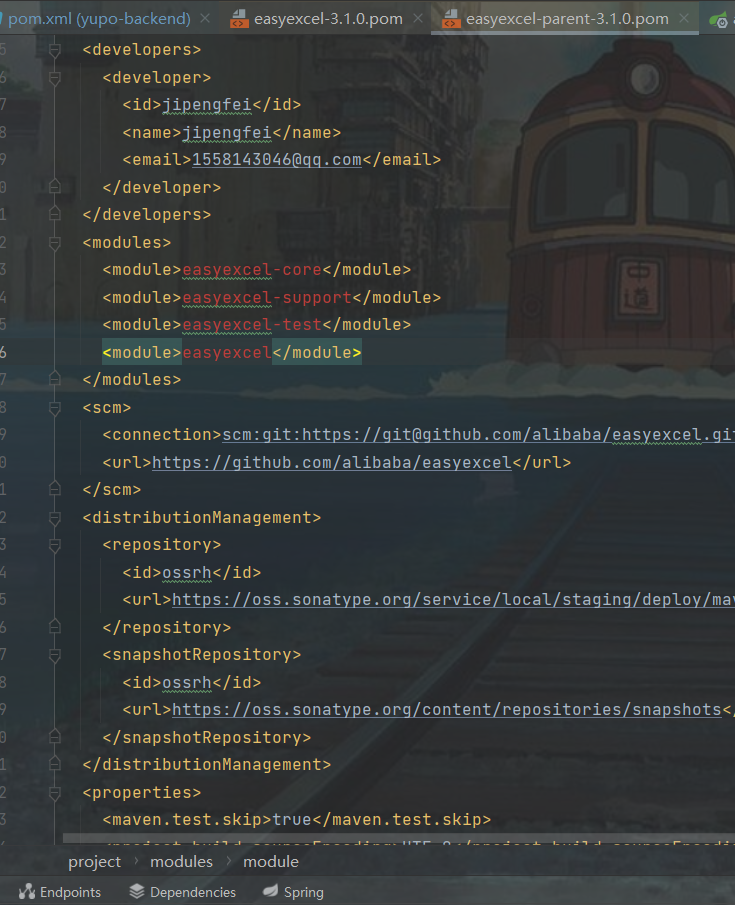
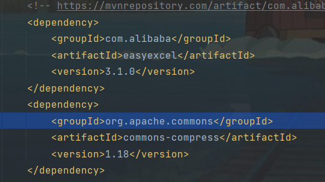
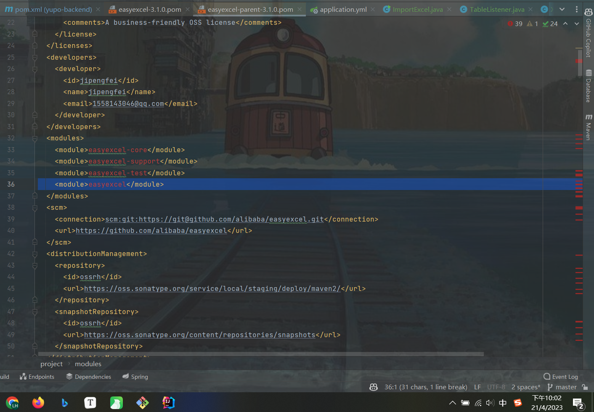

Exception in thread "main" com.alibaba.excel.exception.ExcelAnalysisException: java.lang.NoClassDefFoundError: org/apache/commons/compress/archivers/zip/ZipFile


java: 程序包org.apache.commons.math3.util不存在




大家做伙伴匹配系统有没有遇到过导入easyexcel的错误

我一运行就报错

Caused by: java.lang.ClassNotFoundException: org.apache.commons.compress.archivers.zip.ZipFile

后来我就添加了compress的依赖


我又运行又报错一堆

Exception in thread "main" com.alibaba.excel.exception.ExcelAnalysisException: java.lang.BootstrapMethodError: java.lang.IllegalAccessError: no such constructor: org.apache.poi.xssf.usermodel.XSSFSheet.<init>()void/newInvokeSpecial


然后我点开easyexcel的父依赖，发现里面的好多依赖都爆红，我又重新导入，清理缓存还是不行

我用的是easyexcel 3.1.0版本，jdk是1.8的  springboot是2.6.4的

```
<dependency>
    <groupId>org.apache.xmlbeans</groupId>
    <artifactId>xmlbeans</artifactId>
    <version>3.1.0</version>
</dependency>
```





```
21:54:35.147 [main] DEBUG com.alibaba.excel.metadata.property.ExcelHeadProperty - The initialization sheet/table 'ExcelHeadProperty' is complete , head kind is CLASS
21:54:35.178 [main] DEBUG com.alibaba.excel.context.AnalysisContextImpl - Initialization 'AnalysisContextImpl' complete
Exception in thread "main" com.alibaba.excel.exception.ExcelAnalysisException: java.lang.BootstrapMethodError: java.lang.IllegalAccessError: no such constructor: org.apache.poi.xssf.usermodel.XSSFSheet.<init>()void/newInvokeSpecial
	at com.alibaba.excel.analysis.ExcelAnalyserImpl.<init>(ExcelAnalyserImpl.java:61)
	at com.alibaba.excel.ExcelReader.<init>(ExcelReader.java:27)
	at com.alibaba.excel.read.builder.ExcelReaderBuilder.build(ExcelReaderBuilder.java:202)
	at com.alibaba.excel.read.builder.ExcelReaderBuilder.sheet(ExcelReaderBuilder.java:239)
	at com.alibaba.excel.read.builder.ExcelReaderBuilder.sheet(ExcelReaderBuilder.java:227)
	at com.yupi.yupo.scripts.ImportExcel.readByListener(ImportExcel.java:32)
	at com.yupi.yupo.scripts.ImportExcel.main(ImportExcel.java:20)
Caused by: java.lang.BootstrapMethodError: java.lang.IllegalAccessError: no such constructor: org.apache.poi.xssf.usermodel.XSSFSheet.<init>()void/newInvokeSpecial
	at org.apache.poi.xssf.usermodel.XSSFRelation.<clinit>(XSSFRelation.java:82)
	at com.alibaba.excel.analysis.v07.XlsxSaxAnalyser.<init>(XlsxSaxAnalyser.java:71)
	at com.alibaba.excel.analysis.ExcelAnalyserImpl.choiceExcelExecutor(ExcelAnalyserImpl.java:103)
	at com.alibaba.excel.analysis.ExcelAnalyserImpl.<init>(ExcelAnalyserImpl.java:55)
	... 6 more
Caused by: java.lang.IllegalAccessError: no such constructor: org.apache.poi.xssf.usermodel.XSSFSheet.<init>()void/newInvokeSpecial
	at java.lang.invoke.MethodHandleNatives.linkMethodHandleConstant(MethodHandleNatives.java:483)
	... 10 more
Caused by: java.lang.NoClassDefFoundError: org/apache/xmlbeans/XmlException
	at java.lang.invoke.MethodHandleNatives.resolve(Native Method)
	at java.lang.invoke.MemberName$Factory.resolve(MemberName.java:975)
	at java.lang.invoke.MemberName$Factory.resolveOrFail(MemberName.java:1000)
	at java.lang.invoke.MethodHandles$Lookup.resolveOrFail(MethodHandles.java:1394)
	at java.lang.invoke.MethodHandles$Lookup.linkMethodHandleConstant(MethodHandles.java:1750)
	at java.lang.invoke.MethodHandleNatives.linkMethodHandleConstant(MethodHandleNatives.java:477)
	... 10 more
Caused by: java.lang.ClassNotFoundException: org.apache.xmlbeans.XmlException
	at java.net.URLClassLoader.findClass(URLClassLoader.java:387)
	at java.lang.ClassLoader.loadClass(ClassLoader.java:418)
	at sun.misc.Launcher$AppClassLoader.loadClass(Launcher.java:352)
	at java.lang.ClassLoader.loadClass(ClassLoader.java:351)
	... 16 more

Process finished with exit code 1
```

